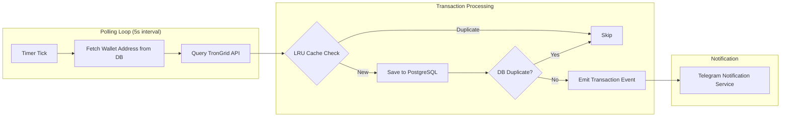

# ADR-0001: TRON Blockchain Monitoring Approach

## Status

Accepted

> **Scope Update (2026-01-22)**: The initial scope included both TRX native transfers and USDT TRC20 transfers. During implementation (see `docs/design/blockchain-monitoring-design.md` v1.1), the scope was narrowed to **USDT TRC20 only** based on business requirements. The architectural decisions in this ADR remain valid - only the transaction type scope was reduced.

## Context

PayPing is a Telegram bot that monitors a TRON wallet and notifies subscribers when transactions occur. The core monitoring requirement is to:

- Track inbound USDT (TRC20) transactions on a single TRON wallet
- ~~Support TRX native transfers~~ (removed from scope - USDT only)
- Achieve near real-time notifications (acceptable latency: 5-10 seconds)
- Support dynamic wallet address configuration from database (changeable without restart)

### Technical Constraints

| Constraint | Value | Impact |
|-----------|-------|--------|
| TronGrid Free Tier | 100K requests/day, 10-15 req/s | Limits polling frequency |
| TRON Block Time | ~3 seconds | Sets minimum useful polling interval |
| USDT Contract | TR7NHqjeKQxGTCi8q8ZY4pL8otSzgjLj6t | Fixed address for TRC20 filtering |
| Application Type | NestJS standalone (no HTTP server) | Cannot receive webhooks directly |

### Current State

The `@app/blockchain` library exists with empty `BlockchainService` class. No monitoring implementation exists yet.

## Decision

**Adopt TronGrid API polling as the primary TRON blockchain monitoring approach.**

### Decision Details

| Item | Content |
|------|---------|
| **Decision** | Use TronGrid API with 5-second polling interval for transaction monitoring |
| **Why now** | Core feature required for MVP; monitoring must be implemented before subscription system |
| **Why this** | Zero infrastructure cost, official API reliability, sufficient for notification latency requirements (5-10s acceptable) |
| **Known unknowns** | Long-term rate limit stability under TronGrid free tier; API response time under high network congestion |
| **Kill criteria** | If free tier limits become insufficient (>50% daily quota consumed) or latency exceeds 30 seconds consistently |

## Rationale

TronGrid polling provides the optimal balance between implementation simplicity, operational cost, and functional requirements for this use case.

### Options Considered

#### Option A: TronGrid API Polling (Selected)

**Overview**: Poll TronGrid REST API endpoints at regular intervals to fetch transaction history.

**API Endpoints Used**:
- `GET /v1/accounts/{address}/transactions` - All account transactions
- `GET /v1/accounts/{address}/transactions/trc20` - TRC20 token transfers (USDT)

**Pros**:
- Zero infrastructure cost (free tier: 100K requests/day)
- Official TRON Foundation maintained API with high reliability
- No server infrastructure needed (no webhooks to receive)
- Simple implementation using standard HTTP client
- Timestamp-based filtering reduces unnecessary data transfer
- Well-documented with predictable behavior

**Cons**:
- 3-5 second inherent latency (polling interval + network)
- Consumes API quota continuously even during idle periods
- No native push notification support
- Requires deduplication logic for overlapping poll windows

**Daily API Usage Estimate**:
```
Polling interval: 5 seconds
Polls per day: 86,400 / 5 = 17,280 requests
With TRC20 separate endpoint: 17,280 * 2 = 34,560 requests
Safety margin (retries, etc.): ~40,000 requests/day
Free tier capacity: 100,000 requests/day
Utilization: ~40%
```

#### Option B: Third-Party WebSocket Services (Bitquery / Crypto APIs)

**Overview**: Use commercial blockchain data providers with WebSocket/GraphQL subscription support for real-time transaction notifications.

**Providers Evaluated**:
- **Bitquery**: GraphQL API with WebSocket subscriptions, covers TRON with TRC20 support
- **Crypto APIs**: REST + WebSocket with <100ms notification latency

**Pros**:
- True real-time notifications (sub-second latency)
- Reduced API call volume (push vs poll)
- Rich query capabilities (GraphQL filtering)
- No deduplication needed (event-driven)

**Cons**:
- Monthly subscription cost ($50-200+/month for production tiers)
- Additional external dependency beyond TronGrid
- Requires webhook endpoint or persistent WebSocket connection
- Application needs HTTP server to receive webhooks (conflicts with standalone architecture)
- Vendor lock-in risk with proprietary APIs

**Effort**: 5-7 days (includes webhook infrastructure)

#### Option C: Self-Hosted TRON Full Node with ZeroMQ

**Overview**: Run a dedicated TRON full node and subscribe to events via built-in ZeroMQ message queue.

**Architecture**:
```
TRON Full Node (java-tron) → ZeroMQ → PayPing Application
```

**Pros**:
- True real-time events (lowest latency possible)
- No external API dependencies or rate limits
- Full control over data and infrastructure
- Historical event replay capability (v2.0 event service)
- No per-request costs

**Cons**:
- Significant infrastructure cost (server: $50-200/month, 500GB+ storage)
- Complex setup and maintenance (java-tron node operations)
- Initial sync time: days to weeks for full blockchain
- Requires DevOps expertise for node monitoring and updates
- Overkill for single-wallet monitoring use case

**Effort**: 10-15 days (includes infrastructure setup)

### Comparison Matrix

| Evaluation Axis | Option A: TronGrid Polling | Option B: Third-Party WebSocket | Option C: Full Node |
|----------------|---------------------------|--------------------------------|---------------------|
| **Implementation Effort** | 2-3 days | 5-7 days | 10-15 days |
| **Monthly Cost** | $0 | $50-200+ | $50-200+ |
| **Latency** | 5-10 seconds | <1 second | <1 second |
| **Reliability** | High (official API) | Medium (third-party) | High (self-controlled) |
| **Maintenance** | Low | Low | High |
| **Scalability** | Limited by rate limits | Limited by subscription tier | Unlimited |
| **Architecture Fit** | Excellent (standalone app) | Poor (needs HTTP server) | Good |

### Trade-off Analysis

| Solution | Cost | Latency | Overall |
|----------|------|---------|---------|
| TronGrid Polling | Low ($0) | Medium (5-10s) | Best for budget |
| Bitquery WebSocket | Medium ($50-200) | Low (<1s) | Premium real-time |
| Crypto APIs | Medium ($50-200) | Low (<1s) | Premium real-time |
| Full Node ZeroMQ | High ($50-200+ops) | Low (<1s) | Maximum control |

**Decision Rationale**: For a notification bot where 5-10 second latency is acceptable, the cost and complexity savings of TronGrid polling significantly outweigh the marginal latency improvement of real-time solutions. The free tier capacity (100K requests/day) provides ample headroom at ~40% projected utilization.

## Consequences

### Positive Consequences

- Zero operational cost for blockchain monitoring
- Simple architecture with no additional infrastructure
- Reliable monitoring using official TRON Foundation API
- Easy to implement and maintain
- No HTTP server needed (maintains standalone architecture)
- Well within free tier limits with room for growth

### Negative Consequences

- 5-10 second notification latency (acceptable per requirements)
- Requires in-memory LRU cache + database deduplication logic
- API quota must be monitored to avoid rate limiting
- Cannot scale beyond 100K requests/day without paid tier
- Continuous polling even during idle periods

### Neutral Consequences

- Transaction deduplication becomes application responsibility
- Need to handle API errors and implement retry logic
- Monitoring dashboard recommended for API usage tracking

## Implementation Guidance

### Architectural Principles

1. **Separation of Concerns**: Isolate TronGrid API interaction from business logic
   - Create dedicated adapter/client for TronGrid API calls
   - Business logic should work with domain transaction models, not API responses

2. **Deduplication Strategy**: Implement two-tier deduplication
   - In-memory LRU cache for fast duplicate detection (recent transactions)
   - PostgreSQL persistence for long-term deduplication and audit trail

3. **Error Handling**: Apply circuit breaker pattern for API failures
   - Exponential backoff on rate limit errors (HTTP 429)
   - Continue processing on partial failures

4. **Configuration**: Externalize all configurable values
   - Polling interval
   - API endpoint and key
   - LRU cache size
   - Rate limit thresholds

5. **Observability**: Design for monitoring integration
   - Expose metrics for Prometheus (polling success/failure, latency, queue depth)
   - Structured logging with correlation IDs
   - Error reporting hooks for Sentry integration

### Data Flow Pattern



### API Optimization Techniques

1. **Timestamp-based Filtering**: Use `min_timestamp` parameter to fetch only transactions after last successful poll
2. **Batch Processing**: Process transactions in batches to reduce database round-trips
3. **Parallel Requests**: Fetch TRX and TRC20 transactions concurrently

## Related Information

### References

- [TronGrid Rate Limits Documentation](https://developers.tron.network/reference/rate-limits) - Official rate limit specifications
- [TronGrid Pricing](https://www.trongrid.io/price) - Free and paid tier details
- [TronGrid API Documentation](https://developers.tron.network/docs/trongrid) - Official API reference
- [Bitquery TRON API](https://docs.bitquery.io/docs/blockchain/Tron/) - Alternative WebSocket provider
- [Crypto APIs TRON Support](https://cryptoapis.io/blog/312-why-tron-is-developers-top-pick-crypto-apis-fast-track-to-events-nodes) - Alternative real-time provider
- [TRON Event Subscription (ZeroMQ)](https://developers.tron.network/docs/use-java-trons-built-in-message-queue-for-event-subscription) - Full node event subscription

### Related Documents

- (Future) Design Doc: `docs/design/blockchain-monitoring-design.md`
- (Future) ADR: Common error handling patterns
- (Future) ADR: Caching strategy

### USDT Contract Reference

```
USDT TRC20 Contract: TR7NHqjeKQxGTCi8q8ZY4pL8otSzgjLj6t
Network: TRON Mainnet
```
