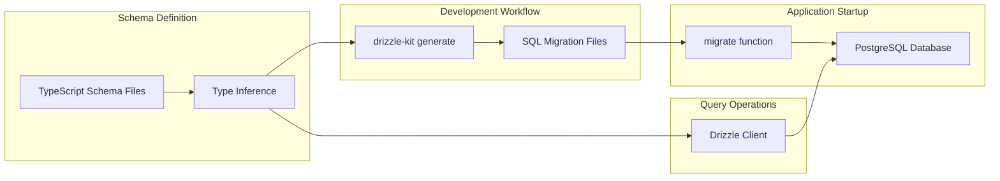

# ADR-0002: Drizzle ORM for Database Access

## Status

Accepted

## Context

PayPing is a NestJS standalone application (no HTTP server) that monitors a TRON wallet and notifies Telegram subscribers of incoming transactions. The application requires persistent storage for:

- **Transactions**: Deduplicated transaction records from blockchain monitoring
- **Users**: Telegram user information for notification delivery
- **Subscriptions**: Subscription status and expiration tracking
- **Payments**: Telegram Stars payment history

The current `@app/db` library contains stub implementations in `DbService` that need to be replaced with real PostgreSQL database operations. The blockchain monitoring module (ADR-0001) already depends on these database methods for transaction deduplication.

### Technical Requirements

| Requirement | Details |
|-------------|---------|
| Database | PostgreSQL (already decided in project architecture) |
| Type Safety | Full TypeScript integration with inferred types |
| Migrations | Programmatic execution on application startup |
| Testing | Real PostgreSQL database for integration tests |
| Architecture | NestJS standalone app (no HTTP server) |
| Performance | Low latency for transaction deduplication checks |

### Constraints

- **Standalone Architecture**: Application runs without HTTP server, so no web-based migration UIs
- **Startup Migrations**: Migrations must run programmatically during app initialization
- **Bundle Size**: As a bot application, smaller dependencies are preferred
- **Learning Curve**: Team should be productive quickly with clear documentation

## Decision

**Adopt Drizzle ORM with postgres.js driver for all PostgreSQL database access.**

### Decision Details

| Item | Content |
|------|---------|
| **Decision** | Use Drizzle ORM with postgres.js driver, drizzle-kit for migrations, and programmatic migration execution on startup |
| **Why now** | Blockchain monitoring (ADR-0001) is implemented and requires persistent transaction storage; subscription system depends on user/payment tables |
| **Why this** | Best TypeScript integration with SQL-like API, smallest bundle size (~7.4KB), excellent NestJS compatibility, and straightforward programmatic migrations |
| **Known unknowns** | Drizzle is newer than alternatives (1.0 released 2024); long-term ecosystem stability compared to Prisma/TypeORM |
| **Kill criteria** | If critical bugs emerge without timely fixes, or if migration tooling proves unreliable for schema evolution |

## Rationale

Drizzle ORM provides the optimal balance between TypeScript type safety, performance, and developer experience for this standalone NestJS application. Its SQL-first approach aligns with the project's need for predictable query behavior and low-latency operations.

### Options Considered

#### Option A: TypeORM

**Overview**: The traditional ORM for NestJS applications with decorator-based entity definitions and the Active Record/Data Mapper patterns.

**Pros**:
- Native NestJS integration via `@nestjs/typeorm`
- Mature ecosystem with extensive documentation
- Built-in migration CLI and synchronization features
- Familiar to developers with ORM experience

**Cons**:
- Performance overhead from entity hydration (instantiating class objects)
- Complex type definitions that can be fragile
- Large bundle size with many dependencies
- Known issues with strict TypeScript configurations
- Decorator-based syntax diverges from SQL mental model

**Effort**: 2-3 days

#### Option B: Prisma

**Overview**: Modern ORM with schema-first approach, generated client, and excellent developer experience.

**Pros**:
- Excellent developer experience with intuitive API
- Strong type safety with generated client
- Prisma Studio for database visualization
- Active development and large community
- Comprehensive migration system (Prisma Migrate)

**Cons**:
- Larger bundle size than Drizzle (~1.6MB with Prisma 7's new TypeScript-native engine)
- Requires code generation step after schema changes
- Schema file is separate from TypeScript (`.prisma` file)
- N+1 query issues with nested relations in some patterns

**Note**: Prisma 7 (2025) removed the Rust query engine, reducing bundle from ~6.5MB to ~1.6MB and eliminating cold start issues. However, Drizzle still has significant bundle size advantage (~7.4KB vs ~1.6MB).

**Effort**: 2-3 days

#### Option C: Knex.js (Query Builder Only)

**Overview**: SQL query builder without ORM abstraction, providing maximum control over generated SQL.

**Pros**:
- Full SQL control with minimal abstraction
- Lightweight with no code generation
- Flexible migration system
- Battle-tested in production

**Cons**:
- No built-in TypeScript type inference from schema
- Manual type definitions required for query results
- More boilerplate for common CRUD operations
- No relation handling - manual joins required

**Effort**: 3-4 days (additional time for type definitions)

#### Option D: Drizzle ORM (Selected)

**Overview**: Modern TypeScript-first ORM with SQL-like query API, schema defined in TypeScript, and minimal runtime overhead.

**Pros**:
- Smallest bundle size (~7.4KB minified+gzipped, zero dependencies)
- Schema defined directly in TypeScript (single source of truth)
- SQL-like API with full type inference (no code generation)
- Excellent performance with minimal abstraction
- Both relational and SQL-like query APIs available
- drizzle-kit for migration generation and management
- Programmatic migration execution via `migrate()` function
- Serverless-ready with negligible cold start impact
- Growing ecosystem with active development

**Cons**:
- Newer than alternatives (less battle-tested at scale)
- Smaller community compared to Prisma/TypeORM
- Type-checking can be slower than Prisma for very large schemas
- Some advanced features still maturing

**Effort**: 2-3 days

### Comparison Matrix

| Evaluation Axis | TypeORM | Prisma | Knex.js | Drizzle (Selected) |
|-----------------|---------|--------|---------|---------------------|
| **Bundle Size** | Large (~MB) | ~1.6MB (Prisma 7) | Medium | ~7.4KB |
| **Type Safety** | Medium | High | Low (manual) | High |
| **Performance** | Medium | Good | Good | Excellent |
| **NestJS Integration** | Native | Good | Manual | Good (providers) |
| **Migration Tooling** | Built-in | Prisma Migrate | Built-in | drizzle-kit |
| **Programmatic Migrations** | Yes | Yes | Yes | Yes |
| **Learning Curve** | Medium | Low | Medium | Low-Medium |
| **Cold Start** | Slow | Fast (Prisma 7) | Fast | Fastest |
| **SQL Proximity** | Low | Medium | High | High |
| **Ecosystem Maturity** | High | High | High | Medium |

### postgres.js Driver Selection

For the PostgreSQL driver, postgres.js was selected over node-postgres (pg) for the following reasons:

| Factor | node-postgres (pg) | postgres.js (Selected) |
|--------|-------------------|------------------------|
| **Prepared Statements** | Manual opt-in | Automatic caching |
| **TypeScript Support** | Via @types/pg | Built-in |
| **Performance** | ~183 us/iter | ~202 us/iter |
| **API Design** | Callback + Promise | Modern tagged template |
| **Bundle Size** | Larger | Smaller |
| **Drizzle Integration** | Supported | Native support |

While node-postgres is slightly faster in raw benchmarks (~10% with pg-native), postgres.js offers:
- Built-in prepared statement caching (important for repeated queries like deduplication checks)
- Cleaner TypeScript integration
- Modern API design with tagged template literals
- Smaller footprint aligning with Drizzle's philosophy

The performance difference is negligible for this application's query volume.

## Consequences

### Positive Consequences

- **Minimal Bundle Size**: ~7.4KB ORM addition, ideal for standalone application
- **Type-Safe Queries**: Full TypeScript inference without code generation step
- **SQL Familiarity**: Query API maps directly to SQL concepts
- **Fast Development**: Schema changes immediately reflected in types
- **Programmatic Migrations**: `migrate()` function fits standalone app architecture
- **Future-Ready**: Serverless-compatible if architecture evolves

### Negative Consequences

- **Newer Technology**: Less production battle-testing than Prisma/TypeORM
- **Smaller Community**: Fewer Stack Overflow answers and tutorials
- **Type-Check Time**: May be slower than Prisma for very large schemas
- **Manual NestJS Setup**: No official `@nestjs/drizzle` package (custom provider needed)

### Neutral Consequences

- **Migration Workflow Change**: Generate migrations via drizzle-kit CLI, apply programmatically
- **Testing Approach**: Real PostgreSQL required (no query mocking like Prisma)
- **Schema Location**: TypeScript files in `libs/db/src/schema/` directory

## Implementation Guidance

### Architectural Principles

1. **Schema as Single Source of Truth**: Define all tables in TypeScript schema files; types are inferred automatically

2. **Provider Pattern for NestJS**: Create a Drizzle provider using NestJS factory pattern with ConfigService for database URL

3. **Migration Strategy**:
   - Use `drizzle-kit generate` to create SQL migration files during development
   - Execute migrations programmatically via `migrate()` on application startup
   - Store migration history in database table

4. **Repository Pattern**: Wrap Drizzle operations in repository classes per domain (TransactionRepository, UserRepository, etc.)

5. **Connection Pooling**: Configure postgres.js connection pool based on expected concurrent operations

### Data Flow Pattern



### Schema Design Principles

1. **Identity Columns**: Use PostgreSQL identity columns (recommended over serial)
2. **Timestamps**: Include `created_at` and `updated_at` with default values
3. **Indexes**: Define indexes for frequently queried columns (transaction hash, user telegram_id)
4. **Foreign Keys**: Use Drizzle's `references()` for relationship definitions

## Related Information

### References

- [Drizzle ORM Official Documentation](https://orm.drizzle.team/) - Complete API reference and guides
- [Drizzle ORM - Why Drizzle?](https://orm.drizzle.team/docs/overview) - Design philosophy and benefits
- [Drizzle Kit Migrations](https://orm.drizzle.team/docs/migrations) - Migration workflow documentation
- [Best ORM for NestJS in 2025](https://dev.to/sasithwarnakafonseka/best-orm-for-nestjs-in-2025-drizzle-orm-vs-typeorm-vs-prisma-229c) - Detailed ORM comparison
- [Drizzle vs Prisma Comparison](https://betterstack.com/community/guides/scaling-nodejs/drizzle-vs-prisma/) - Performance and feature analysis
- [NestJS & DrizzleORM: A Great Match](https://trilon.io/blog/nestjs-drizzleorm-a-great-match) - Integration patterns
- [postgres.js GitHub](https://github.com/porsager/postgres) - Driver documentation
- [PostgreSQL Driver Benchmarks](https://dev.to/nigrosimone/benchmarking-postgresql-drivers-in-nodejs-node-postgres-vs-postgresjs-17kl) - Performance comparison
- [Drizzle ORM PostgreSQL Best Practices 2025](https://gist.github.com/productdevbook/7c9ce3bbeb96b3fabc3c7c2aa2abc717) - Schema design guidelines

### Related Documents

- [ADR-0001: TRON Blockchain Monitoring Approach](./001-tron-monitoring-approach.md) - Depends on database for transaction deduplication
- (Future) Design Doc: `docs/design/database-schema-design.md`
- (Future) ADR: Common error handling patterns

### Package Versions (as of January 2026)

```
drizzle-orm: ^0.45.x (1.0.0-beta.x also available)
drizzle-kit: ^0.30.x
postgres: ^3.4.x
```

### NestJS Integration Options

Community packages exist for NestJS integration:
- [@knaadh/nestjs-drizzle](https://github.com/knaadh/nestjs-drizzle) - Ready-made NestJS module
- Custom provider pattern (recommended for full control) - As described in this ADR
