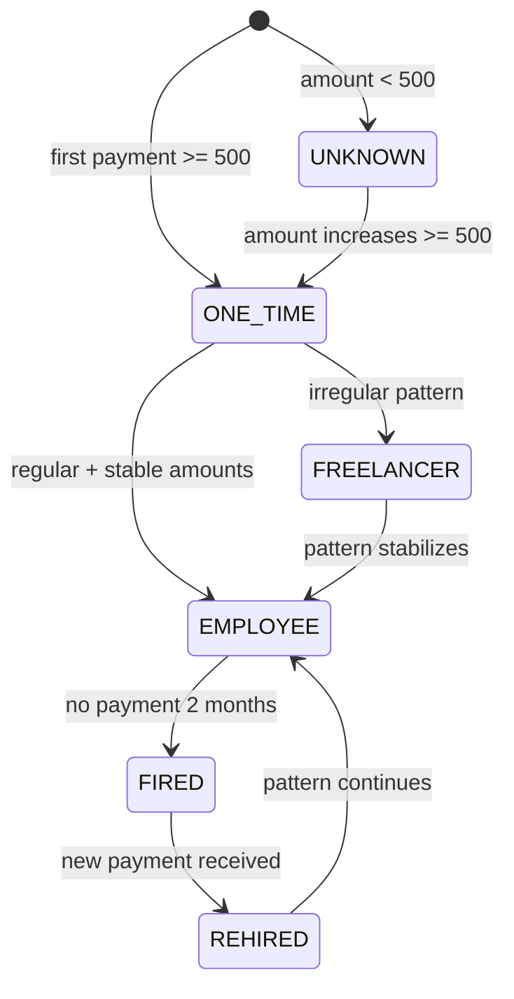
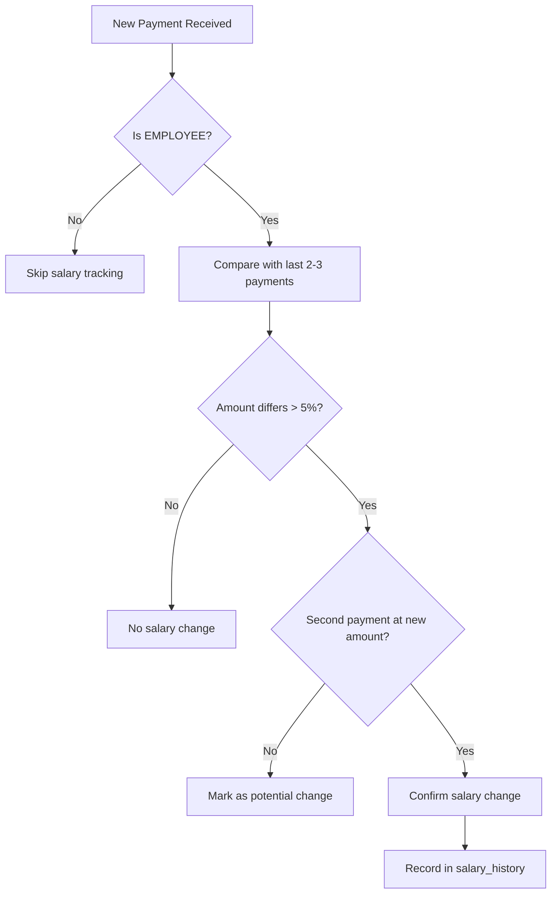
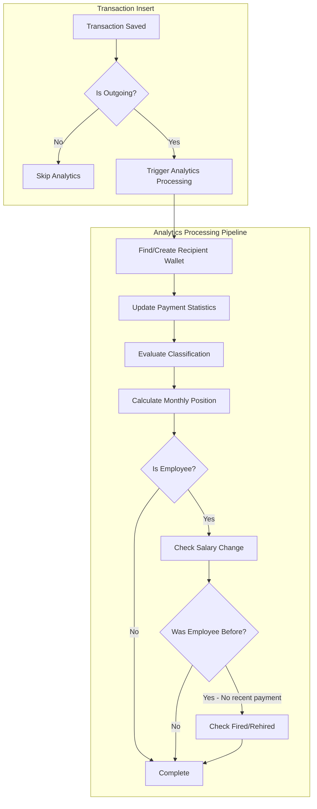

# ADR-0003: Payout Analytics Architecture

## Status

Accepted

## Version History

| Version | Date | Changes |
|---------|------|---------|
| 2.0 | 2026-01-23 | Major revision: Changed from on-demand to real-time processing; automatic classification algorithm; salary tracking; removed admin classification |
| 1.0 | 2026-01-20 | Initial version: On-demand calculation with caching approach |

## Context

PayPing monitors a single TRON wallet for incoming transactions. The existing system stores all transaction data (including outgoing payouts) in the `transactions` table. Finance teams and business owners need analytics capabilities to understand payout patterns, track recipient wallet priority within payment cycles, and compare position changes month-over-month.

### Technical Requirements

| Requirement | Details |
|-------------|---------|
| Display | Recipient wallet ranking table with monthly position |
| Performance | `/analytics` response within 3 seconds for 100 recipients |
| Query Performance | Position retrieval query under 100ms (pre-calculated) |
| History | Support 6 months of historical data |
| Localization | Russian, Ukrainian, English support (existing i18n) |
| Classification | Automatic classification based on payment patterns |

### Constraints

- **Standalone Architecture**: NestJS standalone app (no HTTP server)
- **Existing Transaction Data**: Must work with current `transactions` table structure
- **Real-time Processing**: Analytics data updated on each transaction insert
- **Single Monitored Wallet**: All payouts originate from the predefined monitored wallet

### Current State

- `transactions` table stores all blockchain transactions (incoming and outgoing)
- TransactionsService has `getMonthlySum()` and `getRollingAverage()` for incoming analytics
- No tracking of recipient wallets as distinct entities
- No position history or classification system

## Decision

**Adopt real-time processing on transaction insert with automatic classification and denormalized monthly position storage.**

### Decision Details

| Item | Content |
|------|---------|
| **Decision** | Process analytics data in real-time when transactions are saved: identify/create recipient wallets, evaluate classification, calculate positions, track salary changes, and detect employment status changes |
| **Why now** | Core analytics feature required per PRD; builds on existing transaction storage |
| **Why this** | Provides instant data availability on `/analytics` command with zero calculation delay; classification accuracy improves with automatic pattern detection |
| **Known unknowns** | Edge cases in classification algorithm accuracy; handling retroactive transaction corrections |
| **Kill criteria** | If transaction insert latency exceeds 200ms due to analytics processing overhead |

## Rationale

Real-time processing ensures that analytics data is always current and immediately available when users request it. The processing overhead on each transaction insert is minimal compared to the user experience benefit of instant `/analytics` responses.

### Options Considered

#### Option A: Pure On-Demand Calculation (No Caching)

**Overview**: Calculate positions directly from transactions table every time `/analytics` is called.

**Approach**:
- Query transactions table with `fromAddress = monitored_wallet` for the requested month
- Group by `toAddress` (recipient), aggregate amounts, order by first payment timestamp
- Calculate positions in application code or SQL window function
- No persistence of position data

**Pros**:
- Simplest implementation (no new tables)
- Always accurate (no stale data)
- No cache invalidation complexity
- Minimal database storage

**Cons**:
- Repeated expensive queries (full scan per request)
- Performance degrades with data volume
- No ability to track classification or metadata for recipients
- Cannot efficiently compare positions across months
- Calculation delay on every request

**Effort**: 1-2 days

#### Option B: On-Demand Calculation with Caching

**Overview**: Calculate positions on-demand, cache results in `monthly_positions` table, create `recipient_wallets` lazily.

**Approach**:
1. On `/analytics` request for month M:
   - Check if `monthly_positions` has complete data for month M
   - If yes: read from cache
   - If no: calculate from transactions, upsert to cache
2. Recipients created lazily when first seen in calculation
3. Classification handled separately

**Pros**:
- Fast subsequent queries (cached)
- Recipients tracked for classification feature
- Supports month-over-month comparison efficiently
- No processing overhead on transaction insert

**Cons**:
- First query for each month may be slower (calculation delay)
- Cache invalidation needed if historical transactions change
- Need to handle partially cached months
- Classification updates require separate processing

**Effort**: 3-4 days

#### Option C: Real-Time Processing on Transaction Insert (Selected)

**Overview**: Process analytics data immediately when each transaction is saved to the database.

**Approach**:
1. On transaction save (outgoing payment detected):
   - Identify or create recipient wallet record
   - Evaluate and update classification based on payment patterns
   - Calculate and store position for current month
   - Check for salary changes (for employees)
   - Check for fired/rehired status changes
2. `/analytics` command reads pre-calculated data (simple SELECT)
3. Classification automatically updated based on algorithm

**Pros**:
- Instant `/analytics` response (no calculation delay)
- Data always current and consistent
- Classification continuously refined with each payment
- Salary changes detected immediately
- Employment status transitions tracked automatically
- Simple read path for analytics queries

**Cons**:
- Slightly more processing on each transaction insert
- Position recalculation needed when earlier transaction arrives (rare edge case)
- More complex transaction processing logic

**Effort**: 4-5 days

### Comparison Matrix

| Evaluation Axis | Option A: Pure On-Demand | Option B: Cached On-Demand | Option C: Real-Time (Selected) |
|-----------------|-------------------------|---------------------------|-------------------------------|
| **Implementation Effort** | 1-2 days | 3-4 days | 4-5 days |
| **Analytics Query Speed** | Slow (O(n) per request) | Fast after first query | Instant (pre-calculated) |
| **Data Freshness** | Always current | May have first-query delay | Always current |
| **Transaction Insert Cost** | None | None | Minimal (~10-50ms) |
| **Classification** | None | Manual/separate | Automatic real-time |
| **Salary Tracking** | Not possible | Separate processing | Automatic |
| **Employment Status** | Not possible | Separate processing | Automatic |

### Trade-off Analysis

| Solution | Complexity | Query Performance | Data Freshness | Feature Completeness |
|----------|------------|-------------------|----------------|---------------------|
| Pure On-Demand | Low | Poor | Excellent | Poor |
| Cached On-Demand | Medium | Good (after cache) | Good | Medium |
| Real-Time Processing | High | Excellent | Excellent | Excellent |

**Decision Rationale**: Option C provides the best user experience with instant `/analytics` responses and enables sophisticated features like automatic classification, salary tracking, and employment status detection. The additional processing overhead on transaction insert is acceptable given the low transaction volume in the monitored wallet.

## Classification Algorithm

### Automatic Classification Rules

Classifications are automatically determined and updated based on payment patterns:

| Classification | Criteria | Transition Rules |
|---------------|----------|------------------|
| **UNKNOWN** | `amount < 500` | Default for small payments; may transition when payment increases |
| **ONE_TIME** | First appearance AND `amount >= 500` | Initial classification for significant payments |
| **EMPLOYEE** | Regular payments AND stable amounts (within 20% variance over 2-3 months) | Transitions from ONE_TIME or FREELANCER when pattern stabilizes |
| **FREELANCER** | >1 payment AND high variance (>20% between payments) | Transitions from ONE_TIME when irregular pattern detected |
| **FIRED** | EMPLOYEE with no payment for 2 consecutive months | Temporary status; can transition back to EMPLOYEE |
| **REHIRED** | FIRED recipient receives new payment | Transitions to EMPLOYEE classification on next regular payment |

### Classification State Machine



### Variance Calculation

```
variance_percent = |current_amount - previous_amount| / previous_amount * 100

stable_pattern = variance_percent <= 20% for last 2-3 payments
irregular_pattern = variance_percent > 20%
```

## Salary Tracking

### Decision

Track salary changes for EMPLOYEE-classified recipients to detect compensation adjustments.

### Algorithm

1. **Detection Window**: Compare last 2-3 months of payments
2. **Confirmation**: Require 2 consecutive payments at new amount to confirm change
3. **Tolerance**: Amounts within 5% considered "same salary" (handles rounding)

### Salary Change Detection



### Data Model Addition

```
salary_history
--------------
id: serial PRIMARY KEY
recipient_wallet_id: integer REFERENCES recipient_wallets(id)
previous_amount: varchar(78) NOT NULL
new_amount: varchar(78) NOT NULL
change_percent: decimal(5,2) NOT NULL
detected_at: timestamp NOT NULL
confirmed_at: timestamp
created_at: timestamp DEFAULT NOW()

INDEX: (recipient_wallet_id, detected_at)
```

## Consequences

### Positive Consequences

- **Instant Analytics**: Zero calculation delay on `/analytics` command
- **Real-Time Data**: Positions always reflect latest transactions
- **Automatic Classification**: No manual intervention needed; patterns detected automatically
- **Salary Visibility**: Compensation changes tracked and reportable
- **Employment Tracking**: Fired/rehired status automatically maintained
- **Efficient Queries**: Simple SELECT from pre-calculated tables

### Negative Consequences

- **Transaction Insert Overhead**: Additional 10-50ms processing per transaction
- **Implementation Complexity**: More complex transaction processing pipeline
- **Position Recalculation**: Edge case when late transactions arrive for past periods
- **Storage Requirements**: Additional tables and indexes for analytics data

### Neutral Consequences

- **Monthly Positions Always Current**: Continuously updated as transactions arrive
- **Classification Evolution**: Categories may change as more payment data accumulates
- **Three Analytics Tables**: `recipient_wallets`, `monthly_positions`, `salary_history`

## Implementation Guidance

### Architectural Principles

1. **Service Separation**: Create dedicated `AnalyticsService` for real-time processing, distinct from `TransactionsService`
   - TransactionsService: Transaction persistence and basic queries
   - AnalyticsService: Real-time analytics processing, classification, salary tracking

2. **Event-Driven Processing**: Hook into transaction save to trigger analytics update
   - Use NestJS lifecycle hooks or event emitter pattern
   - Process asynchronously to minimize transaction save latency if needed

3. **Data Model Design**:
   - `recipient_wallets`: Unique wallet addresses with classification and metadata
   - `monthly_positions`: Position data per recipient per month (composite unique key)
   - `salary_history`: Salary change records for employees
   - Use indexes on `(year_month)`, `(recipient_wallet_id)`, and `(classification)`

4. **Query Optimization**:
   - Position stored directly; no window function calculation on read
   - Simple JOINs between tables for analytics display
   - Index on `transactions.timestamp` and `transactions.fromAddress` for historical queries

5. **Classification Approach**:
   - Automatic evaluation on each payment
   - Store classification in `recipient_wallets`
   - Track classification history if audit trail needed

### Real-Time Processing Flow



### Position Calculation on Insert

When a new transaction is inserted:

1. Query existing positions for the same month
2. Determine position based on payment timestamp
3. If position conflicts with existing, shift subsequent positions
4. Upsert recipient's position for the month

```
Algorithm:
1. Get all positions for month M ordered by payment_timestamp
2. Find insertion point based on new transaction timestamp
3. New position = insertion_point + 1
4. UPDATE positions SET position = position + 1 WHERE month = M AND position >= new_position
5. INSERT new position record
```

## Related Information

### References

- [PRD: Payout Analytics Feature](../prd/payout-analytics-prd.md) - Full requirements document
- [ADR-0002: Drizzle ORM Selection](./002-drizzle-orm-selection.md) - Database access patterns
- [Design Doc: Telegram Bot](../design/telegram-bot-design.md) - Handler patterns and i18n integration
- [Drizzle ORM Documentation](https://orm.drizzle.team/docs) - SQL helper documentation

### Related Documents

- (Next) Design Doc: `docs/design/payout-analytics-design.md`
- (Existing) Design Doc: `docs/design/telegram-bot-design.md` - Handler patterns
- (Existing) i18n: `libs/telegram/src/locales/*.ftl` - Localization files

### Data Model Reference

```
recipient_wallets
-----------------
id: serial PRIMARY KEY
address: varchar(64) UNIQUE NOT NULL
classification: varchar(20) DEFAULT 'UNKNOWN'
  -- Values: UNKNOWN, ONE_TIME, EMPLOYEE, FREELANCER, FIRED, REHIRED
first_seen_at: timestamp NOT NULL
last_payment_at: timestamp NOT NULL
total_payments: integer DEFAULT 1
last_amount: varchar(78)  -- For salary tracking
created_at: timestamp DEFAULT NOW()
updated_at: timestamp DEFAULT NOW()

INDEX: (classification)
INDEX: (last_payment_at)

monthly_positions
-----------------
id: serial PRIMARY KEY
recipient_wallet_id: integer REFERENCES recipient_wallets(id)
year_month: varchar(7) NOT NULL  -- '2026-01'
position: integer NOT NULL
transaction_hash: varchar(64) NOT NULL
amount: varchar(78) NOT NULL
payment_timestamp: bigint NOT NULL
created_at: timestamp DEFAULT NOW()
updated_at: timestamp DEFAULT NOW()

UNIQUE: (recipient_wallet_id, year_month)
INDEX: (year_month, position)

salary_history
--------------
id: serial PRIMARY KEY
recipient_wallet_id: integer REFERENCES recipient_wallets(id)
previous_amount: varchar(78) NOT NULL
new_amount: varchar(78) NOT NULL
change_percent: decimal(5,2) NOT NULL
detected_at: timestamp NOT NULL
confirmed_at: timestamp
created_at: timestamp DEFAULT NOW()

INDEX: (recipient_wallet_id, detected_at)
```
