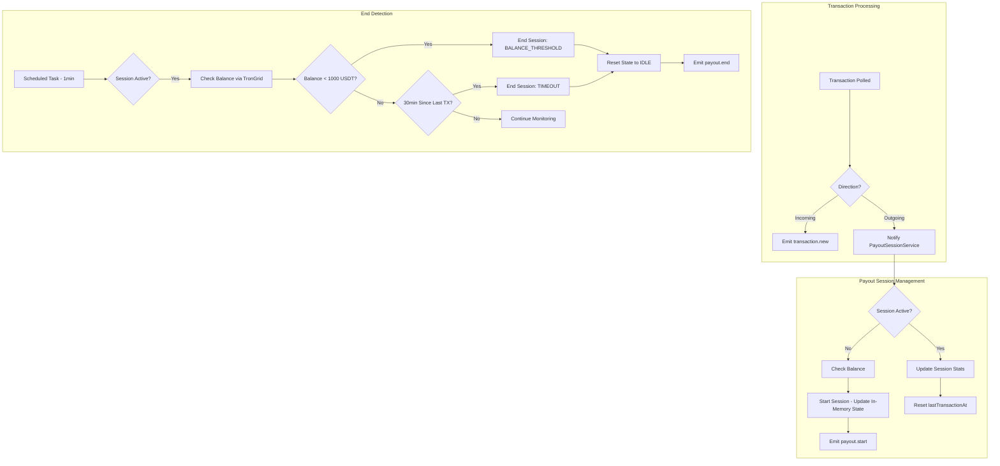

# ADR-0004: Payout Session Detection and Balance Checking Mechanism

## Status

Proposed

## Version History

| Version | Date | Changes |
|---------|------|---------|
| 1.0 | 2026-01-23 | Initial version |
| 1.1 | 2026-01-23 | Simplified to in-memory state management per user feedback |
| 1.2 | 2026-01-23 | Renamed PayoutStartEvent.balance to startBalance for consistency with Design Doc |

## Context

PayPing monitors a TRON wallet and notifies subscribers when incoming funds arrive. Users now require **salary payout notifications** - they want to know when salary disbursement begins and ends, not just individual transactions.

### Business Requirements

| Requirement | Description |
|-------------|-------------|
| **Payout Start** | Detect and notify when the first outgoing transaction occurs from the monitored wallet |
| **Payout End** | Detect and notify when payout session ends (balance < 1000 USDT OR no transactions for 30+ minutes with decreased balance) |
| **Recipients** | All active subscribers receive payout session notifications |

### Technical Context

| Component | Current State |
|-----------|---------------|
| `TransactionProcessorService` | Saves all transactions, emits `transaction.new` events for INCOMING only |
| `TransactionPollerService` | Polls TronGrid every 5 seconds for USDT TRC20 transactions |
| `TronGridClient` | Fetches TRC20 transactions, has `getAccountCreationTimestamp()` method |
| Event Infrastructure | NestJS `EventEmitter2` with `transaction.new` and `transaction.confirmed` events |
| Payout Session State | None - no tracking exists |
| Balance Checking | None - no balance queries implemented |
| **Outgoing Detection** | Existing transaction method already fetches outgoing transactions - this signals payout activity |

### Technical Constraints

| Constraint | Value | Impact |
|-----------|-------|--------|
| TronGrid Free Tier | 100K requests/day, ~10-15 req/s | Limits additional API calls |
| Current Usage | ~40% of quota (34,560 requests/day) | ~60% headroom available |
| USDT Precision | 6 decimals | Balance threshold (1000 USDT) = 1,000,000,000 in raw units |
| USDT Contract | `TR7NHqjeKQxGTCi8q8ZY4pL8otSzgjLj6t` | Fixed contract for balance queries |

### Key Decision Points

1. **Balance Source**: How to obtain current USDT balance
2. **Session State Management**: Where to persist payout session state
3. **Timeout Handling**: How to implement 30-minute inactivity detection
4. **Event Architecture**: How to extend existing event infrastructure

## Decision

**Adopt TronGrid `triggerconstantcontract` API for USDT balance checking with in-memory session state and scheduled task for timeout detection.**

### Decision Details

| Item | Content |
|------|---------|
| **Decision** | Use TronGrid smart contract call API (`triggerconstantcontract`) to query USDT TRC20 balance, maintain session state in-memory within `PayoutSessionService`, use NestJS `@nestjs/schedule` for timeout detection |
| **Why now** | Core feature for salary tracking; builds on existing outgoing transaction processing from ADR-0003 |
| **Why this** | Smart contract call provides authoritative on-chain balance; in-memory state is simplest solution; state loss on restart is acceptable tradeoff for reduced complexity |
| **Known unknowns** | `triggerconstantcontract` rate limit behavior under sustained load; edge cases with rapid transaction sequences |
| **Kill criteria** | If balance queries consume >20% additional daily quota OR response latency exceeds 2 seconds consistently |

## Rationale

The TronGrid `triggerconstantcontract` endpoint provides direct smart contract reads without gas costs. Combined with simple in-memory state and scheduled tasks, this approach balances simplicity, accuracy, and implementation complexity. Existing transaction methods already detect outgoing operations, serving as the signal for payout session start.

### Options Considered

#### Option A: Transaction-Based Balance Calculation

**Overview**: Calculate balance by summing all incoming and outgoing USDT transactions from stored transaction history.

**Approach**:
- Query `transactions` table: `SUM(incoming) - SUM(outgoing)`
- No additional API calls required
- Balance derived from existing data

**Pros**:
- Zero additional API calls
- Instantly available from existing data
- Works offline (no network dependency for balance)

**Cons**:
- May diverge from actual on-chain balance due to:
  - Transactions from other sources not monitored
  - Manual wallet operations
  - Smart contract interactions
- Requires complete transaction history from wallet creation
- Cannot detect external deposits/withdrawals
- Complexity in handling historical data gaps

**Effort**: 2 days

#### Option B: TronGrid Account API with TRX Balance Only

**Overview**: Use existing `GET /v1/accounts/{address}` endpoint which returns TRX balance but not TRC20 token balances.

**Approach**:
- Extend existing `TronGridClient.getAccountCreationTimestamp()` to also return TRX balance
- Use TRX balance as proxy (assumes correlation with USDT)

**Pros**:
- Simple implementation (endpoint already partially used)
- Single API call returns account info
- No smart contract interaction complexity

**Cons**:
- Does NOT return USDT TRC20 balance (critical limitation)
- TRX balance does not reflect USDT holdings
- Would require separate endpoint for TRC20 balance
- Inaccurate for payout end detection

**Effort**: 1 day (but does not meet requirements)

#### Option C: TronGrid `triggerconstantcontract` API (Selected)

**Overview**: Call USDT smart contract's `balanceOf(address)` function via TronGrid REST API to get exact on-chain balance.

**Approach**:
```
POST /wallet/triggerconstantcontract
{
  "contract_address": "TR7NHqjeKQxGTCi8q8ZY4pL8otSzgjLj6t",
  "function_selector": "balanceOf(address)",
  "parameter": "<hex-encoded-wallet-address>",
  "owner_address": "<wallet-address>",
  "visible": true
}
```

**Pros**:
- Returns exact on-chain USDT balance
- Read-only (no gas cost, no transaction needed)
- Authoritative source of truth
- Works regardless of transaction monitoring gaps
- Official TronGrid API with consistent behavior

**Cons**:
- Additional API calls (1 per balance check)
- Requires address hex encoding
- Slightly more complex than REST endpoints
- Response parsing needed (hex to decimal)

**Effort**: 3-4 days

#### Option D: Hybrid - Transaction Tracking with Periodic Balance Verification

**Overview**: Track balance via transactions, verify periodically with API call.

**Approach**:
- Maintain calculated balance from transaction stream
- Verify against on-chain balance every N minutes
- Reconcile differences automatically

**Pros**:
- Reduces API calls during normal operation
- Catches external transactions via periodic sync
- Best of both approaches

**Cons**:
- Most complex implementation
- Drift detection and reconciliation logic
- Two sources of truth require conflict resolution
- Overkill for current single-wallet use case

**Effort**: 5-6 days

### Comparison Matrix

| Evaluation Axis | Option A: Transaction Calc | Option B: Account API | Option C: Smart Contract (Selected) | Option D: Hybrid |
|-----------------|---------------------------|----------------------|-----------------------------------|------------------|
| **Accuracy** | Medium (may drift) | None (wrong token) | Excellent (on-chain) | Excellent |
| **API Cost** | 0 additional | 1 per check | 1 per check | 0.2 avg per check |
| **Complexity** | Low | Low | Medium | High |
| **Reliability** | Medium | N/A | High | High |
| **Implementation** | 2 days | 1 day | 3-4 days | 5-6 days |
| **External TX Handling** | Cannot detect | N/A | Full support | Full support |

### Trade-off Analysis

| Solution | Accuracy | API Cost | Overall |
|----------|----------|----------|---------|
| Transaction Calculation | May diverge | Zero | Unsuitable (accuracy risk) |
| Account API | Wrong token | Low | Unsuitable (wrong data) |
| Smart Contract Call | Exact | Medium | Best balance |
| Hybrid | Exact | Lower | Over-engineered |

**Decision Rationale**: Option C provides exact on-chain balance with acceptable API overhead. At 1 call per balance check, even checking every 5 seconds during active payouts adds only ~17,280 requests/day (17% of quota) during worst case. Combined with existing ~40% usage, total remains under 60% of free tier.

## Session State Management Decision

### Options for Session Persistence

#### In-Memory State (Selected)

**Pros**:
- Simplest implementation
- No database schema changes required
- Fast state access (no I/O)
- Sufficient for single-instance deployment
- Aligns with user preference for simplicity

**Cons**:
- Lost on application restart
- Cannot resume payout session after crash
- No historical audit trail

**Acceptable Tradeoff**: State loss on restart is acceptable. Payouts are time-bounded events (typically complete within hours). If application restarts mid-payout, the next outgoing transaction will simply start a new session. Users may receive duplicate "payout started" notifications in this edge case, which is preferable to added complexity.

#### Database Persistence

**Pros**:
- Survives application restarts
- Audit trail of payout sessions
- Can calculate session statistics
- Consistent with existing persistence patterns

**Cons**:
- Database schema addition
- Slightly more complex state updates
- Over-engineered for current requirements

**Not Selected**: Database persistence adds complexity without sufficient benefit. Historical payout tracking can be derived from transaction data if needed in the future.

### In-Memory Data Model

```typescript
interface PayoutSessionState {
  isActive: boolean;
  startedAt: Date | null;
  startBalance: string | null;    // USDT balance at session start (raw units)
  lastTransactionAt: Date | null;
  transactionCount: number;
  totalAmount: string;            // Cumulative amount (raw units)
  firstTransactionHash: string | null;
}

// Initial state
const initialState: PayoutSessionState = {
  isActive: false,
  startedAt: null,
  startBalance: null,
  lastTransactionAt: null,
  transactionCount: 0,
  totalAmount: '0',
  firstTransactionHash: null,
};
```

## Timeout Detection Decision

### Options

#### Option 1: Polling-Based Check
- Check every poll cycle (5s) if 30 minutes elapsed since last outgoing transaction
- Simple, uses existing interval

#### Option 2: Scheduled Task (Selected)
- Use `@nestjs/schedule` with `@Cron()` or `@Interval()` decorator
- Dedicated check independent of transaction polling
- Cleaner separation of concerns

**Selected**: Scheduled task provides cleaner architecture and doesn't couple timeout detection to transaction polling frequency.

### Timeout Detection Implementation

Use `@Interval(60000)` to check every minute if session is active. Session stores `lastTransactionAt` timestamp. Calculate elapsed time as:

```
elapsed_ms = Date.now() - session.lastTransactionAt.getTime()
timeout_reached = elapsed_ms >= 30 * 60 * 1000  // 30 minutes in milliseconds
```

When `timeout_reached` is true, check if balance has decreased since session start. If so, end the session with reason `TIMEOUT`.

## Consequences

### Positive Consequences

- **Accurate Balance**: On-chain balance query ensures correct payout end detection
- **Simple Architecture**: In-memory state eliminates database complexity
- **Fast Implementation**: No migration or schema changes required
- **Clean Architecture**: Dedicated service for payout session management
- **Extensible Events**: New `payout.start` and `payout.end` events integrate with existing infrastructure
- **Leverages Existing Code**: Outgoing transaction detection already available in transaction methods

### Negative Consequences

- **State Loss on Restart**: Session resets to IDLE if application restarts during active payout
- **No Audit Trail**: Historical payout sessions not persisted (can be derived from transactions if needed)
- **Additional API Calls**: Balance checks consume quota (~5-17% additional)
- **Latency**: Balance check adds network round-trip to payout end detection

### Neutral Consequences

- **New Events**: `payout.start` and `payout.end` join existing event types
- **Outgoing Transaction Processing**: Existing transaction method already detects outgoing - just need to react to them
- **Configuration**: New config values for balance threshold and timeout duration

## Implementation Guidance

### Architectural Principles

1. **Service Separation**: Create dedicated `PayoutSessionService` for session management
   - Separate from `TransactionProcessorService` (single responsibility)
   - Owns session state transitions and balance checking
   - Maintains in-memory state as private class property
   - Note: Outgoing transaction detection for payout sessions will integrate with the existing analytics processing pipeline defined in ADR-0003. PayoutSessionService will be notified during the same event flow.

2. **Event-Driven Communication**: Extend existing event infrastructure
   - Add `PAYOUT_START_EVENT` and `PAYOUT_END_EVENT` constants
   - Create corresponding event payload interfaces
   - Listeners follow existing `TransactionListener` patterns

3. **Smart Contract Integration**: Encapsulate balance queries in `TronGridClient`
   - Add `getUSDTBalance(address): Promise<string>` method
   - Handle hex encoding/decoding internally
   - Apply existing retry and error handling patterns

4. **State Machine**: Model session lifecycle explicitly
   ```
   IDLE -> ACTIVE -> IDLE

   Transitions:
   - IDLE->ACTIVE: First outgoing transaction detected
   - ACTIVE->IDLE: Balance < threshold OR timeout (with notification)
   ```

5. **Configuration Externalization**: All thresholds configurable via environment
   - `PAYOUT_BALANCE_THRESHOLD_USDT` (default: 1000)
   - `PAYOUT_TIMEOUT_MINUTES` (default: 30)
   - `PAYOUT_BALANCE_CHECK_INTERVAL_MS` (optional, for active session monitoring)

6. **Outgoing Transaction Detection**: The existing transaction polling method already fetches outgoing transactions. Modify `TransactionProcessorService` to:
   - Continue filtering incoming for `transaction.new` events
   - Detect outgoing transactions (from_address = monitored wallet)
   - Emit internal signal or call `PayoutSessionService` directly for session management

7. **Restart Behavior**: On application start:
   - Initialize session state to IDLE
   - No recovery logic needed - next outgoing transaction starts fresh session
   - Accept potential duplicate "payout started" notification as acceptable edge case

### Data Flow Pattern



### Balance Check API Call

```
Request:
POST {trongrid_base_url}/wallet/triggerconstantcontract
Headers: TRON-PRO-API-KEY: {api_key}
Body: {
  "contract_address": "TR7NHqjeKQxGTCi8q8ZY4pL8otSzgjLj6t",
  "function_selector": "balanceOf(address)",
  "parameter": "{hex_encoded_address}",
  "owner_address": "{MONITORED_WALLET_ADDRESS}",
  "visible": true
}

Response:
{
  "result": { "result": true },
  "constant_result": ["0000000000000000000000000000000000000000000000000000000005f5e100"]
}

// constant_result[0] is hex-encoded balance in smallest unit (6 decimals)
// 0x5f5e100 = 100000000 = 100 USDT
```

### Service Implementation Pattern

```typescript
// libs/blockchain/src/payout-session.service.ts

interface PayoutSessionState {
  isActive: boolean;
  startedAt: Date | null;
  startBalance: string | null;
  lastTransactionAt: Date | null;
  transactionCount: number;
  totalAmount: string;
  firstTransactionHash: string | null;
}

@Injectable()
export class PayoutSessionService {
  private state: PayoutSessionState = {
    isActive: false,
    startedAt: null,
    startBalance: null,
    lastTransactionAt: null,
    transactionCount: 0,
    totalAmount: '0',
    firstTransactionHash: null,
  };

  // Called when outgoing transaction detected
  async handleOutgoingTransaction(tx: Transaction): Promise<void> {
    if (!this.state.isActive) {
      await this.startSession(tx);
    } else {
      this.updateSession(tx);
    }
  }

  private async startSession(tx: Transaction): Promise<void> {
    const balance = await this.tronGridClient.getUSDTBalance(this.walletAddress);
    this.state = {
      isActive: true,
      startedAt: new Date(),
      startBalance: balance,
      lastTransactionAt: new Date(),
      transactionCount: 1,
      totalAmount: tx.value,
      firstTransactionHash: tx.transactionId,
    };
    this.eventEmitter.emit(PAYOUT_START_EVENT, { /* payload */ });
  }

  // @Interval(60000) - check every minute
  async checkTimeout(): Promise<void> {
    if (!this.state.isActive || !this.state.lastTransactionAt) return;

    const elapsed = Date.now() - this.state.lastTransactionAt.getTime();
    if (elapsed >= this.timeoutMs) {
      await this.endSession('TIMEOUT');
    }
  }

  private async endSession(reason: 'BALANCE_THRESHOLD' | 'TIMEOUT'): Promise<void> {
    const endingBalance = await this.tronGridClient.getUSDTBalance(this.walletAddress);
    this.eventEmitter.emit(PAYOUT_END_EVENT, {
      startedAt: this.state.startedAt,
      endedAt: new Date(),
      endReason: reason,
      transactionCount: this.state.transactionCount,
      totalAmount: this.state.totalAmount,
      endingBalance,
    });
    this.resetState();
  }

  private resetState(): void {
    this.state = {
      isActive: false,
      startedAt: null,
      startBalance: null,
      lastTransactionAt: null,
      transactionCount: 0,
      totalAmount: '0',
      firstTransactionHash: null,
    };
  }
}
```

## Related Information

### References

- [TronGrid API Documentation](https://developers.tron.network/docs/trongrid) - Official API reference
- [TRC-20 Contract Interaction](https://developers.tron.network/docs/trc20-contract-interaction) - Smart contract call examples
- [TronGrid triggerconstantcontract](https://www.postman.com/tronfaq/tron-blockchain/documentation/ld2jkgx/mainnet-trongrid) - Postman documentation
- [Get TRC20 balance examples](https://gist.github.com/andelf/bdd18734d40774a721d0c4cbcec67037) - Community implementation examples

### Related Documents

- [ADR-0001: TRON Blockchain Monitoring Approach](./001-tron-monitoring-approach.md) - Establishes TronGrid polling architecture
- [ADR-0003: Payout Analytics Architecture](./003-payout-analytics-architecture.md) - Related payout tracking decisions
- [Design Doc: Payout Analytics](../design/payout-analytics-design.md) - Real-time processing for outgoing transactions
- (Future) Design Doc: `docs/design/payout-notifications-design.md`

### Event Definitions

```typescript
// libs/blockchain/src/events/payout.events.ts
export const PAYOUT_START_EVENT = 'payout.start';
export const PAYOUT_END_EVENT = 'payout.end';

export interface PayoutStartEvent {
  startedAt: number;             // Unix timestamp
  firstTransactionHash: string;
  startBalance: string;          // USDT balance at session start (raw units, 6 decimals)
}

export interface PayoutEndEvent {
  startedAt: number;
  endedAt: number;
  endReason: 'BALANCE_THRESHOLD' | 'TIMEOUT';
  transactionCount: number;
  totalAmount: string;
  endingBalance: string;
}
```

### USDT Contract Reference

```
USDT TRC20 Contract: TR7NHqjeKQxGTCi8q8ZY4pL8otSzgjLj6t
balanceOf(address) selector: 0x70a08231
Network: TRON Mainnet
Decimals: 6 (1 USDT = 1,000,000 raw units)
Balance Threshold: 1000 USDT = 1,000,000,000 raw units
```
