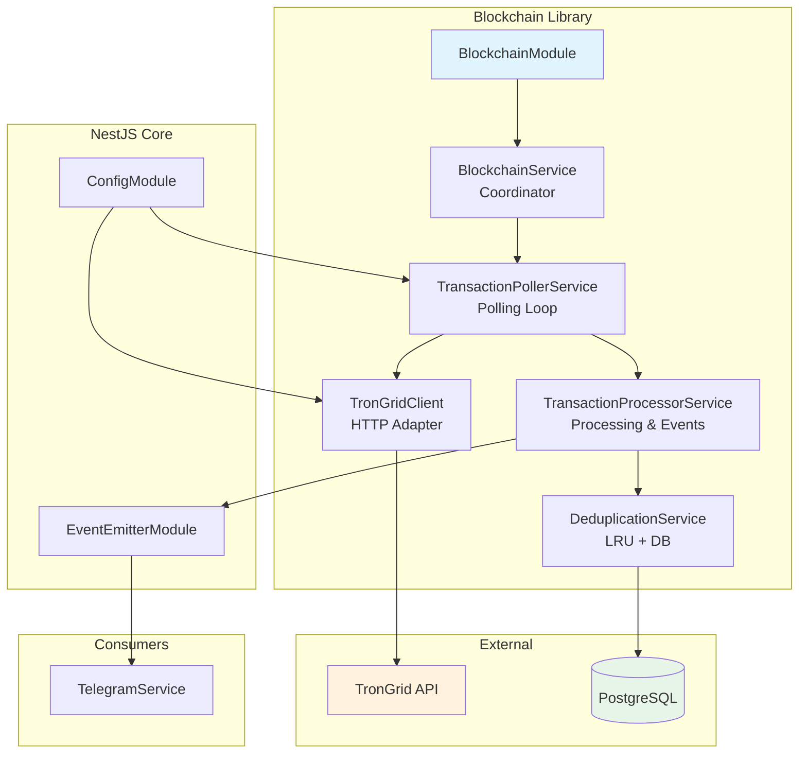
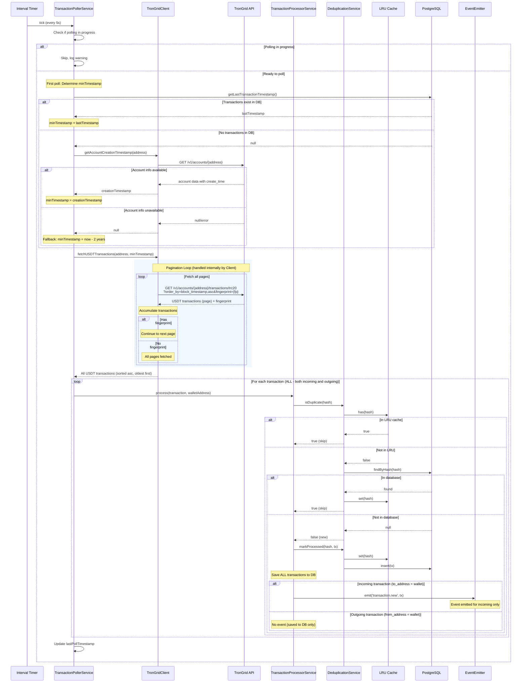
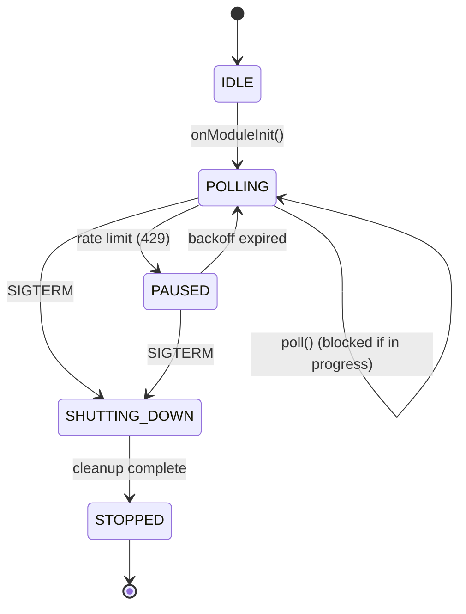

# TRON Blockchain Monitoring Design Document

## Overview

This document defines the technical design for TRON blockchain monitoring within the PayPing Telegram bot. The implementation monitors a single TRON wallet for USDT (TRC20) transactions using the TronGrid API with 5-second polling intervals. All transactions (both incoming and outgoing) are saved to the database for audit/history purposes, while events are emitted only for incoming transactions to trigger downstream notification services.

## Design Summary (Meta)

```yaml
design_type: "new_feature"
risk_level: "low"
complexity_level: "low"
complexity_rationale: >
  (1) Requirements: USDT TRC20 transaction monitoring (single endpoint with pagination),
      two-tier deduplication (LRU + PostgreSQL), graceful shutdown with inflight request handling,
      rate limit management with exponential backoff, and all transactions saved (events for incoming only).
  (2) Constraints/risks addressed: TronGrid free tier limits (100K/day, 15 QPS),
      API error resilience, pagination handling, and observability requirements.
  Scope evolved: v1.0 → v1.1 (USDT only) → v1.2 (DB timestamp) → v1.3 (all txs, pagination, sorting).
main_constraints:
  - "TronGrid free tier: 100K requests/day, 15 QPS"
  - "5-second polling interval requirement"
  - "NestJS standalone application (no HTTP server)"
  - "PostgreSQL for persistence"
  - "Save all transactions (incoming + outgoing) for audit"
biggest_risks:
  - "TronGrid API availability/rate limiting under load"
  - "Transaction deduplication edge cases during restart"
  - "Memory pressure from LRU cache under high transaction volume"
  - "Pagination may increase API calls during large time gaps"
unknowns:
  - "TronGrid API response time under TRON network congestion"
  - "Optimal LRU cache size for production load"
  - "Typical page count for 2-year historical fetch"
```

## Background and Context

### Prerequisite ADRs

- **ADR-0001: TRON Blockchain Monitoring Approach**: Defines TronGrid API polling as the selected approach with 5-second intervals, two-tier deduplication strategy, and architectural principles for error handling and observability. *Note: ADR-0001 remains valid; scope narrowed to USDT TRC20 only (TRX native transfers removed).*

### Agreement Checklist

#### Scope
- [x] Poll TronGrid API every 5 seconds for new transactions
- [x] Monitor USDT TRC20 transfers only (via `/v1/accounts/{address}/transactions/trc20`)
- [x] Download ALL transactions (both incoming and outgoing) for audit/history
- [x] Save ALL transactions to database
- [x] Emit notifications (events) ONLY for incoming transactions
- [x] Support pagination when fetching transactions from TronGrid API
- [x] Process transactions chronologically (oldest first)
- [x] Deduplicate transactions using in-memory LRU cache
- [x] Persist transactions to PostgreSQL for long-term deduplication
- [x] Emit events for new transactions via NestJS EventEmitter
- [x] Load wallet address dynamically from database
- [x] Implement exponential backoff on errors
- [x] Support graceful shutdown
- [x] On polling start, retrieve timestamp of last saved transaction from database
- [x] If no transactions in database, use fallback chain: wallet creation date from TronGrid, or (now - 2 years)

#### Non-Scope (Explicitly not changing)
- [x] HTTP server implementation (standalone application)
- [x] Telegram notification logic (handled by separate service)
- [x] User subscription management
- [x] Database schema design (separate concern)
- [x] Multiple wallet monitoring (single wallet only for MVP)
- [x] TRX native transfer monitoring (removed from scope)

#### Constraints
- [x] Parallel operation: No (single polling loop)
- [x] Backward compatibility: Not required (greenfield implementation)
- [x] Performance measurement: Required (metrics for Prometheus)

### Problem to Solve

PayPing needs to detect incoming USDT (TRC20) transactions on a TRON wallet in near real-time (5-10 seconds) to notify subscribers. The solution must work within TronGrid free tier limits while providing reliable deduplication and fault tolerance.

### Current Challenges

1. No blockchain monitoring implementation exists
2. `BlockchainService` is an empty shell
3. No configuration management for blockchain settings
4. No event emission infrastructure for transaction notifications

### Requirements

#### Functional Requirements

| ID | Requirement | Priority |
|----|-------------|----------|
| FR-1 | Poll TronGrid API every 5 seconds | Must |
| FR-2 | Monitor USDT (TRC20) transfers only | Must |
| FR-3 | Download all transactions, emit events for incoming only | Must |
| FR-4 | Deduplicate by transaction hash (LRU + PostgreSQL) | Must |
| FR-5 | Emit events for new transactions | Must |
| FR-6 | Load wallet address from database | Must |
| FR-7 | Handle API errors with exponential backoff | Must |
| FR-8 | Support graceful shutdown | Must |
| FR-9 | Configurable via environment variables | Must |
| FR-10 | On polling start, retrieve last transaction timestamp from database (fallback: wallet creation date or now - 2 years) | Must |

#### Non-Functional Requirements

- **Performance**: < 500ms per polling cycle (excluding API latency)
- **Reliability**: Zero transaction loss under normal operation
- **Availability**: Automatic recovery from transient API failures
- **Observability**: Prometheus metrics, structured logging, Sentry error tracking
- **Resource Usage**: LRU cache bounded to prevent memory exhaustion

## Acceptance Criteria (AC) - EARS Format

### FR-1: Polling Interval

- [x] **AC-1.1**: The system shall poll TronGrid API every 5 seconds when running normally
- [x] **AC-1.2**: **While** the previous poll is still in progress, the system shall skip the scheduled poll and log a warning
- [x] **AC-1.3**: **When** polling is paused due to rate limiting, the system shall resume after the backoff period expires

### FR-2: USDT (TRC20) Transaction Monitoring

- [x] **AC-2.1**: **When** a new USDT transfer is detected, the system shall extract transaction hash, from/to addresses, token amount, timestamp, and contract address
- [x] **AC-2.2**: The system shall use `contract_address` filter for USDT contract (TR7NHqjeKQxGTCi8q8ZY4pL8otSzgjLj6t)
- [x] **AC-2.3**: The system shall request only confirmed transactions (`only_confirmed=true`)
- [x] **AC-2.4**: The system shall filter transactions using `min_timestamp` parameter to reduce data transfer
- [x] **AC-2.5**: **If** the API returns an error, **then** the system shall retry with exponential backoff
- [x] **AC-2.6**: The system shall support pagination using TronGrid's `fingerprint` parameter
- [x] **AC-2.7**: The system shall fetch all pages until no more data is available (no `fingerprint` in response)
- [x] **AC-2.8**: The system shall request transactions sorted by `block_timestamp,asc` (oldest first) for chronological processing *(API verified: TronGrid supports `order_by` parameter)*
- [x] **AC-2.9**: The system shall limit pagination to a maximum number of pages (configurable, default: 100) to prevent infinite loops

### FR-3: Transaction Download and Event Emission

- [x] **AC-3.1**: The system shall save ALL transactions (both incoming and outgoing) to the database for audit/history
- [x] **AC-3.2**: The system shall emit events ONLY for incoming transactions (where `to_address` matches the monitored wallet)
- [x] **AC-3.3**: Outgoing transactions (where `from_address` matches monitored wallet) shall be saved but NOT trigger event emission

### FR-4: Transaction Deduplication

- [x] **AC-4.1**: **When** a transaction hash exists in LRU cache, the system shall skip processing immediately
- [x] **AC-4.2**: **When** a transaction hash exists in PostgreSQL, the system shall skip event emission
- [x] **AC-4.3**: **When** a new transaction is processed, the system shall add it to both LRU cache and PostgreSQL
- [x] **AC-4.4**: The LRU cache shall have a configurable maximum size (default: 10000 entries)

### FR-5: Event Emission

- [x] **AC-5.1**: **When** a new transaction is verified (passed deduplication), the system shall emit a `transaction.new` event
- [x] **AC-5.2**: The emitted event shall contain: transactionHash, type (USDT), fromAddress, toAddress, amount, timestamp, blockNumber, contractAddress
- [x] **AC-5.3**: **If** event emission fails, **then** the system shall log the error and continue processing

### FR-6: Dynamic Wallet Configuration

- [x] **AC-6.1**: **When** polling starts, the system shall load the wallet address from the database
- [x] **AC-6.2**: **If** no wallet address is configured, **then** the system shall log an error and pause polling
- [x] **AC-6.3**: The system shall not require restart to change monitored wallet address

### FR-7: Error Handling

- [x] **AC-7.1**: **When** TronGrid returns HTTP 429, the system shall wait using exponential backoff (initial: 1s, max: 60s)
- [x] **AC-7.2**: **When** TronGrid returns HTTP 5xx, the system shall retry up to 3 times with backoff
- [x] **AC-7.3**: **If** all retries fail, **then** the system shall log the error, report to Sentry, and continue with next poll cycle
- [x] **AC-7.4**: The system shall include jitter (0-500ms) in backoff calculations to prevent thundering herd

### FR-8: Graceful Shutdown

- [x] **AC-8.1**: **When** SIGTERM is received, the system shall complete the current poll cycle before shutting down
- [x] **AC-8.2**: **When** shutting down, the system shall flush pending database writes
- [x] **AC-8.3**: The system shall not start new poll cycles after shutdown signal

### FR-9: Configuration

- [x] **AC-9.1**: The system shall read configuration from environment variables
- [x] **AC-9.2**: Required configuration: `TRONGRID_API_KEY`, `TRONGRID_BASE_URL`
- [x] **AC-9.3**: Optional configuration with defaults: `POLLING_INTERVAL_MS=5000`, `LRU_CACHE_SIZE=10000`, `BACKOFF_INITIAL_MS=1000`, `BACKOFF_MAX_MS=60000`

### FR-10: Initial Polling Timestamp from Database

- [x] **AC-10.1**: **When** polling starts, the system shall query the database for the timestamp of the last saved transaction
- [x] **AC-10.2**: **If** no transactions exist in the database, **then** the system shall use a fallback chain:
  - Primary fallback: Query TronGrid API for wallet creation date (`getAccountCreationTimestamp`) *(API verified: `/v1/accounts/{address}` returns `create_time` in milliseconds)*
  - Secondary fallback: If wallet creation date unavailable, use `min_timestamp = now - 63072000000ms` (2 years)
- [x] **AC-10.3**: **When** restarting after downtime, the system shall continue from the last saved transaction timestamp
- [x] **AC-10.4**: The system shall NOT skip transactions that occurred during downtime
- [x] **AC-10.5**: **After** the first poll, subsequent polls shall use the timestamp of the last processed transaction as `min_timestamp`

## Existing Codebase Analysis

### Implementation Path Mapping

| Type | Path | Description |
|------|------|-------------|
| Existing | `libs/blockchain/src/blockchain.module.ts` | Empty module, needs providers |
| Existing | `libs/blockchain/src/blockchain.service.ts` | Empty service, becomes coordinator |
| Existing | `libs/blockchain/src/index.ts` | Exports, needs expansion |
| New | `libs/blockchain/src/config/blockchain.config.ts` | Configuration registration |
| New | `libs/blockchain/src/clients/trongrid.client.ts` | HTTP client for TronGrid |
| New | `libs/blockchain/src/services/transaction-poller.service.ts` | Polling orchestration |
| New | `libs/blockchain/src/services/transaction-processor.service.ts` | Processing and event emission |
| New | `libs/blockchain/src/services/deduplication.service.ts` | LRU + DB deduplication |
| New | `libs/blockchain/src/interfaces/transaction.interface.ts` | Domain types |
| New | `libs/blockchain/src/interfaces/trongrid-response.interface.ts` | API response types |
| New | `libs/blockchain/src/constants/contracts.ts` | USDT contract address |
| New | `libs/blockchain/src/events/transaction.events.ts` | Event definitions |

### Integration Points

| Integration Point | Target | Method |
|-------------------|--------|--------|
| Configuration | `@nestjs/config` ConfigModule | `ConfigService` injection |
| Event Emission | `@nestjs/event-emitter` EventEmitterModule | `EventEmitter2` injection |
| Database | `@app/db` DbService | Service injection |
| HTTP Client | `axios` | Direct usage in TronGridClient |

### Similar Functionality Search

- **No existing blockchain monitoring implementation found** - This is a greenfield implementation
- **No existing event emission patterns found** - First use of EventEmitter in the project
- **No existing configuration patterns found** - First use of ConfigModule

## Design

### Change Impact Map

```yaml
Change Target: "@app/blockchain library"
Direct Impact:
  - libs/blockchain/src/blockchain.module.ts (complete rewrite)
  - libs/blockchain/src/blockchain.service.ts (coordinator implementation)
  - libs/blockchain/src/index.ts (export additions)
  - src/app.module.ts (module imports)
Indirect Impact:
  - @app/db (new transaction persistence methods required)
  - @app/telegram (will consume transaction.new events)
No Ripple Effect:
  - Existing test files (new tests will be added)
  - Build configuration
  - Package dependencies (already installed)
```

### Architecture Overview



### Data Flow



### Integration Points List

| Integration Point | Location | Old Implementation | New Implementation | Switching Method |
|-------------------|----------|-------------------|-------------------|------------------|
| Module Registration | `AppModule` | None | `BlockchainModule.forRoot()` | Import with config |
| Event Consumption | `TelegramService` | None | `@OnEvent('transaction.new')` | Decorator |
| Configuration | `BlockchainModule` | None | `ConfigModule.forFeature()` | Static method |
| Transaction Storage | `DbService` | None | `saveTransaction()` method | New method |

### Main Components

#### TronGridClient

- **Responsibility**: HTTP communication with TronGrid API, response transformation, error handling, pagination
- **Interface**:
  ```typescript
  interface TronGridClient {
    /**
     * Fetch all USDT transactions since minTimestamp.
     * Handles pagination internally - fetches all pages.
     * Returns transactions sorted by block_timestamp ascending (oldest first).
     */
    fetchUSDTTransactions(address: string, minTimestamp: number): Promise<USDTTransaction[]>;

    /**
     * Get the wallet creation timestamp from TronGrid API.
     * Used as primary fallback when no transactions exist in database.
     * Returns null if account info is not available.
     */
    getAccountCreationTimestamp(address: string): Promise<number | null>;
  }
  ```
- **Dependencies**: `ConfigService`, `axios`

#### TransactionPollerService

- **Responsibility**: Orchestrate polling loop, manage timing, retrieve initial timestamp from database
- **Interface**:
  ```typescript
  interface TransactionPollerService {
    startPolling(): void;
    stopPolling(): Promise<void>;
    isPolling(): boolean;
    /**
     * Get initial timestamp for first poll with fallback chain:
     * 1. Query DB for last saved transaction timestamp
     * 2. If no DB data: Query TronGrid for wallet creation date
     * 3. If no wallet creation date: Use now - 2 years
     */
    getInitialTimestamp(): Promise<number>;
  }
  ```
- **Dependencies**: `TronGridClient`, `TransactionProcessorService`, `ConfigService`, `DbService`

#### TransactionProcessorService

- **Responsibility**: Transform API responses to domain models, save all transactions, emit events for incoming only
- **Interface**:
  ```typescript
  interface TransactionProcessorService {
    /**
     * Process a single USDT transaction:
     * 1. Check deduplication (skip if duplicate)
     * 2. Save to database (all transactions)
     * 3. Emit event ONLY if incoming (to_address = walletAddress)
     */
    processUSDTTransaction(tx: TRC20ApiResponse, walletAddress: string): Promise<void>;
  }
  ```
- **Dependencies**: `DeduplicationService`, `EventEmitter2`

#### DeduplicationService

- **Responsibility**: Manage LRU cache, coordinate with database for deduplication
- **Interface**:
  ```typescript
  interface DeduplicationService {
    isDuplicate(hash: string): Promise<boolean>;
    markProcessed(hash: string, transaction: Transaction): Promise<void>;
  }
  ```
- **Dependencies**: `DbService`, LRU Cache instance

#### BlockchainService (Coordinator)

- **Responsibility**: Module facade, lifecycle management, wallet address resolution
- **Interface**:
  ```typescript
  interface BlockchainService {
    onModuleInit(): Promise<void>;
    onModuleDestroy(): Promise<void>;
    getMonitoredWallet(): Promise<string | null>;
  }
  ```
- **Dependencies**: `TransactionPollerService`, `DbService`

### Contract Definitions

```typescript
// libs/blockchain/src/interfaces/transaction.interface.ts

export enum TransactionType {
  USDT = 'USDT',
}

export interface Transaction {
  hash: string;
  type: TransactionType;
  fromAddress: string;
  toAddress: string;
  amount: string; // String to preserve precision (6 decimals for USDT)
  timestamp: number; // Unix timestamp in milliseconds
  blockNumber: number;
  contractAddress: string; // USDT TRC20 contract address
  raw?: unknown; // Original API response for debugging
}

export interface TransactionNewEvent {
  transaction: Transaction;
  detectedAt: number;
}
```

```typescript
// libs/blockchain/src/interfaces/trongrid-response.interface.ts

export interface TronGridPaginatedResponse<T> {
  data: T[];
  success: boolean;
  meta: {
    at: number;
    page_size: number;
    fingerprint?: string;
  };
}

export interface TRC20TransactionResponse {
  transaction_id: string;
  block_timestamp: number;
  from: string;
  to: string;
  value: string;
  token_info: {
    symbol: string;
    address: string;
    decimals: number;
    name: string;
  };
  type: string; // 'Transfer' or 'Approval'
}
```

### Data Contract

#### TronGridClient

```yaml
Input:
  Type: { address: string, minTimestamp: number }
  Preconditions:
    - address is valid TRON address (base58 or hex)
    - minTimestamp is Unix timestamp in milliseconds
    - First poll: minTimestamp = last saved transaction timestamp from DB (or wallet creation date, or now - 2 years if no DB data)
    - Subsequent polls: minTimestamp = timestamp of last processed transaction
  Validation: Address format checked, timestamp > 0

Output:
  Type: Transaction[] (domain model, USDT only)
  Guarantees:
    - Transactions sorted by block_timestamp ascending (oldest first, chronological order)
    - All required fields populated
    - Amount converted from smallest unit to USDT (6 decimals)
    - Only USDT TRC20 transactions (contract: TR7NHqjeKQxGTCi8q8ZY4pL8otSzgjLj6t)
    - All pages fetched (pagination handled internally)
  On Error: Throws TronGridApiError with retry info

API Parameters:
  - contract_address: USDT contract (TR7NHqjeKQxGTCi8q8ZY4pL8otSzgjLj6t)
  - only_confirmed: true
  - min_timestamp: {minTimestamp}
  - order_by: block_timestamp,asc
  - limit: 200 (per page)
  - fingerprint: {from previous response, for pagination}

Pagination:
  - Client handles pagination internally
  - Fetches all pages until response has no fingerprint
  - Returns complete merged result

Invariants:
  - API key always included in requests
  - Requests never exceed 15 QPS
  - Only /v1/accounts/{address}/transactions/trc20 endpoint used
```

#### DeduplicationService

```yaml
Input:
  Type: { hash: string, transaction?: Transaction }
  Preconditions:
    - hash is 64-character hex string
    - transaction provided only for markProcessed
  Validation: Hash format validation

Output:
  Type: boolean (for isDuplicate), void (for markProcessed)
  Guarantees:
    - LRU cache checked before database
    - Database write is atomic
    - LRU updated after database success
  On Error:
    - isDuplicate: Returns false (fail-open for safety)
    - markProcessed: Throws error (fail-fast)

Invariants:
  - LRU cache never exceeds configured max size
  - Database is source of truth
```

### State Transitions and Invariants

```yaml
State Definition:
  - Initial State: IDLE (service created but not started)
  - Possible States: [IDLE, POLLING, PAUSED, SHUTTING_DOWN, STOPPED]

State Transitions:
  IDLE → onModuleInit() → POLLING
  POLLING → poll() in progress → POLLING (re-entry blocked)
  POLLING → rate limit hit → PAUSED
  PAUSED → backoff expired → POLLING
  POLLING → SIGTERM received → SHUTTING_DOWN
  PAUSED → SIGTERM received → SHUTTING_DOWN
  SHUTTING_DOWN → current poll complete → STOPPED
  SHUTTING_DOWN → no poll in progress → STOPPED

System Invariants:
  - Only one poll cycle executes at a time
  - Transactions are never emitted twice for same hash
  - Shutdown always completes pending operations
```



### Error Handling

| Error Type | Detection | Response | Recovery |
|------------|-----------|----------|----------|
| HTTP 429 (Rate Limit) | Status code | Exponential backoff with jitter | Auto-resume after delay |
| HTTP 5xx (Server Error) | Status code | Retry up to 3 times | Continue with next cycle |
| Network Timeout | axios timeout | Retry with backoff | Continue with next cycle |
| Invalid Response | JSON parse failure | Log and skip batch | Continue with next cycle |
| Database Error | Exception from DbService | Log, report to Sentry | Re-throw (fail-fast) |
| No Wallet Configured | Null from DB | Log warning, pause polling | Check on next cycle |

#### Error Propagation Strategy

```typescript
// Infrastructure layer: Always throw with context
class TronGridClient {
  async fetch(): Promise<Transaction[]> {
    try {
      const response = await axios.get(url);
      return this.transform(response.data);
    } catch (error) {
      throw new TronGridApiError('Failed to fetch transactions', {
        cause: error,
        url,
        statusCode: error.response?.status,
      });
    }
  }
}

// Application layer: Business-driven decisions
class TransactionPollerService {
  async poll(): Promise<void> {
    try {
      const transactions = await this.client.fetch();
      await this.processor.processAll(transactions);
    } catch (error) {
      if (error instanceof TronGridApiError && error.statusCode === 429) {
        await this.backoff.wait();
        return; // Retry next cycle
      }
      this.logger.error('Poll failed', { error });
      this.sentry.captureException(error);
      // Continue with next cycle - do not crash
    }
  }
}
```

### Logging and Monitoring

#### Structured Logging

```typescript
// Log levels and contexts
{
  level: 'info',
  context: 'TransactionPollerService',
  message: 'Poll cycle completed',
  data: {
    usdtCount: 5,
    incomingCount: 3,
    newTransactions: 2,
    durationMs: 450,
    minTimestamp: 1737460740000,
    timestamp: '2026-01-21T10:00:00.000Z'
  }
}
```

#### Prometheus Metrics

| Metric Name | Type | Labels | Description |
|-------------|------|--------|-------------|
| `blockchain_poll_duration_ms` | Histogram | - | Time to complete poll cycle |
| `blockchain_usdt_transactions_total` | Counter | - | Total incoming USDT transactions processed |
| `blockchain_api_requests_total` | Counter | `status` | TronGrid TRC20 API calls |
| `blockchain_api_errors_total` | Counter | `error_type` | API errors by type |
| `blockchain_lru_cache_size` | Gauge | - | Current LRU cache entries |
| `blockchain_dedup_hits_total` | Counter | `layer` | Deduplication hits (lru/db) |

#### Sentry Integration

- **Error Tracking**: All unhandled exceptions
- **Breadcrumbs**: API calls, state transitions, deduplication decisions
- **Tags**: `wallet_address`, `transaction_type`, `environment`

### Configuration Schema

```typescript
// libs/blockchain/src/config/blockchain.config.ts

import { registerAs } from '@nestjs/config';

export interface BlockchainConfig {
  trongrid: {
    baseUrl: string;
    apiKey: string;
    timeoutMs: number;
  };
  polling: {
    intervalMs: number;
    enabled: boolean;
    fallbackWindowMs: number; // Secondary fallback lookback window when no DB data AND no wallet creation date (default: 63072000000ms = 2 years)
    maxPages: number; // Maximum pagination pages per poll cycle to prevent infinite loops (default: 100)
  };
  lruCache: {
    maxSize: number;
    ttlMs: number;
  };
  backoff: {
    initialMs: number;
    maxMs: number;
    multiplier: number;
    jitterMs: number;
  };
  contracts: {
    usdt: string;
  };
}

export default registerAs('blockchain', (): BlockchainConfig => ({
  trongrid: {
    baseUrl: process.env.TRONGRID_BASE_URL || 'https://api.trongrid.io',
    apiKey: process.env.TRONGRID_API_KEY || '',
    timeoutMs: parseInt(process.env.TRONGRID_TIMEOUT_MS || '10000', 10),
  },
  polling: {
    intervalMs: parseInt(process.env.POLLING_INTERVAL_MS || '5000', 10),
    enabled: process.env.POLLING_ENABLED !== 'false',
    fallbackWindowMs: parseInt(process.env.POLLING_FALLBACK_WINDOW_MS || '63072000000', 10), // 2 years
    maxPages: parseInt(process.env.POLLING_MAX_PAGES || '100', 10), // Safety limit for pagination
  },
  lruCache: {
    maxSize: parseInt(process.env.LRU_CACHE_SIZE || '10000', 10),
    ttlMs: parseInt(process.env.LRU_CACHE_TTL_MS || '3600000', 10), // 1 hour
  },
  backoff: {
    initialMs: parseInt(process.env.BACKOFF_INITIAL_MS || '1000', 10),
    maxMs: parseInt(process.env.BACKOFF_MAX_MS || '60000', 10),
    multiplier: parseFloat(process.env.BACKOFF_MULTIPLIER || '2'),
    jitterMs: parseInt(process.env.BACKOFF_JITTER_MS || '500', 10),
  },
  contracts: {
    usdt: process.env.USDT_CONTRACT_ADDRESS || 'TR7NHqjeKQxGTCi8q8ZY4pL8otSzgjLj6t',
  },
}));
```

#### Environment Variables

| Variable | Required | Default | Description |
|----------|----------|---------|-------------|
| `TRONGRID_API_KEY` | Yes | - | TronGrid API key |
| `TRONGRID_BASE_URL` | No | `https://api.trongrid.io` | TronGrid endpoint |
| `TRONGRID_TIMEOUT_MS` | No | `10000` | Request timeout |
| `POLLING_INTERVAL_MS` | No | `5000` | Polling interval |
| `POLLING_ENABLED` | No | `true` | Enable/disable polling |
| `POLLING_FALLBACK_WINDOW_MS` | No | `63072000000` | Secondary fallback lookback window when no DB data AND no wallet creation date (2 years) |
| `POLLING_MAX_PAGES` | No | `100` | Maximum pagination pages per poll cycle (safety limit) |
| `LRU_CACHE_SIZE` | No | `10000` | Max LRU cache entries |
| `LRU_CACHE_TTL_MS` | No | `3600000` | LRU entry TTL |
| `BACKOFF_INITIAL_MS` | No | `1000` | Initial backoff delay |
| `BACKOFF_MAX_MS` | No | `60000` | Maximum backoff delay |
| `BACKOFF_MULTIPLIER` | No | `2` | Backoff multiplier |
| `BACKOFF_JITTER_MS` | No | `500` | Random jitter range |
| `USDT_CONTRACT_ADDRESS` | No | `TR7NHqjeKQxGTCi8q8ZY4pL8otSzgjLj6t` | USDT TRC20 contract |

## Implementation Plan

### Implementation Approach

**Selected Approach**: Vertical Slice with Foundation Layer First

**Selection Reason**: The blockchain monitoring feature has clear boundaries and can be implemented as a complete vertical slice. However, configuration and interfaces must be established first to ensure consistent integration. The feature has no existing dependencies to manage, making vertical implementation straightforward.

### Technical Dependencies and Implementation Order

#### Required Implementation Order

1. **Configuration and Interfaces (Foundation)**
   - Technical Reason: All components depend on configuration schema and type definitions
   - Dependent Elements: TronGridClient, TransactionPollerService, all services
   - Files: `blockchain.config.ts`, `transaction.interface.ts`, `trongrid-response.interface.ts`, `contracts.ts`

2. **TronGridClient (Infrastructure)**
   - Technical Reason: Core HTTP communication must work before polling can be tested
   - Prerequisites: Configuration, interface definitions
   - Files: `trongrid.client.ts`

3. **DeduplicationService (Infrastructure)**
   - Technical Reason: Must be ready before transaction processing
   - Prerequisites: Interface definitions, LRU cache setup
   - Files: `deduplication.service.ts`

4. **TransactionProcessorService (Application)**
   - Technical Reason: Transforms data and emits events, depends on deduplication
   - Prerequisites: DeduplicationService, EventEmitter setup
   - Files: `transaction-processor.service.ts`, `transaction.events.ts`

5. **TransactionPollerService (Orchestration)**
   - Technical Reason: Coordinates all components, requires everything else
   - Prerequisites: TronGridClient, TransactionProcessorService
   - Files: `transaction-poller.service.ts`

6. **BlockchainService and Module (Integration)**
   - Technical Reason: Module wiring and lifecycle management
   - Prerequisites: All services implemented
   - Files: `blockchain.service.ts`, `blockchain.module.ts`, `index.ts`

### Integration Points

**Integration Point 1: TronGrid API**
- Components: TronGridClient -> TronGrid API
- Verification: Integration test with mock server, manual test with Shasta testnet

**Integration Point 2: Event Emission**
- Components: TransactionProcessorService -> EventEmitter2 -> TelegramService
- Verification: Unit test with event spy, integration test with mock listener

**Integration Point 3: Database Persistence**
- Components: DeduplicationService -> DbService -> PostgreSQL
- Verification: Integration test with test database

**Integration Point 4: Configuration**
- Components: ConfigModule -> All Services
- Verification: Unit test with mock config, integration test with .env.test

### E2E Verification Procedures

| Phase | Verification | Command/Method |
|-------|--------------|----------------|
| Foundation | Config loads correctly | Unit test: `blockchain.config.spec.ts` |
| Infrastructure | TronGrid client fetches data | Integration test with Shasta testnet |
| Infrastructure | Deduplication works | Unit test with mock LRU and DB |
| Application | Events emitted correctly | Integration test with event spy |
| Orchestration | Full poll cycle works | E2E test with mock TronGrid |
| Integration | Module initializes | `pnpm run start:dev` with logs |

### Migration Strategy

Not applicable - greenfield implementation with no existing data or functionality to migrate.

## Test Strategy

### Basic Test Design Policy

Tests derived directly from Acceptance Criteria:
- Each AC generates at least one test case
- Test names reference AC IDs for traceability
- Edge cases derived from AC boundary conditions

### Unit Tests

**Coverage Target**: 80%

| Component | Test Focus | Key Test Cases |
|-----------|------------|----------------|
| TronGridClient | Response transformation, error handling, pagination, sorting | AC-2.1, AC-2.2, AC-2.3, AC-2.4, AC-2.5, AC-2.6, AC-2.7, AC-2.8 |
| DeduplicationService | LRU behavior, DB fallback | AC-4.1, AC-4.2, AC-4.3, AC-4.4 |
| TransactionProcessorService | Save all txs, emit events for incoming only | AC-3.1, AC-3.2, AC-3.3, AC-5.1, AC-5.2, AC-5.3 |
| TransactionPollerService | Timing, skip logic, backoff, DB timestamp retrieval, fallback chain | AC-1.1, AC-1.2, AC-7.1, AC-7.4, AC-10.1, AC-10.2, AC-10.3, AC-10.4 |
| BlockchainConfig | Defaults, validation | AC-9.1, AC-9.2, AC-9.3 |

### Integration Tests

| Test Scenario | Components | Verification |
|---------------|------------|--------------|
| Full poll cycle | Poller + Client + Processor | Transactions flow through all layers |
| Deduplication E2E | Dedup + LRU + DB | Duplicates blocked at both layers |
| Error recovery | Client + Poller | Backoff and retry work correctly |
| Graceful shutdown | Poller + Module | Pending operations complete |

### E2E Tests

| Test Scenario | Setup | Expected Outcome |
|---------------|-------|------------------|
| New incoming USDT transaction | Mock TronGrid with incoming USDT tx | Event emitted, tx saved to DB |
| Outgoing USDT transaction saved but no event | Mock TronGrid with outgoing USDT tx | No event emitted, tx saved to DB |
| Both incoming and outgoing transactions | Mock TronGrid with mixed txs | All saved to DB, events only for incoming |
| Duplicate transaction | Same tx in consecutive polls | No duplicate event, no duplicate DB entry |
| Rate limit handling | Mock 429 response | Backoff applied, recovery |
| Network failure | Mock timeout | Retry with backoff |
| Pagination - multiple pages | Mock TronGrid returning fingerprint | All pages fetched, all transactions processed |
| Pagination - empty result | Mock TronGrid returning no transactions | No errors, no transactions processed |
| Initial polling - no DB data, wallet has creation date | Fresh start, empty DB | Uses wallet creation timestamp from TronGrid |
| Initial polling - no DB data, no wallet creation date | Fresh start, empty DB, API returns null | Uses fallback (now - 2 years) as minTimestamp |
| Initial polling - DB has data | Start with existing transactions in DB | Uses last saved transaction timestamp |
| Restart after downtime | Restart service after extended downtime | Continues from last saved timestamp, no transactions skipped |
| Chronological processing | Mock TronGrid with transactions | Transactions processed in ascending order (oldest first) |

### Performance Tests

| Metric | Target | Test Method |
|--------|--------|-------------|
| Poll cycle duration | < 500ms | Benchmark test with mock |
| LRU lookup | < 1ms | Microbenchmark |
| Memory usage | < 100MB | Load test with 10K cache |
| CPU usage | < 10% idle | Profiling under load |

## Security Considerations

| Concern | Mitigation |
|---------|------------|
| API key exposure | Environment variable, never in logs |
| Sensitive data in logs | Mask addresses except first/last 4 chars |
| Rate limit abuse | Client-side rate limiting before TronGrid |
| Injection attacks | Validate all external input (addresses, hashes) |
| Error message leakage | Generic messages to users, detailed to Sentry |

## Future Extensibility

| Future Feature | Design Consideration |
|----------------|---------------------|
| Multiple wallets | WalletRepository pattern, polling per wallet |
| Additional tokens | Token registry, dynamic contract loading |
| WebSocket upgrade | TronGridClient interface allows swap |
| Horizontal scaling | Distributed LRU cache (Redis), DB-based locking |
| Historical backfill | Pagination support in TronGridClient |

## Alternative Solutions

### Alternative 1: Database-Only Deduplication

- **Overview**: Skip LRU cache, use only PostgreSQL for deduplication
- **Advantages**: Simpler architecture, single source of truth
- **Disadvantages**: Higher database load, slower duplicate detection
- **Reason for Rejection**: LRU cache provides significant performance improvement for hot data

### Alternative 2: Redis for Deduplication

- **Overview**: Use Redis instead of in-process LRU cache
- **Advantages**: Survives restart, shared across instances
- **Disadvantages**: Additional infrastructure, latency for local checks
- **Reason for Rejection**: MVP scope prefers simplicity; can migrate later if scaling needed

### Alternative 3: Fixed Time Window on Restart

- **Overview**: On restart, always fetch transactions from last 1 minute (timestamp = now - 60000ms)
- **Advantages**: Simple implementation, predictable behavior, no database dependency for initial timestamp
- **Disadvantages**: May miss transactions during extended downtime, requires manual intervention for recovery
- **Reason for Rejection**: Database-based timestamp retrieval ensures continuity after restart without missing transactions

## Risks and Mitigation

| Risk | Impact | Probability | Mitigation |
|------|--------|-------------|------------|
| TronGrid rate limit changes | High | Low | Monitor usage, implement circuit breaker |
| API response format changes | High | Low | Version pin API, comprehensive response validation |
| High transaction volume | Medium | Medium | Configurable LRU size, batch processing |
| Memory leak in LRU | Medium | Low | Use battle-tested lru-cache library |
| Database connection issues | High | Low | Connection pooling, retry logic |
| High transaction volume during extended downtime | Medium | Low | Database timestamp ensures all transactions since last save are fetched; pagination may be needed for very large gaps |
| Database query latency on startup | Low | Low | Single query overhead is acceptable; fallback to fixed window if DB unavailable |

## References

- [TronGrid API Documentation](https://developers.tron.network/docs/trongrid) - Official TronGrid reference
- [TronGrid Rate Limits](https://developers.tron.network/reference/rate-limits) - Rate limit specifications
- [Get TRC-20 Transaction History](https://developers.tron.network/docs/get-trc20-transaction-history) - TRC20 endpoint documentation (primary endpoint for USDT monitoring)
- [NestJS Events Documentation](https://docs.nestjs.com/techniques/events) - Official NestJS event emitter guide
- [lru-cache npm package](https://www.npmjs.com/package/lru-cache) - Recommended LRU cache implementation
- [nestjs-lru-cache](https://github.com/StimulCross/nestjs-lru-cache) - NestJS LRU cache wrapper
- [Sentry NestJS Event Emitter Integration](https://docs.sentry.io/platforms/javascript/guides/nestjs/features/event-emitter/) - Error tracking for events

## Update History

| Date | Version | Changes | Author |
|------|---------|---------|--------|
| 2026-01-21 | 1.0 | Initial version | Claude |
| 2026-01-21 | 1.1 | Scope narrowed to USDT only; initial polling window set to 1 minute | Claude |
| 2026-01-22 | 1.2 | Initial polling timestamp now retrieved from database instead of fixed 1-minute window | Claude |
| 2026-01-22 | 1.3 | Transaction scope expanded; pagination support; sorting changed to ascending; fallback timestamp chain updated | Claude |
| 2026-01-22 | 1.3.1 | API verification confirmed; added max_pages safety limit (AC-2.9) | Claude |

## Change History

### v1.1 - 2026-01-21

**Scope Changes:**
1. **Removed TRX native transfer monitoring** - Now monitors USDT (TRC20) only
2. **Removed outgoing transaction monitoring** - Now tracks incoming transactions only
3. **Added initial polling window** - On first poll or restart, starts from last 1 minute (timestamp = now - 60000ms)

**Rationale:**
- Simplifies implementation by focusing on the core use case (USDT deposits)
- Reduces API usage from 2 endpoints to 1 endpoint per poll cycle
- 1-minute initial window prevents processing old historical transactions on restart while still capturing recent activity

**Affected Sections:**
- Overview: Updated scope description
- Design Summary: Reduced complexity level to "low"
- Agreement Checklist: Updated scope and non-scope items
- Functional Requirements: Renumbered FR-2 through FR-10
- Acceptance Criteria: Removed TRX ACs, added FR-10 for initial polling window
- Data Flow Diagram: Simplified to single API call, added initial timestamp note
- Contract Definitions: Removed TransactionType.TRX, TransactionDirection enum
- TronGridClient Interface: Removed fetchTRXTransactions method
- TransactionProcessorService Interface: Simplified to single processUSDTTransaction method
- Configuration Schema: Added polling.initialWindowMs (superseded by v1.2: polling.fallbackWindowMs)
- Environment Variables: Added POLLING_INITIAL_WINDOW_MS (superseded by v1.2: POLLING_FALLBACK_WINDOW_MS)
- Test Strategy: Updated test cases to reference new AC numbers
- E2E Tests: Replaced TRX tests with initial window tests
- Alternative Solutions: Replaced "Single Combined API Call" with "Historical Backfill on Restart"
- Risks: Updated restart risk assessment
- References: Removed TRX endpoint reference

**ADR Relationship:**
- ADR-0001 remains valid - TronGrid polling approach unchanged
- Scope narrowed from "TRX + USDT" to "USDT only"

### v1.2 - 2026-01-22

**Critical Change: Initial Polling Timestamp Logic**

Replaced fixed 1-minute window with database-based timestamp retrieval to ensure transaction continuity after restart.

**Previous Behavior (Removed):**
- When polling starts, use `min_timestamp = now - 60000ms` (last 1 minute)
- Transactions older than 1 minute could be missed during extended downtime

**New Behavior:**
- When polling starts, query database for timestamp of last saved transaction
- If no transactions in database, use `now - 60000ms` as fallback
- Ensures continuity after restart - no transactions are skipped during downtime

**Affected Sections:**

1. **Agreement Checklist (Scope)**
   - Changed: "On polling start, retrieve timestamp of last saved transaction from database"
   - Added: "If no transactions in database, use (now - 60000ms) as fallback"

2. **FR-10 (Functional Requirement)**
   - Changed from: "On first poll or restart, start from last 1 minute"
   - Changed to: "On polling start, retrieve last transaction timestamp from database (fallback: now - 60000ms)"

3. **AC-10.x (Acceptance Criteria)**
   - AC-10.1: Now requires DB query for last transaction timestamp
   - AC-10.2: Defines fallback behavior when no DB data exists
   - AC-10.3: Specifies continuity requirement after downtime
   - AC-10.4: Explicitly states system SHALL NOT skip transactions during downtime
   - AC-10.5: Subsequent polls use last processed transaction timestamp

4. **Data Flow Diagram**
   - Added: DB query step (`getLastTransactionTimestamp()`) before first API call
   - Added: Decision branch for DB data exists vs. fallback

5. **TransactionPollerService Interface**
   - `getInitialTimestamp()` now returns `Promise<number>` (async DB query)
   - Added `DbService` as dependency

6. **Configuration Schema**
   - Renamed: `polling.initialWindowMs` to `polling.fallbackWindowMs`
   - Updated description to clarify fallback-only usage

7. **Environment Variables**
   - Renamed: `POLLING_INITIAL_WINDOW_MS` to `POLLING_FALLBACK_WINDOW_MS`
   - Updated description: "Fallback lookback window when no DB data (1 minute)"

8. **Data Contract (TronGridClient)**
   - Updated precondition: "First poll: minTimestamp = last saved transaction timestamp from DB (or now - 60000ms if no DB data)"

9. **E2E Tests**
   - Replaced: "Initial polling window" test with three new test scenarios
   - Added: "Initial polling - no DB data" (tests fallback)
   - Added: "Initial polling - DB has data" (tests DB timestamp retrieval)
   - Added: "Restart after downtime" (tests continuity)

10. **Alternative Solutions**
    - Replaced: "Historical Backfill on Restart" with "Fixed Time Window on Restart"
    - Previous approach is now documented as rejected alternative

11. **Risks and Mitigation**
    - Removed: "Missed transactions during restart" and "Transactions older than 1 minute missed"
    - Added: "High transaction volume during extended downtime" with pagination note
    - Added: "Database query latency on startup" with acceptable overhead assessment

**Rationale:**
- Previous 1-minute window was a simplicity trade-off that could cause data loss during extended downtime
- Database-based approach ensures zero transaction loss with minimal additional complexity
- Fallback to 1-minute window maintains behavior for fresh installations
- Change aligns with reliability requirement: "Zero transaction loss under normal operation"

**ADR Relationship:**
- ADR-0001 remains valid - TronGrid polling approach unchanged
- Change improves reliability without modifying core architecture

### v1.3 - 2026-01-22

**Major Changes:**

#### 1. Transaction Scope Expansion

**Previous Behavior:**
- Track incoming transactions only
- Ignore outgoing transactions completely

**New Behavior:**
- Download ALL USDT transactions (both incoming AND outgoing)
- Save ALL transactions to database (for history/audit trail)
- Emit notifications (events) ONLY for incoming transactions

**Rationale:**
- Complete transaction history required for audit and reconciliation
- Outgoing transactions are valuable for user's transaction history view
- Event emission for incoming only maintains original notification behavior

**Affected Sections:**
- Agreement Checklist (Scope): Added "Download ALL transactions", "Save ALL transactions to database", "Emit notifications ONLY for incoming"
- Non-Scope: Removed "Outgoing transaction monitoring"
- FR-3: Changed from "Track incoming transactions only" to "Download all transactions, emit events for incoming only"
- AC-3.1: Changed to "save all transactions to database"
- AC-3.2: Changed to "emit events only for incoming transactions"
- AC-3.3: Added "Outgoing transactions saved but NOT trigger event emission"
- TransactionProcessorService interface: Updated responsibility description
- Data Flow Diagram: Updated loop to show "ALL transactions" processing with conditional event emission

#### 2. Pagination Support

**Previous Behavior:**
- No pagination support
- Single API call returned limited results

**New Behavior:**
- TronGridClient handles pagination internally using `fingerprint` parameter
- Fetches ALL pages until no more data is available
- Returns complete merged result

**Rationale:**
- Large time gaps (e.g., after extended downtime) may return more transactions than single page limit
- Ensures no transactions are missed due to pagination limits
- Internal pagination handling keeps the interface simple for consumers

**Affected Sections:**
- Agreement Checklist (Scope): Added "Support pagination when fetching transactions from TronGrid API"
- AC-2.6: Added pagination support using `fingerprint` parameter
- AC-2.7: Added requirement to fetch all pages until no fingerprint returned
- TronGridClient interface: Added JSDoc explaining pagination handling
- Data Contract: Added "Pagination" section and "API Parameters" section
- Data Flow Diagram: Added pagination loop visualization
- E2E Tests: Added "Pagination - multiple pages" and "Pagination - empty result" scenarios
- Unit Tests: Added AC-2.6, AC-2.7 to TronGridClient test focus

#### 3. Sorting Order Change

**Previous Behavior:**
- Transactions sorted by timestamp descending (newest first)

**New Behavior:**
- Transactions sorted by `block_timestamp,asc` (oldest first)
- Enables chronological processing of transactions

**Rationale:**
- Processing oldest transactions first ensures correct state progression
- Matches natural order of events (first in, first processed)
- Required for correct handling of dependent transactions

**Affected Sections:**
- Agreement Checklist (Scope): Added "Process transactions chronologically (oldest first)"
- AC-2.8: Added requirement for ascending sort order
- Data Contract: Changed "Transactions sorted by timestamp descending" to "block_timestamp ascending"
- Data Contract: Added `order_by: block_timestamp,asc` to API Parameters
- Data Flow Diagram: Updated to show "sorted asc, oldest first"
- E2E Tests: Added "Chronological processing" test scenario

#### 4. Fallback Timestamp Chain Update

**Previous Behavior:**
- Primary: Last saved transaction timestamp from DB
- Secondary fallback: `now - 60000ms` (1 minute)

**New Behavior:**
- Primary: Last saved transaction timestamp from DB
- Secondary fallback: Wallet creation date from TronGrid API
- Tertiary fallback: `now - 63072000000ms` (2 years)

**Rationale:**
- 1-minute fallback was too short for fresh installations with existing wallet history
- Wallet creation date provides accurate starting point for new installations
- 2-year fallback ensures complete history capture when wallet creation date unavailable
- Supports wallets with historical transactions that need to be imported

**Affected Sections:**
- AC-10.2: Updated fallback chain description with primary and secondary fallbacks
- TronGridClient interface: Added `getAccountCreationTimestamp(address: string): Promise<number | null>` method
- TransactionPollerService interface: Updated `getInitialTimestamp()` JSDoc with fallback chain
- Data Contract: Updated precondition for first poll timestamp source
- Configuration Schema: Changed default `fallbackWindowMs` from 60000 to 63072000000 (2 years)
- Environment Variables: Updated `POLLING_FALLBACK_WINDOW_MS` default and description
- Data Flow Diagram: Added `getAccountCreationTimestamp` call and decision branches for fallback chain
- E2E Tests: Split "Initial polling - no DB data" into two scenarios (with/without wallet creation date)

**Summary of Configuration Changes:**
| Parameter | Previous Default | New Default | Reason |
|-----------|-----------------|-------------|--------|
| `POLLING_FALLBACK_WINDOW_MS` | `60000` (1 min) | `63072000000` (2 years) | Now tertiary fallback; needs to cover full wallet history |

**ADR Relationship:**
- ADR-0001 remains valid - TronGrid polling approach unchanged
- Changes expand data capture scope without modifying core architecture
- Pagination and sorting are implementation details within existing design boundaries

### v1.3.1 - 2026-01-22

**API Verification and Safety Improvements**

Verified TronGrid API parameters and added safety measures for pagination.

**API Verification Results:**

| Feature | Endpoint | Field/Parameter | Status |
|---------|----------|-----------------|--------|
| Sorting | `/v1/accounts/{address}/transactions/trc20` | `order_by=block_timestamp,asc` | ✅ Verified |
| Pagination | `/v1/accounts/{address}/transactions/trc20` | `fingerprint` | ✅ Verified |
| Wallet creation date | `/v1/accounts/{address}` | `data.create_time` (milliseconds) | ✅ Verified |

**New Acceptance Criteria:**
- AC-2.9: Added max_pages safety limit to prevent infinite pagination loops (default: 100 pages)

**Affected Sections:**
- AC-2.8: Added API verification note
- AC-2.9: New acceptance criterion for pagination safety
- AC-10.2: Added API verification note for `create_time` field
- Configuration Schema: Added `polling.maxPages` (default: 100)
- Environment Variables: Added `POLLING_MAX_PAGES`

**Rationale:**
- Confirmed API compatibility before implementation to avoid rework
- Added pagination safety limit as recommended by document review
