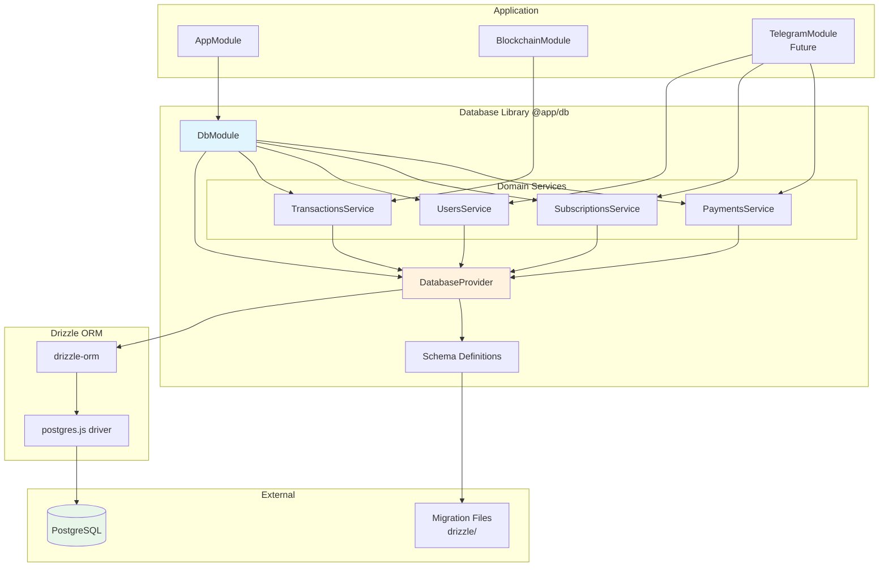
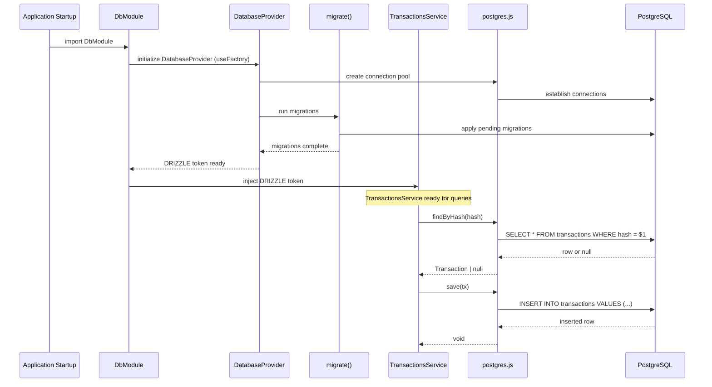

# Database Drizzle ORM Implementation Design Document

## Overview

This document defines the technical design for implementing PostgreSQL database access using Drizzle ORM in the PayPing Telegram bot. The implementation introduces domain-specific services (TransactionsService, UsersService, SubscriptionsService, PaymentsService) with a centralized DatabaseProvider for connection management, providing persistent storage for transactions, users, subscriptions, and payments.

## Design Summary (Meta)

```yaml
design_type: "new_feature"
risk_level: "low"
complexity_level: "medium"
complexity_rationale: >
  (1) Requirements: 4 tables with relationships (users -> subscriptions -> payments, transactions standalone),
      programmatic migrations at startup, repository pattern with 4 domain services, connection lifecycle management.
  (2) Constraints/risks: Must provide backward-compatible method signatures in TransactionsService for
      blockchain module; postgres.js driver connection pool configuration; NestJS standalone app lifecycle.
main_constraints:
  - "NestJS standalone application (no HTTP server)"
  - "Programmatic migrations on startup (no CLI dependency)"
  - "postgres.js driver (ADR-0002 decision)"
  - "Repository pattern with separate services per domain (ADR-0002 recommendation)"
  - "Breaking change: Blockchain module requires migration to new service/method names"
biggest_risks:
  - "Migration execution failures on startup blocking application"
  - "Connection pool exhaustion under high transaction volume"
  - "Service method signature changes breaking existing blockchain module"
unknowns:
  - "Optimal connection pool size for standalone bot application"
  - "postgres.js behavior with prepared statements in long-running processes"
```

## Background and Context

### Prerequisite ADRs

- **ADR-0002: Drizzle ORM for Database Access**: Defines Drizzle ORM with postgres.js driver as the selected database access approach, including migration strategy and NestJS integration patterns.
- **ADR-0001: TRON Blockchain Monitoring Approach**: Depends on database for transaction deduplication (defines the Transaction interface).

### Agreement Checklist

#### Scope
- [x] Implement 4 database tables: transactions, users, subscriptions, payments
- [x] Create domain-specific services: TransactionsService, UsersService, SubscriptionsService, PaymentsService
- [x] Create DatabaseProvider with useFactory pattern for connection and migration management
- [x] Create Drizzle schema definitions in TypeScript
- [x] Configure postgres.js connection with pooling via DatabaseProvider
- [x] Implement programmatic migrations on startup via DatabaseProvider.useFactory()
- [x] Export DRIZZLE token for injection into domain services
- [x] Update DbModule to register DatabaseProvider and all domain services

#### Non-Scope (Explicitly not changing)
- [x] Blockchain module polling logic (only service import changes from DbService to TransactionsService)
- [x] Transaction interface definition (already exists in @app/blockchain)
- [x] TelegramService implementation (future work)
- [x] HTTP server or REST API (standalone application)
- [x] External admin interface for database management

#### Constraints
- [x] Parallel operation: No (single app instance)
- [x] Backward compatibility: Breaking change (blockchain module migration required - see "Breaking Changes" section)
- [x] Performance measurement: Required (query latency for deduplication checks)

### Problem to Solve

The PayPing bot needs persistent storage for:
1. **Transaction deduplication**: The blockchain monitoring module (ADR-0001) requires transaction persistence for deduplication
2. **User management**: Store Telegram user information for subscription management
3. **Subscription tracking**: Track subscription status and expiration dates
4. **Payment history**: Record Telegram Stars payment transactions

### Current Challenges

1. `DbService` contains only stub implementations returning null/void
2. No database schema or connection management exists
3. No migration strategy implemented
4. Blockchain module depends on DbService but has no real persistence
5. Single service violates Single Responsibility Principle as features grow

### Requirements

#### Functional Requirements

| ID | Requirement | Priority |
|----|-------------|----------|
| FR-1 | Define database schema for 4 tables (transactions, users, subscriptions, payments) | Must |
| FR-2 | Implement DatabaseProvider with postgres.js driver and useFactory pattern | Must |
| FR-3 | Run migrations programmatically on application startup via DatabaseProvider | Must |
| FR-4 | Implement TransactionsService.findByHash() with real query | Must |
| FR-5 | Implement TransactionsService.save() with real insert | Must |
| FR-6 | Implement TransactionsService.getLastTimestamp() | Must |
| FR-7 | Implement TransactionsService.getMonitoredWalletAddress() | Must |
| FR-8 | Implement UsersService with user CRUD operations | Must |
| FR-9 | Implement SubscriptionsService with subscription CRUD operations | Must |
| FR-10 | Implement PaymentsService with payment recording operations | Must |
| FR-11 | Configure connection pooling in DatabaseProvider | Should |
| FR-12 | Implement graceful connection shutdown in DbModule | Should |

#### Non-Functional Requirements

- **Performance**: < 10ms for transaction hash lookup (deduplication critical path)
- **Reliability**: Zero data loss for saved transactions
- **Availability**: Application startup fails gracefully if database unavailable
- **Maintainability**: Schema changes tracked via migrations

## Acceptance Criteria (AC) - EARS Format

### FR-1: Database Schema

- [x] **AC-1.1**: The system shall define a `transactions` table with columns: id, hash (unique), type, from_address, to_address, amount, timestamp, block_number, contract_address, raw, created_at
- [x] **AC-1.2**: The system shall define a `users` table with columns: id, telegram_id (unique), username, first_name, last_name, created_at, updated_at
- [x] **AC-1.3**: The system shall define a `subscriptions` table with columns: id, user_id (foreign key), status, starts_at, expires_at, created_at, updated_at
- [x] **AC-1.4**: The system shall define a `payments` table with columns: id, user_id (foreign key), telegram_payment_charge_id, amount, currency, status, created_at
- [x] **AC-1.5**: The system shall use PostgreSQL identity columns for primary keys (not serial)

### FR-2: Database Connection

- [x] **AC-2.1**: **When** the DbModule initializes, DatabaseProvider shall establish a connection using postgres.js driver via useFactory pattern
- [x] **AC-2.2**: The system shall read database connection URL from `DATABASE_URL` environment variable via ConfigService
- [x] **AC-2.3**: **If** database connection fails, **then** DatabaseProvider shall throw an error with descriptive message

### FR-3: Programmatic Migrations

- [x] **AC-3.1**: **When** DatabaseProvider.useFactory() executes, the system shall run pending migrations before returning the Drizzle instance
- [x] **AC-3.2**: **If** migrations fail, **then** the system shall log the error and exit with non-zero code
- [x] **AC-3.3**: The system shall store migration history in the database

### FR-4: Transaction Lookup (TransactionsService)

- [x] **AC-4.1**: **When** `TransactionsService.findByHash()` is called with existing hash, the system shall return the Transaction object
- [x] **AC-4.2**: **When** `TransactionsService.findByHash()` is called with non-existing hash, the system shall return null
- [x] **AC-4.3**: The transaction lookup shall complete in < 10ms for indexed hash lookup

### FR-5: Transaction Save (TransactionsService)

- [x] **AC-5.1**: **When** `TransactionsService.save()` is called with valid Transaction, the system shall insert a new row
- [x] **AC-5.2**: **If** transaction hash already exists, **then** the system shall throw a unique constraint error
- [x] **AC-5.3**: The system shall preserve amount precision (6 decimals for USDT)

### FR-6: Last Transaction Timestamp (TransactionsService)

- [x] **AC-6.1**: **When** `TransactionsService.getLastTimestamp()` is called with transactions in database, the system shall return the maximum timestamp
- [x] **AC-6.2**: **When** `TransactionsService.getLastTimestamp()` is called with empty transactions table, the system shall return null

### FR-7: Monitored Wallet Address (TransactionsService)

- [x] **AC-7.1**: **When** `TransactionsService.getMonitoredWalletAddress()` is called, the system shall return the configured wallet address
- [x] **AC-7.2**: The wallet address shall be configurable via environment variable or database setting

### FR-8: User Operations (UsersService)

- [x] **AC-8.1**: **When** `UsersService.create()` is called with telegram_id, the system shall create or return existing user
- [x] **AC-8.2**: **When** `UsersService.findByTelegramId()` is called, the system shall return user or null

### FR-9: Subscription Operations (SubscriptionsService)

- [x] **AC-9.1**: **When** `SubscriptionsService.create()` is called, the system shall create subscription with status 'active'
- [x] **AC-9.2**: **When** `SubscriptionsService.getActive()` is called, the system shall return subscription where status='active' AND expires_at > now

### FR-10: Payment Operations (PaymentsService)

- [x] **AC-10.1**: **When** `PaymentsService.record()` is called, the system shall insert payment record

### FR-11: Connection Pooling (DatabaseProvider)

- [x] **AC-11.1**: DatabaseProvider shall configure postgres.js with connection pool (default max: 10)
- [x] **AC-11.2**: The pool configuration shall be configurable via environment variables

### FR-12: Graceful Shutdown (DbModule)

- [x] **AC-12.1**: **When** application receives shutdown signal, DbModule.onApplicationShutdown() shall close all database connections
- [x] **AC-12.2**: The system shall wait for in-flight queries to complete before closing

## Existing Codebase Analysis

### Implementation Path Mapping

| Type | Path | Description |
|------|------|-------------|
| Existing | `libs/db/src/db.module.ts` | Module definition, register all providers and services |
| Existing | `libs/db/src/index.ts` | Exports, needs schema and service exports |
| Delete | `libs/db/src/db.service.ts` | Remove old stub service (replaced by domain services) |
| New | `libs/db/src/database.provider.ts` | DatabaseProvider with useFactory pattern |
| New | `libs/db/src/services/transactions.service.ts` | Transaction operations |
| New | `libs/db/src/services/users.service.ts` | User CRUD operations |
| New | `libs/db/src/services/subscriptions.service.ts` | Subscription operations |
| New | `libs/db/src/services/payments.service.ts` | Payment recording operations |
| New | `libs/db/src/schema/transactions.ts` | Transaction table schema |
| New | `libs/db/src/schema/users.ts` | User table schema |
| New | `libs/db/src/schema/subscriptions.ts` | Subscription table schema |
| New | `libs/db/src/schema/payments.ts` | Payment table schema |
| New | `libs/db/src/schema/index.ts` | Schema exports |
| New | `libs/db/src/schema/relations.ts` | Table relations (separate to avoid circular deps) |
| New | `libs/db/src/types/dto.ts` | DTO type definitions |
| New | `libs/db/src/config/db.config.ts` | Database configuration |
| New | `drizzle.config.ts` | drizzle-kit configuration (project root) |
| New | `drizzle/` | Migration files directory (project root) |

#### File Structure Overview

```
libs/db/src/
├── database.provider.ts      # DatabaseProvider with useFactory
├── db.module.ts              # Register all providers and services
├── services/
│   ├── transactions.service.ts  # Transaction operations (findByHash, save, getLastTimestamp)
│   ├── users.service.ts         # User CRUD operations
│   ├── subscriptions.service.ts # Subscription operations
│   └── payments.service.ts      # Payment recording operations
├── schema/
│   ├── index.ts
│   ├── transactions.ts
│   ├── users.ts
│   ├── subscriptions.ts
│   ├── payments.ts
│   └── relations.ts
├── types/
│   └── dto.ts
├── config/
│   └── db.config.ts
└── index.ts
```

### Integration Points

| Integration Point | Target | Method |
|-------------------|--------|--------|
| Blockchain Module | DeduplicationService | Uses TransactionsService.findByHash(), save() |
| Blockchain Module | TransactionPollerService | Uses TransactionsService.getLastTimestamp(), getMonitoredWalletAddress() |
| Future TelegramModule | User management | Will use UsersService |
| Future TelegramModule | Subscription management | Will use SubscriptionsService |
| Future TelegramModule | Payment processing | Will use PaymentsService |
| NestJS Lifecycle | OnModuleInit | Run migrations via DatabaseProvider |
| NestJS Lifecycle | OnApplicationShutdown | Close connections via DatabaseProvider |

#### Breaking Changes: Blockchain Module Migration

**Important**: This is a **breaking change** for the blockchain module. Method names have been simplified:

| Old DbService Method | New TransactionsService Method | Action Required |
|---------------------|-------------------------------|-----------------|
| `findTransactionByHash(hash)` | `findByHash(hash)` | Update DeduplicationService |
| `saveTransaction(tx)` | `save(tx)` | Update DeduplicationService |
| `getLastTransactionTimestamp()` | `getLastTimestamp()` | Update TransactionPollerService |
| `getMonitoredWalletAddress()` | `getMonitoredWalletAddress()` | No change (same name) |

**Migration Steps for Blockchain Module**:
1. Update imports: `DbService` → `TransactionsService`
2. Update method calls to new names
3. Update module imports: `DbModule` still exports `TransactionsService`

### Similar Functionality Search

- **No existing ORM configuration found** - This is the first database implementation
- **ConfigModule pattern exists** in `@app/blockchain` - Will follow same `registerAs()` pattern
- **Repository pattern adopted** - Separate service per domain table (aligns with ADR-0002 recommendation)

## Design

### Change Impact Map

```yaml
Change Target: "@app/db library"
Direct Impact:
  - libs/db/src/db.module.ts (register all providers and services)
  - libs/db/src/db.service.ts (DELETE - replaced by domain services)
  - libs/db/src/database.provider.ts (NEW - connection and migration management)
  - libs/db/src/services/*.service.ts (NEW - domain-specific services)
  - libs/db/src/index.ts (add schema and service exports)
  - package.json (add drizzle-orm, postgres, drizzle-kit)
Indirect Impact:
  - @app/blockchain DeduplicationService (import TransactionsService instead of DbService)
  - @app/blockchain TransactionPollerService (import TransactionsService instead of DbService)
  - Environment configuration (DATABASE_URL required)
No Ripple Effect:
  - TronGridClient (no database dependency)
  - TransactionProcessorService (no direct DB calls)
  - LRU cache logic (unchanged)
```

### Architecture Overview



### Data Flow



### Integration Points List

| Integration Point | Location | Old Implementation | New Implementation | Switching Method |
|-------------------|----------|-------------------|-------------------|------------------|
| Transaction Lookup | DeduplicationService | DbService.findTransactionByHash() stub | TransactionsService.findByHash() | Service replacement |
| Transaction Save | DeduplicationService | DbService.saveTransaction() stub | TransactionsService.save() | Service replacement |
| Timestamp Query | TransactionPollerService | DbService.getLastTransactionTimestamp() stub | TransactionsService.getLastTimestamp() | Service replacement |
| Wallet Address | TransactionPollerService | DbService.getMonitoredWalletAddress() stub | TransactionsService.getMonitoredWalletAddress() | Service replacement |
| DB Connection | DbModule | None | DatabaseProvider with useFactory | Provider injection |
| User Management | Future TelegramModule | None | UsersService | New dependency |
| Subscription Management | Future TelegramModule | None | SubscriptionsService | New dependency |
| Payment Recording | Future TelegramModule | None | PaymentsService | New dependency |

### Main Components

#### DatabaseProvider (Two-Provider Pattern)

- **Responsibility**: Initialize postgres.js connection, create Drizzle instance, run migrations on startup
- **Design Note**: Uses two providers to properly expose the postgres.js client for graceful shutdown
- **Interface**:
  ```typescript
  // libs/db/src/database.provider.ts
  import postgres from 'postgres';
  import { drizzle, PostgresJsDatabase } from 'drizzle-orm/postgres-js';
  import { migrate } from 'drizzle-orm/postgres-js/migrator';
  import * as schema from './schema';

  export const DRIZZLE = Symbol('DRIZZLE');
  export const SQL_CLIENT = Symbol('SQL_CLIENT');
  export type DrizzleDB = PostgresJsDatabase<typeof schema>;

  // Provider 1: postgres.js client (needed for graceful shutdown)
  export const SqlClientProvider: Provider = {
    provide: SQL_CLIENT,
    inject: [ConfigService],
    useFactory: async (configService: ConfigService): Promise<postgres.Sql> => {
      const dbConfig = configService.get<DbConfig>('database');
      return postgres(dbConfig.url, {
        max: dbConfig.pool.max,
        idle_timeout: dbConfig.pool.idleTimeoutMs / 1000,
        connect_timeout: dbConfig.pool.connectionTimeoutMs / 1000,
      });
    }
  };

  // Provider 2: Drizzle ORM instance
  export const DatabaseProvider: Provider = {
    provide: DRIZZLE,
    inject: [SQL_CLIENT, ConfigService],
    useFactory: async (sql: postgres.Sql, configService: ConfigService): Promise<DrizzleDB> => {
      const dbConfig = configService.get<DbConfig>('database');
      const db = drizzle(sql, { schema });

      // Run migrations on startup (using separate max:1 client to prevent race conditions)
      if (dbConfig.migrations.runOnStartup) {
        const migrationClient = postgres(dbConfig.url, { max: 1 });
        const migrationDb = drizzle(migrationClient, { schema });
        await migrate(migrationDb, { migrationsFolder: dbConfig.migrations.migrationsFolder });
        await migrationClient.end();
      }

      return db;
    }
  };
  ```
- **Dependencies**: `ConfigService`, `postgres.js`, `drizzle-orm`, schema definitions
- **Lifecycle**: Migrations run with separate max:1 client (required by Drizzle), main pool managed by postgres.js

#### DbModule Structure

- **Responsibility**: Register DatabaseProvider and all domain services, export services for use by other modules
- **Interface**:
  ```typescript
  // libs/db/src/db.module.ts
  import postgres from 'postgres';
  import { SQL_CLIENT, SqlClientProvider, DatabaseProvider } from './database.provider';

  @Module({
    imports: [ConfigModule.forFeature(dbConfig)],
    providers: [
      SqlClientProvider,   // Must be registered before DatabaseProvider
      DatabaseProvider,
      TransactionsService,
      UsersService,
      SubscriptionsService,
      PaymentsService,
    ],
    exports: [
      TransactionsService,
      UsersService,
      SubscriptionsService,
      PaymentsService,
    ],
  })
  export class DbModule implements OnApplicationShutdown {
    constructor(@Inject(SQL_CLIENT) private readonly sql: postgres.Sql) {}

    async onApplicationShutdown(): Promise<void> {
      // Close database connections gracefully using the postgres.js client
      await this.sql.end();
    }
  }
  ```

#### TransactionsService

- **Responsibility**: Transaction persistence and queries (supports blockchain module)
- **Interface**:
  ```typescript
  // libs/db/src/services/transactions.service.ts
  @Injectable()
  export class TransactionsService {
    constructor(@Inject(DRIZZLE) private readonly db: DrizzleDB) {}

    // Methods for blockchain module (renamed from DbService for clarity)
    findByHash(hash: string): Promise<Transaction | null>;
    save(transaction: Transaction): Promise<void>;
    getLastTimestamp(): Promise<number | null>;
    getMonitoredWalletAddress(): Promise<string | null>;
  }
  ```
- **Dependencies**: `DRIZZLE` token

#### UsersService

- **Responsibility**: User CRUD operations
- **Interface**:
  ```typescript
  // libs/db/src/services/users.service.ts
  @Injectable()
  export class UsersService {
    constructor(@Inject(DRIZZLE) private readonly db: DrizzleDB) {}

    findByTelegramId(telegramId: number): Promise<User | null>;
    create(data: CreateUserDto): Promise<User>;
    update(telegramId: number, data: UpdateUserDto): Promise<User | null>;
    findById(id: number): Promise<User | null>;
  }
  ```
- **Dependencies**: `DRIZZLE` token

#### SubscriptionsService

- **Responsibility**: Subscription management
- **Interface**:
  ```typescript
  // libs/db/src/services/subscriptions.service.ts
  @Injectable()
  export class SubscriptionsService {
    constructor(@Inject(DRIZZLE) private readonly db: DrizzleDB) {}

    create(userId: number, expiresAt: Date): Promise<Subscription>;
    getActive(userId: number): Promise<Subscription | null>;
    getActiveSubscribers(): Promise<User[]>;
    expire(subscriptionId: number): Promise<void>;
  }
  ```
- **Dependencies**: `DRIZZLE` token

#### PaymentsService

- **Responsibility**: Payment recording and queries
- **Interface**:
  ```typescript
  // libs/db/src/services/payments.service.ts
  @Injectable()
  export class PaymentsService {
    constructor(@Inject(DRIZZLE) private readonly db: DrizzleDB) {}

    record(data: CreatePaymentDto): Promise<Payment>;
    findByUser(userId: number): Promise<Payment[]>;
    findByChargeId(chargeId: string): Promise<Payment | null>;
  }
  ```
- **Dependencies**: `DRIZZLE` token

#### Database Schema

- **Responsibility**: Define table structures as TypeScript source of truth
- **Files**:
  - `schema/transactions.ts` - Transaction storage
  - `schema/users.ts` - Telegram user records
  - `schema/subscriptions.ts` - Subscription status
  - `schema/payments.ts` - Payment history
  - `schema/relations.ts` - Table relationships
  - `schema/index.ts` - Aggregated exports

### Contract Definitions

```typescript
// libs/db/src/schema/transactions.ts
import { pgTable, integer, varchar, text, bigint, timestamp, jsonb, index } from 'drizzle-orm/pg-core';

export const transactions = pgTable('transactions', {
  id: integer('id').primaryKey().generatedAlwaysAsIdentity(),
  hash: varchar('hash', { length: 64 }).notNull().unique(),
  type: varchar('type', { length: 10 }).notNull(), // Maps to TransactionType enum ('USDT')
  fromAddress: varchar('from_address', { length: 64 }).notNull(),
  toAddress: varchar('to_address', { length: 64 }).notNull(),
  amount: varchar('amount', { length: 78 }).notNull(), // String for precision
  timestamp: bigint('timestamp', { mode: 'number' }).notNull(),
  blockNumber: bigint('block_number', { mode: 'number' }).notNull(),
  contractAddress: varchar('contract_address', { length: 64 }).notNull(),
  raw: jsonb('raw'),
  createdAt: timestamp('created_at').defaultNow().notNull(),
}, (table) => [
  // Note: hash column unique constraint creates an implicit index, so no explicit index needed
  index('idx_transactions_timestamp').on(table.timestamp),
]);

// libs/db/src/schema/users.ts
import { pgTable, integer, bigint, varchar, timestamp } from 'drizzle-orm/pg-core';

export const users = pgTable('users', {
  id: integer('id').primaryKey().generatedAlwaysAsIdentity(),
  telegramId: bigint('telegram_id', { mode: 'number' }).notNull().unique(),
  username: varchar('username', { length: 255 }),
  firstName: varchar('first_name', { length: 255 }),
  lastName: varchar('last_name', { length: 255 }),
  createdAt: timestamp('created_at').defaultNow().notNull(),
  // Note: $onUpdateFn is a runtime-only feature (not reflected in DDL).
  // Updates must use Drizzle's update methods for this to work.
  updatedAt: timestamp('updated_at').defaultNow().notNull().$onUpdateFn(() => new Date()),
});
// Note: No explicit index on telegram_id - unique constraint creates implicit index

// libs/db/src/schema/subscriptions.ts
import { pgTable, integer, varchar, timestamp, index } from 'drizzle-orm/pg-core';
import { users } from './users';

export const subscriptionStatusEnum = ['active', 'expired', 'cancelled'] as const;
export type SubscriptionStatus = typeof subscriptionStatusEnum[number];

export const subscriptions = pgTable('subscriptions', {
  id: integer('id').primaryKey().generatedAlwaysAsIdentity(),
  userId: integer('user_id').notNull().references(() => users.id, { onDelete: 'cascade' }),
  status: varchar('status', { length: 20 }).notNull().$type<SubscriptionStatus>(),
  startsAt: timestamp('starts_at').notNull(),
  expiresAt: timestamp('expires_at').notNull(),
  createdAt: timestamp('created_at').defaultNow().notNull(),
  // Note: $onUpdateFn is a runtime-only feature (not reflected in DDL).
  updatedAt: timestamp('updated_at').defaultNow().notNull().$onUpdateFn(() => new Date()),
}, (table) => [
  index('idx_subscriptions_user_id').on(table.userId),
  index('idx_subscriptions_expires_at').on(table.expiresAt),
]);

// libs/db/src/schema/payments.ts
import { pgTable, integer, varchar, bigint, timestamp, index } from 'drizzle-orm/pg-core';
import { users } from './users';

export const paymentStatusEnum = ['pending', 'completed', 'failed', 'refunded'] as const;
export type PaymentStatus = typeof paymentStatusEnum[number];

export const payments = pgTable('payments', {
  id: integer('id').primaryKey().generatedAlwaysAsIdentity(),
  userId: integer('user_id').notNull().references(() => users.id, { onDelete: 'cascade' }),
  telegramPaymentChargeId: varchar('telegram_payment_charge_id', { length: 255 }).notNull().unique(),
  amount: integer('amount').notNull(), // Telegram Stars amount (integer)
  currency: varchar('currency', { length: 3 }).notNull().default('XTR'), // XTR for Telegram Stars
  status: varchar('status', { length: 20 }).notNull().$type<PaymentStatus>(),
  createdAt: timestamp('created_at').defaultNow().notNull(),
}, (table) => [
  index('idx_payments_user_id').on(table.userId),
  // Note: No explicit index on telegram_payment_charge_id - unique constraint creates implicit index
]);

// libs/db/src/schema/relations.ts
import { relations } from 'drizzle-orm';
import { users } from './users';
import { subscriptions } from './subscriptions';
import { payments } from './payments';

export const usersRelations = relations(users, ({ many }) => ({
  subscriptions: many(subscriptions),
  payments: many(payments),
}));

export const subscriptionsRelations = relations(subscriptions, ({ one }) => ({
  user: one(users, {
    fields: [subscriptions.userId],
    references: [users.id],
  }),
}));

export const paymentsRelations = relations(payments, ({ one }) => ({
  user: one(users, {
    fields: [payments.userId],
    references: [users.id],
  }),
}));
```

### DTO Type Definitions

```typescript
// libs/db/src/types/dto.ts

// User DTOs
export interface CreateUserDto {
  telegramId: number;
  username?: string | null;
  firstName?: string | null;
  lastName?: string | null;
}

export interface UpdateUserDto {
  username?: string | null;
  firstName?: string | null;
  lastName?: string | null;
}

// Payment DTOs
export interface CreatePaymentDto {
  userId: number;
  telegramPaymentChargeId: string;
  amount: number;
  currency?: string; // Defaults to 'XTR'
  status: 'pending' | 'completed' | 'failed' | 'refunded';
}
```

### Type Mapping: Database ↔ Domain

The database schema uses varchar for the transaction `type` column, while the domain model uses the `TransactionType` enum. The mapping is transparent since `TransactionType.USDT = 'USDT'`:

```typescript
// Domain model (from @app/blockchain)
enum TransactionType { USDT = 'USDT' }
interface Transaction { type: TransactionType; ... }

// Database storage
// type: varchar('type', { length: 10 }) stores 'USDT' string

// Mapping in DbService
// On read: result.type is already 'USDT' which matches TransactionType.USDT
// On write: transaction.type is TransactionType.USDT which serializes to 'USDT'

// No explicit conversion needed - TypeScript enum string values match database storage
```

### Data Contract

#### TransactionsService

```yaml
findByHash:
  Input:
    Type: string (hash)
    Preconditions:
      - hash is 64-character hex string
    Validation: Format validation optional (DB handles)
  Output:
    Type: Transaction | null
    Guarantees:
      - Returns full Transaction object matching blockchain interface
      - Amount is string (preserves precision)
      - Null if not found
    On Error: Throws error (fail-fast)
  Invariants:
    - Query uses indexed hash column

save:
  Input:
    Type: Transaction
    Preconditions:
      - All required fields present
      - Hash is unique
    Validation: Schema enforces constraints
  Output:
    Type: void
    Guarantees:
      - Transaction persisted to database
      - Unique constraint enforced on hash
    On Error: Throws error (unique violation or DB error)
  Invariants:
    - Atomic insert operation

getLastTimestamp:
  Input:
    Type: void
  Output:
    Type: number | null
    Guarantees:
      - Returns MAX(timestamp) from transactions table
      - Null if no transactions exist
    On Error: Throws error
  Invariants:
    - Query uses indexed timestamp column

getMonitoredWalletAddress:
  Input:
    Type: void
  Output:
    Type: string | null
    Guarantees:
      - Returns wallet address from environment or settings
      - Null if not configured
    On Error: Returns null (fail-open)
  Invariants:
    - Environment variable takes precedence
```

#### UsersService

```yaml
findByTelegramId:
  Input:
    Type: number (telegramId)
    Preconditions:
      - telegramId is positive integer
  Output:
    Type: User | null
    Guarantees:
      - Returns full User object
      - Null if not found
    On Error: Throws error (fail-fast)

create:
  Input:
    Type: CreateUserDto
    Preconditions:
      - telegramId is unique
  Output:
    Type: User
    Guarantees:
      - User persisted to database
      - createdAt and updatedAt set automatically
    On Error: Throws error (unique violation or DB error)

update:
  Input:
    Type: number (telegramId), UpdateUserDto
  Output:
    Type: User | null
    Guarantees:
      - User updated if exists
      - updatedAt automatically updated
      - Null if user not found
    On Error: Throws error
```

#### SubscriptionsService

```yaml
create:
  Input:
    Type: number (userId), Date (expiresAt)
    Preconditions:
      - userId references existing user
  Output:
    Type: Subscription
    Guarantees:
      - Subscription created with status 'active'
      - startsAt set to current time
    On Error: Throws error (foreign key violation or DB error)

getActive:
  Input:
    Type: number (userId)
  Output:
    Type: Subscription | null
    Guarantees:
      - Returns subscription where status='active' AND expires_at > now
      - Null if no active subscription
    On Error: Throws error

getActiveSubscribers:
  Input:
    Type: void
  Output:
    Type: User[]
    Guarantees:
      - Returns all users with active subscriptions
    On Error: Throws error
```

#### PaymentsService

```yaml
record:
  Input:
    Type: CreatePaymentDto
    Preconditions:
      - userId references existing user
      - telegramPaymentChargeId is unique
  Output:
    Type: Payment
    Guarantees:
      - Payment persisted to database
    On Error: Throws error (foreign key or unique violation)

findByUser:
  Input:
    Type: number (userId)
  Output:
    Type: Payment[]
    Guarantees:
      - Returns all payments for user ordered by createdAt desc
    On Error: Throws error
```

### Integration Boundary Contracts

```yaml
DatabaseProvider → Domain Services:
  Input: DRIZZLE token via @Inject(DRIZZLE)
  Output: Synchronous injection of DrizzleDB instance
  On Error: Module initialization fails

DbModule → BlockchainModule:
  Input: TransactionsService exported from DbModule
  Output: Fully functional TransactionsService with real queries
  On Error: Module dependency resolution fails

DbModule → Future TelegramModule:
  Input: UsersService, SubscriptionsService, PaymentsService exported from DbModule
  Output: Fully functional domain services
  On Error: Module dependency resolution fails

postgres.js → PostgreSQL:
  Input: Connection URL, pool config
  Output: Connection pool
  On Error: Connection refused error with retry info

DatabaseProvider Initialization:
  Input: ConfigService providing DbConfig
  Output: DrizzleDB instance with migrations applied
  On Error: Startup fails with descriptive error
```

### Error Handling

| Error Type | Detection | Response | Recovery |
|------------|-----------|----------|----------|
| Connection Failed | postgres.js throws | Log error, fail startup | Manual intervention |
| Migration Failed | migrate() throws | Log error, exit process | Fix migration, restart |
| Unique Violation | Database constraint | Throw error to caller | Caller handles (dedup service) |
| Query Timeout | postgres.js timeout | Throw error | Automatic retry by caller |
| Pool Exhaustion | Connection wait timeout | Log warning, throw | Increase pool size |

#### Error Propagation Strategy

```typescript
// Infrastructure layer: Always throw with context
// libs/db/src/database.provider.ts
export const DatabaseProvider: Provider = {
  provide: DRIZZLE,
  inject: [ConfigService],
  useFactory: async (configService: ConfigService): Promise<DrizzleDB> => {
    const dbConfig = configService.get<DbConfig>('database');
    try {
      const sql = postgres(dbConfig.url, { max: dbConfig.pool.max });
      const db = drizzle(sql, { schema });
      await migrate(db, { migrationsFolder: dbConfig.migrations.migrationsFolder });
      return db;
    } catch (error) {
      throw new DatabaseConnectionError('Failed to initialize database', {
        cause: error,
        url: dbConfig.url.replace(/:[^:@]+@/, ':***@'), // Mask password
      });
    }
  }
};

// Application layer: Business-driven decisions
// libs/db/src/services/transactions.service.ts
@Injectable()
class TransactionsService {
  constructor(@Inject(DRIZZLE) private readonly db: DrizzleDB) {}

  async findByHash(hash: string): Promise<Transaction | null> {
    try {
      const result = await this.db
        .select()
        .from(transactions)
        .where(eq(transactions.hash, hash))
        .limit(1);
      return result[0] ?? null;
    } catch (error) {
      this.logger.error('Failed to find transaction', { hash, error });
      throw error; // Fail-fast for DB errors
    }
  }
}
```

### Logging and Monitoring

#### Structured Logging

```typescript
{
  level: 'info',
  context: 'DbService',
  message: 'Transaction saved',
  data: {
    hash: '0x1234...5678',
    type: 'USDT',
    durationMs: 5,
    timestamp: '2026-01-22T10:00:00.000Z'
  }
}
```

#### Key Metrics

| Metric Name | Type | Description |
|-------------|------|-------------|
| `db_query_duration_ms` | Histogram | Query execution time |
| `db_pool_size` | Gauge | Current active connections |
| `db_pool_waiting` | Gauge | Queries waiting for connection |
| `db_errors_total` | Counter | Database errors by type |

### Configuration Schema

```typescript
// libs/db/src/config/db.config.ts
import { registerAs } from '@nestjs/config';

export interface DbConfig {
  url: string;
  pool: {
    max: number;
    idleTimeoutMs: number;
    connectionTimeoutMs: number;
  };
  migrations: {
    runOnStartup: boolean;
    migrationsFolder: string;
  };
}

export default registerAs('database', (): DbConfig => ({
  url: process.env.DATABASE_URL || '',
  pool: {
    max: parseInt(process.env.DB_POOL_MAX || '10', 10),
    idleTimeoutMs: parseInt(process.env.DB_POOL_IDLE_TIMEOUT_MS || '30000', 10),
    connectionTimeoutMs: parseInt(process.env.DB_POOL_CONNECTION_TIMEOUT_MS || '10000', 10),
  },
  migrations: {
    runOnStartup: process.env.DB_RUN_MIGRATIONS !== 'false',
    migrationsFolder: './drizzle',
  },
}));
```

#### Environment Variables

| Variable | Required | Default | Description |
|----------|----------|---------|-------------|
| `DATABASE_URL` | Yes | - | PostgreSQL connection string |
| `DB_POOL_MAX` | No | `10` | Maximum pool connections |
| `DB_POOL_IDLE_TIMEOUT_MS` | No | `30000` | Idle connection timeout |
| `DB_POOL_CONNECTION_TIMEOUT_MS` | No | `10000` | Connection acquisition timeout |
| `DB_RUN_MIGRATIONS` | No | `true` | Run migrations on startup |
| `MONITORED_WALLET_ADDRESS` | Yes | - | TRON wallet address to monitor |

### drizzle-kit Configuration

```typescript
// drizzle.config.ts (project root)
import type { Config } from 'drizzle-kit';

export default {
  schema: './libs/db/src/schema/index.ts',
  out: './drizzle',
  dialect: 'postgresql',
  dbCredentials: {
    url: process.env.DATABASE_URL!,
  },
  verbose: true,
  strict: true,
} satisfies Config;
```

## Implementation Plan

### Implementation Approach

**Selected Approach**: Horizontal Slice with Foundation First

**Selection Reason**: The database layer is foundational infrastructure that multiple future features (blockchain monitoring persistence, user management, subscriptions, payments) depend upon. All components need the same schema and connection management, making horizontal implementation more efficient.

### Technical Dependencies and Implementation Order

#### Required Implementation Order

1. **Package Installation and Configuration (Foundation)**
   - Technical Reason: All Drizzle functionality requires packages
   - Files: `package.json`, `drizzle.config.ts`, `libs/db/src/config/db.config.ts`

2. **Schema Definitions (Foundation)**
   - Technical Reason: Migrations and queries depend on schema
   - Prerequisites: Package installation
   - Files: `libs/db/src/schema/*.ts`, `libs/db/src/types/dto.ts`

3. **DatabaseProvider (Infrastructure)**
   - Technical Reason: All domain services need Drizzle instance
   - Prerequisites: Schema definitions
   - Files: `libs/db/src/database.provider.ts`

4. **Migration Setup and Execution**
   - Technical Reason: Database must have tables before queries
   - Prerequisites: DatabaseProvider, schema
   - Files: `drizzle/` migrations

5. **Domain Services Implementation (Application)**
   - Technical Reason: Provides domain-specific repository operations
   - Prerequisites: Working DatabaseProvider, migrations applied
   - Files:
     - `libs/db/src/services/transactions.service.ts`
     - `libs/db/src/services/users.service.ts`
     - `libs/db/src/services/subscriptions.service.ts`
     - `libs/db/src/services/payments.service.ts`

6. **DbModule Updates (Integration)**
   - Technical Reason: Wire DatabaseProvider and export domain services
   - Prerequisites: DatabaseProvider, all domain services
   - Files: `libs/db/src/db.module.ts`, `libs/db/src/index.ts`

7. **BlockchainModule Integration (Application)**
   - Technical Reason: Replace DbService with TransactionsService
   - Prerequisites: Working DbModule with TransactionsService
   - Files: `libs/blockchain/src/services/deduplication.service.ts`, `libs/blockchain/src/services/transaction-poller.service.ts`

### Integration Points

**Integration Point 1: Database Connection**
- Components: DatabaseProvider -> postgres.js -> PostgreSQL
- Verification: `pnpm run start:dev` connects without error

**Integration Point 2: Migration Execution**
- Components: DatabaseProvider.useFactory() -> migrate() -> PostgreSQL
- Verification: Schema matches TypeScript definitions

**Integration Point 3: Blockchain Module**
- Components: DeduplicationService -> TransactionsService -> PostgreSQL
- Verification: Transactions persist and can be queried

**Integration Point 4: Future Telegram Module**
- Components: TelegramService -> UsersService/SubscriptionsService/PaymentsService -> PostgreSQL
- Verification: User management and subscription tracking work correctly

### E2E Verification Procedures

| Phase | Verification | Command/Method |
|-------|--------------|----------------|
| Foundation | Packages install | `pnpm install` |
| Foundation | Config loads | Unit test: `db.config.spec.ts` |
| Schema | Schema compiles | `pnpm run build` |
| Schema | Migrations generate | `npx drizzle-kit generate` |
| Infrastructure | DatabaseProvider creates connection | Integration test with test DB |
| Integration | DbModule initializes | `pnpm run start:dev` with logs |
| Application | TransactionsService queries work | Integration test with test DB |
| Application | UsersService CRUD works | Integration test with test DB |
| Application | SubscriptionsService queries work | Integration test with test DB |
| Application | PaymentsService recording works | Integration test with test DB |
| E2E | Full deduplication flow | E2E test with blockchain module |

### Migration Strategy

**Development Workflow**:
1. Modify schema in `libs/db/src/schema/*.ts`
2. Run `npx drizzle-kit generate` to create migration SQL
3. Review generated SQL in `drizzle/` directory
4. Commit migration files to repository
5. On deployment, `migrate()` applies pending migrations via DatabaseProvider

**Programmatic Migration Execution**:
```typescript
// libs/db/src/database.provider.ts
import { migrate } from 'drizzle-orm/postgres-js/migrator';

// During provider useFactory initialization
await migrate(db, { migrationsFolder: './drizzle' });
```

## Test Strategy

### Basic Test Design Policy

Tests derived directly from Acceptance Criteria:
- Each AC generates at least one test case
- Test names reference AC IDs for traceability
- Integration tests use real PostgreSQL (test container or local)

### Unit Tests

**Coverage Target**: 80%

| Component | Test Focus | Key Test Cases |
|-----------|------------|----------------|
| DbConfig | Configuration loading | AC-2.2, AC-11.2 |
| Schema | Type definitions | AC-1.1 through AC-1.5 |

### Integration Tests

| Test Scenario | Components | Verification |
|---------------|------------|--------------|
| Connection establishment | DatabaseProvider + PostgreSQL | AC-2.1, AC-2.3 |
| Transaction CRUD | TransactionsService + PostgreSQL | AC-4.1, AC-4.2, AC-5.1, AC-5.2 |
| Timestamp query | TransactionsService + PostgreSQL | AC-6.1, AC-6.2 |
| User CRUD | UsersService + PostgreSQL | AC-8.1, AC-8.2 |
| Subscription queries | SubscriptionsService + PostgreSQL | AC-9.1, AC-9.2 |
| Payment recording | PaymentsService + PostgreSQL | AC-10.1 |

### E2E Tests

| Test Scenario | Setup | Expected Outcome |
|---------------|-------|------------------|
| Full deduplication flow | App + test DB | Transactions persist, duplicates detected |
| Startup migration | Fresh database | Tables created, app runs |
| Graceful shutdown | App with active connections | Connections closed cleanly |

### Performance Tests

| Metric | Target | Test Method |
|--------|--------|-------------|
| Hash lookup latency | < 10ms | Benchmark with 100K rows |
| Insert throughput | > 1000 tx/sec | Load test |
| Connection pool | No exhaustion | Concurrent query test |

## Security Considerations

| Concern | Mitigation |
|---------|------------|
| SQL Injection | Drizzle uses parameterized queries |
| Connection string exposure | Environment variable, never logged |
| Data exposure in logs | Mask sensitive fields (addresses truncated) |
| Unauthorized access | PostgreSQL authentication required |

## Future Extensibility

| Future Feature | Design Consideration |
|----------------|---------------------|
| Multiple wallet monitoring | Add wallet_id to transactions table |
| Subscription tiers | Add plan_id and tier to subscriptions |
| Payment webhooks | Add webhook_status to payments |
| Read replicas | Connection URL can point to replica |
| Sharding | Partition transactions by timestamp |

## Alternative Solutions

### Alternative 1: node-postgres (pg) Driver

- **Overview**: Use node-postgres instead of postgres.js
- **Advantages**: More widely used, slightly faster raw performance
- **Disadvantages**: Requires manual prepared statement management, larger bundle
- **Reason for Rejection**: ADR-0002 selected postgres.js for automatic prepared statement caching and TypeScript integration

### Alternative 2: Single DbService with All Methods

- **Overview**: Single DbService containing all database operations for all domains
- **Advantages**: Fewer files, simpler initial setup
- **Disadvantages**: Violates Single Responsibility Principle, harder to test in isolation, grows unwieldy as features expand
- **Reason for Rejection**: Repository pattern with separate services per domain provides better separation of concerns, easier unit testing, and cleaner dependency injection for consuming modules

> **Note**: ADR-0002 recommends Repository Pattern. This design adopts that recommendation with separate domain services (TransactionsService, UsersService, SubscriptionsService, PaymentsService). Each service is responsible for a single domain, making the codebase more maintainable and testable.

### Alternative 3: Migration via CLI Only

- **Overview**: Run migrations manually via `npx drizzle-kit migrate`
- **Advantages**: Simpler provider, no startup dependency
- **Disadvantages**: Manual step in deployment, risk of forgetting
- **Reason for Rejection**: Programmatic migrations ensure consistency and work with containerized deployments

## Risks and Mitigation

| Risk | Impact | Probability | Mitigation |
|------|--------|-------------|------------|
| Migration failure blocks startup | High | Low | Validate migrations in CI, add health check |
| Connection pool exhaustion | Medium | Low | Monitor pool metrics, configure appropriate max |
| Schema drift between envs | Medium | Low | Migration files in git, CI validation |
| postgres.js driver issues | Medium | Low | Monitor releases, have pg fallback plan |
| Performance regression | Low | Medium | Benchmark critical queries, add indexes |

## References

- [Drizzle ORM Official Documentation](https://orm.drizzle.team/) - Complete API reference
- [Drizzle ORM Migrations](https://orm.drizzle.team/docs/migrations) - Migration workflow
- [Drizzle ORM PostgreSQL Best Practices 2025](https://gist.github.com/productdevbook/7c9ce3bbeb96b3fabc3c7c2aa2abc717) - Schema design guidelines
- [NestJS & DrizzleORM: A Great Match](https://trilon.io/blog/nestjs-drizzleorm-a-great-match) - Integration patterns
- [@knaadh/nestjs-drizzle](https://github.com/knaadh/nestjs-drizzle) - Community NestJS module
- [postgres.js GitHub](https://github.com/porsager/postgres) - Driver documentation
- [Drizzle Kit migrate](https://orm.drizzle.team/docs/drizzle-kit-migrate) - CLI migration command
- [How to integrate Drizzle ORM with NestJS](https://dev.to/anooop102910/how-to-integrate-drizzle-orm-with-nest-js-gdc) - Integration tutorial
- [API with NestJS #149 - Drizzle ORM with PostgreSQL](https://wanago.io/2024/05/20/api-nestjs-drizzle-orm-postgresql/) - Detailed walkthrough

## Update History

| Date | Version | Changes | Author |
|------|---------|---------|--------|
| 2026-01-22 | 1.0 | Initial version | Claude |
| 2026-01-22 | 1.1 | Replace single DbService with separate domain services (TransactionsService, UsersService, SubscriptionsService, PaymentsService); Add DatabaseProvider with useFactory pattern for connection and migration management; Update DbModule structure to register all providers and export domain services; Update file structure with services/ directory; Align with ADR-0002 Repository Pattern recommendation | Claude |
| 2026-01-22 | 1.2 | Fix Two-Provider pattern for graceful shutdown (SqlClientProvider + DatabaseProvider); Add separate migration client with max:1; Clarify breaking changes for blockchain module migration; Remove redundant indexes on unique columns | Claude |
