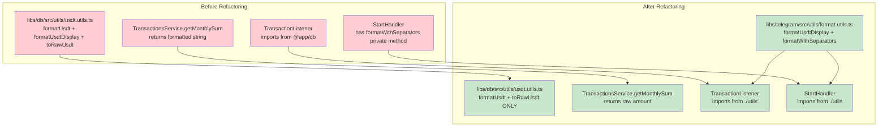
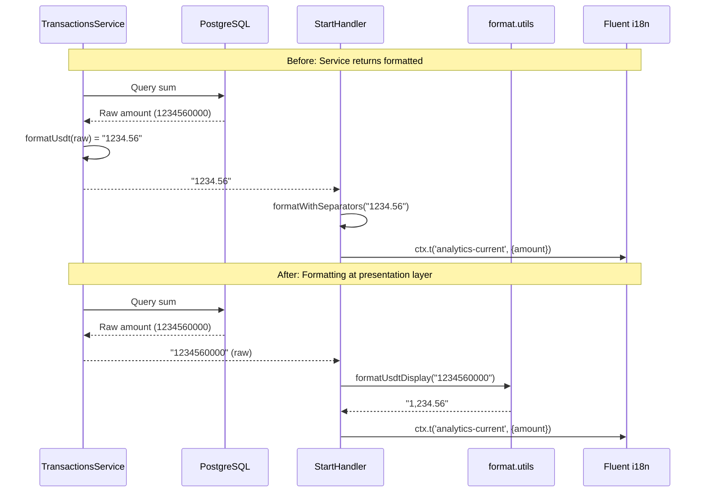
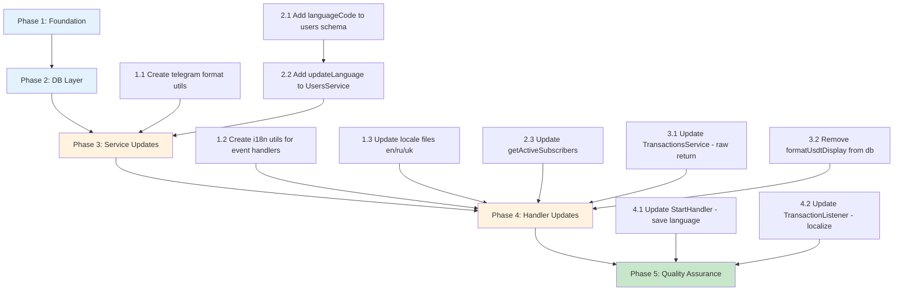

# User-Friendly Messages and Ukrainian Locale Design Document

## Overview

This document defines the technical design for making PayPing bot messages user-friendly for a salary payment monitoring context, adding Ukrainian language support, and refactoring the formatting utilities architecture.

## Design Summary (Meta)

```yaml
design_type: "feature_enhancement"
risk_level: "medium"
complexity_level: "medium"
complexity_rationale: >
  (1) Requirements/ACs: Message content updates in 3 locale files, utility relocation from
      @app/db to @app/telegram, service method signature change (formatted -> raw),
      getRollingAverage() internal calculation update, database schema change for languageCode,
      TransactionListener per-user localization.
  (2) Constraints/risks: Database migration required, service method dependencies
      (getRollingAverage -> getMonthlySum), manual Fluent loading for event handlers.
main_constraints:
  - "Maintain backward compatibility for existing analytics methods"
  - "Preserve all existing functionality (amounts, formatting)"
  - "Database schema change requires migration"
  - "Follow existing i18n patterns from @grammyjs/i18n"
  - "TransactionListener must load Fluent resources manually (no grammY context)"
biggest_risks:
  - "getRollingAverage() regression when getMonthlySum() returns raw amounts"
  - "Import path updates may miss some references"
  - "Translation quality for Ukrainian locale"
  - "Fluent resource loading in event handlers"
unknowns:
  - "Fluent bundle loading API outside grammY context"
```

## Background and Context

### Prerequisite ADRs

- **ADR-0001: TRON Blockchain Monitoring Approach**: Defines transaction data structure
- **ADR-0002: Drizzle ORM Selection**: Database access patterns

### Agreement Checklist

#### Scope (Confirmed with User)
- [x] Update en.ftl and ru.ftl with user-friendly, celebratory messages for salary context
- [x] Create uk.ftl (Ukrainian locale)
- [x] Move `formatUsdtDisplay()` from `@app/db` to `@app/telegram`
- [x] Change `TransactionsService.getMonthlySum()` to return raw amount (not formatted)
- [x] Fix `getRollingAverage()` internal calculation (depends on getMonthlySum)
- [x] Create formatting utilities in `libs/telegram/src/utils/`
- [x] Update `TransactionListener` to use new utility location
- [x] Add `languageCode` column to users table (database schema change)
- [x] Save user language preference on /start
- [x] Localize TransactionListener notifications per user language

#### User Preferences (Confirmed)
- [x] Tone: Friendly + Celebratory ("Hooray! Payment arrived!")
- [x] Emojis: Sparingly (for titles and key moments only)
- [x] Approved emojis: money bag, checkmark, chart/stats, bell, star
- [x] Detail level: Full technical (amount + address + hash + time)

#### Non-Scope (Explicitly not changing)
- [x] Transaction processing logic
- [x] Blockchain monitoring
- [x] Subscription management logic (except language field)
- [x] Bot command handlers (only import updates and language save)

#### Constraints
- [x] Backward compatibility: Yes (existing tests must pass)
- [x] Performance: No impact expected

### Problem to Solve

1. **Messages are generic**: Current messages ("New Transaction", "You have subscribed") are bland and don't fit the salary monitoring context where users want celebratory notifications when payments arrive.

2. **Missing Ukrainian locale**: Many target users speak Ukrainian, but only English and Russian are supported.

3. **Architecture violation**: Display formatting (`formatUsdtDisplay()`) is in `@app/db` which should only handle data persistence, not presentation. The service method `getMonthlySum()` returns a formatted string, violating separation of concerns.

## Existing Codebase Analysis

### Implementation Path Mapping

| Type | Path | Description | Action |
|------|------|-------------|--------|
| Existing | `libs/telegram/src/locales/en.ftl` | English translations | Update messages |
| Existing | `libs/telegram/src/locales/ru.ftl` | Russian translations | Update messages |
| New | `libs/telegram/src/locales/uk.ftl` | Ukrainian translations | Create |
| Existing | `libs/db/src/utils/usdt.utils.ts` | USDT formatting utilities | Remove `formatUsdtDisplay()` |
| Existing | `libs/db/src/index.ts` | DB module exports | Remove display util export |
| Existing | `libs/db/src/services/transactions.service.ts:263` | Returns formatted string | Return raw amount, fix getRollingAverage |
| New | `libs/telegram/src/utils/format.utils.ts` | Display formatting utilities | Create |
| New | `libs/telegram/src/utils/index.ts` | Utils barrel export | Create |
| New | `libs/telegram/src/utils/i18n.utils.ts` | Fluent bundle loader for event handlers | Create |
| Existing | `libs/telegram/src/listeners/transaction.listener.ts` | Uses formatUsdtDisplay, hardcoded EN | Localize per user |
| Existing | `libs/telegram/src/handlers/start.handler.ts` | Uses formatWithSeparators | Use new utility, save language |
| Existing | `libs/db/src/schema/users.ts` | Users table schema | Add languageCode column |
| Existing | `libs/db/src/services/users.service.ts` | User management | Add updateLanguage method |
| Existing | `libs/db/src/services/subscriptions.service.ts` | Subscription management | Return languageCode in getActiveSubscribers |

### Similar Functionality Search

- **formatUsdtDisplay()** in `@app/db` - Will be moved to `@app/telegram`
- **formatWithSeparators()** in `StartHandler` - Private method, same logic as `formatUsdtDisplay()`; will be replaced by new utility
- **No duplicate i18n infrastructure** - Single source in telegram lib

### Integration Points

| Integration Target | Current Implementation | New Implementation |
|-------------------|------------------------|-------------------|
| TransactionsService.getMonthlySum() | Returns formatted string ("1234.56") | Returns raw amount ("1234560000") |
| formatUsdtDisplay import | `@app/db` | `@app/telegram/utils` |
| StartHandler.formatWithSeparators | Private method | Use formatUsdtDisplay from utils |

## Design

### Change Impact Map

```yaml
Change Target: "i18n messages, formatting architecture, and per-user localization"
Direct Impact:
  - libs/telegram/src/locales/en.ftl (message content)
  - libs/telegram/src/locales/ru.ftl (message content)
  - libs/telegram/src/locales/uk.ftl (new file)
  - libs/db/src/utils/usdt.utils.ts (remove formatUsdtDisplay)
  - libs/db/src/index.ts (remove formatUsdtDisplay export)
  - libs/db/src/services/transactions.service.ts (return raw amount, fix getRollingAverage)
  - libs/telegram/src/utils/format.utils.ts (new file)
  - libs/telegram/src/utils/index.ts (new file)
  - libs/telegram/src/utils/i18n.utils.ts (new file - Fluent bundle loader)
  - libs/telegram/src/listeners/transaction.listener.ts (per-user localization)
  - libs/telegram/src/handlers/start.handler.ts (save language, use new utility)
  - libs/db/src/schema/users.ts (add languageCode column)
  - libs/db/src/services/users.service.ts (add updateLanguage method)
  - libs/db/src/services/subscriptions.service.ts (return languageCode)
Indirect Impact:
  - libs/db/src/utils/usdt.utils.spec.ts (remove formatUsdtDisplay tests)
  - libs/db/src/services/__tests__/transactions.service.int.test.ts (update assertions)
  - libs/db/src/services/__tests__/users.service.int.test.ts (test updateLanguage)
  - Database migration required for languageCode column
No Ripple Effect:
  - libs/blockchain/* (no changes)
  - libs/telegram/src/handlers/subscribe.handler.ts (no changes)
  - libs/telegram/src/telegram.service.ts (no changes)
```

### Architecture Overview



### Data Flow



### Interface Change Matrix

| Existing Operation | New Operation | Conversion Required | Compatibility Method |
|-------------------|---------------|-------------------|---------------------|
| `TransactionsService.getMonthlySum()` returns formatted | Returns raw amount string | Yes | Callers use formatUsdtDisplay() |
| `formatUsdtDisplay` from `@app/db` | from `@app/telegram/utils` | Yes | Update import paths |
| `StartHandler.formatWithSeparators()` private | Use `formatUsdtDisplay()` | Yes | Remove private method |

### Integration Boundary Contracts

```yaml
Boundary: TransactionsService.getMonthlySum()
  Input: { year: number, month: number }
  Output (Before): Formatted string "1234.56" (2 decimal places)
  Output (After): Raw amount string "1234560000" (6 decimal precision)
  On Error: Throws (fail-fast)

Boundary: format.utils.formatUsdtDisplay()
  Input: Raw amount (string | number), decimals (default 2)
  Output: Formatted string with thousand separators "1,234.56"
  On Error: Returns "0.00" for invalid input
```

### Message Categories and Content

**Design Principle**: One message = one variable. Full context for translators.

#### Message Key Structure

| Key | Purpose | Variables |
|-----|---------|-----------|
| `welcome` | Greeting + bot explanation | - |
| `analytics-with-history` | Stats with expected amount | `$currentAmount`, `$expectedAmount`, `$months` |
| `analytics-no-history` | Stats without history | `$currentAmount` |
| `notification` | Transaction alert (full) | `$amount`, `$address`, `$time`, `$hash` |
| `subscribe-success` | Subscription confirmed | - |
| `subscribe-already` | Already subscribed | - |
| `unsubscribe-success` | Unsubscribed | - |
| `unsubscribe-not-subscribed` | Not subscribed | - |
| `status-subscribed` | Status line | - |
| `status-not-subscribed` | Status line | - |
| `btn-subscribe` | Button text | - |
| `btn-unsubscribe` | Button text | - |
| `error-generic` | Generic error | - |
| `error-rate-limit` | Rate limit error | - |

#### English (en.ftl)

```fluent
# Welcome message
welcome = 👋 Welcome to PayPing!

    I help you track salary payments to your company wallet.
    You'll get instant notifications when funds arrive.

# Analytics - with historical data
analytics-with-history = 📊 <b>Monthly Stats</b>
    ━━━━━━━━━━━━━━━
    • This month: { $currentAmount } USDT
    • Expected: { $expectedAmount } USDT
      (based on { $months }-month average)

# Analytics - no historical data yet
analytics-no-history = 📊 <b>Monthly Stats</b>
    ━━━━━━━━━━━━━━━
    • This month: { $currentAmount } USDT
    • Expected: N/A (not enough data yet)

# Transaction notification - full message with all details
notification = 🎉 <b>Payment Received!</b>

    💵 { $amount } USDT

    📍 From: <code>{ $address }</code>
    🕐 Time: { $time }
    🔗 Tx: <code>{ $hash }</code>

# Subscription actions
subscribe-success = ✅ Subscribed! You'll now receive payment notifications.
subscribe-already = ℹ️ You're already subscribed.
unsubscribe-success = Unsubscribed. You won't receive notifications anymore.
unsubscribe-not-subscribed = You're not currently subscribed.

# Status indicators
status-subscribed = ✅ Subscribed
status-not-subscribed = 🔔 Not subscribed

# Buttons
btn-subscribe = Subscribe
btn-unsubscribe = Unsubscribe

# Errors
error-generic = ⚠️ Something went wrong. Please try again.
error-rate-limit = ⏳ Too many requests. Please wait a moment.
```

#### Russian (ru.ftl)

```fluent
# Приветствие
welcome = 👋 Добро пожаловать в PayPing!

    Я помогаю отслеживать поступления зарплаты на корпоративный кошелёк.
    Вы получите мгновенные уведомления о поступлении средств.

# Аналитика - с историей
analytics-with-history = 📊 <b>Статистика за месяц</b>
    ━━━━━━━━━━━━━━━
    • В этом месяце: { $currentAmount } USDT
    • Ожидается: { $expectedAmount } USDT
      (на основе среднего за { $months } мес.)

# Аналитика - без истории
analytics-no-history = 📊 <b>Статистика за месяц</b>
    ━━━━━━━━━━━━━━━
    • В этом месяце: { $currentAmount } USDT
    • Ожидается: Н/Д (пока недостаточно данных)

# Уведомление о транзакции
notification = 🎉 <b>Платёж получен!</b>

    💵 { $amount } USDT

    📍 От: <code>{ $address }</code>
    🕐 Время: { $time }
    🔗 Tx: <code>{ $hash }</code>

# Действия подписки
subscribe-success = ✅ Вы подписались! Теперь вы будете получать уведомления о платежах.
subscribe-already = ℹ️ Вы уже подписаны.
unsubscribe-success = Подписка отменена. Вы больше не будете получать уведомления.
unsubscribe-not-subscribed = Вы сейчас не подписаны.

# Статусы
status-subscribed = ✅ Подписка активна
status-not-subscribed = 🔔 Не подписаны

# Кнопки
btn-subscribe = Подписаться
btn-unsubscribe = Отписаться

# Ошибки
error-generic = ⚠️ Что-то пошло не так. Попробуйте ещё раз.
error-rate-limit = ⏳ Слишком много запросов. Подождите немного.
```

#### Ukrainian (uk.ftl)

```fluent
# Привітання
welcome = 👋 Ласкаво просимо до PayPing!

    Я допомагаю відстежувати надходження зарплати на корпоративний гаманець.
    Ви отримаєте миттєві сповіщення про надходження коштів.

# Аналітика - з історією
analytics-with-history = 📊 <b>Статистика за місяць</b>
    ━━━━━━━━━━━━━━━
    • Цього місяця: { $currentAmount } USDT
    • Очікується: { $expectedAmount } USDT
      (на основі середнього за { $months } міс.)

# Аналітика - без історії
analytics-no-history = 📊 <b>Статистика за місяць</b>
    ━━━━━━━━━━━━━━━
    • Цього місяця: { $currentAmount } USDT
    • Очікується: Н/Д (поки недостатньо даних)

# Сповіщення про транзакцію
notification = 🎉 <b>Платіж отримано!</b>

    💵 { $amount } USDT

    📍 Від: <code>{ $address }</code>
    🕐 Час: { $time }
    🔗 Tx: <code>{ $hash }</code>

# Дії підписки
subscribe-success = ✅ Ви підписались! Тепер ви отримуватимете сповіщення про платежі.
subscribe-already = ℹ️ Ви вже підписані.
unsubscribe-success = Підписку скасовано. Ви більше не отримуватимете сповіщень.
unsubscribe-not-subscribed = Ви зараз не підписані.

# Статуси
status-subscribed = ✅ Підписка активна
status-not-subscribed = 🔔 Не підписані

# Кнопки
btn-subscribe = Підписатись
btn-unsubscribe = Відписатись

# Помилки
error-generic = ⚠️ Щось пішло не так. Спробуйте ще раз.
error-rate-limit = ⏳ Забагато запитів. Зачекайте трохи.
```

### Contract Definitions

#### format.utils.ts

```typescript
// libs/telegram/src/utils/format.utils.ts

/**
 * USDT TRC20 token has 6 decimal places.
 */
const USDT_DECIMALS = 6;

/**
 * Converts raw USDT amount to human-readable format with thousand separators.
 *
 * @param rawAmount - Amount in smallest unit (e.g., "1000000" = 1 USDT)
 * @param decimals - Number of decimal places (default: 2)
 * @returns Formatted string with separators (e.g., "1,234.56")
 *
 * @example
 * formatUsdtDisplay("1234567890000") // "1,234,567.89"
 * formatUsdtDisplay("1000000") // "1.00"
 */
export function formatUsdtDisplay(rawAmount: string | number, decimals = 2): string;

/**
 * Format number string with thousand separators.
 * Wrapper for formatUsdtDisplay that takes already-converted amounts.
 *
 * @param value - Human-readable amount string (e.g., "1234.56")
 * @returns Formatted string with separators (e.g., "1,234.56")
 */
export function formatWithSeparators(value: string): string;
```

### Data Contract

#### TransactionsService.getMonthlySum() (Updated)

```yaml
Input:
  Type: { year: number, month: number }
  Preconditions:
    - year is valid year (e.g., 2026)
    - month is 1-12
  Validation: Range check

Output:
  Type: string (raw amount in smallest unit)
  Before: "1234.56" (formatted with 2 decimals)
  After: "1234560000" (raw, 6 decimal precision preserved)
  Guarantees:
    - Returns sum of USDT incoming transactions for specified month
    - Returns "0" if no transactions
    - Preserves full precision (no formatting)
  On Error: Throws (fail-fast)

Migration:
  - Callers must wrap result with formatUsdtDisplay() for display
  - getRollingAverage() internally uses getMonthlySum(), must be updated
```

## Acceptance Criteria

### AC-1: English Messages User-Friendly

- **AC-1.1**: **When** user receives transaction notification, **then** message starts with celebratory text and emoji
- **AC-1.2**: **When** user views /start, **then** welcome message explains salary monitoring purpose
- **AC-1.3**: **When** user subscribes/unsubscribes, **then** confirmation message is warm and friendly

### AC-2: Russian Messages User-Friendly

- **AC-2.1**: Same criteria as AC-1 for Russian locale
- **AC-2.2**: Messages are grammatically correct Russian

### AC-3: Ukrainian Locale Added

- **AC-3.1**: **When** user has language_code 'uk', **then** all messages display in Ukrainian
- **AC-3.2**: All message keys from en.ftl exist in uk.ftl
- **AC-3.3**: Ukrainian translations are grammatically correct

### AC-4: Formatting Utilities Relocated

- **AC-4.1**: `formatUsdtDisplay()` exists in `libs/telegram/src/utils/format.utils.ts`
- **AC-4.2**: `formatUsdtDisplay` is NOT exported from `@app/db`
- **AC-4.3**: `TransactionListener` imports formatting from `../utils`

### AC-5: TransactionsService Returns Raw Data

- **AC-5.1**: `getMonthlySum()` returns raw amount string (e.g., "1234560000")
- **AC-5.2**: Existing tests updated to expect raw amount format
- **AC-5.3**: `getRollingAverage()` continues to return formatted string (for backward compatibility)
- **AC-5.4**: `getRollingAverage()` internal calculation updated to handle raw amounts from `getMonthlySum()` - sums raw values, then formats at the end

### AC-6: StartHandler Uses New Utilities

- **AC-6.1**: Private `formatWithSeparators()` method removed
- **AC-6.2**: Handler imports and uses `formatUsdtDisplay()` from utils
- **AC-6.3**: Handler saves user's `language_code` from Telegram context to database on /start

### AC-7: Users Table Has Language Code

- **AC-7.1**: `users` table has `language_code` column (varchar, nullable, default null)
- **AC-7.2**: `UsersService` has `updateLanguage(telegramId, languageCode)` method
- **AC-7.3**: Existing users without language_code get 'en' as fallback

### AC-8: TransactionListener Localized

- **AC-8.1**: `getActiveSubscribers()` returns `languageCode` field alongside `telegramId`
- **AC-8.2**: TransactionListener formats notification message using subscriber's language
- **AC-8.3**: Fluent bundles loaded via `i18n.utils.ts` (outside grammY context)
- **AC-8.4**: Fallback to 'en' if user language not set or locale not found

## Implementation Plan

### Implementation Approach

**Selected Approach**: Horizontal Slice (Foundation-driven)

**Selection Reason**: Database schema and utilities must be created first. The languageCode column and i18n utils are required before handlers and listeners can be updated.

### Technical Dependencies and Implementation Order



### Phase 1: Foundation (Parallel Tasks)

**Task 1.1: Create telegram format utils**
- Create `libs/telegram/src/utils/format.utils.ts` with `formatUsdtDisplay()`, `formatWithSeparators()`
- Create `libs/telegram/src/utils/index.ts` barrel export
- Add unit tests
- Verification: L2 (tests pass)

**Task 1.2: Create i18n utils for event handlers**
- Create `libs/telegram/src/utils/i18n.utils.ts`
- Load Fluent bundles outside grammY context
- Export `translate(languageCode, key, params)` function
- Verification: L2 (unit tests pass)

**Task 1.3: Update locale files**
- Update `en.ftl` with user-friendly messages (celebratory tone)
- Update `ru.ftl` with user-friendly messages (Cyrillic)
- Create `uk.ftl` with Ukrainian translations (Cyrillic)
- Add `notification-time` key to all locales
- Verification: L3 (build succeeds, locale files load)

### Phase 2: Database Layer

**Task 2.1: Add languageCode to users schema**
- Add `languageCode` column to `libs/db/src/schema/users.ts`
- Column: `varchar(10)`, nullable, default null
- Run drizzle-kit generate for migration
- Verification: L3 (migration applies successfully)

**Task 2.2: Add updateLanguage to UsersService**
- Add `updateLanguage(telegramId: number, languageCode: string)` method
- Add integration test
- Verification: L2 (tests pass)

**Task 2.3: Update getActiveSubscribers**
- Modify `SubscriptionsService.getActiveSubscribers()` to return `languageCode`
- Update return type to include `languageCode: string | null`
- Update existing tests
- Verification: L2 (tests pass)

### Phase 3: Service Updates

**Task 3.1: Update TransactionsService**
- Modify `getMonthlySum()` to return raw amount (remove `formatUsdt()` call)
- Update `getRollingAverage()` internal calculation:
  - Sum raw amounts (as numbers)
  - Format only at the end using `formatUsdt()`
- Update integration tests to expect raw format
- Verification: L2 (tests pass)

**Task 3.2: Remove display util from db**
- Remove `formatUsdtDisplay()` from `libs/db/src/utils/usdt.utils.ts`
- Keep `formatUsdt()` and `toRawUsdt()` (data conversion, not display)
- Remove export from `libs/db/src/index.ts`
- Remove related tests from `usdt.utils.spec.ts`
- Verification: L3 (build succeeds, no broken imports)

### Phase 4: Handler Updates

**Task 4.1: Update StartHandler**
- Remove private `formatWithSeparators()` method
- Import `formatUsdtDisplay()` from `../utils`
- Update to handle raw amount from `getMonthlySum()`
- Save user's `ctx.from.language_code` to database via `usersService.updateLanguage()`
- Verification: L2 (tests pass)

**Task 4.2: Update TransactionListener**
- Import `formatUsdtDisplay` from `../utils`
- Import `translate` from `../utils/i18n.utils`
- Refactor `formatNotificationMessage()` to accept `languageCode`
- Use `translate(languageCode, 'notification-title')` etc.
- Fallback to 'en' if languageCode is null
- Update notification loop to pass subscriber's languageCode
- Verification: L2 (tests pass)

### Phase 5: Quality Assurance

- Run full test suite (`pnpm test`)
- Run build (`pnpm build`)
- Verify all locale files load correctly
- Grep for old import paths (`@app/db` + `formatUsdtDisplay`)
- Manual testing with each locale (en, ru, uk)
- Code review for import path consistency

### E2E Verification Procedures

| Phase | Verification | Method |
|-------|--------------|--------|
| 1.1 | Utils created and tested | `pnpm test libs/telegram/src/utils` |
| 1.2 | Locales load without error | Bot startup log check |
| 2.1 | Service returns raw amounts | Integration tests |
| 2.2 | No db display export | Import check fails |
| 3.1 | Listener uses new import | Unit tests pass |
| 3.2 | Handler formats correctly | Unit tests pass |
| 4 | Full flow works | Manual E2E test |

### Integration Point Map

```yaml
Integration Point 1:
  Existing Component: TransactionsService.getMonthlySum()
  Integration Method: Return value change
  Impact Level: Medium (Callers need update)
  Required Test Coverage: Update assertions in int tests

Integration Point 2:
  Existing Component: libs/db/src/index.ts exports
  Integration Method: Remove export
  Impact Level: Medium (Import path change)
  Required Test Coverage: Build verification

Integration Point 3:
  Existing Component: TransactionListener.formatNotificationMessage()
  Integration Method: Import update
  Impact Level: Low (Internal change)
  Required Test Coverage: Unit test pass
```

## Test Strategy

### Unit Tests

| Component | Test Focus | Key Test Cases |
|-----------|------------|----------------|
| format.utils.ts | formatUsdtDisplay | Thousand separators, decimals, edge cases |
| format.utils.ts | formatWithSeparators | Already-formatted input handling |

### Integration Tests

| Test Scenario | Components | Verification |
|---------------|------------|--------------|
| Monthly sum raw format | TransactionsService | Returns raw amount string |
| Rolling average formatted | TransactionsService | Still returns formatted string |

### Manual Tests

| Test Scenario | Steps | Expected |
|---------------|-------|----------|
| English messages | Set language_code='en', run /start | User-friendly English |
| Russian messages | Set language_code='ru', run /start | User-friendly Russian |
| Ukrainian messages | Set language_code='uk', run /start | User-friendly Ukrainian |
| Transaction notification | Emit event | Celebratory message with emoji |

## Risks and Mitigation

| Risk | Impact | Probability | Mitigation |
|------|--------|-------------|------------|
| Missed import update | Build fails | Low | Grep for old import path |
| Ukrainian translation quality | User confusion | Medium | Review by native speaker |
| getRollingAverage regression | Wrong display | Low | Verify test coverage |

## References

- [Project Fluent Syntax](https://projectfluent.org/fluent/guide/) - Fluent localization syntax reference
- [grammY i18n Plugin](https://grammy.dev/plugins/i18n) - i18n plugin documentation
- [Ukrainian Localization Guidelines](https://localizationlab.org/tools/ukraine-localization-guide/) - Best practices

## Update History

| Date | Version | Changes | Author |
|------|---------|---------|--------|
| 2026-01-22 | 1.0 | Initial version | Claude |
