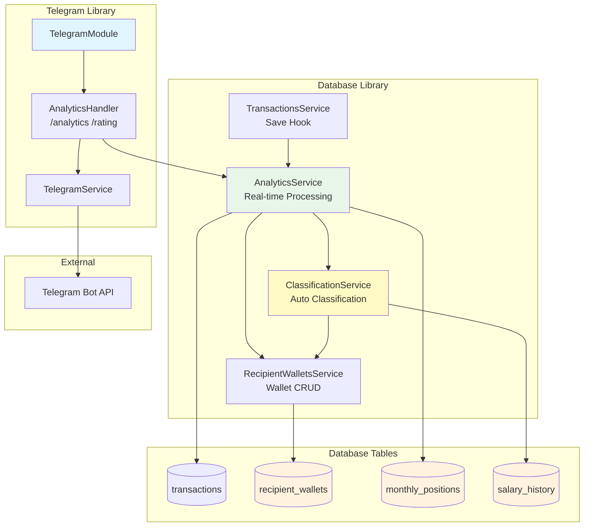
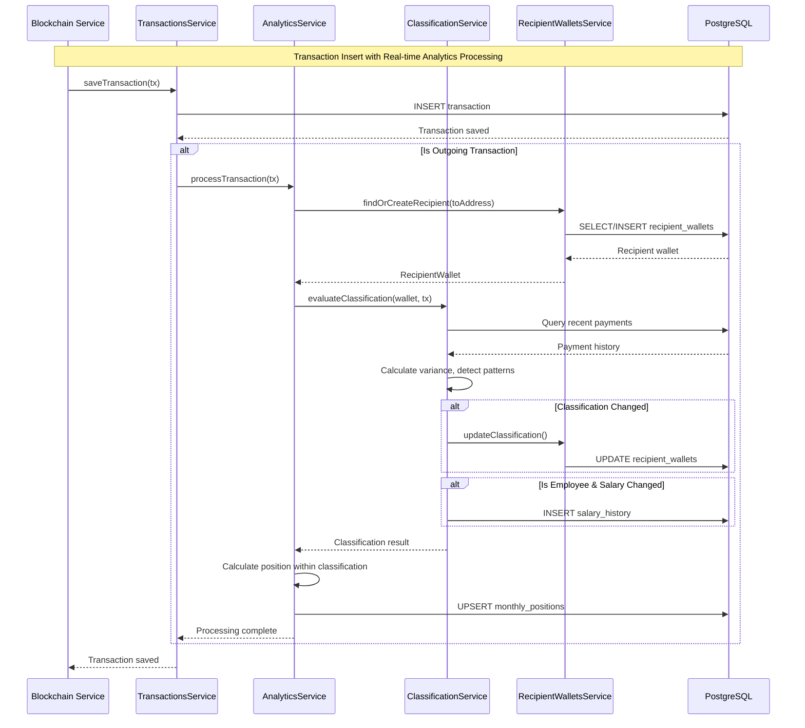
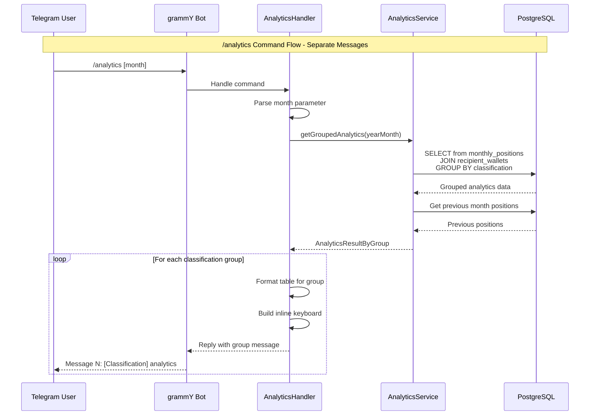
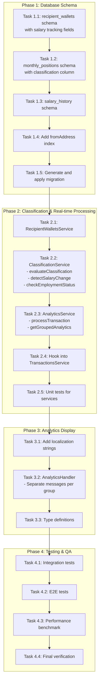

# Payout Analytics Design Document

## Overview

This document defines the technical design for the Payout Analytics feature within PayPing. The feature provides a `/analytics` command that displays recipient wallet rankings grouped by classification type in separate messages, with automatic classification based on payment patterns, real-time processing on transaction insert, salary tracking, and employment status detection.

## Design Summary (Meta)

```yaml
design_type: "new_feature"
risk_level: "medium"
complexity_level: "high"
complexity_rationale: >
  (1) Requirements/ACs: Automatic classification algorithm with pattern detection,
      salary change tracking with confirmation logic, fired/rehired status detection,
      separate message display per classification group with position-within-group
      calculation, real-time processing hook into transaction save flow.
  (2) Constraints/risks addressed: 3-second response time requirement for 100 recipients,
      real-time processing overhead on transaction insert (<200ms), classification
      algorithm edge cases, salary change confirmation requiring 2-month pattern.
main_constraints:
  - "NestJS standalone application (no HTTP server)"
  - "Real-time processing on transaction insert (not on-demand)"
  - "Response time under 3 seconds for 100 recipients"
  - "6-month historical data support without degradation"
  - "Automatic classification only (no admin manual classification)"
biggest_risks:
  - "Transaction insert latency with analytics processing overhead"
  - "Classification algorithm accuracy for edge cases"
  - "Position recalculation when late transactions arrive"
  - "Salary change false positive detection"
unknowns:
  - "Actual query performance with 6 months of production data"
  - "Classification algorithm accuracy against real payment patterns"
  - "Edge cases in fired/rehired detection timing"
```

## Background and Context

### Prerequisite ADRs

- **ADR-0003: Payout Analytics Architecture** (v2.0): Defines real-time processing on transaction insert with automatic classification
- **ADR-0002: Drizzle ORM Selection**: Database access patterns and schema design
- **ADR-0001: TRON Blockchain Monitoring**: Transaction data structure and storage

### Agreement Checklist

#### Scope
- [x] New `/analytics` command with separate messages per classification type
- [x] New `/rating` command as alias for `/analytics`
- [x] New `recipient_wallets` database table with salary tracking fields
- [x] New `monthly_positions` database table with classification column
- [x] New `salary_history` database table for salary change tracking
- [x] New `ClassificationService` for automatic classification algorithm
- [x] New `AnalyticsService` for real-time processing and analytics display
- [x] New `RecipientWalletsService` for recipient management
- [x] New `AnalyticsHandler` for command handling
- [x] Inline keyboard navigation (Previous/Next month)
- [x] Localization support (en, ru, uk) using existing i18n infrastructure
- [x] Month parameter parsing (`/analytics 2026-01`)
- [x] Real-time processing hook into transaction save flow

#### Non-Scope (Explicitly not changing)
- [x] Existing `transactions` table schema (read-only access)
- [x] Existing `TransactionsService` (no modifications to core logic)
- [x] Incoming transaction analytics in `/start` command
- [x] Transaction notification flow
- [x] Subscription management
- [x] TRX payouts (USDT only)
- [x] Admin classification commands (removed - classification is fully automatic)
- [x] ADMIN_USER_IDS configuration (removed - no admin features)

#### Constraints
- [x] Parallel operation: No (single bot instance)
- [x] Backward compatibility: Not required (new feature)
- [x] Performance measurement: Required (3 second response, <200ms insert overhead)
- [x] Real-time processing: Analytics updated on transaction insert

### Problem to Solve

Finance teams and business owners need visibility into:
1. Where outgoing payments are going (recipient wallets) grouped by type
2. Payment priority/order within each classification group (employees separate from freelancers)
3. Changes in recipient position month-over-month within their group
4. Automatic classification of recipients based on payment patterns
5. Detection of salary changes and confirmation
6. Detection of employee terminations and rehires

### Current Challenges

1. No recipient wallet tracking - payouts are just `toAddress` in transactions
2. No position history - cannot determine payment order
3. No classification system for recipients
4. No month-over-month comparison capability
5. No salary tracking or change detection
6. No employment status tracking (fired/rehired)

### Requirements

#### Functional Requirements

| ID | Requirement | Priority |
|----|-------------|----------|
| FR-1 | `/analytics` command with separate messages per classification | Must |
| FR-2 | Recipient wallet table with positions within classification group | Must |
| FR-3 | Recipient wallet entity tracking with salary fields | Must |
| FR-4 | Automatic wallet classification algorithm | Must |
| FR-5 | Real-time analytics processing on transaction insert | Must |
| FR-6 | Salary tracking and change detection with confirmation | Must |
| FR-7 | Fired and rehired status tracking | Must |
| FR-8 | Localization (en, ru, uk) | Must |
| FR-9 | Historical month selection parameter | Should |
| FR-10 | Inline keyboard navigation | Should |
| FR-11 | Summary statistics per classification group | Could |

#### Non-Functional Requirements

- **Performance**: Command response under 3 seconds; transaction insert overhead under 200ms
- **Scalability**: Support 500 unique recipients, 1000 payouts/month
- **Reliability**: 99% command success rate; deterministic position calculation; >90% classification accuracy
- **Maintainability**: Follows existing handler patterns; centralized i18n

## Acceptance Criteria (AC) - EARS Format

### FR-1: `/analytics` Command with Grouped Display

- [x] **AC-1.1**: **When** user sends `/analytics` command, the system shall respond with **separate messages per classification type** within 3 seconds
- [x] **AC-1.2**: **When** user sends `/rating` command, the system shall respond identically to `/analytics` (alias)
- [x] **AC-1.3**: **If** no payout data exists for current month, **then** the system shall display localized "no data" message
- [x] **AC-1.4**: The system shall send messages in order: Employees, Freelancers, One-time, Unknown, Fired (if any)
- [x] **AC-1.5**: **If** a classification group is empty, **then** no message shall be sent for that group

### FR-2: Recipient Wallet Table Display

- [x] **AC-2.1**: The system shall display recipient wallets in a formatted table with columns: Position, Wallet, Previous, Change, Amount
- [x] **AC-2.2**: **When** displaying wallet address, the system shall truncate to first 4 + last 3 characters (e.g., `TXyz...abc`)
- [x] **AC-2.3**: The system shall sort recipients by payment timestamp **within each classification group**
- [x] **AC-2.4**: **If** multiple payments to same recipient in one month, **then** position is based on first payment timestamp
- [x] **AC-2.5**: **If** two recipients have identical timestamps, **then** the system shall use transaction hash as secondary sort for determinism
- [x] **AC-2.6**: Position numbers shall be **within classification group** (Employee #1, #2, #3, not global)

### FR-3: Recipient Wallet Entity

- [x] **AC-3.1**: **When** a new recipient address appears in payout transaction, the system shall create recipient_wallet record with appropriate automatic classification
- [x] **AC-3.2**: The system shall store first_seen_at, last_payment_at, and hired_at timestamps for each recipient
- [x] **AC-3.3**: The system shall track total_payments count and last_amount for each recipient
- [x] **AC-3.4**: The system shall store fired_at timestamp when employee is marked as fired

### FR-4: Automatic Classification

- [x] **AC-4.1**: **When** payment amount < 500 USDT, the system shall classify as UNKNOWN `[?]`
- [x] **AC-4.2**: **When** first payment >= 500 USDT, the system shall classify as ONE_TIME `[O]`
- [x] **AC-4.3**: **When** wallet has regular payments with stable amounts (within 20% variance over 2-3 months), the system shall classify as EMPLOYEE `[E]`
- [x] **AC-4.4**: **When** wallet has >1 payment with high variance (>20%), the system shall classify as FREELANCER `[F]`
- [x] **AC-4.5**: **When** EMPLOYEE wallet has no payments for 2 consecutive months, the system shall classify as FIRED (door emoji)
- [x] **AC-4.6**: **When** FIRED wallet receives new payment, the system shall reclassify as EMPLOYEE and log as rehire

### FR-5: Real-time Processing

- [x] **AC-5.1**: **When** payout transaction is saved, the system shall trigger analytics processing within 100ms
- [x] **AC-5.2**: **When** transaction is processed, the system shall update recipient classification immediately
- [x] **AC-5.3**: **When** transaction is processed, the system shall calculate and store position for current month
- [x] **AC-5.4**: Real-time processing shall not add more than 200ms to transaction insert latency

### FR-6: Salary Tracking

- [x] **AC-6.1**: **When** EMPLOYEE payment amount differs from previous by >5%, the system shall log potential salary change
- [x] **AC-6.2**: **When** two consecutive payments at new amount are received, the system shall confirm salary change
- [x] **AC-6.3**: The system shall store salary history with detected_at and confirmed_at timestamps

### FR-7: Fired/Rehired Status

- [x] **AC-7.1**: The system shall run batch check for fired employees (2+ months no payment)
- [x] **AC-7.2**: **When** marking employee as fired, the system shall set fired_at timestamp and change classification
- [x] **AC-7.3**: **When** fired employee receives payment, the system shall clear fired_at, change to EMPLOYEE, and log rehire

### FR-8: Localization Support

- [x] **AC-8.1**: **When** user has `language_code='ru'`, the system shall display all text in Russian
- [x] **AC-8.2**: **When** user has `language_code='uk'`, the system shall display all text in Ukrainian
- [x] **AC-8.3**: **If** language_code is unrecognized, **then** the system shall fallback to English
- [x] **AC-8.4**: All month names and classification names shall be localized

### FR-9: Historical Month Selection

- [x] **AC-9.1**: **When** user sends `/analytics 2026-01`, the system shall display January 2026 analytics
- [x] **AC-9.2**: **When** user sends `/analytics Jan`, the system shall display current year January analytics
- [x] **AC-9.3**: **If** requested month has no data, **then** the system shall display "no data" message
- [x] **AC-9.4**: **If** requested month is more than 6 months ago, **then** the system shall display "data unavailable" message

### FR-10: Inline Keyboard Navigation

- [x] **AC-10.1**: The system shall display "Previous Month" and "Next Month" inline buttons on each classification message
- [x] **AC-10.2**: **When** user clicks "Previous Month", the system shall update all messages with previous month analytics
- [x] **AC-10.3**: **When** viewing current month, the system shall disable "Next Month" button
- [x] **AC-10.4**: **When** viewing 6 months ago, the system shall disable "Previous Month" button

## Existing Codebase Analysis

### Implementation Path Mapping

| Type | Path | Description |
|------|------|-------------|
| Existing | `libs/db/src/schema/transactions.ts` | Transaction table schema (read-only) |
| Existing | `libs/db/src/services/transactions.service.ts` | Transaction queries (hook into save) |
| Existing | `libs/telegram/src/telegram.service.ts` | Bot instance and i18n access |
| Existing | `libs/telegram/src/handlers/start.handler.ts` | Handler pattern reference |
| Existing | `libs/telegram/src/locales/*.ftl` | Localization files (extend) |
| Existing | `libs/telegram/src/utils/format.utils.ts` | Address truncation utility |
| New | `libs/db/src/schema/recipient-wallets.ts` | Recipient wallet table schema |
| New | `libs/db/src/schema/monthly-positions.ts` | Monthly positions table schema |
| New | `libs/db/src/schema/salary-history.ts` | Salary history table schema |
| New | `libs/db/src/services/recipient-wallets.service.ts` | Recipient CRUD operations |
| New | `libs/db/src/services/classification.service.ts` | Automatic classification algorithm |
| New | `libs/db/src/services/analytics.service.ts` | Real-time processing and analytics |
| New | `libs/telegram/src/handlers/analytics.handler.ts` | /analytics command handler |

### Integration Points

| Integration Target | Invocation Method |
|-------------------|-------------------|
| TelegramService | Dependency injection (bot access) |
| AnalyticsService | Dependency injection (analytics data) |
| ClassificationService | Dependency injection (classification logic) |
| RecipientWalletsService | Dependency injection (wallet management) |
| TransactionsService | **Event hook or direct call on transaction save** |
| UsersService | Dependency injection (user lookup) |
| I18n Middleware | Context method `ctx.t()` |

### Similar Functionality Search

- **Existing analytics in StartHandler**: `getMonthlySum()`, `getRollingAverage()` - similar query patterns
- **Existing format utilities**: `truncateAddress()`, `formatUsdtDisplay()` - reuse for display
- **Existing handler pattern**: `StartHandler`, `SubscribeHandler` - follow same structure
- **No existing position calculation** - new implementation required
- **No existing classification algorithm** - new implementation required
- **No existing real-time processing hook** - need to add to transaction flow

## Design

### Change Impact Map

```yaml
Change Target: "@app/telegram library and @app/db library"
Direct Impact:
  - libs/db/src/schema/index.ts (export new schemas)
  - libs/db/src/db.module.ts (register new services)
  - libs/db/src/index.ts (export new services)
  - libs/db/src/services/transactions.service.ts (add hook for analytics processing)
  - libs/telegram/src/telegram.module.ts (register handlers)
  - libs/telegram/src/locales/en.ftl (add analytics strings)
  - libs/telegram/src/locales/ru.ftl (add analytics strings)
  - libs/telegram/src/locales/uk.ftl (add analytics strings)
  - libs/telegram/src/types/telegram.types.ts (add types)
Indirect Impact:
  - Database migrations (new tables: recipient_wallets, monthly_positions, salary_history)
  - Transaction insert flow (additional processing time)
No Ripple Effect:
  - libs/blockchain/* (unchanged)
  - libs/telegram/src/handlers/start.handler.ts (unchanged)
  - libs/telegram/src/handlers/subscribe.handler.ts (unchanged)
  - libs/telegram/src/listeners/transaction.listener.ts (unchanged, analytics hook is in DB layer)
```

### Architecture Overview



### Data Flow - Real-time Processing



### Data Flow - Analytics Display



### Integration Point Map

```yaml
Integration Point 1: Transaction Save Hook
  Existing Component: TransactionsService.saveTransaction()
  Integration Method: Call AnalyticsService.processTransaction() after save
  Impact Level: Medium (Process Flow Change)
  Required Test Coverage: Verify transaction save latency remains acceptable (<200ms overhead)

Integration Point 2: Analytics Handler Registration
  Existing Component: TelegramModule providers
  Integration Method: Add AnalyticsHandler to providers array
  Impact Level: Low (Provider Addition)
  Required Test Coverage: Handler responds to /analytics command

Integration Point 3: Module Service Registration
  Existing Component: DbModule providers
  Integration Method: Add AnalyticsService, ClassificationService, RecipientWalletsService
  Impact Level: Low (Provider Addition)
  Required Test Coverage: Services injectable and dependencies resolved
```

### Main Components

#### AnalyticsService

- **Responsibility**: Real-time transaction processing, position calculation, grouped analytics retrieval
- **Interface**:
  ```typescript
  interface AnalyticsService {
    // Real-time processing (called on transaction save)
    processTransaction(tx: Transaction): Promise<void>;

    // Analytics display (called by handler)
    getGroupedAnalytics(yearMonth: string): Promise<GroupedAnalyticsResult>;

    // Position calculation helper
    calculatePositionWithinGroup(yearMonth: string, classification: Classification): Promise<void>;
  }
  ```
- **Dependencies**: `DrizzleDB`, `RecipientWalletsService`, `ClassificationService`, `TransactionsService` (read-only)

#### ClassificationService

- **Responsibility**: Automatic classification algorithm, salary change detection, fired/rehired detection
- **Interface**:
  ```typescript
  interface ClassificationService {
    // Evaluate and update classification based on payment patterns
    evaluateClassification(walletAddress: string, newPayment: PaymentInfo): Promise<ClassificationResult>;

    // Detect salary changes for employees
    detectSalaryChange(walletAddress: string, newAmount: string): Promise<SalaryChangeResult | null>;

    // Batch job: Check for employees to mark as fired
    checkEmploymentStatus(): Promise<FiredEmployee[]>;
  }
  ```
- **Dependencies**: `DrizzleDB`, `RecipientWalletsService`

#### RecipientWalletsService

- **Responsibility**: Recipient wallet CRUD, classification and status updates
- **Interface**:
  ```typescript
  interface RecipientWalletsService {
    findByAddress(address: string): Promise<RecipientWallet | null>;
    findOrCreate(address: string, firstPayment: PaymentInfo): Promise<RecipientWallet>;
    updateClassification(address: string, classification: Classification): Promise<void>;
    updatePaymentInfo(address: string, lastAmount: string, lastPaymentAt: Date): Promise<void>;
    markAsFired(address: string): Promise<void>;
    markAsRehired(address: string, newSalary: string): Promise<void>;
    getByClassification(classification: Classification): Promise<RecipientWallet[]>;
  }
  ```
- **Dependencies**: `DrizzleDB`

#### AnalyticsHandler

- **Responsibility**: /analytics and /rating command handling, sending separate messages per classification
- **Interface**:
  ```typescript
  interface AnalyticsHandler {
    handleAnalytics(ctx: BotContext): Promise<void>;
    handleNavigation(ctx: BotContext): Promise<void>;
  }
  ```
- **Dependencies**: `TelegramService`, `AnalyticsService`, `UsersService`

### Contract Definitions

```typescript
// libs/db/src/schema/recipient-wallets.ts
import { decimal, integer, pgEnum, pgTable, timestamp, varchar } from 'drizzle-orm/pg-core';

export const classificationEnum = pgEnum('recipient_classification', [
  'UNKNOWN',
  'ONE_TIME',
  'EMPLOYEE',
  'FREELANCER',
  'FIRED',
]);

export const recipientWallets = pgTable('recipient_wallets', {
  id: integer('id').primaryKey().generatedAlwaysAsIdentity(),
  address: varchar('address', { length: 64 }).notNull().unique(),
  classification: classificationEnum('classification').default('UNKNOWN').notNull(),
  lastAmount: decimal('last_amount', { precision: 78, scale: 18 }), // For salary tracking
  lastPaymentAt: timestamp('last_payment_at'),
  hiredAt: timestamp('hired_at'), // First payment date
  firedAt: timestamp('fired_at'), // Nullable - set when marked as fired
  firstSeenAt: timestamp('first_seen_at').notNull(),
  totalPayments: integer('total_payments').default(1).notNull(),
  monthsWithoutPayment: integer('months_without_payment').default(0).notNull(),
  createdAt: timestamp('created_at').defaultNow().notNull(),
  updatedAt: timestamp('updated_at').defaultNow().notNull().$onUpdateFn(() => new Date()),
});

// libs/db/src/schema/monthly-positions.ts
import { bigint, integer, pgTable, timestamp, unique, varchar } from 'drizzle-orm/pg-core';
import { recipientWallets, classificationEnum } from './recipient-wallets';

export const monthlyPositions = pgTable('monthly_positions', {
  id: integer('id').primaryKey().generatedAlwaysAsIdentity(),
  recipientWalletId: integer('recipient_wallet_id').notNull().references(() => recipientWallets.id),
  yearMonth: varchar('year_month', { length: 7 }).notNull(), // '2026-01'
  classification: classificationEnum('classification').notNull(), // Classification at time of payment
  position: integer('position').notNull(), // Position within classification group
  transactionHash: varchar('transaction_hash', { length: 64 }).notNull(),
  amount: varchar('amount', { length: 78 }).notNull(), // Cumulative amount
  paymentTimestamp: bigint('payment_timestamp', { mode: 'number' }).notNull(),
  createdAt: timestamp('created_at').defaultNow().notNull(),
  updatedAt: timestamp('updated_at').defaultNow().notNull().$onUpdateFn(() => new Date()),
}, (table) => [
  unique('unique_recipient_month').on(table.recipientWalletId, table.yearMonth),
]);

// libs/db/src/schema/salary-history.ts
import { boolean, decimal, integer, pgEnum, pgTable, timestamp, varchar } from 'drizzle-orm/pg-core';
import { recipientWallets } from './recipient-wallets';

export const salaryChangeTypeEnum = pgEnum('salary_change_type', [
  'INITIAL',
  'INCREASE',
  'DECREASE',
  'REHIRE',
]);

export const salaryHistory = pgTable('salary_history', {
  id: integer('id').primaryKey().generatedAlwaysAsIdentity(),
  recipientWalletId: integer('recipient_wallet_id').notNull().references(() => recipientWallets.id),
  previousSalary: decimal('previous_salary', { precision: 78, scale: 18 }),
  newSalary: decimal('new_salary', { precision: 78, scale: 18 }).notNull(),
  changeType: salaryChangeTypeEnum('change_type').notNull(),
  confirmed: boolean('confirmed').default(false).notNull(),
  detectedAt: timestamp('detected_at').notNull(),
  confirmedAt: timestamp('confirmed_at'),
  createdAt: timestamp('created_at').defaultNow().notNull(),
});

// Required index for payout queries (added in migration)
// CREATE INDEX idx_transactions_from_address ON transactions(from_address);

// libs/telegram/src/types/telegram.types.ts (additions)
export interface AnalyticsResult {
  position: number;
  walletAddress: string;
  classification: Classification;
  amount: string;
  previousPosition: number | null; // null = NEW
  positionChange: 'up' | 'down' | 'same' | 'new';
}

export interface GroupedAnalyticsResult {
  employees: AnalyticsResult[];
  freelancers: AnalyticsResult[];
  oneTime: AnalyticsResult[];
  unknown: AnalyticsResult[];
  fired: FiredEmployeeResult[];
}

export interface FiredEmployeeResult {
  walletAddress: string;
  lastPaymentMonth: string;
  lastAmount: string;
}

export type Classification = 'UNKNOWN' | 'ONE_TIME' | 'EMPLOYEE' | 'FREELANCER' | 'FIRED';

export interface SalaryChangeResult {
  previousAmount: string;
  newAmount: string;
  changePercent: number;
  confirmed: boolean;
}

export const CALLBACK_ACTIONS = {
  // ... existing actions
  // NEW: Analytics navigation callbacks
  ANALYTICS_PREV: 'analytics:prev',
  ANALYTICS_NEXT: 'analytics:next',
} as const;
```

### Data Contract

#### AnalyticsService.processTransaction()

```yaml
Input:
  Type: Transaction
  Preconditions:
    - Transaction is outgoing (fromAddress = monitored wallet)
    - Transaction has valid toAddress
    - Transaction has valid amount and timestamp
  Validation: Transaction type check, address format

Output:
  Type: void
  Guarantees:
    - Recipient wallet created or updated
    - Classification evaluated and updated if changed
    - Monthly position calculated and stored
    - Salary change detected and logged if applicable
  On Error: Log and continue (don't block transaction save)

Invariants:
  - Processing completes within 200ms
  - Position numbers are sequential within classification group
```

#### AnalyticsService.getGroupedAnalytics()

```yaml
Input:
  Type: { yearMonth: string }
  Preconditions:
    - yearMonth format is 'YYYY-MM' (e.g., '2026-01')
    - yearMonth is within 6 months of current date
  Validation: Regex pattern match, date range check

Output:
  Type: GroupedAnalyticsResult
  Guarantees:
    - Results grouped by classification
    - Each group sorted by position (1, 2, 3...)
    - Position is within classification group, not global
    - previousPosition is null for new recipients
    - positionChange accurately reflects comparison within same classification
  On Error: Throws (fail-fast)

Invariants:
  - Same input always produces same output (deterministic)
  - Fired employees shown separately with last payment info
```

#### ClassificationService.evaluateClassification()

```yaml
Input:
  Type: { walletAddress: string, newPayment: PaymentInfo }
  Preconditions:
    - walletAddress is valid TRON wallet (34 chars, starts with T)
    - newPayment contains amount and timestamp
  Validation: Address format, amount is positive

Output:
  Type: ClassificationResult { classification, changed, salaryChange? }
  Guarantees:
    - Classification follows algorithm rules
    - Salary change detected for employees
    - Fired -> EMPLOYEE transition detected for rehires
  On Error: Throws with context

Invariants:
  - Algorithm is deterministic
  - Classification transitions follow state machine
```

### State Transitions and Invariants

```yaml
State Definition:
  - Recipient Classification: [UNKNOWN, ONE_TIME, EMPLOYEE, FREELANCER, FIRED]
  - Salary Change Status: [PENDING, CONFIRMED]

State Transitions:
  UNKNOWN -> ONE_TIME: amount increases >= 500
  ONE_TIME -> EMPLOYEE: regular + stable amounts (2-3 months)
  ONE_TIME -> FREELANCER: irregular pattern (>20% variance)
  FREELANCER -> EMPLOYEE: pattern stabilizes
  EMPLOYEE -> FIRED: no payment 2+ months
  FIRED -> EMPLOYEE: new payment received (rehire)

  PENDING -> CONFIRMED: 2 consecutive payments at new amount

System Invariants:
  - Position calculation is deterministic (timestamp + hash sort)
  - Classification algorithm applies same rules consistently
  - Fired status only applies to former EMPLOYEE wallets
  - Salary history preserves full audit trail
```

### Classification Algorithm

```typescript
// Pseudocode for classification algorithm
function classifyWallet(wallet: RecipientWallet, payment: PaymentInfo): Classification {
  // Handle rehire case first
  if (wallet.classification === 'FIRED') {
    logRehire(wallet, payment);
    return 'EMPLOYEE';
  }

  // Small payment threshold
  if (parseFloat(payment.amount) < 500) {
    return 'UNKNOWN';
  }

  // First significant payment
  if (wallet.totalPayments === 1) {
    return 'ONE_TIME';
  }

  // Analyze pattern over last 2-3 months
  const recentPayments = getRecentPayments(wallet.address, 3);
  const variance = calculateVariance(recentPayments.map(p => p.amount));

  if (variance <= 0.20) {  // 20% tolerance
    detectSalaryChange(wallet, payment);
    return 'EMPLOYEE';
  } else {
    return 'FREELANCER';
  }
}

function checkFiredStatus(): void {
  // Run periodically or on-demand
  const employees = getWalletsByClassification('EMPLOYEE');

  for (const wallet of employees) {
    const monthsSincePayment = getMonthsSinceLastPayment(wallet);
    if (monthsSincePayment >= 2) {
      markAsFired(wallet);
    }
  }
}
```

### Error Handling

| Error Type | Detection | Response | Recovery |
|------------|-----------|----------|----------|
| Invalid month format | Regex validation | "Invalid month format" message | User retries with correct format |
| Month out of range | Date comparison | "Data unavailable" message | User selects valid month |
| Database query error | Exception from Drizzle | Generic error message | Log, report to Sentry |
| Real-time processing error | Exception during process | Log error, continue | Transaction saved, analytics may be stale |
| Classification algorithm edge case | Unexpected pattern | Default to current classification | Log for review |

### Logging and Monitoring

#### Structured Logging

```typescript
// Transaction processing
{
  level: 'info',
  context: 'AnalyticsService.processTransaction',
  message: 'Transaction processed for analytics',
  data: {
    txHash: 'abc123...',
    toAddress: 'TXyz...',
    classification: 'EMPLOYEE',
    classificationChanged: true,
    salaryChangeDetected: false,
    processingTimeMs: 45,
    timestamp: '2026-01-23T10:30:00.000Z'
  }
}

// Classification change
{
  level: 'info',
  context: 'ClassificationService.evaluateClassification',
  message: 'Wallet classification updated',
  data: {
    walletAddress: 'TXyz...',
    previousClassification: 'ONE_TIME',
    newClassification: 'EMPLOYEE',
    reason: 'stable_payments_3_months',
    timestamp: '2026-01-23T10:30:00.000Z'
  }
}
```

#### Key Metrics (Future)

| Metric Name | Type | Labels | Description |
|-------------|------|--------|-------------|
| `analytics_command_total` | Counter | `month_type`, `classification` | Commands by type |
| `analytics_response_time_ms` | Histogram | `groups_count` | Response time |
| `transaction_processing_time_ms` | Histogram | - | Real-time processing duration |
| `classification_changes_total` | Counter | `from`, `to` | Classification transitions |
| `salary_changes_total` | Counter | `type` | Salary changes by type |

## Implementation Plan

### Implementation Approach

**Selected Approach**: Vertical Slice with Real-time Processing Foundation

**Selection Reason**: The feature requires a real-time processing hook into the transaction save flow as a foundation. Database schema and classification service must be established first. The separate messages display is an independent concern that can be developed after core processing is in place.

### Technical Dependencies and Implementation Order

#### Required Implementation Order

1. **Database Schema (Foundation)** - Phase 1
   - Technical Reason: All services depend on table definitions
   - Dependent Elements: RecipientWalletsService, ClassificationService, AnalyticsService
   - Files: `recipient-wallets.ts`, `monthly-positions.ts`, `salary-history.ts`, schema exports, migration
   - **Required Index**: Create index on `transactions.from_address` for efficient payout queries

2. **RecipientWalletsService (Data Layer)** - Phase 2
   - Technical Reason: ClassificationService and AnalyticsService depend on wallet management
   - Prerequisites: Schema definitions
   - Files: `recipient-wallets.service.ts`, service exports

3. **ClassificationService (Business Logic)** - Phase 2
   - Technical Reason: AnalyticsService depends on classification for processing
   - Prerequisites: RecipientWalletsService, schema definitions
   - Files: `classification.service.ts`, service exports

4. **AnalyticsService with Real-time Processing (Core Logic)** - Phase 2
   - Technical Reason: Must process transactions and calculate positions
   - Prerequisites: ClassificationService, RecipientWalletsService
   - Files: `analytics.service.ts`, service exports
   - **Hook into TransactionsService.saveTransaction()**

5. **Localization Strings (Presentation)** - Phase 3
   - Technical Reason: Handler needs i18n keys before display logic
   - Prerequisites: None
   - Files: `en.ftl`, `ru.ftl`, `uk.ftl`

6. **AnalyticsHandler with Separate Messages (Application)** - Phase 3
   - Technical Reason: User-facing command implementation
   - Prerequisites: AnalyticsService, i18n strings
   - Files: `analytics.handler.ts`, handler registration, type definitions

7. **Module Integration and Testing** - Phase 4
   - Technical Reason: Wire all components together
   - Prerequisites: All components implemented
   - Files: `telegram.module.ts`, `db.module.ts`, `index.ts` files

### Phase Structure



### Integration Points

**Integration Point 1: Schema Migration**
- Components: Drizzle Schema -> PostgreSQL
- Verification: `pnpm drizzle-kit generate`, migration applies successfully

**Integration Point 2: Service Registration**
- Components: `DbModule` -> `AnalyticsService`, `ClassificationService`, `RecipientWalletsService`
- Verification: Services injectable, dependencies resolved

**Integration Point 3: Transaction Processing Hook**
- Components: `TransactionsService.saveTransaction()` -> `AnalyticsService.processTransaction()`
- Verification: Transaction insert latency < 200ms overhead, analytics data populated

**Integration Point 4: Handler Registration**
- Components: `TelegramModule` -> `AnalyticsHandler`
- Verification: Commands registered, bot responds to /analytics with separate messages

**Integration Point 5: i18n Integration**
- Components: Handler -> `ctx.t()` -> Fluent files
- Verification: Messages display in correct language

### E2E Verification Procedures

| Phase | Verification | Command/Method |
|-------|--------------|----------------|
| 1 | Schema migration applies | `pnpm drizzle-kit generate && pnpm drizzle-kit migrate` |
| 2 | RecipientWalletsService CRUD | Unit test: `recipient-wallets.service.spec.ts` |
| 2 | ClassificationService algorithm | Unit test: `classification.service.spec.ts` |
| 2 | AnalyticsService processing | Unit test: `analytics.service.spec.ts` |
| 2 | Transaction hook latency | Performance test: < 200ms overhead |
| 3 | i18n keys load | Unit test: verify all keys exist |
| 3 | /analytics responds with separate messages | E2E test with real bot |
| 3 | Navigation works | E2E test with callback handling |
| 4 | Full flow | Manual test with Telegram |

### Migration Strategy

Not applicable - new feature with new tables. Migration creates tables; no data migration needed.

### Integration Boundary Contracts

```yaml
Boundary: AnalyticsHandler <- AnalyticsService
  Input: yearMonth string (format 'YYYY-MM')
  Output: GroupedAnalyticsResult (async)
  On Error: Throw exception with context

Boundary: AnalyticsService <- ClassificationService
  Input: Wallet address and payment info
  Output: ClassificationResult (sync within transaction context)
  On Error: Re-throw (fail-fast)

Boundary: TransactionsService -> AnalyticsService
  Input: Saved transaction object
  Output: void (fire-and-forget with error logging)
  On Error: Log error, don't block transaction save

Boundary: ClassificationService <- RecipientWalletsService
  Input: Wallet address for lookup/update
  Output: RecipientWallet or void
  On Error: Re-throw (fail-fast)
```

## Test Strategy

### Basic Test Design Policy

Tests derived directly from Acceptance Criteria:
- Each AC generates at least one test case
- Test names reference AC IDs for traceability
- Classification algorithm tests verify deterministic behavior
- Real-time processing tests verify latency requirements

### Unit Tests

**Coverage Target**: 80%

| Component | Test Focus | Key Test Cases |
|-----------|------------|----------------|
| RecipientWalletsService | CRUD operations | Create, find, update, markAsFired, markAsRehired |
| ClassificationService | Classification algorithm | AC-4.1 through AC-4.6 (all classification rules) |
| ClassificationService | Salary detection | AC-6.1, AC-6.2 (salary change detection and confirmation) |
| ClassificationService | Fired detection | AC-7.1, AC-7.2 (batch check, marking fired) |
| AnalyticsService | Real-time processing | AC-5.1 through AC-5.4 (processing flow) |
| AnalyticsService | Grouped retrieval | Position within group, all groups returned |
| AnalyticsService | Timestamp tie ordering | AC-2.5 (determinism) |
| AnalyticsHandler | Month parsing | AC-9.1, AC-9.2, AC-9.4 |
| AnalyticsHandler | Separate messages | AC-1.4, AC-1.5 (message ordering, empty groups) |

### Integration Tests

| Test Scenario | Components | Verification |
|---------------|------------|--------------|
| Real-time processing | AnalyticsService + TransactionsService | Transaction insert triggers analytics update |
| Classification evolution | ClassificationService + Database | ONE_TIME -> EMPLOYEE after 3 months |
| Position calculation | AnalyticsService + Database | Correct positions within classification groups |
| Salary change confirmation | ClassificationService + Database | 2 months at new amount confirms change |
| Fired detection batch | ClassificationService + Database | Employees without payment marked fired |

**Classification Evolution Test Case**:
```typescript
it('should evolve from ONE_TIME to EMPLOYEE with stable payments', async () => {
  // Month 1: First payment 5000 USDT
  await processPayment(wallet, { amount: '5000', timestamp: month1 });
  expect(wallet.classification).toBe('ONE_TIME');

  // Month 2: Second payment ~5000 USDT (within 20%)
  await processPayment(wallet, { amount: '5100', timestamp: month2 });
  // Still ONE_TIME, need 3 data points

  // Month 3: Third payment ~5000 USDT
  await processPayment(wallet, { amount: '4900', timestamp: month3 });
  expect(wallet.classification).toBe('EMPLOYEE');
});
```

### E2E Tests

| Test Scenario | Setup | Expected Outcome |
|---------------|-------|------------------|
| Analytics with employees | 3 employee wallets | Employees message shows #1, #2, #3 |
| Analytics with mixed types | Employees + Freelancers | Separate messages for each |
| Fired employees display | Employee marked fired | Separate Fired message appears |
| Real-time update | New transaction added | /analytics shows updated data |
| Navigation across months | Historical data exists | Previous month loads on click |
| Empty classification | No freelancers this month | No Freelancers message sent |
| Russian locale | ru language code | All 5 message types in Russian |

### Performance Tests

| Metric | Target | Test Method |
|--------|--------|-------------|
| Transaction insert overhead | < 200ms | Benchmark with real-time processing |
| Command response time | < 3 seconds | Benchmark with 100 recipients |
| Grouped query | < 500ms | Benchmark with 6 months data |

## Security Considerations

| Concern | Mitigation |
|---------|------------|
| Wallet address exposure | Truncated display (first 4 + last 3) |
| Classification tampering | Automatic only - no manual override exposed |
| Salary data sensitivity | Not displayed to users, only logged |
| User data | No PII stored in analytics tables |
| Input validation | Month format and classification enum validation |

## Future Extensibility

| Future Feature | Design Consideration |
|----------------|---------------------|
| Classification override | Add optional admin classification that takes precedence |
| Export to CSV | Add export handler using same grouped data source |
| Summary statistics | Extend GroupedAnalyticsResult with aggregates |
| Multiple wallets | Filter by monitored wallet in queries (already parameterized) |
| Pagination | Add limit/offset per classification group |
| Salary change notifications | Add notification trigger in ClassificationService |

## Alternative Solutions

### Alternative 1: On-Demand Calculation with Caching (Previous Design)

- **Overview**: Calculate positions on first request, cache results
- **Advantages**: No processing overhead on transaction insert
- **Disadvantages**: First query may be slow, cache invalidation complexity, classification not real-time
- **Reason for Rejection**: PRD v2.0 requires real-time processing for instant classification and salary tracking

### Alternative 2: Single Message with Classification Headers

- **Overview**: One message with classification sections separated by headers
- **Advantages**: Fewer messages, simpler handler
- **Disadvantages**: Message too long with many recipients, harder to navigate by classification
- **Reason for Rejection**: PRD specifies separate messages for better user experience

### Alternative 3: Background Job for Classification

- **Overview**: Scheduled job evaluates classifications periodically
- **Advantages**: Simpler transaction flow, predictable processing
- **Disadvantages**: Classification lag, complexity in scheduler, harder to detect immediate rehires
- **Reason for Rejection**: PRD requires real-time classification updates

## Risks and Mitigation

| Risk | Impact | Probability | Mitigation |
|------|--------|-------------|------------|
| Transaction insert latency > 200ms | High | Medium | Async processing, optimize queries |
| Classification algorithm accuracy | Medium | Medium | Log edge cases, tune thresholds based on real data |
| Salary change false positives | Medium | Medium | Require 2-month confirmation |
| Fired detection timing edge case | Low | Low | Allow immediate rehire detection |
| Large recipient count per group | Medium | Medium | Pagination for > 20 per group |
| Position recalculation on late tx | Low | Low | Recalculate affected group positions |
| i18n key missing | Low | Low | Build-time validation of all keys |

## References

- [PRD: Payout Analytics Feature](../prd/payout-analytics-prd.md) v2.0 - Full requirements document
- [ADR-0003: Payout Analytics Architecture](../adr/003-payout-analytics-architecture.md) v2.0 - Architecture decisions
- [ADR-0002: Drizzle ORM Selection](../adr/002-drizzle-orm-selection.md) - Database patterns
- [Design Doc: Telegram Bot](./telegram-bot-design.md) - Handler and i18n patterns
- [grammY Documentation](https://grammy.dev/) - Bot framework reference
- [Drizzle ORM Documentation](https://orm.drizzle.team/) - ORM reference
- [Project Fluent](https://projectfluent.org/) - i18n format specification

## Update History

| Date | Version | Changes | Author |
|------|---------|---------|--------|
| 2026-01-23 | 1.0 | Initial version | Claude |
| 2026-01-23 | 1.1 | Added fromAddress index requirement, cache completeness detection mechanism, timestamp tie test case, marked new callback actions | Claude |
| 2026-01-23 | 2.0 | Major revision: (1) Removed admin features (ClassifyHandler, /classify command, ADMIN_USER_IDS), (2) Changed analytics display to separate messages per classification, (3) Changed from on-demand to real-time processing architecture, (4) Added ClassificationService with automatic classification algorithm, (5) Added salary tracking and change detection, (6) Added fired/rehired status tracking, (7) Updated database schema with salary_history table and new fields (last_amount, last_payment_at, hired_at, fired_at), (8) Updated acceptance criteria for automatic classification accuracy, salary change detection, fired/rehired status, and separate message display, (9) Updated implementation phases to reflect new architecture | Claude |
