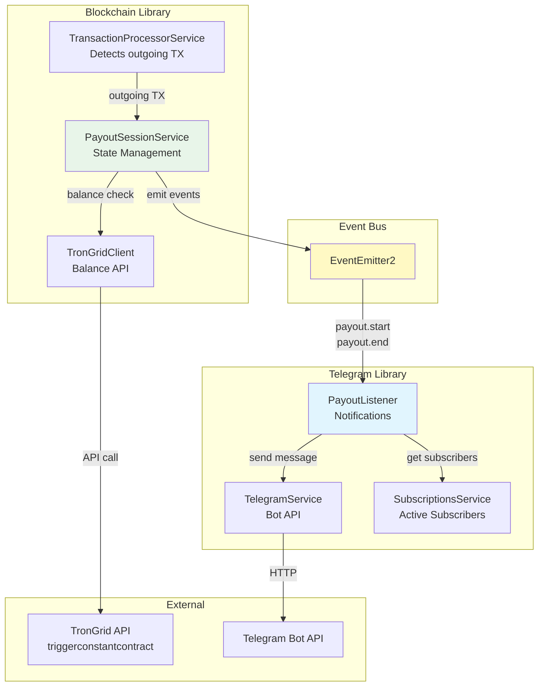
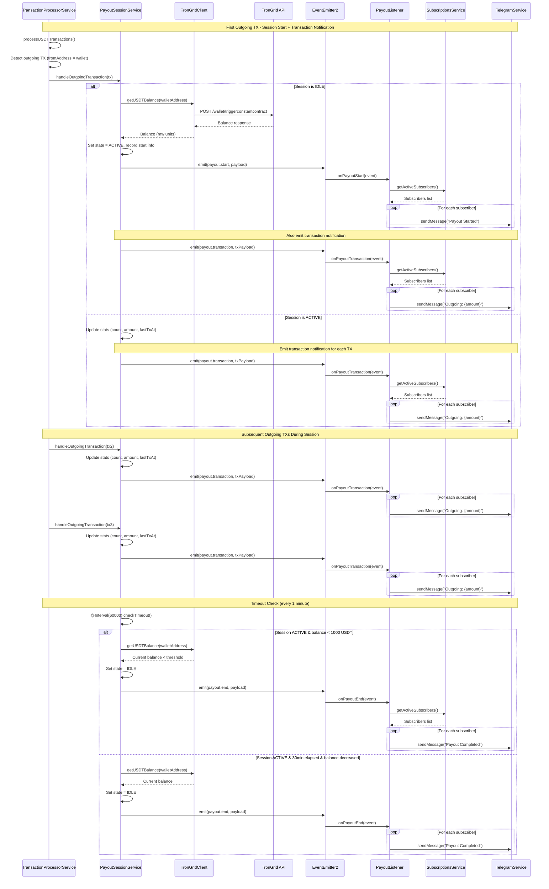
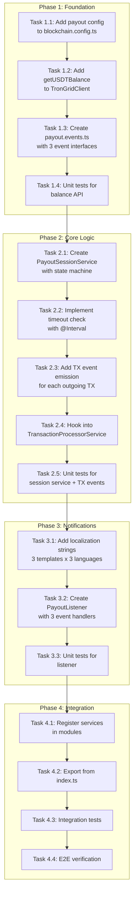

# Payout Session Notifications Design Document

## Overview

This document defines the technical design for payout session notifications in PayPing. The feature detects when salary payout sessions start (first outgoing transaction) and end (balance threshold or timeout), notifying all active subscribers of these events in real-time. Additionally, each outgoing transaction during an active session triggers an individual transaction notification.

## Design Summary (Meta)

```yaml
design_type: "new_feature"
risk_level: "low"
complexity_level: "medium"
complexity_rationale: >
  (1) Requirements/ACs: In-memory state machine with 2 states (IDLE/ACTIVE),
      balance threshold detection via TronGrid API, 30-minute timeout detection
      with scheduled task, integration with existing transaction processing,
      individual outgoing transaction notifications during active sessions.
  (2) Constraints/risks addressed: State loss on restart is acceptable (documented),
      TronGrid API quota impact (<17% additional), single-wallet deployment.
main_constraints:
  - "In-memory state management (no database persistence)"
  - "Single wallet deployment (no multi-wallet support)"
  - "TronGrid free tier API limits (~60% headroom available)"
biggest_risks:
  - "TronGrid API rate limits during sustained payout activity"
  - "Edge case: rapid sequential outgoing transactions"
  - "High notification volume during bulk payouts (50+ transactions)"
unknowns:
  - "Balance check API latency under production load"
  - "Optimal balance check interval during active session"
  - "Telegram rate limits during high-volume payout sessions"
```

## Background and Context

### Prerequisite ADRs

- **ADR-0004: Payout Session Detection and Balance Checking Mechanism** - Defines TronGrid `triggerconstantcontract` API for balance checking, in-memory state management, and timeout detection approach
- **ADR-0001: TRON Blockchain Monitoring Approach** - Establishes TronGrid polling architecture
- **ADR-0003: Payout Analytics Architecture** - Related payout tracking for outgoing transactions

### Agreement Checklist

#### Scope
- [x] New `PayoutSessionService` in `@app/blockchain` for session state management
- [x] New `getUSDTBalance()` method in `TronGridClient`
- [x] New `PayoutListener` in `@app/telegram` for notifications
- [x] New payout events: `payout.start`, `payout.end`, `payout.transaction`
- [x] New localization strings for payout notifications (en, ru, uk)
- [x] New configuration values for balance threshold and timeout
- [x] Integration with existing `TransactionProcessorService` for outgoing transaction detection
- [x] Individual outgoing transaction notifications during active payout sessions

#### Non-Scope (Explicitly not changing)
- [x] Existing `transaction.new` event for incoming transactions
- [x] Existing `TransactionListener` for incoming transaction notifications
- [x] Existing database schema (no persistence for payout sessions)
- [x] TRX transaction monitoring (USDT only for payout detection)
- [x] Multi-wallet support

#### Constraints
- [x] Parallel operation: No (single bot instance)
- [x] Backward compatibility: N/A (new feature)
- [x] Performance measurement: Required (balance check latency)
- [x] State persistence: Not required (in-memory acceptable)

### Problem to Solve

Users need to know when salary disbursement begins and ends, not just individual transactions. Currently:
1. Users receive notifications for incoming transactions only
2. No awareness of when outgoing payout sessions occur
3. No notification when payout activity has completed

### Current Challenges

1. Outgoing transactions are saved but not acted upon
2. No wallet balance checking capability
3. No session concept for grouping related payout activity
4. No timeout detection for inactive periods

### Requirements

#### Functional Requirements

| ID | Requirement | Priority |
|----|-------------|----------|
| FR-1 | Detect payout session start on first outgoing transaction | Must |
| FR-2 | Detect payout session end when balance < 1000 USDT | Must |
| FR-3 | Detect payout session end after 30-minute timeout (with decreased balance) | Must |
| FR-4 | Notify all active subscribers on session start | Must |
| FR-5 | Notify all active subscribers on session end with statistics | Must |
| FR-6 | Notify all active subscribers on each outgoing transaction during active session | Must |
| FR-7 | Localization support (en, ru, uk) | Must |
| FR-8 | Reset session state on service restart | Should |

#### Non-Functional Requirements

- **Performance**: Balance check response < 2 seconds; notification delivery < 5 seconds
- **Scalability**: Support current subscriber base (~100 users)
- **Reliability**: Graceful handling of API failures; notifications continue on restart
- **Maintainability**: Clean separation of session management from transaction processing

## Acceptance Criteria (AC) - EARS Format

### FR-1: Payout Session Start Detection

- [x] **AC-1.1**: **When** first outgoing USDT transaction is detected AND session is IDLE, the system shall transition to ACTIVE state
- [x] **AC-1.2**: **When** session transitions to ACTIVE, the system shall record start timestamp, starting balance, and first transaction hash
- [x] **AC-1.3**: **When** session is ACTIVE AND another outgoing transaction is detected, the system shall update session statistics without emitting start event
- [x] **AC-1.4**: The system shall emit `payout.start` event containing start timestamp, first transaction hash, and starting balance

### FR-2: Balance Threshold End Detection

- [x] **AC-2.1**: **When** session is ACTIVE, the system shall check balance periodically (every 1 minute via `@Interval(60000)` which serves dual purpose: timeout detection AND balance threshold checking)
- [x] **AC-2.2**: **When** balance check returns value < 1000 USDT (1,000,000,000 raw units), the system shall end session with reason `BALANCE_THRESHOLD`
- [x] **AC-2.3**: **If** balance check fails, **then** the system shall log error and retry on next check interval

### FR-3: Timeout End Detection

- [x] **AC-3.1**: **When** session is ACTIVE AND 30 minutes elapsed since last outgoing transaction AND balance decreased since session start, the system shall end session with reason `TIMEOUT`
- [x] **AC-3.2**: **When** session ends due to timeout, the system shall check balance to confirm decrease
- [x] **AC-3.3**: **If** balance has not decreased after timeout, **then** the system shall not end session (continue monitoring)

### FR-4: Session Start Notifications

- [x] **AC-4.1**: **When** `payout.start` event is emitted, the system shall send notification to all active subscribers
- [x] **AC-4.2**: The notification shall include localized "payout started" message
- [x] **AC-4.3**: **If** individual notification fails, **then** the system shall log error and continue with remaining subscribers

### FR-5: Session End Notifications

- [x] **AC-5.1**: **When** `payout.end` event is emitted, the system shall send notification to all active subscribers
- [x] **AC-5.2**: The notification shall include: end reason, transaction count, total amount, session duration
- [x] **AC-5.3**: The notification shall be localized based on subscriber's language preference

### FR-6: Individual Outgoing Transaction Notifications

- [x] **AC-6.1**: **When** session is ACTIVE AND outgoing transaction is detected (including the first one), the system shall emit `payout.transaction` event
- [x] **AC-6.2**: **When** `payout.transaction` event is emitted, the system shall send notification to all active subscribers
- [x] **AC-6.3**: The notification shall include: transaction amount, recipient address (truncated), transaction hash, session running total
- [x] **AC-6.4**: The notification shall be localized based on subscriber's language preference
- [x] **AC-6.5**: For the first transaction, both `payout.start` AND `payout.transaction` events shall be emitted (separate notifications)

### FR-7: Localization

- [x] **AC-7.1**: **When** subscriber has `language_code='ru'`, the system shall display messages in Russian
- [x] **AC-7.2**: **When** subscriber has `language_code='uk'`, the system shall display messages in Ukrainian
- [x] **AC-7.3**: **If** language_code is unrecognized, **then** the system shall fallback to English

### FR-8: Service Restart Behavior

- [x] **AC-8.1**: **When** service restarts, the system shall initialize session state to IDLE
- [x] **AC-8.2**: **When** service restarts during active session, the next outgoing transaction shall start a new session
- [x] **AC-8.3**: The system shall accept potential duplicate "payout started" notification as acceptable edge case

## Existing Codebase Analysis

### Implementation Path Mapping

| Type | Path | Description |
|------|------|-------------|
| Existing | `libs/blockchain/src/services/transaction-processor.service.ts` | Processes all transactions, emits events for incoming only |
| Existing | `libs/blockchain/src/clients/trongrid.client.ts` | TronGrid API client for transaction fetching |
| Existing | `libs/blockchain/src/events/transaction.events.ts` | Transaction event constants |
| Existing | `libs/telegram/src/listeners/transaction.listener.ts` | Handles transaction notifications |
| Existing | `libs/db/src/services/subscriptions.service.ts` | Gets active subscribers |
| Existing | `libs/telegram/src/locales/*.ftl` | Localization files |
| New | `libs/blockchain/src/services/payout-session.service.ts` | Payout session state management |
| New | `libs/blockchain/src/events/payout.events.ts` | Payout event constants and interfaces |
| New | `libs/telegram/src/listeners/payout.listener.ts` | Payout notification handler |

### Integration Points

| Integration Target | Invocation Method |
|-------------------|-------------------|
| `TransactionProcessorService` | Direct call to `PayoutSessionService.handleOutgoingTransaction()` |
| `TronGridClient` | New method `getUSDTBalance()` called by `PayoutSessionService` |
| `EventEmitter2` | Emit `payout.start`, `payout.transaction`, and `payout.end` events |
| `SubscriptionsService` | Query active subscribers for notifications |
| `TelegramService` | Send notifications via bot API |
| `@nestjs/schedule` | `@Interval(60000)` for timeout detection |

### Similar Functionality Search

- **Existing transaction processing**: `TransactionProcessorService.processUSDTTransactions()` - pattern for detecting outgoing vs incoming
- **Existing event emission**: `emitTransactionEvent()` pattern in `TransactionProcessorService`
- **Existing notification pattern**: `TransactionListener.onTransactionNew()` - pattern for subscriber notification
- **No existing session management** - new implementation required
- **No existing balance checking** - new implementation required

## Design

### Change Impact Map

```yaml
Change Target: "@app/blockchain and @app/telegram libraries"
Direct Impact:
  - libs/blockchain/src/services/transaction-processor.service.ts (add outgoing detection hook)
  - libs/blockchain/src/clients/trongrid.client.ts (add getUSDTBalance method)
  - libs/blockchain/src/blockchain.module.ts (register PayoutSessionService)
  - libs/blockchain/src/config/blockchain.config.ts (add payout config options)
  - libs/blockchain/src/index.ts (export new components)
  - libs/telegram/src/telegram.module.ts (register PayoutListener)
  - libs/telegram/src/locales/en.ftl (add payout strings)
  - libs/telegram/src/locales/ru.ftl (add payout strings)
  - libs/telegram/src/locales/uk.ftl (add payout strings)
Indirect Impact:
  - Transaction processing flow (slight latency increase from session check)
No Ripple Effect:
  - libs/db/* (no schema changes)
  - libs/telegram/src/handlers/* (unchanged)
  - libs/telegram/src/listeners/transaction.listener.ts (unchanged)
  - Incoming transaction notifications (unchanged)
```

### Architecture Overview



### Data Flow - Payout Session Lifecycle



### Integration Point Map

```yaml
Integration Point 1: Outgoing Transaction Detection
  Existing Component: TransactionProcessorService.processUSDTTransactions()
  Integration Method: Add call to PayoutSessionService.handleOutgoingTransaction()
  Impact Level: Low (Process Flow Addition)
  Required Test Coverage: Verify session starts on first outgoing TX

Integration Point 2: TronGrid Balance API
  Existing Component: TronGridClient (new method)
  Integration Method: Add getUSDTBalance() method using triggerconstantcontract
  Impact Level: Low (New Method)
  Required Test Coverage: Verify balance API response parsing

Integration Point 3: Payout Events
  Existing Component: EventEmitter2
  Integration Method: Add new event constants (payout.start, payout.transaction, payout.end) and emit calls
  Impact Level: Low (New Events)
  Required Test Coverage: Verify events emitted with correct payloads

Integration Point 3.1: Outgoing Transaction Events
  Existing Component: PayoutSessionService
  Integration Method: Emit payout.transaction event for each outgoing TX during active session
  Impact Level: Low (New Event)
  Required Test Coverage: Verify transaction event emitted with amount, recipient, hash, running total

Integration Point 4: Payout Listener
  Existing Component: TelegramModule providers
  Integration Method: Add PayoutListener to providers array
  Impact Level: Low (Provider Addition)
  Required Test Coverage: Verify notifications sent on events
```

### Main Components

#### PayoutSessionService

- **Responsibility**: In-memory payout session state management, outgoing transaction handling, timeout detection, balance checking coordination
- **Interface**:
  ```typescript
  interface PayoutSessionService {
    // Called by TransactionProcessorService for outgoing transactions
    handleOutgoingTransaction(tx: Transaction): Promise<void>;

    // Called by @Interval decorator every minute
    checkTimeout(): Promise<void>;

    // Get current session state (for testing/monitoring)
    getState(): PayoutSessionState;

    // Check if session is active
    isActive(): boolean;
  }
  ```
- **Dependencies**: `TronGridClient`, `EventEmitter2`, `ConfigService`

#### TronGridClient.getUSDTBalance()

- **Responsibility**: Query USDT balance via TronGrid smart contract API
- **Interface**:
  ```typescript
  // New method addition to existing TronGridClient
  interface TronGridClient {
    // ... existing methods

    // Get USDT balance for address (returns raw units as string)
    getUSDTBalance(address: string): Promise<string>;
  }
  ```
- **Dependencies**: `axios`, `ConfigService` (for API key and USDT contract address)

#### PayoutListener

- **Responsibility**: Handle payout events and send notifications to subscribers
- **Interface**:
  ```typescript
  interface PayoutListener {
    // Handle payout session start
    onPayoutStart(event: PayoutStartEvent): Promise<void>;

    // Handle individual outgoing transaction during session
    onPayoutTransaction(event: PayoutTransactionEvent): Promise<void>;

    // Handle payout session end
    onPayoutEnd(event: PayoutEndEvent): Promise<void>;
  }
  ```
- **Dependencies**: `SubscriptionsService`, `TelegramService`

### Contract Definitions

```typescript
// libs/blockchain/src/events/payout.events.ts

export const PAYOUT_START_EVENT = 'payout.start';
export const PAYOUT_TRANSACTION_EVENT = 'payout.transaction';
export const PAYOUT_END_EVENT = 'payout.end';

export type PayoutEndReason = 'BALANCE_THRESHOLD' | 'TIMEOUT';

export interface PayoutStartEvent {
  /** Session start timestamp (Unix ms) */
  startedAt: number;
  /** First outgoing transaction hash */
  firstTransactionHash: string;
  /** USDT balance at session start (raw units, 6 decimals) */
  startBalance: string;
}

export interface PayoutTransactionEvent {
  /** Transaction hash */
  transactionHash: string;
  /** Transaction amount (raw units, 6 decimals) */
  amount: string;
  /** Recipient wallet address */
  recipientAddress: string;
  /** Transaction timestamp (Unix ms) */
  timestamp: number;
  /** Session running total after this TX (raw units) */
  sessionTotalAmount: string;
  /** Transaction number in current session (1-based) */
  transactionNumber: number;
}

export interface PayoutEndEvent {
  /** Session start timestamp (Unix ms) */
  startedAt: number;
  /** Session end timestamp (Unix ms) */
  endedAt: number;
  /** Reason for session end */
  endReason: PayoutEndReason;
  /** Number of outgoing transactions in session */
  transactionCount: number;
  /** Total amount paid out (raw units) */
  totalAmount: string;
  /** USDT balance at session end (raw units) */
  endingBalance: string;
  /** Session duration in minutes */
  durationMinutes: number;
}

export const PayoutEvents = {
  START: PAYOUT_START_EVENT,
  TRANSACTION: PAYOUT_TRANSACTION_EVENT,
  END: PAYOUT_END_EVENT,
} as const;

// libs/blockchain/src/services/payout-session.service.ts

export interface PayoutSessionState {
  isActive: boolean;
  startedAt: Date | null;
  startBalance: string | null;
  lastTransactionAt: Date | null;
  transactionCount: number;
  totalAmount: string;
  firstTransactionHash: string | null;
}

// libs/blockchain/src/config/blockchain.config.ts additions

export interface PayoutConfig {
  /** Balance threshold in USDT (default: 1000) */
  balanceThresholdUsdt: number;
  /** Timeout in minutes (default: 30) */
  timeoutMinutes: number;
  /** Check interval in milliseconds (default: 60000) */
  checkIntervalMs: number;
}
```

### Data Contract

#### PayoutSessionService.handleOutgoingTransaction()

```yaml
Input:
  Type: Transaction
  Preconditions:
    - Transaction is outgoing (fromAddress = monitored wallet)
    - Transaction has valid toAddress and amount
  Validation: Direction check performed by caller

Output:
  Type: void (async)
  Guarantees:
    - If session IDLE: transitions to ACTIVE, emits payout.start AND payout.transaction
    - If session ACTIVE: updates statistics (count, amount, lastTxAt), emits payout.transaction
  On Error: Log and continue (don't block transaction processing)

Invariants:
  - Session state is always valid (IDLE or ACTIVE)
  - Statistics are cumulative within session
```

#### TronGridClient.getUSDTBalance()

```yaml
Input:
  Type: { address: string }
  Preconditions:
    - address is valid TRON wallet (34 chars, starts with T)
  Validation: Address format check

Output:
  Type: string (raw balance, 6 decimals)
  Guarantees:
    - Returns on-chain USDT balance
    - Precision preserved as string
  On Error: Throw TronGridApiError with context

Invariants:
  - Balance is non-negative
  - Result is authoritative (on-chain)
```

### State Transitions and Invariants

```yaml
State Definition:
  - Session State: [IDLE, ACTIVE]

State Transitions:
  IDLE -> ACTIVE:
    Trigger: First outgoing USDT transaction detected
    Actions: Record start info, check balance, emit payout.start, emit payout.transaction

  ACTIVE -> IDLE (BALANCE_THRESHOLD):
    Trigger: Balance check returns < 1000 USDT
    Actions: Emit payout.end with reason BALANCE_THRESHOLD, reset state

  ACTIVE -> IDLE (TIMEOUT):
    Trigger: 30 minutes since last TX AND balance decreased
    Actions: Emit payout.end with reason TIMEOUT, reset state

  ACTIVE -> ACTIVE:
    Trigger: Additional outgoing transaction
    Actions: Update transactionCount, totalAmount, lastTransactionAt, emit payout.transaction

System Invariants:
  - Only one session can be active at a time
  - State resets to IDLE on service restart
  - Balance threshold is constant (configurable via env)
  - Timeout duration is constant (configurable via env)
```

### Error Handling

| Error Type | Detection | Response | Recovery |
|------------|-----------|----------|----------|
| Balance API failure | TronGridApiError | Log error, skip check | Retry on next interval |
| Balance API timeout | Axios timeout | Log warning, skip check | Retry on next interval |
| Invalid balance response | Missing constant_result | Log error, skip check | Retry on next interval |
| Notification failure | Telegram API error | Log error, continue | Continue with next subscriber |
| Session state corruption | State validation | Reset to IDLE | Log and reset state |

### Implementation Guidance

#### Mutex Strategy for Race Condition Prevention

To prevent race conditions during rapid sequential outgoing transactions (I002), use the `async-mutex` library for state transition locking:

```typescript
import { Mutex } from 'async-mutex';

@Injectable()
export class PayoutSessionService {
  private readonly mutex = new Mutex();
  private state: PayoutSessionState = { /* initial state */ };

  async handleOutgoingTransaction(tx: Transaction): Promise<void> {
    // Wrap state-modifying operations with mutex
    await this.mutex.runExclusive(async () => {
      if (!this.state.isActive) {
        await this.startSession(tx);
        // Emit both payout.start AND payout.transaction for first TX
        this.emitTransactionEvent(tx);
      } else {
        this.updateSession(tx);
        // Emit payout.transaction for each subsequent TX
        this.emitTransactionEvent(tx);
      }
    });
  }

  private emitTransactionEvent(tx: Transaction): void {
    const event: PayoutTransactionEvent = {
      transactionHash: tx.hash,
      amount: tx.amount,
      recipientAddress: tx.toAddress,
      timestamp: Date.now(),
      sessionTotalAmount: this.state.totalAmount,
      transactionNumber: this.state.transactionCount,
    };
    this.eventEmitter.emit(PAYOUT_TRANSACTION_EVENT, event);
  }

  @Interval(60000)
  async checkTimeout(): Promise<void> {
    // Also protect timeout check to prevent concurrent state modifications
    await this.mutex.runExclusive(async () => {
      if (!this.state.isActive || !this.state.lastTransactionAt) return;

      const elapsed = Date.now() - this.state.lastTransactionAt.getTime();
      const currentBalance = await this.tronGridClient.getUSDTBalance(this.walletAddress);

      // Balance threshold check (dual purpose of interval)
      if (BigInt(currentBalance) < BigInt(this.balanceThresholdRaw)) {
        await this.endSession('BALANCE_THRESHOLD');
        return;
      }

      // Timeout check with balance decrease verification
      if (elapsed >= this.timeoutMs) {
        if (BigInt(currentBalance) < BigInt(this.state.startBalance!)) {
          await this.endSession('TIMEOUT');
        }
      }
    });
  }
}
```

**Key Points**:
- The mutex ensures only one state transition occurs at a time
- Both `handleOutgoingTransaction()` and `checkTimeout()` are protected
- Balance API calls happen inside the mutex to ensure consistent state reads
- The `async-mutex` package supports async operations within the critical section

#### Interval Dual Purpose (I003)

The 1-minute `@Interval(60000)` serves two purposes:
1. **Timeout detection**: Check if 30 minutes elapsed since last transaction
2. **Balance threshold checking**: Query current balance and end session if below 1000 USDT

This design avoids separate timers and ensures balance is checked regularly during active sessions.

### Logging and Monitoring

#### Structured Logging

```typescript
// Session start
{
  level: 'info',
  context: 'PayoutSessionService.handleOutgoingTransaction',
  message: 'Payout session started',
  data: {
    firstTxHash: 'abc123...',
    startBalance: '5000000000',
    startBalanceUsdt: '5000.00',
    timestamp: '2026-01-23T10:30:00.000Z'
  }
}

// Outgoing transaction during session
{
  level: 'info',
  context: 'PayoutSessionService.emitTransactionEvent',
  message: 'Outgoing transaction processed',
  data: {
    txHash: 'def456...',
    amountUsdt: '100.00',
    recipient: 'TXyz...',
    transactionNumber: 5,
    sessionTotalUsdt: '500.00',
    timestamp: '2026-01-23T10:35:00.000Z'
  }
}

// Session end
{
  level: 'info',
  context: 'PayoutSessionService.endSession',
  message: 'Payout session ended',
  data: {
    endReason: 'BALANCE_THRESHOLD',
    transactionCount: 45,
    totalAmountUsdt: '4500.00',
    durationMinutes: 23,
    endingBalanceUsdt: '500.00',
    timestamp: '2026-01-23T10:53:00.000Z'
  }
}

// Balance check
{
  level: 'debug',
  context: 'PayoutSessionService.checkTimeout',
  message: 'Timeout check performed',
  data: {
    isActive: true,
    minutesSinceLastTx: 15,
    currentBalanceUsdt: '2500.00',
    thresholdUsdt: '1000.00'
  }
}
```

### Localization Strings

The following localization keys are required for all three notification types (en, ru, uk):

```fluent
# libs/telegram/src/locales/en.ftl

# Payout session started notification
payout-started = 🚀 <b>Payout Session Started</b>

    The wallet has started disbursing funds.
    You will receive updates for each transfer.

    { $time }

# Individual outgoing transaction notification
payout-transaction = 💸 <b>Transfer #{$txNumber}</b>

    <b>{ $amount } USDT</b> → { $recipient }

    Session total: { $sessionTotal } USDT

    🔗 <a href="https://tronscan.org/#/transaction/{ $txHash }">View on Tronscan</a>

# Payout session completed notification
payout-completed = ✅ <b>Payout Session Completed</b>

    📊 <b>Summary</b>
    • Transfers: { $txCount }
    • Total paid: { $totalAmount } USDT
    • Duration: { $duration } min
    • Remaining balance: { $endBalance } USDT

    { $time }

# libs/telegram/src/locales/ru.ftl

payout-started = 🚀 <b>Выплата началась</b>

    Кошелёк начал выплату средств.
    Вы будете получать уведомления о каждом переводе.

    { $time }

payout-transaction = 💸 <b>Перевод #{$txNumber}</b>

    <b>{ $amount } USDT</b> → { $recipient }

    Итого за сессию: { $sessionTotal } USDT

    🔗 <a href="https://tronscan.org/#/transaction/{ $txHash }">Смотреть в Tronscan</a>

payout-completed = ✅ <b>Выплата завершена</b>

    📊 <b>Итоги</b>
    • Переводов: { $txCount }
    • Всего выплачено: { $totalAmount } USDT
    • Длительность: { $duration } мин
    • Остаток на балансе: { $endBalance } USDT

    { $time }

# libs/telegram/src/locales/uk.ftl

payout-started = 🚀 <b>Виплата розпочалась</b>

    Гаманець почав виплату коштів.
    Ви отримуватимете сповіщення про кожен переказ.

    { $time }

payout-transaction = 💸 <b>Переказ #{$txNumber}</b>

    <b>{ $amount } USDT</b> → { $recipient }

    Разом за сесію: { $sessionTotal } USDT

    🔗 <a href="https://tronscan.org/#/transaction/{ $txHash }">Дивитись у Tronscan</a>

payout-completed = ✅ <b>Виплата завершена</b>

    📊 <b>Підсумки</b>
    • Переказів: { $txCount }
    • Всього виплачено: { $totalAmount } USDT
    • Тривалість: { $duration } хв
    • Залишок на балансі: { $endBalance } USDT

    { $time }
```

**Localization Variables:**

| Message | Variables | Description |
|---------|-----------|-------------|
| `payout-started` | `time` | Formatted timestamp |
| `payout-transaction` | `txNumber`, `amount`, `recipient`, `sessionTotal`, `txHash` | TX details |
| `payout-completed` | `txCount`, `totalAmount`, `duration`, `endBalance`, `time` | Session summary |

## Implementation Plan

### Implementation Approach

**Selected Approach**: Vertical Slice with Foundation First

**Selection Reason**: The feature has clear boundaries with minimal external dependencies. The TronGrid balance API is the foundational capability needed before session management can be implemented. Following the vertical slice approach allows end-to-end verification at each phase.

### Technical Dependencies and Implementation Order

#### Required Implementation Order

1. **Configuration Extension (Foundation)** - Phase 1
   - Technical Reason: PayoutSessionService needs configuration values
   - Files: `blockchain.config.ts` additions

2. **TronGridClient.getUSDTBalance() (Infrastructure)** - Phase 1
   - Technical Reason: PayoutSessionService depends on balance checking
   - Prerequisites: Configuration
   - Files: `trongrid.client.ts` additions

3. **Payout Events (Contracts)** - Phase 1
   - Technical Reason: Both PayoutSessionService and PayoutListener need event definitions
   - Files: `payout.events.ts`
   - Events: `payout.start`, `payout.transaction`, `payout.end`

4. **PayoutSessionService (Core Logic)** - Phase 2
   - Technical Reason: Core session management with state machine
   - Prerequisites: TronGridClient, Events, Config
   - Files: `payout-session.service.ts`
   - Emits: `payout.start` on first TX, `payout.transaction` on each TX, `payout.end` on session end

5. **TransactionProcessor Integration (Wiring)** - Phase 2
   - Technical Reason: Hook outgoing transaction detection
   - Prerequisites: PayoutSessionService
   - Files: `transaction-processor.service.ts` modification

6. **Localization Strings (Presentation)** - Phase 3
   - Technical Reason: PayoutListener needs i18n keys
   - Files: `en.ftl`, `ru.ftl`, `uk.ftl`

7. **PayoutListener (Notifications)** - Phase 3
   - Technical Reason: User-facing notification delivery
   - Prerequisites: Events, Localization
   - Files: `payout.listener.ts`

8. **Module Registration (Wiring)** - Phase 4
   - Technical Reason: Wire all components together
   - Files: `blockchain.module.ts`, `telegram.module.ts`, index exports

### Phase Structure



### Integration Points

**Integration Point 1: Balance API**
- Components: `TronGridClient` -> TronGrid API
- Verification: Unit test with mocked API response, integration test with real API

**Integration Point 2: Session State Management**
- Components: `TransactionProcessorService` -> `PayoutSessionService`
- Verification: Unit test verifying outgoing TX triggers session start

**Integration Point 3: Event Emission**
- Components: `PayoutSessionService` -> `EventEmitter2` -> `PayoutListener`
- Verification: Integration test verifying event flow

**Integration Point 4: Notification Delivery**
- Components: `PayoutListener` -> `SubscriptionsService` -> `TelegramService`
- Verification: E2E test with test bot

### E2E Verification Procedures

| Phase | Verification | Command/Method |
|-------|--------------|----------------|
| 1 | Balance API returns valid response | `trongrid.client.spec.ts` + integration test |
| 2 | Session starts on outgoing TX | `payout-session.service.spec.ts` |
| 2 | TX event emitted for each outgoing TX | Unit test verifying `payout.transaction` emission |
| 2 | Session ends on balance threshold | Unit test with mocked balance |
| 2 | Session ends on timeout | Unit test with time mocking |
| 3 | Localization keys load | Verify all 9 keys exist in FTL files (3 messages x 3 langs) |
| 3 | Start notifications sent correctly | Unit test with mocked bot |
| 3 | TX notifications sent correctly | Unit test verifying each TX triggers notification |
| 3 | End notifications sent correctly | Unit test with mocked bot |
| 4 | Full flow works | E2E test: TX -> Events (start+tx) -> Notifications |
| 4 | Multi-TX session works | E2E test: 3 TXs -> 4 notifications (1 start + 3 tx) |

### Migration Strategy

Not applicable - new feature with no database changes.

### Integration Boundary Contracts

```yaml
Boundary: TransactionProcessorService -> PayoutSessionService
  Input: Transaction object (outgoing TX)
  Output: void (async, fire-and-forget)
  On Error: Log error, don't block transaction processing

Boundary: PayoutSessionService -> TronGridClient
  Input: Wallet address string
  Output: Balance string (raw units, async)
  On Error: Throw TronGridApiError

Boundary: PayoutSessionService -> EventEmitter2
  Input: PayoutStartEvent, PayoutTransactionEvent, or PayoutEndEvent
  Output: void (sync emit)
  On Error: EventEmitter handles listener errors

Boundary: PayoutListener -> TelegramService
  Input: User ID and message
  Output: void (async)
  On Error: Log and continue with next subscriber
```

## Test Strategy

### Basic Test Design Policy

Tests derived directly from Acceptance Criteria:
- Each AC generates at least one test case
- State machine transitions tested exhaustively
- Balance threshold boundary conditions tested
- Timeout logic tested with time mocking

### Unit Tests

**Coverage Target**: 80%

| Component | Test Focus | Key Test Cases |
|-----------|------------|----------------|
| TronGridClient | Balance API | AC-2.1: Parse valid response, handle errors |
| PayoutSessionService | State machine | AC-1.1: IDLE -> ACTIVE on first TX |
| PayoutSessionService | Statistics | AC-1.3: Update count/amount on subsequent TX |
| PayoutSessionService | Balance threshold | AC-2.2: End when balance < 1000 USDT |
| PayoutSessionService | Timeout | AC-3.1: End after 30 min with balance decrease |
| PayoutSessionService | Timeout guard | AC-3.3: Don't end if balance not decreased |
| PayoutSessionService | TX event emission | AC-6.1: Emit payout.transaction for each outgoing TX |
| PayoutSessionService | First TX dual emit | AC-6.5: Emit both payout.start AND payout.transaction |
| PayoutListener | Start notifications | AC-4.1: Notify all subscribers on session start |
| PayoutListener | TX notifications | AC-6.2: Notify all subscribers on each TX |
| PayoutListener | End notifications | AC-5.1: Notify all subscribers on session end |
| PayoutListener | Localization | AC-7.1, AC-7.2, AC-7.3: Correct language |

### Integration Tests

| Test Scenario | Components | Verification |
|---------------|------------|--------------|
| Balance API real call | TronGridClient + TronGrid | Valid balance returned for known address |
| Session start flow | TransactionProcessor + PayoutSession | Both payout.start and payout.transaction emitted on first outgoing TX |
| Session end flow | PayoutSession + EventEmitter | payout.end emitted with correct payload |
| TX notification flow | PayoutSession + EventEmitter | payout.transaction emitted for each outgoing TX with running total |
| Notification flow | PayoutListener + SubscriptionsService | All active subscribers notified for each event type |
| Multi-TX session | TransactionProcessor + PayoutSession | 3 TXs emit 1 start + 3 transaction + 1 end events |

### E2E Tests

| Test Scenario | Setup | Expected Outcome |
|---------------|-------|------------------|
| Session start | Inject first outgoing TX | payout.start + payout.transaction events emitted, 2 notifications sent |
| Multi-TX session | Inject 3 outgoing TXs | 1 start + 3 transaction events, 4 notifications sent per subscriber |
| Session end (balance) | Mock balance < threshold | payout.end with BALANCE_THRESHOLD, final summary notification |
| Session end (timeout) | Wait 30 min (mocked) | payout.end with TIMEOUT, final summary notification |
| Russian locale | Subscriber with ru language | Russian notification text for all 3 message types |
| High volume session | Inject 50 TXs rapidly | All 50 transaction events emitted, Telegram rate limits respected |

### Performance Tests

| Metric | Target | Test Method |
|--------|--------|-------------|
| Balance API latency | < 2 seconds | Benchmark real API call |
| Session start overhead | < 50ms | Measure handleOutgoingTransaction() |
| Notification delivery | < 5 seconds for 100 users | Benchmark with rate limiting |
| TX event emission | < 10ms per event | Measure emitTransactionEvent() |
| High-volume session | Handle 50+ TXs/session | Stress test with rapid TX injection |
| Notification queue | < 30 notifications/second | Telegram API rate limit compliance |

## Security Considerations

| Concern | Mitigation |
|---------|------------|
| API key exposure | Stored in environment variable |
| Balance data sensitivity | Not displayed to users, only logged |
| Event injection | EventEmitter2 is internal only |
| Rate limit abuse | TronGrid API key with higher limits |

## Future Extensibility

| Future Feature | Design Consideration |
|----------------|---------------------|
| Multiple wallets | Add walletAddress to session state, separate sessions per wallet |
| Persistent sessions | Add database table for session state, load on restart |
| Custom thresholds per user | Add user preferences table |
| Session history | Store completed sessions for analytics |
| Push notification channel | Add notification channel abstraction |

## Alternative Solutions

### Alternative 1: Database-Persisted Sessions

- **Overview**: Store session state in PostgreSQL instead of memory
- **Advantages**: Survives restarts, full audit trail, multi-instance support
- **Disadvantages**: Additional schema, more complex state management, overkill for single instance
- **Reason for Rejection**: ADR-0004 explicitly chose in-memory for simplicity; state loss is acceptable

### Alternative 2: Event-Sourced Sessions

- **Overview**: Store all session events, reconstruct state from event log
- **Advantages**: Complete audit trail, replayable, scalable
- **Disadvantages**: Complex implementation, unnecessary for current scale
- **Reason for Rejection**: Over-engineered for current requirements

### Alternative 3: Webhook-Based Balance Monitoring

- **Overview**: Use TronGrid webhooks to get balance change notifications
- **Advantages**: No polling, real-time updates
- **Disadvantages**: Requires webhook endpoint (HTTP server), more complex setup
- **Reason for Rejection**: Project uses long polling, not webhooks; HTTP server is minimal

## Risks and Mitigation

| Risk | Impact | Probability | Mitigation |
|------|--------|-------------|------------|
| TronGrid rate limit exceeded | Medium | Low | API key provides higher limits; ~17% additional usage |
| Balance API latency > 2s | Low | Low | Implement timeout and retry logic |
| State loss on restart | Low | Medium | Documented as acceptable; new session starts on next TX |
| Rapid TX sequence race condition | Low | Low | Use `async-mutex` library for state transition locking (see Implementation Guidance) |
| Notification delivery failure | Low | Low | Log errors, continue with remaining subscribers |
| Memory leak from unclosed sessions | Low | Low | Timeout mechanism ensures sessions end |
| Telegram rate limit during bulk payout | Medium | Medium | Implement notification queue with rate limiting (30 msg/sec) |
| User notification fatigue | Low | Medium | Consider batching option for future (not in v1.2 scope) |
| High message volume cost | Low | Low | Monitor message counts, alert on unusual spikes |

## References

- [ADR-0004: Payout Session Detection](../adr/004-payout-session-detection.md) - Architecture decision for this feature
- [ADR-0001: TRON Blockchain Monitoring](../adr/001-tron-monitoring-approach.md) - TronGrid polling architecture
- [TRC-20 Contract Interaction](https://developers.tron.network/docs/trc20-contract-interaction) - TronGrid API documentation
- [Get TRC20 Balance Examples](https://gist.github.com/andelf/bdd18734d40774a721d0c4cbcec67037) - Community implementation examples
- [NestJS Schedule Module](https://docs.nestjs.com/techniques/task-scheduling) - @Interval decorator documentation
- [async-mutex npm package](https://www.npmjs.com/package/async-mutex) - Mutex implementation for async operations (race condition prevention)

## Update History

| Date | Version | Changes | Author |
|------|---------|---------|--------|
| 2026-01-23 | 1.0 | Initial version | Claude |
| 2026-01-23 | 1.1 | Review fixes: (I001) Confirmed startBalance field name consistent with ADR-0004; (I002) Added mutex strategy detail in Implementation Guidance section; (I003) Clarified 1-minute interval dual purpose in AC-2.1 and Implementation Guidance | Claude |
| 2026-01-23 | 1.2 | Added individual outgoing transaction notifications (FR-6): new `payout.transaction` event emitted for each outgoing TX during active session; updated sequence diagram to show 3-message notification flow (start + each TX + end); added `PayoutTransactionEvent` interface; updated acceptance criteria, tests, and risk assessment for high-volume notification scenarios | Claude |
