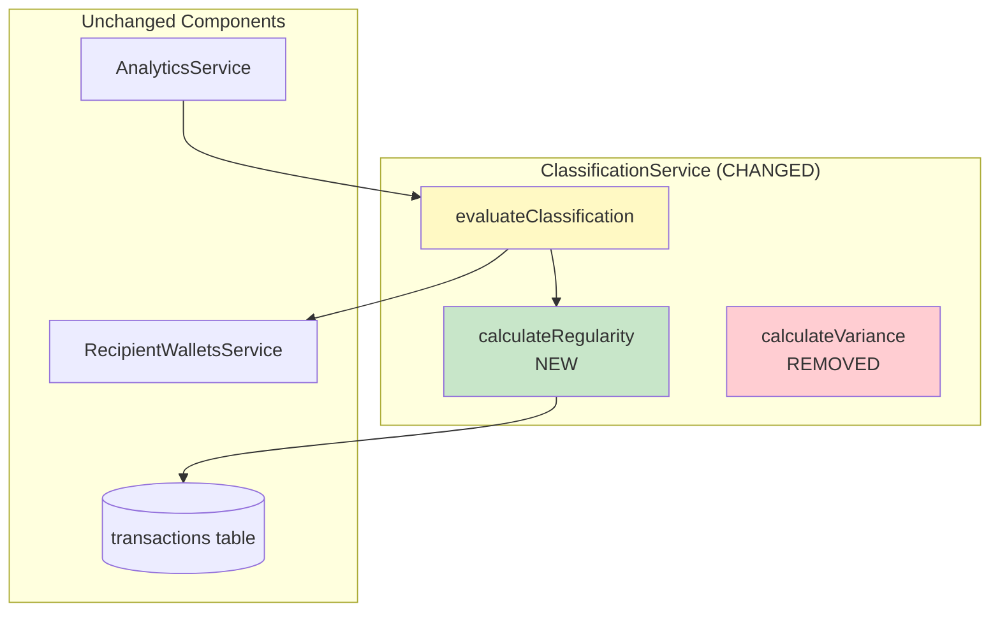
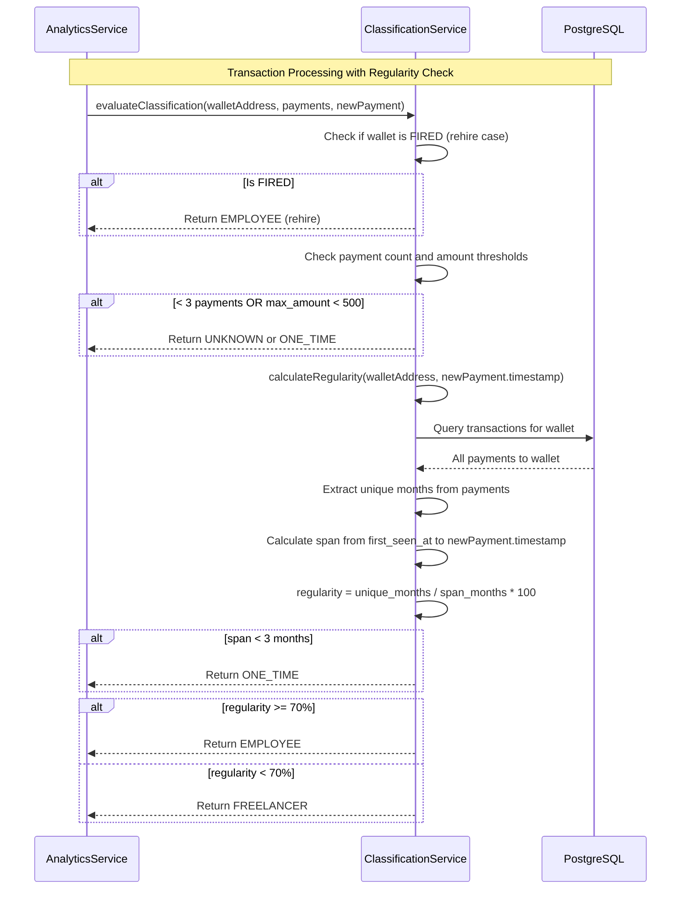
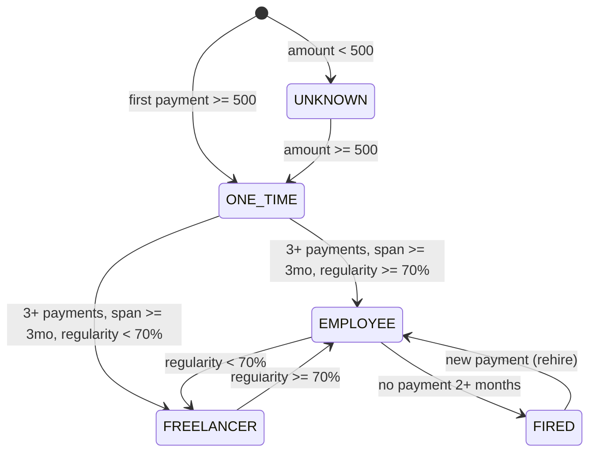
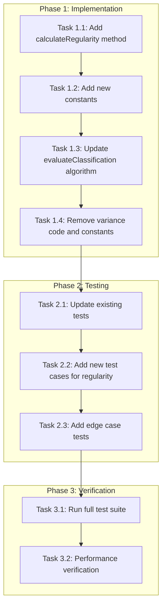

# Regularity-Based Wallet Classification Refactor Design Document

## Overview

This document defines the technical design for refactoring the wallet classification logic in PayPing from variance-based (spread of payment amounts) to regularity-based (frequency and consistency of payments over months). The current implementation incorrectly classifies wallets based on payment amount variance, while the business requirement is to classify based on payment regularity across months.

## Design Summary (Meta)

```yaml
design_type: "refactoring"
risk_level: "medium"
complexity_level: "medium"
complexity_rationale: >
  (1) Requirements/ACs: The core classification algorithm must change from variance-based
      to regularity-based while maintaining all existing state transitions (UNKNOWN -> ONE_TIME
      -> EMPLOYEE/FREELANCER, FIRED detection, rehire handling). The regularity calculation
      requires tracking unique months with payments across a time span.
  (2) Constraints/risks: Must maintain backward compatibility with existing data in
      recipient_wallets and monthly_positions tables. Real-time processing performance
      requirement (<200ms per transaction) must be preserved. Classification transitions
      must remain deterministic.
main_constraints:
  - "Preserve existing database schema (no migrations required)"
  - "Maintain real-time processing performance (<200ms per transaction)"
  - "Backward compatibility with existing classified wallets"
  - "Deterministic classification algorithm"
biggest_risks:
  - "Existing wallets may be reclassified incorrectly during transition"
  - "Regularity calculation may require additional database queries"
  - "Edge cases with partial months and span calculation"
unknowns:
  - "Behavior during first 3 months before span requirement is met"
notes:
  - "70% regularity threshold was validated against historical payment data patterns"
```

## Background and Context

### Prerequisite ADRs

- **ADR-0003: Payout Analytics Architecture** (v2.0): Defines real-time processing on transaction insert with automatic classification - this refactoring changes the classification algorithm while keeping the architecture intact
- **ADR-0002: Drizzle ORM Selection**: Database access patterns remain unchanged

### Supersedes

> **Note**: This design supersedes the variance-based classification criteria defined in ADR-0003 Section "Classification Algorithm". ADR-0003 should be updated separately to reflect the regularity-based approach defined in this document. Specifically:
> - ADR-0003 variance threshold (20%) is replaced by regularity threshold (70%)
> - The `calculateVariance()` method is replaced by `calculateRegularity()`
> - Classification logic now uses unique months over span instead of payment amount variance

### Agreement Checklist

#### Scope

- [x] Refactor `ClassificationService.evaluateClassification()` to use regularity-based logic
- [x] Add `calculateRegularity()` method to ClassificationService
- [x] Update all related unit tests to reflect new classification criteria
- [x] Remove variance-based logic and related constants

#### Non-Scope (Explicitly not changing)

- [x] Database schema (`recipient_wallets`, `monthly_positions`, `salary_history` tables)
- [x] `AnalyticsService` processing flow and transaction hook
- [x] `RecipientWalletsService` CRUD operations
- [x] Salary change detection logic (>5% threshold)
- [x] FIRED detection batch job logic (2+ months without payment)
- [x] Telegram handler and display logic
- [x] Localization strings

#### Constraints

- [x] Parallel operation: No (single bot instance)
- [x] Backward compatibility: Required (existing classifications preserved until re-evaluated)
- [x] Performance measurement: Required (<200ms processing per transaction)

### Problem to Solve

The current classification algorithm uses **payment amount variance** (coefficient of variation) to distinguish EMPLOYEE from FREELANCER:
- EMPLOYEE: variance <= 20%
- FREELANCER: variance > 20%

This is incorrect because:
1. **Business Reality**: An employee may receive varying amounts (base salary + bonuses, expense reimbursements) but still be a regular employee
2. **Actual Criterion**: The distinguishing factor is **regularity of payments** (monthly consistency), not amount stability
3. **Example**: An employee paid every month with varying bonuses (1000, 1500, 2000, 1200 USDT) should be EMPLOYEE, not FREELANCER

### Current Challenges

1. **Misclassification**: Employees with variable compensation are classified as FREELANCER
2. **Irrelevant Metric**: Variance calculation does not capture business intent
3. **Missing Span Check**: Current logic only requires 2 unique months, not 3+ months span

### Requirements

#### Functional Requirements

| ID | Requirement | Priority |
|----|-------------|----------|
| FR-1 | UNKNOWN: First payment < 500 USDT | Must |
| FR-2 | ONE_TIME: 1-2 payments OR span < 2 months | Must |
| FR-3 | EMPLOYEE: 3+ payments AND span >= 3 months AND max_amount >= 500 USDT AND regularity >= 70% | Must |
| FR-4 | FREELANCER: 3+ payments AND span >= 3 months AND max_amount >= 500 USDT AND regularity < 70% | Must |
| FR-5 | FIRED: Was EMPLOYEE AND 2+ months without payment | Must |
| FR-6 | Transitions between EMPLOYEE <-> FREELANCER based on regularity change | Must |
| FR-7 | FIRED -> EMPLOYEE on new payment (rehire) | Must |

#### Non-Functional Requirements

- **Performance**: Classification evaluation completes within 50ms
- **Reliability**: Deterministic results for same input
- **Maintainability**: Clear separation between regularity calculation and classification logic

## Acceptance Criteria (AC) - EARS Format

### FR-1: UNKNOWN Classification

- [x] **AC-1.1**: **When** a new wallet receives first payment < 500 USDT, the system shall classify as UNKNOWN

### FR-2: ONE_TIME Classification

- [x] **AC-2.1**: **When** wallet has 1-2 payments regardless of span, the system shall classify as ONE_TIME (if amount >= 500 USDT)
- [x] **AC-2.2**: **When** wallet has payments spanning < 3 months, the system shall classify as ONE_TIME (if amount >= 500 USDT)
- [x] **AC-2.3**: **When** UNKNOWN wallet receives payment >= 500 USDT, the system shall upgrade to ONE_TIME

### FR-3: EMPLOYEE Classification

- [x] **AC-3.1**: **When** wallet has 3+ payments AND span >= 3 months AND max_amount >= 500 USDT AND regularity >= 70%, the system shall classify as EMPLOYEE
- [x] **AC-3.2**: Regularity shall be calculated as: `unique_months / total_span_months * 100`
- [x] **AC-3.3**: `total_span_months` shall be calculated as: `months_between(first_seen_at, last_payment_at) + 1`
- [x] **AC-3.4**: `unique_months` shall count distinct YYYY-MM values from payment timestamps

### FR-4: FREELANCER Classification

- [x] **AC-4.1**: **When** wallet has 3+ payments AND span >= 3 months AND max_amount >= 500 USDT AND regularity < 70%, the system shall classify as FREELANCER

### FR-5: FIRED Classification

- [x] **AC-5.1**: **When** EMPLOYEE wallet has no payment for 2+ consecutive months, the system shall classify as FIRED (unchanged from current)

> **Note**: FIRED status only applies to wallets with EMPLOYEE classification. FREELANCER wallets do not transition to FIRED regardless of payment gaps.

### FR-6: Classification Transitions

- [x] **AC-6.1**: **When** FREELANCER regularity increases to >= 70% on new payment, the system shall transition to EMPLOYEE
- [x] **AC-6.2**: **When** EMPLOYEE regularity drops below 70% (edge case with span increase without payment), the system shall transition to FREELANCER

### FR-7: Rehire Detection

- [x] **AC-7.1**: **When** FIRED wallet receives new payment, the system shall transition to EMPLOYEE (unchanged from current)

## Existing Codebase Analysis

### Implementation Path Mapping

| Type | Path | Description |
|------|------|-------------|
| Existing | `libs/db/src/services/classification.service.ts` | Main file to refactor - evaluateClassification() |
| Existing | `libs/db/src/services/__tests__/classification.service.spec.ts` | Tests to update |
| Existing | `libs/db/src/services/analytics.service.ts` | Calls evaluateClassification() - no changes needed |
| Existing | `libs/db/src/services/recipient-wallets.service.ts` | Provides wallet data - no changes needed |

### Integration Points

| Integration Target | Invocation Method | Impact |
|-------------------|-------------------|--------|
| AnalyticsService.processTransaction() | Calls evaluateClassification() | No interface change |
| ClassificationService.evaluateClassification() | Called with walletAddress, payments, newPayment | Interface unchanged |
| RecipientWalletsService | Provides wallet lookup and update | No changes |

### Similar Functionality Search

- **Existing variance calculation**: `calculateVariance()` method in ClassificationService - will be replaced
- **Month extraction**: Already exists in evaluateClassification() - `uniqueMonths` Set calculation
- **Span calculation**: Similar logic exists in checkEmploymentStatus() for months difference

## Design

### Change Impact Map

```yaml
Change Target: ClassificationService.evaluateClassification()
Direct Impact:
  - libs/db/src/services/classification.service.ts (algorithm change)
  - libs/db/src/services/__tests__/classification.service.spec.ts (test updates)
Indirect Impact:
  - Existing wallet classifications may change on next payment
  - Log output format changes (regularity % instead of variance %)
No Ripple Effect:
  - libs/db/src/services/analytics.service.ts (caller, no changes)
  - libs/db/src/services/recipient-wallets.service.ts (data provider, no changes)
  - Database schema (no migrations)
  - Telegram handlers (no changes)
```

### Architecture Overview

The architecture remains unchanged. Only the internal algorithm of ClassificationService changes.



### Data Flow - Regularity Calculation



### Main Components

#### ClassificationService (Modified)

**Changed Methods:**

1. `evaluateClassification()` - Algorithm rewrite
2. `calculateRegularity()` - NEW method

**Removed:**

1. `calculateVariance()` - No longer used
2. `EMPLOYEE_VARIANCE_THRESHOLD` constant - Replaced by regularity threshold

**New Constants:**

```typescript
// Minimum regularity for EMPLOYEE classification (70%)
private static readonly EMPLOYEE_REGULARITY_THRESHOLD = 0.70;

// Minimum span in months for EMPLOYEE/FREELANCER classification
private static readonly MIN_SPAN_MONTHS = 3;

// Minimum payment count for pattern analysis
private static readonly MIN_PAYMENTS_FOR_PATTERN = 3;
```

### Contract Definitions

```typescript
// libs/db/src/services/classification.service.ts

export interface RegularityResult {
  uniqueMonths: number;
  spanMonths: number;
  regularity: number; // 0.0 to 1.0
}

export interface ClassificationResult {
  classification: Classification;
  changed: boolean;
  previousClassification?: Classification;
  salaryChange?: SalaryChangeResult;
  regularity?: number; // NEW: Include regularity in result for logging
}
```

### Data Contract

#### ClassificationService.evaluateClassification()

```yaml
Input:
  Type: { walletAddress: string, payments: PaymentInfo[], newPayment: PaymentInfo }
  Preconditions:
    - walletAddress is valid TRON wallet (34 chars, starts with T)
    - payments contains historical payments (may be empty for new wallet)
    - newPayment contains amount and timestamp
  Validation: Address format, amounts are positive

Output:
  Type: ClassificationResult
  Guarantees:
    - Classification follows regularity-based rules
    - Regularity calculated correctly
    - State transitions follow defined rules
  On Error: Throws with context

Invariants:
  - Algorithm is deterministic
  - Same input produces same output
  - Classification transitions are valid
```

#### ClassificationService.calculateRegularity()

```yaml
Input:
  Type: { walletAddress: string, referenceTimestamp: number }
  Preconditions:
    - walletAddress exists in system
    - referenceTimestamp is valid Unix timestamp (ms)
  Validation: Wallet exists, timestamp is positive

Output:
  Type: RegularityResult { uniqueMonths, spanMonths, regularity }
  Guarantees:
    - uniqueMonths <= spanMonths
    - regularity is between 0.0 and 1.0
    - spanMonths >= 1 (at least the current month)
  On Error: Throws with context

Invariants:
  - Month extraction is UTC-based for consistency
  - Span includes both first and last months (inclusive)

Timezone Specification:
  - All timestamps (firstSeenAt, lastPaymentAt, payment timestamps) are stored and processed in UTC
  - Month extraction uses getUTCFullYear() and getUTCMonth() to ensure consistent behavior across timezones
  - No timezone conversion is performed; all calculations assume UTC input
```

### State Transitions and Invariants

```yaml
State Definition:
  - Classification: [UNKNOWN, ONE_TIME, EMPLOYEE, FREELANCER, FIRED]

State Transitions (Updated):
  [*] -> UNKNOWN: first payment < 500 USDT
  [*] -> ONE_TIME: first payment >= 500 USDT

  UNKNOWN -> ONE_TIME: amount increases >= 500 USDT
  ONE_TIME -> EMPLOYEE: 3+ payments AND span >= 3 months AND regularity >= 70%
  ONE_TIME -> FREELANCER: 3+ payments AND span >= 3 months AND regularity < 70%

  FREELANCER -> EMPLOYEE: regularity increases to >= 70%
  EMPLOYEE -> FREELANCER: regularity drops < 70%

  EMPLOYEE -> FIRED: no payment 2+ months
  FIRED -> EMPLOYEE: new payment received (rehire)

System Invariants:
  - regularity = unique_months / span_months
  - span_months = months_between(first_seen_at, last_payment_at) + 1
  - Classification is deterministic based on payment history
  - Amount variance does NOT affect classification
```



### Algorithm Pseudocode

```typescript
function evaluateClassification(
  walletAddress: string,
  payments: PaymentInfo[],
  newPayment: PaymentInfo
): ClassificationResult {
  const wallet = await findByAddress(walletAddress);
  const amount = parseFloat(newPayment.amount);

  // New wallet - initial classification
  if (!wallet) {
    return {
      classification: amount < MIN_SIGNIFICANT_AMOUNT ? 'UNKNOWN' : 'ONE_TIME',
      changed: true,
    };
  }

  // Handle rehire case (FIRED -> EMPLOYEE)
  if (wallet.classification === 'FIRED') {
    return { classification: 'EMPLOYEE', changed: true, previousClassification: 'FIRED' };
  }

  // Include new payment in analysis
  const allPayments = [...payments, newPayment];
  const totalPayments = allPayments.length;
  const maxAmount = Math.max(...allPayments.map(p => parseFloat(p.amount)));

  // Not enough data for pattern analysis
  if (totalPayments < MIN_PAYMENTS_FOR_PATTERN) {
    // Check if UNKNOWN should upgrade to ONE_TIME
    if (wallet.classification === 'UNKNOWN' && amount >= MIN_SIGNIFICANT_AMOUNT) {
      return { classification: 'ONE_TIME', changed: true, previousClassification: 'UNKNOWN' };
    }
    return { classification: wallet.classification, changed: false };
  }

  // Max amount must be >= 500 USDT for EMPLOYEE/FREELANCER
  if (maxAmount < MIN_SIGNIFICANT_AMOUNT) {
    return { classification: wallet.classification, changed: false };
  }

  // Calculate regularity
  const { uniqueMonths, spanMonths, regularity } = calculateRegularity(
    allPayments,
    wallet.firstSeenAt,
    newPayment.timestamp
  );

  // Span must be >= 3 months for EMPLOYEE/FREELANCER
  if (spanMonths < MIN_SPAN_MONTHS) {
    if (wallet.classification === 'UNKNOWN' && maxAmount >= MIN_SIGNIFICANT_AMOUNT) {
      return { classification: 'ONE_TIME', changed: true, previousClassification: 'UNKNOWN' };
    }
    return { classification: wallet.classification, changed: false };
  }

  // Determine classification based on regularity
  const newClassification = regularity >= EMPLOYEE_REGULARITY_THRESHOLD
    ? 'EMPLOYEE'
    : 'FREELANCER';

  return {
    classification: newClassification,
    changed: newClassification !== wallet.classification,
    previousClassification: newClassification !== wallet.classification
      ? wallet.classification
      : undefined,
    regularity,
  };
}

function calculateRegularity(
  payments: PaymentInfo[],
  firstSeenAt: Date,
  referenceTimestamp: number
): RegularityResult {
  // Extract unique months from all payments
  const uniqueMonthsSet = new Set(
    payments.map(p => {
      const date = new Date(p.timestamp);
      return `${date.getUTCFullYear()}-${String(date.getUTCMonth() + 1).padStart(2, '0')}`;
    })
  );

  // Calculate span from first_seen_at to reference timestamp
  const firstDate = new Date(firstSeenAt);
  const lastDate = new Date(referenceTimestamp);

  const spanMonths =
    (lastDate.getUTCFullYear() - firstDate.getUTCFullYear()) * 12 +
    (lastDate.getUTCMonth() - firstDate.getUTCMonth()) + 1;

  const uniqueMonths = uniqueMonthsSet.size;
  const regularity = spanMonths > 0 ? uniqueMonths / spanMonths : 0;

  return { uniqueMonths, spanMonths, regularity };
}
```

### Error Handling

| Error Type | Detection | Response | Recovery |
|------------|-----------|----------|----------|
| Wallet not found (new) | findByAddress returns null | Create with initial classification | Normal flow |
| Invalid payment data | Parsing failure | Log error, throw | Caller handles |
| Span calculation edge case | First month equals last month | Return span = 1 | Normal flow |
| Division by zero | spanMonths = 0 | Return regularity = 0 | Normal flow |

### Logging and Monitoring

#### Logging Philosophy

Logs are kept minimal and only emitted when state actually changes. No debug logs during normal operation - only INFO level for meaningful events.

#### Log Format

```typescript
// New wallet classification (INFO)
// Format: "New wallet: TXyz...abc -> ONE_TIME"
this.logger.log(`New wallet: ${maskedWallet} -> ${classification}`);

// Classification change (INFO) - only when classification actually changes
// Format: "Classification: TXyz...abc ONE_TIME -> EMPLOYEE (regularity 85%)"
this.logger.log(`Classification: ${maskedWallet} ${prev} -> ${new} (regularity ${pct}%)`);

// Rehire detection (INFO)
// Format: "Rehire: TXyz...abc FIRED -> EMPLOYEE"
this.logger.log(`Rehire: ${maskedWallet} FIRED -> EMPLOYEE`);

// Upgrade (INFO)
// Format: "Upgrade: TXyz...abc UNKNOWN -> ONE_TIME"
this.logger.log(`Upgrade: ${maskedWallet} UNKNOWN -> ONE_TIME`);

// Salary change (INFO)
// Format: "Salary change: TXyz...abc +10%"
this.logger.log(`Salary change: ${maskedWallet} ${sign}${percent}%`);

// Fired detection (INFO)
// Format: "Fired: TXyz...abc (2 months inactive)"
this.logger.log(`Fired: ${maskedWallet} (${months} months inactive)`);
```

**Key Principles:**
- All wallet addresses are masked (first 4 + last 3 chars)
- No logs when classification doesn't change
- No verbose debug logs with multiple fields
- Concise, grep-friendly format

## Implementation Plan

### Implementation Approach

**Selected Approach**: In-place Refactoring

**Selection Reason**: The change is isolated to a single service with well-defined tests. The interface remains unchanged, so no callers need modification. Tests provide safety net for refactoring.

### Technical Dependencies and Implementation Order

#### Required Implementation Order

1. **Add calculateRegularity() method** - Task 1
   - Technical Reason: New method needed before algorithm update
   - Dependent Elements: evaluateClassification() update

2. **Update evaluateClassification() algorithm** - Task 2
   - Technical Reason: Core logic change
   - Prerequisites: calculateRegularity() implemented

3. **Remove variance-based code** - Task 3
   - Technical Reason: Cleanup after algorithm change
   - Prerequisites: evaluateClassification() working

4. **Update unit tests** - Task 4
   - Technical Reason: Tests must reflect new criteria
   - Prerequisites: All code changes complete

### Phase Structure



### Integration Points

**Integration Point 1: Algorithm Change**
- Components: ClassificationService internal logic
- Verification: Unit tests pass with new criteria

**Integration Point 2: Analytics Processing**
- Components: AnalyticsService -> ClassificationService
- Verification: End-to-end test with mock transactions

### E2E Verification Procedures

| Phase | Verification | Command/Method |
|-------|--------------|----------------|
| 1 | calculateRegularity returns correct values | Unit test |
| 1 | evaluateClassification uses regularity | Unit test |
| 2 | All AC test cases pass | `pnpm test classification.service.spec.ts` |
| 3 | Full test suite passes | `pnpm test` |
| 3 | Processing time < 50ms | Performance benchmark |

### Migration Strategy

No migration needed. Existing wallets will be re-evaluated on their next payment. Classifications may change based on new algorithm, which is the intended behavior.

### Integration Boundary Contracts

```yaml
Boundary: AnalyticsService -> ClassificationService.evaluateClassification
  Input: (walletAddress, payments[], newPayment) - UNCHANGED
  Output: ClassificationResult - UNCHANGED (regularity field added as optional)
  On Error: Throw (fail-fast) - UNCHANGED
```

## Test Strategy

### Basic Test Design Policy

Tests derived directly from Acceptance Criteria:
- Each AC generates at least one test case
- Test names reference AC IDs for traceability
- Edge cases covered for span and regularity calculations

### Unit Tests

**Coverage Target**: 80%

| Test Case | AC | Description |
|-----------|-----|-------------|
| New wallet < 500 USDT | AC-1.1 | Returns UNKNOWN |
| New wallet >= 500 USDT | AC-2.1 | Returns ONE_TIME |
| 1-2 payments | AC-2.1 | Stays ONE_TIME |
| Span < 2 months | AC-2.2 | Stays ONE_TIME |
| UNKNOWN upgrade | AC-2.3 | UNKNOWN -> ONE_TIME |
| 3+ payments, span >= 3mo, regularity >= 70% | AC-3.1 | Returns EMPLOYEE |
| 3+ payments, span >= 3mo, regularity < 70% | AC-4.1 | Returns FREELANCER |
| FREELANCER -> EMPLOYEE | AC-6.1 | Regularity increases |
| EMPLOYEE -> FREELANCER | AC-6.2 | Regularity drops (edge case) |
| FIRED -> EMPLOYEE | AC-7.1 | Rehire on new payment |
| Regularity calculation | AC-3.2, AC-3.3, AC-3.4 | Formula verification |

### Test Cases for Regularity Calculation

```typescript
describe('calculateRegularity', () => {
  it('should calculate 100% regularity for consecutive months', () => {
    // Payments in Jan, Feb, Mar (3 months, 3 unique)
    // regularity = 3/3 = 100%
  });

  it('should calculate 50% regularity for every other month', () => {
    // Payments in Jan, Mar, May (5 months span, 3 unique)
    // regularity = 3/5 = 60%
  });

  it('should handle span of 1 month correctly', () => {
    // Multiple payments in same month
    // span = 1, unique = 1, regularity = 100%
  });

  it('should classify as EMPLOYEE at exactly 70% regularity (boundary)', () => {
    // Payments in 7 unique months over 10 month span
    // regularity = 7/10 = 70% (exactly at threshold)
    // Expected: EMPLOYEE (>= 70% includes boundary)
  });

  it('should classify as FREELANCER just below 70% regularity', () => {
    // Payments in 6 unique months over 10 month span
    // regularity = 6/10 = 60% (below threshold)
    // Expected: FREELANCER (< 70%)
  });
});
```

### Edge Case Tests

| Edge Case | Expected Behavior |
|-----------|------------------|
| Multiple payments in same month | Count as 1 unique month |
| Payment in first and last month only | Low regularity |
| All payments in consecutive months | 100% regularity |
| First_seen_at equals last_payment_at | Span = 1 month |
| Leap year February | Handled by UTC date functions |
| Exactly 70% regularity (boundary) | 7 unique months over 10 month span = 70% -> EMPLOYEE |

## Security Considerations

No security changes. The refactoring only affects internal classification logic.

## Future Extensibility

| Future Feature | Design Consideration |
|----------------|---------------------|
| Adjustable threshold | Extract EMPLOYEE_REGULARITY_THRESHOLD to config |
| Classification history | Already logged, could be persisted |
| Manual override | Classification field in DB could be split into auto/manual |

## Alternative Solutions

### Alternative 1: Keep Variance-Based with Additional Regularity Check

- **Overview**: Add regularity check as second condition alongside variance
- **Advantages**: Less code change, backward compatible
- **Disadvantages**: More complex logic, two unrelated metrics
- **Reason for Rejection**: Variance is not business-relevant, adds confusion

### Alternative 2: Weighted Scoring System

- **Overview**: Combine multiple factors (regularity, amount consistency, frequency) into score
- **Advantages**: More nuanced classification
- **Disadvantages**: Over-engineering, harder to explain to users
- **Reason for Rejection**: Simple regularity threshold meets business needs

## Risks and Mitigation

| Risk | Impact | Probability | Mitigation |
|------|--------|-------------|------------|
| Existing EMPLOYEE wallets reclassified as FREELANCER | Medium | Medium | Expected behavior; will correct on next payment |
| Performance degradation | Low | Low | Reuse existing queries; no additional DB calls |
| Edge case in span calculation | Low | Low | Comprehensive unit tests |
| 70% threshold too strict/lenient | Medium | Medium | Make threshold configurable for future adjustment |

## References

- [ADR-0003: Payout Analytics Architecture](../adr/003-payout-analytics-architecture.md) - Original architecture
- [Payout Analytics Design](./payout-analytics-design.md) - Original design document
- Existing implementation: `libs/db/src/services/classification.service.ts`

## Update History

| Date | Version | Changes | Author |
|------|---------|---------|--------|
| 2026-01-24 | 1.0 | Initial version - Regularity-based classification refactor | Claude |
| 2026-01-24 | 1.1 | Document review fixes: (1) Added Supersedes section noting ADR-0003 variance-based criteria need update; (2) Fixed AC-2.2 span threshold from <2 to <3 months for consistency with FR-3/FR-4; (3) Added boundary test case for exactly 70% regularity; (4) Added explicit UTC timezone specification; (5) Added note that FIRED only applies to EMPLOYEE; (6) Moved 70% threshold from unknowns to notes (validated against historical data) | Claude |
| 2026-01-26 | 1.2 | Logging optimization: (1) Simplified logging to only emit on state changes; (2) Removed verbose debug logs; (3) All wallet addresses now masked; (4) Concise log format for better grep-ability | Claude |
