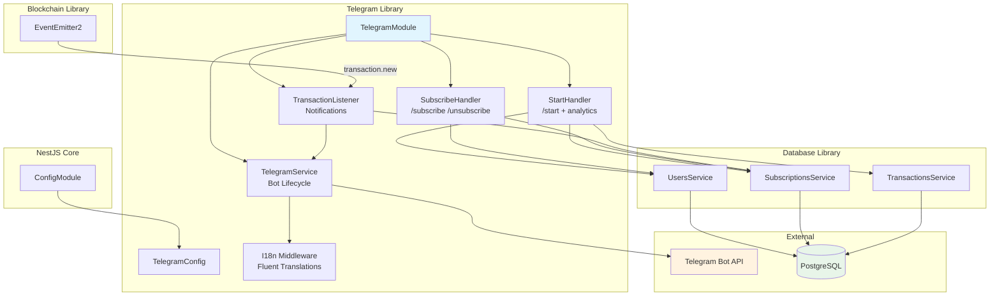
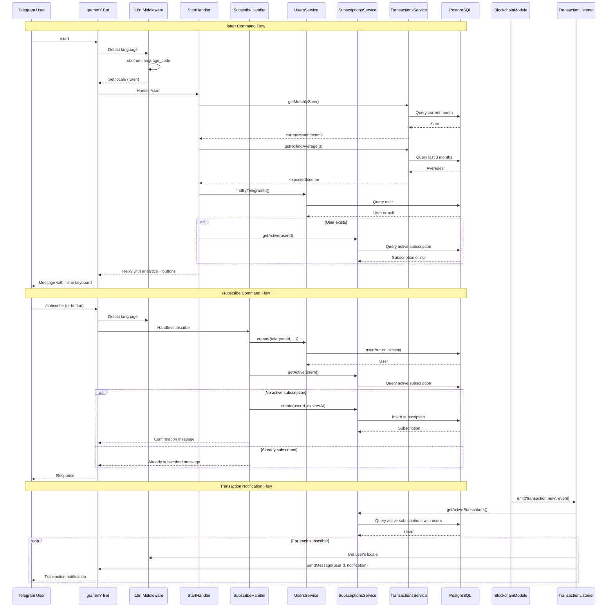
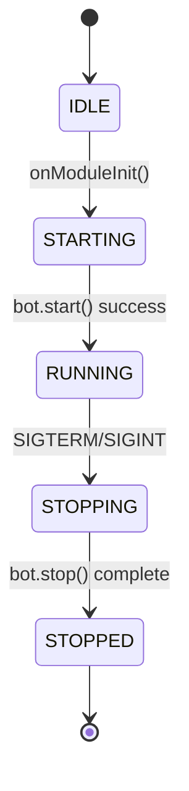

# Telegram Bot User Interface Design Document

## Overview

This document defines the technical design for the Telegram bot user interface within the PayPing application. The implementation provides a user-facing interface using grammY framework with long polling mode, enabling users to subscribe to wallet monitoring notifications and view income analytics via commands and inline buttons.

## Design Summary (Meta)

```yaml
design_type: "new_feature"
risk_level: "low"
complexity_level: "medium"
complexity_rationale: >
  (1) Requirements/ACs: i18n support with language detection (ru/en), event-driven notifications
      to multiple subscribers, analytics calculations (monthly sum, 3-month rolling average),
      subscription state management with inline button updates.
  (2) Constraints/risks addressed: NestJS standalone app (no HTTP), grammY lifecycle integration,
      EventEmitter pattern for transaction.new events, Telegram API rate limits (30 msg/sec).
main_constraints:
  - "NestJS standalone application (no HTTP server)"
  - "Long polling mode (no webhooks)"
  - "Telegram API rate limits (30 messages/second to different chats)"
  - "Integration with existing EventEmitter pattern for transaction.new"
  - "Open access (no authentication required)"
biggest_risks:
  - "grammY NestJS integration library is in alpha stage"
  - "Notification delivery rate under high subscriber volume"
  - "i18n configuration and Fluent syntax learning curve"
unknowns:
  - "Optimal batch size for concurrent notification delivery"
  - "grammY runner vs built-in polling for this use case"
```

## Background and Context

### Prerequisite ADRs

- **ADR-0001: TRON Blockchain Monitoring Approach**: Defines the `transaction.new` event emission pattern that this module consumes
- **ADR-0002: Drizzle ORM Selection**: Database access patterns used by services

### Agreement Checklist

#### Scope
- [x] `/start` command with welcome message and income analytics
- [x] `/subscribe` command to activate user subscription
- [x] `/unsubscribe` command to deactivate subscription
- [x] Inline buttons for Subscribe/Unsubscribe actions on /start
- [x] Transaction notifications to active subscribers
- [x] Language detection and i18n (Russian/English)
- [x] Open access for all Telegram users
- [x] New `cancel()` method in SubscriptionsService
- [x] New analytics methods in TransactionsService (getMonthlySum, getRollingAverage)

#### Non-Scope (Explicitly not changing)
- [x] Telegram Stars payments (future PRD)
- [x] Multiple wallet monitoring
- [x] TRX transaction notifications (USDT only)
- [x] Admin commands
- [x] Group chat support
- [x] Webhook mode deployment
- [x] Existing BlockchainModule implementation
- [x] Existing database schema

#### Constraints
- [x] Parallel operation: No (single bot instance for MVP)
- [x] Backward compatibility: Not required (greenfield TelegramModule)
- [x] Performance measurement: Required (response time < 2s, notification latency < 5s)

### Problem to Solve

PayPing needs a user-facing interface that allows Telegram users to:
1. Subscribe to receive real-time transaction notifications
2. View income analytics (current month sum and expected income from 3-month average)
3. Receive instant alerts when USDT funds arrive at the monitored wallet

### Current Challenges

1. `TelegramModule` is an empty shell with no implementation
2. `TelegramService` is an empty injectable class
3. No event listener for `transaction.new` events
4. No i18n infrastructure exists
5. `SubscriptionsService` lacks a `cancel()` method for unsubscribing
6. `TransactionsService` lacks analytics methods

### Requirements

#### Functional Requirements

| ID | Requirement | Priority |
|----|-------------|----------|
| FR-1 | /start command with analytics and inline buttons | Must |
| FR-2 | /subscribe command to create/activate subscription | Must |
| FR-3 | /unsubscribe command to deactivate subscription | Must |
| FR-4 | Inline buttons on /start for subscribe/unsubscribe | Must |
| FR-5 | Transaction notifications on transaction.new event | Must |
| FR-6 | Language detection and i18n (ru/en) | Must |
| FR-7 | Open access (no whitelist) | Must |
| FR-8 | Subscription status display in /start | Should |
| FR-9 | User-friendly error messages | Should |

#### Non-Functional Requirements

- **Performance**: Bot commands respond within 2 seconds; notifications within 5 seconds of event
- **Reliability**: 99% notification delivery rate
- **Scalability**: Support 100+ concurrent subscribers
- **Maintainability**: Centralized i18n, modular handler architecture

## Acceptance Criteria (AC) - EARS Format

### FR-1: /start Command with Analytics

- [x] **AC-1.1**: **When** user sends /start command, the system shall respond with welcome message containing current month income within 2 seconds
- [x] **AC-1.2**: **When** user sends /start command, the system shall display expected income calculated from 3-month rolling average
- [x] **AC-1.3**: **If** less than 3 months of transaction data exists, **then** the system shall calculate average using available months only
- [x] **AC-1.4**: **If** no transaction data exists, **then** the system shall display "0.00 USDT" for both metrics
- [x] **AC-1.5**: **When** user sends /start command, the system shall display Subscribe and Unsubscribe inline buttons

### FR-2: /subscribe Command

- [x] **AC-2.1**: **When** user executes /subscribe command, the system shall create user record if not exists
- [x] **AC-2.2**: **When** user executes /subscribe command, the system shall create subscription with status 'active'
- [x] **AC-2.3**: **If** user already has active subscription, **then** the system shall respond with "already subscribed" message
- [x] **AC-2.4**: **When** subscription is created, the system shall respond with confirmation message

### FR-3: /unsubscribe Command

- [x] **AC-3.1**: **When** user executes /unsubscribe command, the system shall set subscription status to 'cancelled'
- [x] **AC-3.2**: **If** user has no active subscription, **then** the system shall respond with "not subscribed" message
- [x] **AC-3.3**: **When** subscription is cancelled, the system shall respond with confirmation message
- [x] **AC-3.4**: The system shall preserve user and subscription records (no deletion)

### FR-4: Inline Buttons

- [x] **AC-4.1**: **When** user clicks Subscribe inline button, the system shall execute subscription flow
- [x] **AC-4.2**: **When** user clicks Unsubscribe inline button, the system shall execute unsubscription flow
- [x] **AC-4.3**: **When** action completes via button, the system shall update the original message with new status

### FR-5: Transaction Notifications

- [x] **AC-5.1**: **When** transaction.new event is emitted, the system shall send notification to all active subscribers within 5 seconds
- [x] **AC-5.2**: The notification shall contain: amount, sender address (truncated), timestamp
- [x] **AC-5.3**: **If** notification delivery fails for a user, the system shall log the error and continue with other subscribers
- [x] **AC-5.4**: **While** sending notifications, the system shall respect Telegram rate limits (30 msg/sec)

### FR-6: Language Detection and i18n

- [x] **AC-6.1**: **When** user interacts with the bot, the system shall detect language from ctx.from.language_code
- [x] **AC-6.2**: **If** language_code is 'ru', **then** the system shall use Russian translations
- [x] **AC-6.3**: **If** language_code is not 'ru', **then** the system shall fallback to English
- [x] **AC-6.4**: All user-facing strings shall be stored in Fluent (.ftl) translation files

### FR-7: Open Access

- [x] **AC-7.1**: The system shall allow any Telegram user to interact with the bot
- [x] **AC-7.2**: The system shall not require authentication or subscription payment

## Existing Codebase Analysis

### Implementation Path Mapping

| Type | Path | Description |
|------|------|-------------|
| Existing | `libs/telegram/src/telegram.module.ts` | Empty module, needs bot setup |
| Existing | `libs/telegram/src/telegram.service.ts` | Empty service, becomes bot manager |
| Existing | `libs/db/src/services/users.service.ts` | Has create/findByTelegramId |
| Existing | `libs/db/src/services/subscriptions.service.ts` | Needs cancel() method |
| Existing | `libs/db/src/services/transactions.service.ts` | Needs analytics methods |
| Existing | `libs/blockchain/src/events/transaction.events.ts` | TRANSACTION_NEW_EVENT constant |
| New | `libs/telegram/src/config/telegram.config.ts` | Bot token configuration |
| New | `libs/telegram/src/handlers/start.handler.ts` | /start command handler |
| New | `libs/telegram/src/handlers/subscribe.handler.ts` | Subscription management |
| New | `libs/telegram/src/listeners/transaction.listener.ts` | Event listener for notifications |
| New | `libs/telegram/src/i18n/` | Fluent translation files |
| New | `libs/telegram/src/types/context.ts` | Custom context with i18n flavor |

### Integration Points

| Integration Target | Invocation Method |
|-------------------|-------------------|
| UsersService | Dependency injection |
| SubscriptionsService | Dependency injection |
| TransactionsService | Dependency injection |
| EventEmitter2 | @OnEvent decorator |
| ConfigService | Dependency injection |

### Similar Functionality Search

- **No existing Telegram bot implementation** - Greenfield implementation
- **EventEmitter pattern exists** in BlockchainModule - Will follow same pattern
- **No existing i18n infrastructure** - New implementation

## Design

### Change Impact Map

```yaml
Change Target: "@app/telegram library"
Direct Impact:
  - libs/telegram/src/telegram.module.ts (complete rewrite)
  - libs/telegram/src/telegram.service.ts (bot management)
  - libs/telegram/src/index.ts (export additions)
  - libs/db/src/services/subscriptions.service.ts (add cancel method)
  - libs/db/src/services/transactions.service.ts (add analytics methods)
  - src/app.module.ts (add TelegramModule import)
Indirect Impact:
  - None (greenfield implementation)
No Ripple Effect:
  - libs/blockchain/* (unchanged, only consumes events)
  - libs/db/src/schema/* (no schema changes)
  - Existing test files
```

### Architecture Overview



### Data Flow



### Integration Points List

| Integration Point | Location | Old Implementation | New Implementation | Switching Method |
|-------------------|----------|-------------------|-------------------|------------------|
| Module Registration | `AppModule` | None | `TelegramModule` | Import |
| Event Consumption | `TransactionListener` | None | `@OnEvent('transaction.new')` | Decorator |
| Configuration | `TelegramModule` | None | `ConfigModule.forFeature()` | Static method |
| User Creation | `StartHandler` | None | `UsersService.create()` | DI |
| Subscription Management | `SubscribeHandler` | None | `SubscriptionsService.*()` | DI |
| Analytics | `StartHandler` | None | `TransactionsService.getMonthlySum()` | DI |

### Main Components

#### TelegramConfig

- **Responsibility**: Load and validate bot token from environment
- **Interface**:
  ```typescript
  interface TelegramConfig {
    botToken: string;
  }
  ```
- **Dependencies**: `ConfigService`

#### TelegramService

- **Responsibility**: Bot instance management, lifecycle hooks, message sending
- **Interface**:
  ```typescript
  interface TelegramService {
    onModuleInit(): Promise<void>;
    onModuleDestroy(): Promise<void>;
    getBot(): Bot<BotContext>;
    sendMessage(chatId: number, text: string, options?: Other<'sendMessage'>): Promise<void>;
  }
  ```
- **Dependencies**: `TelegramConfig`, `I18n`

#### StartHandler

- **Responsibility**: Handle /start command, display analytics and subscription buttons
- **Interface**:
  ```typescript
  interface StartHandler {
    handleStart(ctx: BotContext): Promise<void>;
    handleSubscribeButton(ctx: BotContext): Promise<void>;
    handleUnsubscribeButton(ctx: BotContext): Promise<void>;
  }
  ```
- **Dependencies**: `UsersService`, `SubscriptionsService`, `TransactionsService`

#### SubscribeHandler

- **Responsibility**: Handle /subscribe and /unsubscribe commands
- **Interface**:
  ```typescript
  interface SubscribeHandler {
    handleSubscribe(ctx: BotContext): Promise<void>;
    handleUnsubscribe(ctx: BotContext): Promise<void>;
  }
  ```
- **Dependencies**: `UsersService`, `SubscriptionsService`

#### TransactionListener

- **Responsibility**: Listen to transaction.new events and send notifications
- **Interface**:
  ```typescript
  interface TransactionListener {
    onTransactionNew(event: TransactionNewEvent): Promise<void>;
  }
  ```
- **Dependencies**: `SubscriptionsService`, `TelegramService`

#### SubscriptionsService.cancel() (New Method)

- **Responsibility**: Cancel active subscription by setting status to 'cancelled'
- **Interface**:
  ```typescript
  async cancel(userId: number): Promise<void>;
  ```
- **Dependencies**: Existing `DrizzleDB`

#### TransactionsService Analytics Methods (New)

- **Responsibility**: Provide analytics data for income display
- **Interface**:
  ```typescript
  async getMonthlySum(year: number, month: number): Promise<string>;
  async getRollingAverage(months: number): Promise<string>;
  ```
- **Dependencies**: Existing `DrizzleDB`

### Contract Definitions

```typescript
// libs/telegram/src/types/context.ts
import { Context } from 'grammy';
import { I18nFlavor } from '@grammyjs/i18n';

export type BotContext = Context & I18nFlavor;

// libs/telegram/src/config/telegram.config.ts
import { registerAs } from '@nestjs/config';

export interface TelegramConfig {
  botToken: string;
}

export default registerAs('telegram', (): TelegramConfig => ({
  botToken: process.env.TELEGRAM_BOT_TOKEN || '',
}));
```

```typescript
// libs/telegram/src/handlers/types.ts
export interface AnalyticsData {
  currentMonthIncome: string;
  expectedIncome: string;
  isSubscribed: boolean;
}

export const CALLBACK_ACTIONS = {
  SUBSCRIBE: 'action:subscribe',
  UNSUBSCRIBE: 'action:unsubscribe',
} as const;
```

### Data Contract

#### TelegramService

```yaml
Input:
  Type: { chatId: number, text: string, options?: SendMessageOptions }
  Preconditions:
    - chatId is valid Telegram user ID
    - text is non-empty localized string
  Validation: grammY validates internally

Output:
  Type: void (async)
  Guarantees:
    - Message sent to Telegram API
    - Errors logged and not thrown (for notifications)
  On Error: Log error, continue processing

Invariants:
  - Bot token always valid
  - Rate limits respected (30 msg/sec)
```

#### TransactionsService.getMonthlySum()

```yaml
Input:
  Type: { year: number, month: number }
  Preconditions:
    - year is valid year (e.g., 2026)
    - month is 1-12
  Validation: Range check

Output:
  Type: string (decimal amount)
  Guarantees:
    - Returns sum of USDT incoming transactions for specified month
    - Returns "0" if no transactions
    - Preserves 6 decimal precision
  On Error: Throws (fail-fast)

Invariants:
  - Only incoming transactions counted (to_address = monitored wallet)
```

#### TransactionsService.getRollingAverage()

```yaml
Input:
  Type: { months: number }
  Preconditions:
    - months > 0 (typically 3)
  Validation: Positive integer check

Output:
  Type: string (decimal amount)
  Guarantees:
    - Returns average of last N months' sums
    - If fewer months of data exist, uses available months
    - Returns "0" if no data exists
    - Preserves 2 decimal precision (for display)
  On Error: Throws (fail-fast)

Invariants:
  - Calculation based on actual available data
  - Never returns negative value
```

### State Transitions and Invariants

```yaml
State Definition:
  - Initial State: IDLE (module created but not initialized)
  - Possible States: [IDLE, STARTING, RUNNING, STOPPING, STOPPED]

State Transitions:
  IDLE -> onModuleInit() -> STARTING
  STARTING -> bot.start() success -> RUNNING
  RUNNING -> SIGTERM/SIGINT -> STOPPING
  STOPPING -> bot.stop() complete -> STOPPED

Subscription States:
  - 'active': User is subscribed and will receive notifications
  - 'cancelled': User unsubscribed, no notifications
  - 'expired': Subscription period ended (future, for paid subscriptions)

System Invariants:
  - Only one bot instance runs at a time
  - Notifications only sent to users with 'active' subscription
  - User locale detected fresh on each interaction
```



### Error Handling

| Error Type | Detection | Response | Recovery |
|------------|-----------|----------|----------|
| Missing bot token | Config validation | Throw on startup | Fix environment |
| Telegram API error | grammY error | Log and continue | Auto-retry by grammY |
| Notification failure | sendMessage throws | Log error, skip user | Continue with others |
| Database error | Exception from service | Log, report to Sentry | Re-throw (fail-fast) |
| Invalid callback data | Callback handler | Log, respond with error | User can retry |

### Logging and Monitoring

#### Structured Logging

```typescript
{
  level: 'info',
  context: 'TelegramService',
  message: 'Notification sent',
  data: {
    userId: 123456789,
    transactionHash: 'abc123...',
    locale: 'ru',
    durationMs: 150,
    timestamp: '2026-01-22T14:30:00.000Z'
  }
}
```

#### Prometheus Metrics (Future)

| Metric Name | Type | Labels | Description |
|-------------|------|--------|-------------|
| `telegram_commands_total` | Counter | `command` | Commands handled |
| `telegram_notifications_total` | Counter | `status` | Notifications sent |
| `telegram_response_time_ms` | Histogram | `command` | Command response time |
| `telegram_active_subscribers` | Gauge | - | Current active subscriber count |

### i18n Configuration

#### File Structure

```
libs/telegram/src/i18n/
  locales/
    en.ftl
    ru.ftl
```

#### Translation Files

```fluent
# en.ftl
welcome = Welcome to PayPing!

current-month-income = Current Month Income
expected-income = Expected Income
status-subscribed = Subscribed
status-not-subscribed = Not subscribed

btn-subscribe = Subscribe
btn-unsubscribe = Unsubscribe

subscribed-success = You are now subscribed!
    You will receive notifications when funds arrive to the monitored wallet.
    To unsubscribe, use /unsubscribe or click the button in /start.

unsubscribed-success = You have been unsubscribed.
    You will no longer receive transaction notifications.
    To subscribe again, use /subscribe or click the button in /start.

already-subscribed = You are already subscribed to notifications.
not-subscribed = You are not currently subscribed.

notification-title = New incoming transaction!
notification-amount = Amount
notification-from = From
notification-time = Time
notification-hash = Transaction hash
```

```fluent
# ru.ftl
welcome = Добро пожаловать в PayPing!

current-month-income = Доход за текущий месяц
expected-income = Ожидаемый доход
status-subscribed = Подписан
status-not-subscribed = Не подписан

btn-subscribe = Подписаться
btn-unsubscribe = Отписаться

subscribed-success = Вы подписаны!
    Вы будете получать уведомления при поступлении средств на отслеживаемый кошелёк.
    Чтобы отписаться, используйте /unsubscribe или нажмите кнопку в /start.

unsubscribed-success = Вы отписаны.
    Вы больше не будете получать уведомления о транзакциях.
    Чтобы подписаться снова, используйте /subscribe или нажмите кнопку в /start.

already-subscribed = Вы уже подписаны на уведомления.
not-subscribed = Вы не подписаны.

notification-title = Новая входящая транзакция!
notification-amount = Сумма
notification-from = От
notification-time = Время
notification-hash = Хеш транзакции
```

## Implementation Plan

### Implementation Approach

**Selected Approach**: Vertical Slice with Foundation First

**Selection Reason**: The Telegram bot feature has clear boundaries and can be implemented as a complete vertical slice. Configuration and i18n must be established first as all handlers depend on them. The feature consumes existing events without modifying the blockchain module.

### Technical Dependencies and Implementation Order

#### Required Implementation Order

1. **Configuration and Types (Foundation)**
   - Technical Reason: All components depend on config and type definitions
   - Dependent Elements: TelegramService, all handlers
   - Files: `telegram.config.ts`, `context.ts`

2. **i18n Setup (Foundation)**
   - Technical Reason: All user-facing messages require localization
   - Prerequisites: Type definitions
   - Files: `locales/en.ftl`, `locales/ru.ftl`

3. **TelegramService (Infrastructure)**
   - Technical Reason: Bot lifecycle must work before handlers
   - Prerequisites: Configuration, i18n setup
   - Files: `telegram.service.ts`

4. **Database Service Extensions**
   - Technical Reason: Handlers need analytics and cancel methods
   - Prerequisites: None (extend existing)
   - Files: `transactions.service.ts`, `subscriptions.service.ts`

5. **StartHandler (Application)**
   - Technical Reason: Core user interaction point
   - Prerequisites: TelegramService, analytics methods
   - Files: `start.handler.ts`

6. **SubscribeHandler (Application)**
   - Technical Reason: Subscription management
   - Prerequisites: TelegramService, cancel method
   - Files: `subscribe.handler.ts`

7. **TransactionListener (Application)**
   - Technical Reason: Notification delivery
   - Prerequisites: TelegramService, SubscriptionsService
   - Files: `transaction.listener.ts`

8. **Module Integration**
   - Technical Reason: Wire all components together
   - Prerequisites: All components implemented
   - Files: `telegram.module.ts`, `index.ts`

### Integration Points

**Integration Point 1: Configuration**
- Components: `ConfigModule` -> `TelegramConfig` -> `TelegramService`
- Verification: Bot starts with valid token from environment

**Integration Point 2: Event Consumption**
- Components: `BlockchainModule` -> `EventEmitter2` -> `TransactionListener`
- Verification: Listener receives events and sends notifications

**Integration Point 3: Database Services**
- Components: Handlers -> `UsersService`, `SubscriptionsService`, `TransactionsService`
- Verification: CRUD operations work correctly

**Integration Point 4: Telegram API**
- Components: `TelegramService` -> Telegram Bot API
- Verification: Commands respond, notifications delivered

### E2E Verification Procedures

| Phase | Verification | Command/Method |
|-------|--------------|----------------|
| Foundation | Config loads correctly | Unit test: `telegram.config.spec.ts` |
| Foundation | i18n translations load | Unit test: `i18n.spec.ts` |
| Infrastructure | Bot starts and stops | Integration test with mock |
| Application | /start shows analytics | E2E test with real bot |
| Application | Subscribe/Unsubscribe works | E2E test with real bot |
| Application | Notifications delivered | E2E test with event emission |
| Integration | Full flow works | Manual test with Telegram |

### Migration Strategy

Not applicable - greenfield implementation with no existing functionality to migrate.

### Integration Boundary Contracts

```yaml
Boundary: TelegramModule <- BlockchainModule (Event)
  Input: TransactionNewEvent { transaction: Transaction, detectedAt: number }
  Output: void (async)
  On Error: Log and continue (do not block event emitter)

Boundary: TelegramModule -> DbModule (Services)
  Input: Method calls with validated parameters
  Output: Promises with typed results
  On Error: Re-throw (fail-fast for critical operations)

Boundary: TelegramModule -> Telegram API
  Input: Bot API method calls
  Output: API responses
  On Error: grammY handles retries; log failures
```

## Test Strategy

### Basic Test Design Policy

Tests derived directly from Acceptance Criteria:
- Each AC generates at least one test case
- Test names reference AC IDs for traceability

### Unit Tests

**Coverage Target**: 80%

| Component | Test Focus | Key Test Cases |
|-----------|------------|----------------|
| TelegramConfig | Token validation | Missing token throws |
| StartHandler | Analytics display, button rendering | AC-1.1 to AC-1.5 |
| SubscribeHandler | Subscription flows | AC-2.1 to AC-2.4, AC-3.1 to AC-3.4 |
| TransactionListener | Event handling, notification sending | AC-5.1 to AC-5.4 |
| TransactionsService.getMonthlySum | Sum calculation | Empty data, single month, filtering |
| TransactionsService.getRollingAverage | Average calculation | AC-1.3, AC-1.4 |
| SubscriptionsService.cancel | Status update | Cancel active, cancel inactive |

### Integration Tests

| Test Scenario | Components | Verification |
|---------------|------------|--------------|
| Start command flow | Handler + Services | Analytics returned correctly |
| Subscribe flow | Handler + User + Subscription | User and subscription created |
| Unsubscribe flow | Handler + Subscription | Status changed to cancelled |
| Notification delivery | Listener + Service + Mock Bot | All subscribers notified |

### E2E Tests

| Test Scenario | Setup | Expected Outcome |
|---------------|-------|------------------|
| New user starts bot | Clean state | Welcome message with 0.00 USDT |
| User subscribes | Existing user | Confirmation, status updated |
| User unsubscribes | Subscribed user | Confirmation, status cancelled |
| Transaction notification | Emit event | All active subscribers receive message |
| Russian language user | User with ru locale | All text in Russian |
| Button subscribe | Start message displayed | Subscription created via callback |

### Performance Tests

| Metric | Target | Test Method |
|--------|--------|-------------|
| Command response time | < 2 seconds | Benchmark with mock services |
| Notification latency | < 5 seconds | Event emission to delivery timing |
| Concurrent notifications | 100 users | Load test with mock bot |

## Security Considerations

| Concern | Mitigation |
|---------|------------|
| Bot token exposure | Environment variable, never in logs |
| User data | Only store Telegram ID, username, name |
| Input validation | grammY sanitizes inputs |
| Rate limiting | Built-in Telegram limits + potential middleware |
| Error message leakage | Generic messages to users, detailed to logs |

## Future Extensibility

| Future Feature | Design Consideration |
|----------------|---------------------|
| Telegram Stars payments | Payment handler architecture ready |
| Multiple languages | Fluent supports adding locales |
| Notification preferences | User settings table extension |
| Admin commands | Separate handler with guards |
| Horizontal scaling | Stateless design, DB-based state |

## Alternative Solutions

### Alternative 1: @grammyjs/nestjs Official Integration

- **Overview**: Use the official `@grammyjs/nestjs` package for NestJS integration
- **Advantages**: Decorators for handlers, guards/interceptors support, official maintenance
- **Disadvantages**: Alpha stage, limited documentation, potential breaking changes
- **Reason for Rejection**: Alpha status introduces risk; manual integration provides more control

### Alternative 2: nestjs-grammy Community Package

- **Overview**: Use community-maintained `nestjs-grammy` package
- **Advantages**: More mature, decorator-based approach
- **Disadvantages**: Not official, different API from grammY core, maintenance concerns
- **Reason for Rejection**: Prefer staying close to core grammY API for stability

### Alternative 3: grammY Runner for Polling

- **Overview**: Use `@grammyjs/runner` instead of built-in `bot.start()`
- **Advantages**: Better concurrency handling, sophisticated lifecycle management
- **Disadvantages**: Additional complexity, overkill for expected load
- **Reason for Rejection**: Simple long polling sufficient for MVP; can upgrade later if needed

## Risks and Mitigation

| Risk | Impact | Probability | Mitigation |
|------|--------|-------------|------------|
| grammY API changes | Medium | Low | Pin version, monitor releases |
| High notification volume | Medium | Medium | Batch sending, rate limiting |
| Telegram API downtime | High | Low | Retry logic in grammY |
| i18n translation errors | Low | Medium | Review with native speakers |
| Database performance for analytics | Medium | Low | Add indexes, cache results |
| Bot token leak | High | Low | Environment variables, secrets management |

## References

- [grammY Documentation](https://grammy.dev/) - Official grammY framework documentation
- [grammY i18n Plugin](https://grammy.dev/plugins/i18n) - Internationalization plugin documentation
- [grammY NestJS Integration](https://github.com/grammyjs/nestjs) - Official NestJS integration (alpha)
- [Telegram Bot API](https://core.telegram.org/bots/api) - Official Telegram Bot API reference
- [Project Fluent](https://projectfluent.org/) - Fluent localization syntax
- [NestJS Event Emitter](https://docs.nestjs.com/techniques/events) - Event handling in NestJS
- [Long Polling vs Webhooks](https://grammy.dev/guide/deployment-types) - grammY deployment guide

## Update History

| Date | Version | Changes | Author |
|------|---------|---------|--------|
| 2026-01-22 | 1.0 | Initial version | Claude |
