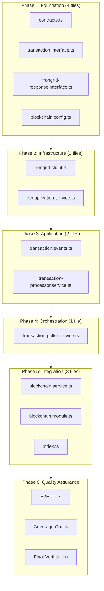
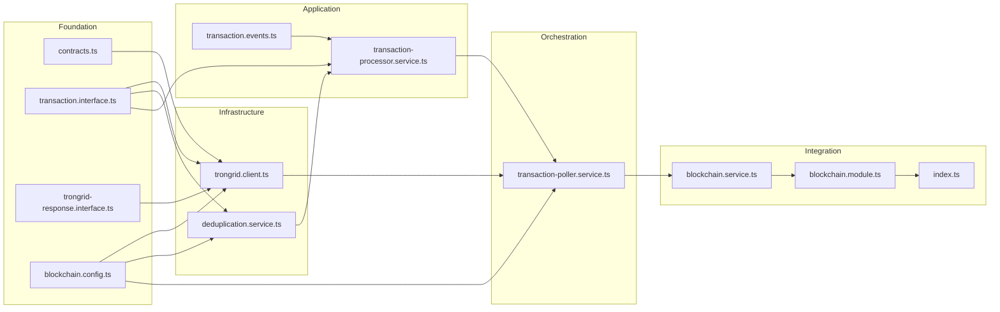

# Work Plan: Blockchain Monitoring Implementation

Created Date: 2026-01-22
Type: feature
Estimated Duration: 3-4 days
Estimated Impact: 12 files (9 new, 3 modified)
Related Issue/PR: N/A

## Related Documents
- Design Doc: [docs/design/blockchain-monitoring-design.md](../design/blockchain-monitoring-design.md) (v1.2)
- ADR: [docs/adr/ADR-0001](../adr/ADR-0001.md) (TRON Blockchain Monitoring Approach)

## Objective

Implement TRON blockchain monitoring for the PayPing Telegram bot to detect incoming USDT (TRC20) transactions on a monitored wallet and emit events for downstream notification services.

## Background

- `BlockchainService` exists as an empty shell
- `BlockchainModule` has basic structure but no providers configured
- No existing blockchain monitoring, event emission, or configuration patterns in the codebase
- This is a greenfield implementation with clear boundaries

## Phase Structure Diagram



## Task Dependency Diagram



## Risks and Countermeasures

### Technical Risks
- **Risk**: TronGrid API response format changes or unexpected errors
  - **Impact**: High - Core functionality failure
  - **Countermeasure**: Comprehensive response validation, integration tests with mock server

- **Risk**: LRU cache memory pressure under high transaction volume
  - **Impact**: Medium - Performance degradation
  - **Countermeasure**: Configurable max size (default 10000), monitoring via metrics

- **Risk**: Database connection issues during deduplication
  - **Impact**: High - Data integrity risk
  - **Countermeasure**: Fail-fast approach for DB errors, connection pooling

### Schedule Risks
- **Risk**: External API integration complexity
  - **Impact**: Medium - Delay in Phase 2
  - **Countermeasure**: Use Shasta testnet for early verification

## Dependencies (npm packages)

The following packages are already installed per `package.json`:
- `@nestjs/config` (v4.0.2) - Configuration management
- `@nestjs/event-emitter` (v3.0.1) - Event emission
- `axios` (v1.13.2) - HTTP client for TronGrid API

**Required new packages:**
- `lru-cache` - LRU cache implementation for deduplication

Install command:
```bash
pnpm add lru-cache
```

## Implementation Phases

### Phase 1: Foundation Layer (Estimated commits: 2)
**Purpose**: Establish type definitions, constants, and configuration for all subsequent components

**Test Resolution**: 0/11 integration tests (setup only)

#### Tasks
- [x] Create `libs/blockchain/src/constants/contracts.ts` with USDT contract address constant
- [x] Create `libs/blockchain/src/interfaces/transaction.interface.ts` with domain types
- [x] Create `libs/blockchain/src/interfaces/trongrid-response.interface.ts` with API response types
- [x] Create `libs/blockchain/src/config/blockchain.config.ts` with configuration registration
- [ ] Install `lru-cache` package: `pnpm add lru-cache`
- [ ] Quality check: Types compile without errors
- [x] Unit tests: Configuration validation tests

#### Files to Create

| File | Description | AC Coverage |
|------|-------------|-------------|
| `constants/contracts.ts` | USDT TRC20 contract address | AC-2.2 |
| `interfaces/transaction.interface.ts` | `Transaction`, `TransactionType`, `TransactionNewEvent` | AC-5.2 |
| `interfaces/trongrid-response.interface.ts` | `TronGridPaginatedResponse`, `TRC20TransactionResponse` | AC-2.1 |
| `config/blockchain.config.ts` | Configuration schema with defaults | AC-9.1, AC-9.2, AC-9.3 |

#### Phase Completion Criteria
- [ ] All interfaces and types defined per Design Doc contract definitions
- [ ] Configuration loads correctly from environment variables
- [ ] Configuration defaults work when env vars not set
- [ ] `pnpm run check` passes

#### Operational Verification Procedures
1. Import types in a test file and verify TypeScript compiles
2. Load configuration and verify default values
3. Set environment variables and verify override behavior

---

### Phase 2: Infrastructure Layer (Estimated commits: 2)
**Purpose**: Implement HTTP client for TronGrid API and deduplication service

**Test Resolution**: 6/11 integration tests (TronGrid: 3, Deduplication: 3)

#### Tasks
- [x] Create `libs/blockchain/src/clients/trongrid.client.ts` with TronGrid API integration
- [ ] Create `libs/blockchain/src/services/deduplication.service.ts` with LRU + DB deduplication
- [x] Create integration tests: `trongrid.client.spec.ts` (implemented 13 test cases)
- [ ] Create integration tests: `deduplication.int.test.ts` (implement 3 test cases)
- [ ] Quality check: `pnpm run check` passes

#### Files to Create

| File | Description | AC Coverage |
|------|-------------|-------------|
| `clients/trongrid.client.ts` | HTTP adapter for TronGrid API | AC-2.1, AC-2.2, AC-2.3, AC-2.4, AC-2.5, AC-7.1, AC-7.2 |
| `services/deduplication.service.ts` | LRU cache + PostgreSQL deduplication | AC-4.1, AC-4.2, AC-4.3, AC-4.4 |

#### Integration Test Mapping

**trongrid.client.int.test.ts** (3 tests):
| Test | Meta Info | Priority |
|------|-----------|----------|
| AC-2.1/AC-2.2: extracts USDT transaction fields | @complexity: high, @category: core-functionality | 1 |
| AC-2.3/AC-2.4: constructs API request with correct query parameters | @complexity: medium, @category: core-functionality | 2 |
| AC-7.1/AC-7.2: error handling with backoff | @complexity: medium, @category: edge-case | 3 |

**deduplication.int.test.ts** (3 tests):
| Test | Meta Info | Priority |
|------|-----------|----------|
| AC-4.1: LRU cache hit skips processing | @complexity: medium, @category: core-functionality | 1 |
| AC-4.2: DB hit after LRU miss | @complexity: medium, @category: core-functionality | 2 |
| AC-4.3: new transaction added to LRU + DB | @complexity: medium, @category: core-functionality | 3 |

#### Phase Completion Criteria
- [x] TronGridClient fetches and transforms USDT transactions correctly
- [x] TronGridClient handles HTTP 429 and 5xx errors with backoff
- [ ] DeduplicationService uses LRU cache before DB queries
- [ ] DeduplicationService persists new transactions to DB
- [ ] All 6 integration tests pass
- [ ] `pnpm run check` passes

#### Operational Verification Procedures
1. Run TronGridClient integration tests with mocked axios
2. Verify request parameters include `only_confirmed=true`, `min_timestamp`, `contract_address`
3. Run DeduplicationService tests verifying LRU-first, then DB fallback
4. Verify cache warming on DB hit (LRU updated)

---

### Phase 3: Application Layer (Estimated commits: 2)
**Purpose**: Implement event definitions and transaction processing with event emission

**Test Resolution**: 9/11 integration tests (+3 from deduplication event tests)

#### Tasks
- [x] Create `libs/blockchain/src/events/transaction.events.ts` with event constants
- [ ] Create `libs/blockchain/src/services/transaction-processor.service.ts` with processing logic
- [ ] Update deduplication integration tests: add event emission tests (AC-5.1, AC-5.2, AC-5.3)
- [ ] Quality check: `pnpm run check` passes
- [ ] Integration tests: Verify event emission with correct payload

#### Files to Create

| File | Description | AC Coverage |
|------|-------------|-------------|
| `events/transaction.events.ts` | Event name constants (`transaction.new`) | AC-5.1 |
| `services/transaction-processor.service.ts` | Processing, filtering, event emission | AC-3.1, AC-3.2, AC-5.1, AC-5.2, AC-5.3 |

#### Integration Test Additions (deduplication.int.test.ts)

| Test | AC Coverage | Priority |
|------|-------------|----------|
| AC-5.1/AC-5.2: emits transaction.new event with correct payload | AC-5.1, AC-5.2 | 1 |
| AC-5.3: logs error and continues when event emission fails | AC-5.3 | 2 |
| Cache warming: warms LRU cache after database hit | AC-4.2 | 3 |

#### Phase Completion Criteria
- [ ] TransactionProcessorService filters incoming transactions correctly (AC-3.1, AC-3.2)
- [ ] TransactionProcessorService emits `transaction.new` event with complete payload (AC-5.1, AC-5.2)
- [ ] Event emission failures are logged and do not crash processing (AC-5.3)
- [ ] All 9 integration tests pass
- [ ] `pnpm run check` passes

#### Operational Verification Procedures
1. Process mock incoming USDT transaction and verify event emitted
2. Process mock outgoing USDT transaction and verify NO event emitted
3. Mock event listener error and verify processing continues
4. Verify event payload contains all required fields from AC-5.2

---

### Phase 4: Orchestration Layer (Estimated commits: 2)
**Purpose**: Implement polling loop with timing control, initial timestamp retrieval, and graceful shutdown

**Test Resolution**: 11/11 integration tests (+3 from transaction-poller tests)

#### Tasks
- [ ] Create `libs/blockchain/src/services/transaction-poller.service.ts` with polling orchestration
- [ ] Implement integration tests: `transaction-poller.int.test.ts` (implement 3 test cases)
- [ ] Quality check: `pnpm run check` passes
- [ ] Integration tests: Verify polling behavior, skip logic, shutdown

#### Files to Create

| File | Description | AC Coverage |
|------|-------------|-------------|
| `services/transaction-poller.service.ts` | Polling loop, timing, DB timestamp retrieval, shutdown | AC-1.1, AC-1.2, AC-1.3, AC-7.1, AC-7.4, AC-8.1, AC-8.2, AC-8.3, AC-10.1, AC-10.2, AC-10.3, AC-10.4, AC-10.5 |

#### Integration Test Mapping (transaction-poller.int.test.ts)

| Test | Meta Info | Priority |
|------|-----------|----------|
| AC-10.1/AC-10.3: retrieves last timestamp from DB on start | @complexity: high, @category: core-functionality | 1 |
| AC-10.2: uses fallback when no DB data | @complexity: medium, @category: core-functionality | 2 |
| AC-1.2: skips poll when previous in progress | @complexity: medium, @category: edge-case | 3 |

#### Phase Completion Criteria
- [ ] Polling interval defaults to 5 seconds (AC-1.1)
- [ ] Concurrent poll attempts blocked with warning (AC-1.2)
- [ ] Initial timestamp retrieved from DB (AC-10.1, AC-10.3)
- [ ] Fallback to now-60s when no DB data (AC-10.2)
- [ ] Subsequent polls use last processed timestamp (AC-10.5)
- [ ] Graceful shutdown completes current poll (AC-8.1, AC-8.3)
- [ ] All 11 integration tests pass
- [ ] `pnpm run check` passes

#### Operational Verification Procedures
1. Start poller with mocked DB returning timestamp, verify API called with DB timestamp
2. Start poller with empty DB, verify fallback timestamp used (within 60s of now)
3. Trigger slow poll then rapid second poll, verify skip and warning logged
4. Call stopPolling during active poll, verify current poll completes first

---

### Phase 5: Integration Layer (Estimated commits: 2)
**Purpose**: Wire all components together in module, implement coordinator service, update exports

**Test Resolution**: 11/11 integration tests (no new integration tests)

#### Tasks
- [x] Modify `libs/blockchain/src/blockchain.service.ts` to implement coordinator
- [x] Modify `libs/blockchain/src/blockchain.module.ts` to configure all providers
- [x] Modify `libs/blockchain/src/index.ts` to export all new components
- [x] Quality check: `pnpm run check` passes
- [x] Integration tests: All existing tests still pass

#### Files to Modify

| File | Changes | AC Coverage |
|------|---------|-------------|
| `blockchain.service.ts` | Implement coordinator, lifecycle methods, wallet resolution | AC-6.1, AC-6.2, AC-6.3 |
| `blockchain.module.ts` | Add ConfigModule.forFeature, EventEmitterModule, providers | All |
| `index.ts` | Export interfaces, events, services | All |

#### Phase Completion Criteria
- [x] BlockchainModule imports ConfigModule.forFeature with blockchain config
- [x] BlockchainModule imports EventEmitterModule
- [x] BlockchainService implements OnModuleInit and OnModuleDestroy
- [x] BlockchainService loads wallet address from DB (AC-6.1)
- [x] BlockchainService handles missing wallet gracefully (AC-6.2)
- [x] All exports available from `@app/blockchain`
- [x] All 11 integration tests pass
- [x] `pnpm run check` passes

#### Operational Verification Procedures
1. Import BlockchainModule in AppModule and verify no circular dependencies
2. Start application and verify polling begins automatically
3. Verify wallet address loaded from DB on startup
4. Send SIGTERM and verify graceful shutdown logged

---

### Phase 6: Quality Assurance (Required) (Estimated commits: 1)
**Purpose**: Execute E2E tests, verify all acceptance criteria, ensure quality standards

**Test Resolution**: All tests pass (11 integration + 2 E2E)

#### Tasks
- [ ] Execute E2E tests: `blockchain-monitoring.e2e.test.ts` (2 test scenarios)
- [ ] Verify all Design Doc acceptance criteria achieved (AC-1.x through AC-10.x)
- [ ] Quality checks: `pnpm run check` (types, lint, format)
- [ ] Execute all tests: `pnpm run test`
- [ ] Coverage check: `pnpm run test:cov` (target 80%+)
- [ ] Update CLAUDE.md if needed with new patterns

#### E2E Test Execution (blockchain-monitoring.e2e.test.ts)

| Test | Covers | Priority |
|------|--------|----------|
| Complete USDT Detection Flow | AC-1.1, AC-2.1, AC-2.2, AC-3.1, AC-4.1-4.3, AC-5.1-5.2, AC-10.1 | 1 |
| Restart Continuity | AC-10.1, AC-10.2, AC-10.3, AC-10.4, AC-10.5 | 2 |

#### Acceptance Criteria Checklist

**Polling (FR-1)**:
- [ ] AC-1.1: Polls every 5 seconds
- [ ] AC-1.2: Skips poll when previous in progress
- [ ] AC-1.3: Resumes after rate limit backoff

**USDT Monitoring (FR-2)**:
- [ ] AC-2.1: Extracts all required transaction fields
- [ ] AC-2.2: Filters by USDT contract address
- [ ] AC-2.3: Requests only confirmed transactions
- [ ] AC-2.4: Uses min_timestamp parameter
- [ ] AC-2.5: Retries with backoff on errors

**Incoming Filtering (FR-3)**:
- [ ] AC-3.1: Processes only incoming (to_address = wallet)
- [ ] AC-3.2: Ignores outgoing (from_address = wallet)

**Deduplication (FR-4)**:
- [ ] AC-4.1: LRU cache hit skips immediately
- [ ] AC-4.2: DB hit skips event emission
- [ ] AC-4.3: New tx added to LRU + DB
- [ ] AC-4.4: LRU max size configurable (default 10000)

**Event Emission (FR-5)**:
- [ ] AC-5.1: Emits `transaction.new` for new transactions
- [ ] AC-5.2: Event contains all required fields
- [ ] AC-5.3: Event emission failure logged, processing continues

**Wallet Configuration (FR-6)**:
- [ ] AC-6.1: Loads wallet from DB on start
- [ ] AC-6.2: Pauses polling if no wallet configured
- [ ] AC-6.3: No restart required for wallet change

**Error Handling (FR-7)**:
- [ ] AC-7.1: HTTP 429 triggers exponential backoff
- [ ] AC-7.2: HTTP 5xx retries up to 3 times
- [ ] AC-7.3: Failed retries logged to Sentry
- [ ] AC-7.4: Jitter (0-500ms) in backoff

**Graceful Shutdown (FR-8)**:
- [ ] AC-8.1: Completes current poll on SIGTERM
- [ ] AC-8.2: Flushes pending DB writes
- [ ] AC-8.3: No new polls after shutdown signal

**Configuration (FR-9)**:
- [ ] AC-9.1: Reads from environment variables
- [ ] AC-9.2: Required: TRONGRID_API_KEY, TRONGRID_BASE_URL
- [ ] AC-9.3: Optional with defaults work correctly

**Initial Timestamp (FR-10)**:
- [ ] AC-10.1: Queries DB for last tx timestamp on start
- [ ] AC-10.2: Falls back to now-60s when no DB data
- [ ] AC-10.3: Continues from last saved timestamp on restart
- [ ] AC-10.4: Does NOT skip transactions during downtime
- [ ] AC-10.5: Subsequent polls use last processed timestamp

#### Phase Completion Criteria
- [ ] All 11 integration tests pass
- [ ] All 2 E2E tests pass
- [ ] All acceptance criteria verified
- [ ] Code coverage >= 80%
- [ ] `pnpm run check` passes (zero errors)
- [ ] `pnpm run build` succeeds

#### Operational Verification Procedures
1. Run full test suite: `pnpm run test`
2. Run E2E tests specifically targeting the blockchain monitoring flow
3. Check coverage report: `pnpm run test:cov`
4. Verify build: `pnpm run build`
5. Start application in dev mode and observe logs for polling behavior

---

## Quality Assurance
- [ ] Implement staged quality checks (per ai-development-guide skill)
- [ ] All tests pass (13 total: 11 integration + 2 E2E)
- [ ] Static check pass: `pnpm run check`
- [ ] Lint check pass: `pnpm run lint`
- [ ] Build success: `pnpm run build`

## File-to-Phase Mapping Summary

| Phase | Files | Type | Test File |
|-------|-------|------|-----------|
| Phase 1 | `constants/contracts.ts` | New | N/A (unit test) |
| Phase 1 | `interfaces/transaction.interface.ts` | New | N/A |
| Phase 1 | `interfaces/trongrid-response.interface.ts` | New | N/A |
| Phase 1 | `config/blockchain.config.ts` | New | Unit test |
| Phase 2 | `clients/trongrid.client.ts` | New | `trongrid.client.int.test.ts` |
| Phase 2 | `services/deduplication.service.ts` | New | `deduplication.int.test.ts` |
| Phase 3 | `events/transaction.events.ts` | New | N/A |
| Phase 3 | `services/transaction-processor.service.ts` | New | `deduplication.int.test.ts` |
| Phase 4 | `services/transaction-poller.service.ts` | New | `transaction-poller.int.test.ts` |
| Phase 5 | `blockchain.service.ts` | Modify | N/A |
| Phase 5 | `blockchain.module.ts` | Modify | N/A |
| Phase 5 | `index.ts` | Modify | N/A |
| Phase 6 | N/A | E2E | `blockchain-monitoring.e2e.test.ts` |

## Completion Criteria
- [ ] All 6 phases completed
- [ ] Each phase's operational verification procedures executed
- [ ] All Design Doc acceptance criteria satisfied (AC-1.x through AC-10.x)
- [ ] Staged quality checks completed (zero errors)
- [ ] All tests pass (13 total)
- [ ] Test coverage >= 80%
- [ ] Necessary documentation updated
- [ ] User review approval obtained

## Progress Tracking

### Phase 1: Foundation Layer
- Start: ____-__-__ __:__
- Complete: ____-__-__ __:__
- Notes:

### Phase 2: Infrastructure Layer
- Start: ____-__-__ __:__
- Complete: ____-__-__ __:__
- Notes:

### Phase 3: Application Layer
- Start: ____-__-__ __:__
- Complete: ____-__-__ __:__
- Notes:

### Phase 4: Orchestration Layer
- Start: ____-__-__ __:__
- Complete: ____-__-__ __:__
- Notes:

### Phase 5: Integration Layer
- Start: ____-__-__ __:__
- Complete: ____-__-__ __:__
- Notes:

### Phase 6: Quality Assurance
- Start: ____-__-__ __:__
- Complete: ____-__-__ __:__
- Notes:

## Notes

### Test Skeleton Meta Information Summary

Extracted from test skeleton files:

| Test File | Category | Complexity | Dependencies |
|-----------|----------|------------|--------------|
| `trongrid.client.int.test.ts` | core-functionality, edge-case | high, medium | TronGridClient, axios, ConfigService |
| `transaction-poller.int.test.ts` | core-functionality, edge-case | high, medium | TransactionPollerService, DbService, TronGridClient |
| `deduplication.int.test.ts` | core-functionality, integration, edge-case | medium | DeduplicationService, DbService, LRU Cache |
| `blockchain-monitoring.e2e.test.ts` | e2e | high | full-system |

### Implementation Order Rationale

The phase order follows the Design Doc's "Technical Dependencies and Implementation Order" section:
1. Foundation first (all components depend on types and config)
2. Infrastructure next (TronGridClient and DeduplicationService are independent, can be parallel)
3. Application layer (depends on DeduplicationService)
4. Orchestration (depends on TronGridClient and TransactionProcessorService)
5. Integration (depends on all services)
6. Quality assurance (depends on all implementations)

### Key Design Decisions from Design Doc

1. **LRU Cache before DB**: Performance optimization for hot data
2. **Database-based initial timestamp**: Ensures zero transaction loss after restart
3. **Fail-fast for DB errors**: Data integrity over availability
4. **Exponential backoff with jitter**: Prevent thundering herd on rate limits
