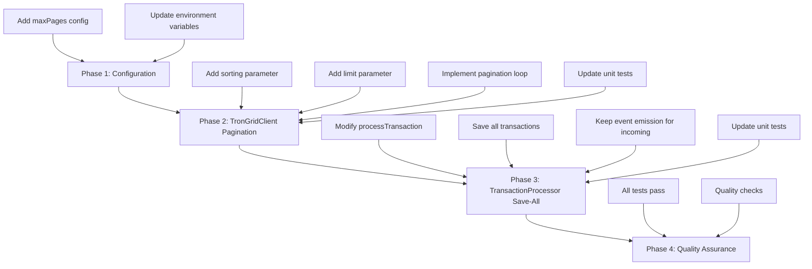
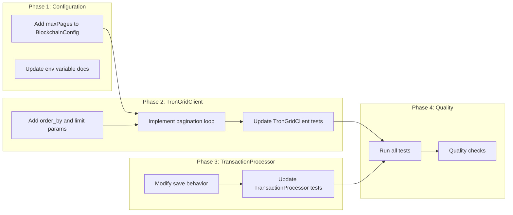

# Work Plan: Design Doc v1.3.1 Changes Implementation

Created Date: 2026-01-22
Type: feature
Estimated Duration: 1-2 days
Estimated Impact: 6 files
Related Issue/PR: N/A

## Related Documents
- Design Doc: [docs/design/blockchain-monitoring-design.md]
- ADR: [docs/adr/ADR-0001-tron-monitoring-approach.md]

## Objective
Implement remaining Design Doc v1.3.1 changes to complete the TRON blockchain monitoring feature. These changes add pagination support for TronGrid API, chronological sorting, save-all-transactions behavior, and configuration for max pages safety limit.

## Background

### Already Implemented (from earlier session)
- `getAccountCreationTimestamp()` method in TronGridClient
- Fallback chain in `getInitialTimestamp()` (DB -> wallet creation -> 2 years)
- Tests for the above features

### Current State Analysis

| Component | Current State | Required State |
|-----------|--------------|----------------|
| TronGridClient.fetchUSDTTransactions | Single page fetch, no sorting | Pagination loop, `order_by=block_timestamp,asc`, `limit=200` |
| TransactionProcessorService | Filters to incoming only, events for incoming only | Save ALL transactions, events for incoming only |
| DeduplicationService | Works with current flow | No changes needed |
| BlockchainConfig | No `maxPages` setting | Add `polling.maxPages` with default 100 |

### Gap Analysis

| AC | Description | Status |
|----|-------------|--------|
| AC-2.6 | Pagination using `fingerprint` parameter | NOT IMPLEMENTED |
| AC-2.7 | Fetch all pages until no fingerprint | NOT IMPLEMENTED |
| AC-2.8 | Sort by `block_timestamp,asc` | NOT IMPLEMENTED |
| AC-2.9 | Max pages safety limit (default: 100) | NOT IMPLEMENTED |
| AC-3.1 | Save ALL transactions to database | PARTIAL (only incoming saved) |
| AC-3.2 | Emit events ONLY for incoming | IMPLEMENTED |
| AC-3.3 | Outgoing transactions saved but no event | NOT IMPLEMENTED |

## Risks and Countermeasures

### Technical Risks
- **Risk**: Pagination loop may cause memory issues for large transaction volumes
  - **Impact**: Medium - Could cause OOM during historical fetch
  - **Countermeasure**: `maxPages` safety limit, logging for monitoring

- **Risk**: API rate limiting during pagination
  - **Impact**: Medium - Could slow down historical fetch
  - **Countermeasure**: Existing backoff logic handles 429 errors

- **Risk**: Breaking existing tests during refactoring
  - **Impact**: High - Could introduce regressions
  - **Countermeasure**: Run tests after each change, maintain test coverage

### Schedule Risks
- **Risk**: Pagination edge cases may require additional testing
  - **Impact**: Low - Well-documented API behavior
  - **Countermeasure**: Comprehensive unit tests with mock responses

## Implementation Phases

### Phase Structure Diagram



### Task Dependency Diagram



---

### Phase 1: Configuration Update (Estimated commits: 1)
**Purpose**: Add `maxPages` configuration setting for pagination safety limit

#### Tasks
- [ ] Add `polling.maxPages` to `BlockchainConfig` interface (`libs/blockchain/src/config/blockchain.config.ts`)
- [ ] Add `POLLING_MAX_PAGES` environment variable parsing (default: 100)
- [ ] Update JSDoc comments for new configuration
- [ ] Quality check: TypeScript compilation passes

#### Phase Completion Criteria
- [ ] `BlockchainConfig.polling.maxPages` property exists with type `number`
- [ ] Default value is 100 when environment variable not set
- [ ] TypeScript compiles without errors

#### Operational Verification Procedures
1. Run `pnpm run build` to verify TypeScript compilation
2. Verify config loads correctly with default value

#### Files to Modify
- `libs/blockchain/src/config/blockchain.config.ts`

---

### Phase 2: TronGridClient Pagination (Estimated commits: 2)
**Purpose**: Implement pagination support with sorting for TronGrid API calls

#### Tasks
- [ ] Add `order_by=block_timestamp,asc` parameter to API request (AC-2.8)
- [ ] Add `limit=200` parameter for efficiency
- [ ] Implement pagination loop using `fingerprint` parameter (AC-2.6, AC-2.7)
- [ ] Add `maxPages` safety limit check (AC-2.9)
- [ ] Log pagination progress for monitoring
- [ ] Update unit tests for pagination scenarios
- [ ] Update unit tests for sorting parameter
- [ ] Quality check: All TronGridClient tests pass

#### Phase Completion Criteria
- [ ] API requests include `order_by=block_timestamp,asc` parameter
- [ ] API requests include `limit=200` parameter
- [ ] Client fetches all pages until no `fingerprint` in response
- [ ] Pagination stops at `maxPages` limit with warning log
- [ ] All existing tests pass
- [ ] New pagination tests pass

#### Operational Verification Procedures
1. Run `pnpm run test -- trongrid.client.spec.ts`
2. Verify mock responses with fingerprint trigger pagination loop
3. Verify max pages limit is enforced

#### Files to Modify
- `libs/blockchain/src/clients/trongrid.client.ts`
- `libs/blockchain/src/clients/trongrid.client.spec.ts`

#### Implementation Details

```typescript
// fetchUSDTTransactions method changes:
// 1. Add params: order_by, limit
// 2. Loop while response.meta.fingerprint exists
// 3. Accumulate transactions from all pages
// 4. Return merged array
```

---

### Phase 3: TransactionProcessor Save-All Behavior (Estimated commits: 1)
**Purpose**: Modify transaction processing to save ALL transactions while emitting events only for incoming

#### Tasks
- [ ] Modify `processTransaction()` to save ALL transactions (not just incoming) (AC-3.1, AC-3.3)
- [ ] Keep event emission logic ONLY for incoming transactions (AC-3.2)
- [ ] Update `processUSDTTransactions()` batch method for same behavior
- [ ] Update unit tests to verify save-all, emit-incoming-only behavior
- [ ] Quality check: All TransactionProcessorService tests pass

#### Phase Completion Criteria
- [ ] All transactions (incoming and outgoing) are saved to database
- [ ] Events are emitted ONLY for incoming transactions
- [ ] Test coverage for both incoming and outgoing transaction paths
- [ ] All existing tests pass (may need updates)

#### Operational Verification Procedures
1. Run `pnpm run test -- transaction-processor.service.spec.ts`
2. Verify outgoing transactions are saved but no event emitted
3. Verify incoming transactions are saved AND event emitted

#### Files to Modify
- `libs/blockchain/src/services/transaction-processor.service.ts`
- `libs/blockchain/src/services/transaction-processor.service.spec.ts`

#### Implementation Details

```typescript
// Current behavior (to change):
// - Skip non-incoming transactions entirely
// - Only save incoming transactions

// New behavior:
// 1. Check deduplication for ALL transactions
// 2. Save ALL new transactions to database
// 3. Emit event ONLY if transaction is incoming
```

---

### Phase 4: Quality Assurance (Required) (Estimated commits: 1)
**Purpose**: Overall quality assurance and Design Doc consistency verification

#### Tasks
- [ ] Verify all Design Doc acceptance criteria achieved (AC-2.6 through AC-3.3)
- [ ] Quality checks (types, lint, format)
- [ ] Execute all tests (unit + integration)
- [ ] Verify no regressions in existing functionality
- [ ] Document any API changes
- [ ] Coverage verification

#### Operational Verification Procedures
1. Run full test suite: `pnpm run test`
2. Run linting: `pnpm run lint`
3. Run build: `pnpm run build`
4. Manual verification with mock TronGrid (if available)

#### Acceptance Criteria Checklist

| AC | Description | Verification Method |
|----|-------------|---------------------|
| AC-2.6 | Pagination using `fingerprint` | Unit test with mock fingerprint response |
| AC-2.7 | Fetch all pages | Unit test verifying loop termination |
| AC-2.8 | Sort by `block_timestamp,asc` | Unit test verifying request params |
| AC-2.9 | Max pages safety limit | Unit test with maxPages exceeded scenario |
| AC-3.1 | Save ALL transactions | Unit test saving outgoing transaction |
| AC-3.2 | Events ONLY for incoming | Unit test verifying no event for outgoing |
| AC-3.3 | Outgoing saved, no event | Combined test for outgoing path |

### Quality Assurance
- [ ] Implement staged quality checks (details: refer to ai-development-guide skill)
- [ ] All tests pass (`pnpm run test`)
- [ ] Static check pass (`pnpm run build`)
- [ ] Lint check pass (`pnpm run lint`)
- [ ] Build success (`pnpm run build`)

## Completion Criteria
- [ ] All phases completed
- [ ] Each phase's operational verification procedures executed
- [ ] Design Doc acceptance criteria satisfied (AC-2.6 through AC-3.3)
- [ ] Staged quality checks completed (zero errors)
- [ ] All tests pass
- [ ] Existing functionality not regressed

## Progress Tracking

### Phase 1: Configuration Update
- Start: ____-__-__ __:__
- Complete: ____-__-__ __:__
- Notes:

### Phase 2: TronGridClient Pagination
- Start: ____-__-__ __:__
- Complete: ____-__-__ __:__
- Notes:

### Phase 3: TransactionProcessor Save-All
- Start: ____-__-__ __:__
- Complete: ____-__-__ __:__
- Notes:

### Phase 4: Quality Assurance
- Start: ____-__-__ __:__
- Complete: ____-__-__ __:__
- Notes:

## Notes

### Implementation Order Rationale
1. **Configuration first**: TronGridClient pagination needs `maxPages` config
2. **TronGridClient second**: Core API change, independent of processor
3. **TransactionProcessor third**: Changes how transactions flow through system
4. **Quality assurance last**: Verifies all pieces work together

### Key Code Changes Summary

#### TronGridClient.fetchUSDTTransactions
```typescript
// Before: Single API call
const response = await axios.get(url, { params });
return this.transformResponse(response.data);

// After: Pagination loop
const allTransactions: Transaction[] = [];
let fingerprint: string | undefined;
let pageCount = 0;

do {
  const response = await axios.get(url, {
    params: {
      ...params,
      order_by: 'block_timestamp,asc',
      limit: 200,
      fingerprint,
    },
  });

  allTransactions.push(...this.transformResponse(response.data));
  fingerprint = response.data.meta?.fingerprint;
  pageCount++;
} while (fingerprint && pageCount < this.config.polling.maxPages);

return allTransactions;
```

#### TransactionProcessorService.processTransaction
```typescript
// Before: Skip non-incoming
if (!this.isIncomingTransaction(tx, walletAddress)) {
  return; // Skip entirely
}

// After: Save all, event for incoming only
if (await this.deduplicationService.isDuplicate(tx.hash)) {
  return; // Skip duplicates
}

// Save ALL transactions
await this.deduplicationService.markProcessed(tx.hash, tx);

// Event only for incoming
if (this.isIncomingTransaction(tx, walletAddress)) {
  this.emitTransactionEvent(tx);
}
```

### Test Updates Required

| Test File | Changes Needed |
|-----------|---------------|
| `trongrid.client.spec.ts` | Add pagination tests, sorting tests |
| `transaction-processor.service.spec.ts` | Update to expect save for outgoing, no event for outgoing |

### Environment Variables Summary

| Variable | Description | Default | Status |
|----------|-------------|---------|--------|
| `POLLING_MAX_PAGES` | Maximum pagination pages per poll cycle | `100` | NEW |
