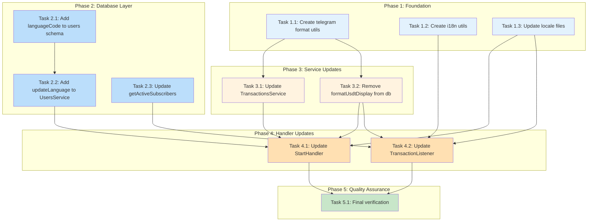
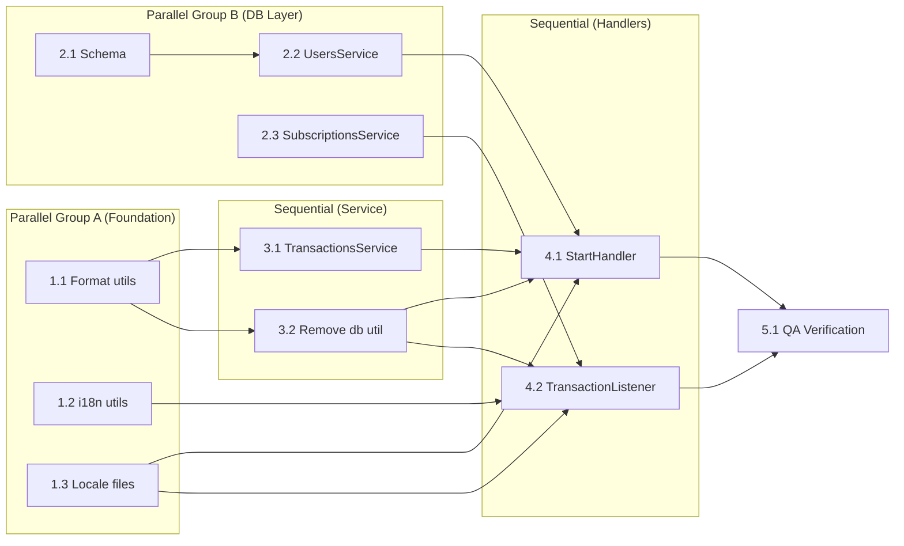

# Work Plan: User-Friendly Messages and Ukrainian Locale

## Overview

| Attribute | Value |
|-----------|-------|
| Source Design Doc | `docs/design/i18n-user-friendly-messages-design.md` |
| Target Branch | `main` |
| Estimated Effort | 2-3 days |
| Start Date | 2026-01-22 |
| Status | Not Started |

## Summary

This work plan implements user-friendly, celebratory messages for PayPing bot, adds Ukrainian locale support, and refactors the formatting utilities architecture. The implementation follows a horizontal slice (foundation-driven) approach as database schema and utilities must be created before handlers can be updated.

## Phase Structure Diagram



## Task Dependency Diagram



---

## Phase 1: Foundation

**Goal**: Create utility functions and locale files that other phases depend on.

**Tasks can run in parallel**: Yes (1.1, 1.2, 1.3 have no interdependencies)

### Task 1.1: Create telegram format utils

- [ ] **Completed**

**Description**: Create formatting utilities in the telegram lib for display purposes.

**Files to Create/Modify**:
- `libs/telegram/src/utils/format.utils.ts` (create)
- `libs/telegram/src/utils/index.ts` (create)
- `libs/telegram/src/utils/format.utils.spec.ts` (create)

**Implementation Details**:
1. Create `formatUsdtDisplay(rawAmount, decimals)` - converts raw USDT to formatted display with thousand separators
2. Create `formatWithSeparators(value)` - adds thousand separators to already-formatted numbers
3. Add barrel export in `index.ts`
4. Write unit tests covering edge cases (zero, negative, large numbers, invalid input)

**Completion Criteria**:
- [x] `formatUsdtDisplay("1234567890000")` returns `"1,234,567.89"` (AC-4.1)
- [x] `formatUsdtDisplay("1000000")` returns `"1.00"` (AC-4.1)
- [x] `formatWithSeparators("1234.56")` returns `"1,234.56"`
- [x] Unit tests pass: `pnpm test libs/telegram/src/utils/format.utils.spec.ts`
- [x] Build succeeds: `pnpm build`

**Verification Level**: L2 (tests pass)

---

### Task 1.2: Create i18n utils for event handlers

- [ ] **Completed**

**Description**: Create utility to load Fluent bundles outside grammY context for use in event handlers.

**Files to Create/Modify**:
- `libs/telegram/src/utils/i18n.utils.ts` (create)
- `libs/telegram/src/utils/i18n.utils.spec.ts` (create)
- `libs/telegram/src/utils/index.ts` (update)

**Implementation Details**:
1. Create `FluentLoader` class or function that loads `.ftl` files from locales directory
2. Export `translate(languageCode, key, params?)` function
3. Support fallback to 'en' when requested locale not found
4. Cache loaded bundles for performance

**Completion Criteria**:
- [x] `translate('en', 'notification-title')` returns English message (AC-8.3)
- [x] `translate('uk', 'notification-title')` returns Ukrainian message (AC-8.3)
- [x] `translate('unknown', 'notification-title')` falls back to English (AC-8.4)
- [x] Unit tests pass
- [x] Build succeeds

**Verification Level**: L2 (tests pass)

---

### Task 1.3: Update locale files (en/ru/uk)

- [ ] **Completed**

**Description**: Update English and Russian locales with user-friendly messages, create Ukrainian locale.

**Files to Create/Modify**:
- `libs/telegram/src/locales/en.ftl` (update)
- `libs/telegram/src/locales/ru.ftl` (update)
- `libs/telegram/src/locales/uk.ftl` (create)

**Implementation Details**:
1. Update `en.ftl`:
   - Welcome message: friendly, explains salary monitoring purpose
   - Notification title: celebratory ("Payment Received!")
   - Add `notification-time` key
   - Use approved emojis sparingly
2. Update `ru.ftl`:
   - Mirror all en.ftl keys with Russian translations
   - Ensure grammatically correct Russian (Cyrillic)
3. Create `uk.ftl`:
   - All keys from en.ftl with Ukrainian translations
   - Ensure grammatically correct Ukrainian (Cyrillic)

**Message Keys to Include**:
- `welcome`, `analytics-title`, `analytics-current`, `analytics-expected`, `analytics-expected-na`, `analytics-based-on`
- `status-subscribed`, `status-not-subscribed`
- `subscribe-success`, `subscribe-already`, `unsubscribe-success`, `unsubscribe-not-subscribed`
- `btn-subscribe`, `btn-unsubscribe`
- `notification-title`, `notification-amount`, `notification-from`, `notification-hash`, `notification-time`
- `error-generic`, `error-rate-limit`

**Completion Criteria**:
- [x] All message keys present in all 3 locale files (AC-3.2)
- [x] Messages are celebratory/friendly in tone (AC-1.1, AC-2.1)
- [x] Ukrainian translations grammatically correct (AC-3.3)
- [x] Build succeeds and locales load without error (AC-1.2)

**Verification Level**: L3 (build succeeds)

---

## Phase 2: Database Layer

**Goal**: Add language preference support to the database.

**Prerequisite**: None (can run parallel to Phase 1)

### Task 2.1: Add languageCode to users schema

- [ ] **Completed**

**Description**: Add `languageCode` column to users table for storing user language preference.

**Files to Create/Modify**:
- `libs/db/src/schema/users.ts` (update)

**Implementation Details**:
1. Add `languageCode` column: `varchar('language_code', { length: 10 })`
2. Column should be nullable with default null
3. Run `pnpm drizzle-kit generate` to create migration

**Completion Criteria**:
- [x] `users` table has `language_code` column (AC-7.1)
- [x] Column is nullable, default null (AC-7.1)
- [x] Migration generated successfully
- [x] `pnpm drizzle-kit push` applies migration

**Verification Level**: L3 (migration applies)

---

### Task 2.2: Add updateLanguage to UsersService

- [ ] **Completed**

**Description**: Add method to update user's language preference.

**Files to Create/Modify**:
- `libs/db/src/services/users.service.ts` (update)
- `libs/db/src/services/__tests__/users.service.int.test.ts` (update)

**Implementation Details**:
1. Add `updateLanguage(telegramId: number, languageCode: string): Promise<void>` method
2. Update user record where telegramId matches
3. Add integration test

**Completion Criteria**:
- [x] `updateLanguage(123, 'uk')` updates user's language_code (AC-7.2)
- [x] Integration test passes
- [x] Build succeeds

**Verification Level**: L2 (tests pass)

---

### Task 2.3: Update getActiveSubscribers

- [ ] **Completed**

**Description**: Modify `getActiveSubscribers()` to return `languageCode` alongside `telegramId`.

**Files to Create/Modify**:
- `libs/db/src/services/subscriptions.service.ts` (update)
- `libs/db/src/services/__tests__/subscriptions.service.int.test.ts` (update if exists)

**Implementation Details**:
1. Update return type to include `languageCode: string | null`
2. Modify query to select `languageCode` from joined users table
3. Update any existing tests

**Completion Criteria**:
- [x] Return type includes `languageCode` field (AC-8.1)
- [x] Existing tests updated and pass
- [x] Build succeeds

**Verification Level**: L2 (tests pass)

---

## Phase 3: Service Updates

**Goal**: Refactor service layer to return raw data and remove display formatting from db module.

**Prerequisite**: Task 1.1 completed

### Task 3.1: Update TransactionsService (raw return, fix getRollingAverage)

- [ ] **Completed**

**Description**: Modify `getMonthlySum()` to return raw amount and fix `getRollingAverage()` internal calculation.

**Files to Create/Modify**:
- `libs/db/src/services/transactions.service.ts` (update)
- `libs/db/src/services/__tests__/transactions.service.int.test.ts` (update)

**Implementation Details**:
1. `getMonthlySum()`: Remove `formatUsdt()` call, return raw amount as string
2. `getRollingAverage()`: Update internal calculation:
   - Store raw sums as numbers (not formatted strings)
   - Sum raw values
   - Format only at the end using `formatUsdt()` from `./utils/usdt.utils`
3. Update integration tests to expect raw format from `getMonthlySum()`

**Before**:
```typescript
// getMonthlySum returns "1234.56" (formatted)
return formatUsdt(sumInSmallestUnit);

// getRollingAverage parses formatted strings
const monthSum = await this.getMonthlySum(year, month);
totalSum += Number.parseFloat(monthSum); // Parses "1234.56"
```

**After**:
```typescript
// getMonthlySum returns "1234560000" (raw)
return sumInSmallestUnit.toString();

// getRollingAverage works with raw values
const monthSum = await this.getMonthlySum(year, month);
totalSum += Number.parseFloat(monthSum); // Parses raw "1234560000"
// Then formats at end
return formatUsdt(totalSum);
```

**Completion Criteria**:
- [x] `getMonthlySum()` returns raw amount string (AC-5.1)
- [x] `getRollingAverage()` returns formatted string with 2 decimals (AC-5.3)
- [x] `getRollingAverage()` internal calculation uses raw values (AC-5.4)
- [x] Integration tests updated and pass (AC-5.2)
- [x] Build succeeds

**Verification Level**: L2 (tests pass)

---

### Task 3.2: Remove formatUsdtDisplay from db

- [ ] **Completed**

**Description**: Remove display formatting utility from database module (belongs in telegram module).

**Files to Create/Modify**:
- `libs/db/src/utils/usdt.utils.ts` (update)
- `libs/db/src/utils/usdt.utils.spec.ts` (update)
- `libs/db/src/index.ts` (update)

**Implementation Details**:
1. Remove `formatUsdtDisplay()` function from `usdt.utils.ts`
2. Keep `formatUsdt()` and `toRawUsdt()` (data conversion, not display)
3. Remove export from `index.ts` (change `export * from './utils/usdt.utils'` to named exports)
4. Remove related tests from `usdt.utils.spec.ts`

**Completion Criteria**:
- [x] `formatUsdtDisplay` NOT exported from `@app/db` (AC-4.2)
- [x] `formatUsdt` and `toRawUsdt` still exported
- [x] Build succeeds (no broken imports at this point - Phase 4 will fix callers)
- [x] Tests pass

**Verification Level**: L3 (build succeeds)

---

## Phase 4: Handler Updates

**Goal**: Update handlers to use new utilities and implement per-user localization.

**Prerequisite**: Phase 1, Phase 2, Phase 3 all completed

### Task 4.1: Update StartHandler (save language, use new utils)

- [ ] **Completed**

**Description**: Refactor StartHandler to use new formatting utilities and save user language preference.

**Files to Create/Modify**:
- `libs/telegram/src/handlers/start.handler.ts` (update)
- `libs/telegram/src/handlers/start.handler.spec.ts` (update)

**Implementation Details**:
1. Remove private `formatWithSeparators()` method
2. Import `formatUsdtDisplay` from `../utils`
3. Update `buildMessage()` to use `formatUsdtDisplay(rawAmount)` instead of `formatWithSeparators(formattedAmount)`
4. Save user's language from `ctx.from.language_code` via `usersService.updateLanguage()` in `handleStart()`

**Before**:
```typescript
const currentAmount = this.formatWithSeparators(analytics.currentMonthSum);
```

**After**:
```typescript
import { formatUsdtDisplay } from '../utils';
// ...
const currentAmount = formatUsdtDisplay(analytics.currentMonthSum);
// ...
// In handleStart, after ensuring user exists:
const languageCode = ctx.from.language_code || 'en';
await this.usersService.updateLanguage(telegramId, languageCode);
```

**Completion Criteria**:
- [x] Private `formatWithSeparators()` removed (AC-6.1)
- [x] `formatUsdtDisplay` imported from `../utils` (AC-6.2)
- [x] User's language_code saved to database on /start (AC-6.3)
- [x] Unit tests pass
- [x] Build succeeds

**Verification Level**: L2 (tests pass)

---

### Task 4.2: Update TransactionListener (localize per user)

- [ ] **Completed**

**Description**: Implement per-user localized notifications using the new i18n utils.

**Files to Create/Modify**:
- `libs/telegram/src/listeners/transaction.listener.ts` (update)
- `libs/telegram/src/listeners/transaction.listener.spec.ts` (update or create)

**Implementation Details**:
1. Import `formatUsdtDisplay` from `../utils`
2. Import `translate` from `../utils/i18n.utils`
3. Refactor `formatNotificationMessage(transaction)` to `formatNotificationMessage(transaction, languageCode)`
4. Use `translate(languageCode, key, params)` for all message keys
5. Update notification loop to pass subscriber's `languageCode` (from `getActiveSubscribers()`)
6. Fallback to 'en' if `languageCode` is null

**Before**:
```typescript
import { formatUsdtDisplay, SubscriptionsService } from '@app/db';
// ...
const message = this.formatNotificationMessage(transaction);
// ...
private formatNotificationMessage(transaction: Transaction): string {
  return [
    'New Transaction',
    `Amount: ${formatUsdtDisplay(transaction.amount)} USDT`,
    // ...
  ].join('\n');
}
```

**After**:
```typescript
import { SubscriptionsService } from '@app/db';
import { formatUsdtDisplay } from '../utils';
import { translate } from '../utils/i18n.utils';
// ...
for (const subscriber of subscribers) {
  const lang = subscriber.languageCode || 'en';
  const message = this.formatNotificationMessage(transaction, lang);
  // send message...
}
// ...
private formatNotificationMessage(transaction: Transaction, languageCode: string): string {
  const amount = formatUsdtDisplay(transaction.amount);
  const title = translate(languageCode, 'notification-title');
  const amountLine = translate(languageCode, 'notification-amount', { amount });
  // ...
}
```

**Completion Criteria**:
- [x] `formatUsdtDisplay` imported from `../utils` (AC-4.3)
- [x] `translate` used for all message keys (AC-8.2)
- [x] Notifications localized per subscriber's language (AC-8.2)
- [x] Fallback to 'en' if languageCode is null (AC-8.4)
- [x] Unit tests pass
- [x] Build succeeds

**Verification Level**: L2 (tests pass)

---

## Phase 5: Quality Assurance

**Goal**: Verify all acceptance criteria met, no regressions, clean build.

**Prerequisite**: All previous phases completed

### Task 5.1: Final verification

- [ ] **Completed**

**Description**: Run comprehensive verification to ensure all acceptance criteria are met.

**Verification Checklist**:

**Tests**:
- [ ] `pnpm test` - All unit tests pass
- [ ] `pnpm test libs/db` - DB service tests pass
- [ ] `pnpm test libs/telegram` - Telegram handler/listener tests pass

**Build**:
- [ ] `pnpm build` - Build succeeds without errors
- [ ] `pnpm lint` - No linting errors

**Import Verification**:
- [ ] Grep for old import: `grep -r "formatUsdtDisplay.*@app/db" libs/` returns no results
- [ ] All `formatUsdtDisplay` imports are from `../utils` or `@app/telegram`

**Locale Verification**:
- [ ] All 3 locale files load without error
- [ ] Key count matches: `en.ftl`, `ru.ftl`, `uk.ftl` have same number of keys
- [ ] No missing keys in any locale

**Acceptance Criteria Verification**:

| AC | Description | Verification Method |
|----|-------------|-------------------|
| AC-1.1 | Transaction notification celebratory | Check en.ftl notification-title |
| AC-1.2 | Welcome explains salary monitoring | Check en.ftl welcome message |
| AC-1.3 | Subscribe confirmation friendly | Check en.ftl subscribe-success |
| AC-2.1 | Russian messages user-friendly | Check ru.ftl messages |
| AC-2.2 | Russian grammatically correct | Manual review |
| AC-3.1 | Ukrainian works with uk language_code | Manual test |
| AC-3.2 | All keys in uk.ftl | Compare key count |
| AC-3.3 | Ukrainian grammatically correct | Manual review |
| AC-4.1 | formatUsdtDisplay in telegram utils | File exists check |
| AC-4.2 | formatUsdtDisplay NOT in @app/db | Import grep check |
| AC-4.3 | TransactionListener uses ../utils | Import check |
| AC-5.1 | getMonthlySum returns raw | Unit test assertion |
| AC-5.2 | Tests expect raw format | Integration test check |
| AC-5.3 | getRollingAverage returns formatted | Unit test assertion |
| AC-5.4 | getRollingAverage internal fix | Code review |
| AC-6.1 | formatWithSeparators removed | File search |
| AC-6.2 | StartHandler uses new util | Import check |
| AC-6.3 | Language saved on /start | Code review |
| AC-7.1 | languageCode column exists | Schema check |
| AC-7.2 | updateLanguage method exists | Service check |
| AC-7.3 | Fallback to 'en' | Code review |
| AC-8.1 | getActiveSubscribers returns languageCode | Return type check |
| AC-8.2 | Notifications per-user localized | Code review |
| AC-8.3 | Fluent via i18n.utils | Import check |
| AC-8.4 | Fallback to 'en' | Code review |

**Manual E2E Test**:
- [ ] Start bot, send /start with `language_code='en'` - English messages displayed
- [ ] Start bot, send /start with `language_code='ru'` - Russian messages displayed
- [ ] Start bot, send /start with `language_code='uk'` - Ukrainian messages displayed
- [ ] Trigger transaction event - Notification received in user's language

**Completion Criteria**:
- [x] All automated tests pass
- [x] Build succeeds
- [x] No lint errors
- [x] All ACs verified
- [x] Manual E2E test passes

**Verification Level**: L1 (functional operation verified)

---

## E2E Verification Procedures (from Design Doc)

| Phase | Verification | Method |
|-------|--------------|--------|
| 1.1 | Utils created and tested | `pnpm test libs/telegram/src/utils` |
| 1.2 | i18n utils work | Unit tests pass |
| 1.3 | Locales load without error | Bot startup log check |
| 2.1 | Schema updated | Migration applies |
| 2.2 | updateLanguage works | Integration tests |
| 2.3 | getActiveSubscribers returns languageCode | Integration tests |
| 3.1 | Service returns raw amounts | Integration tests |
| 3.2 | No db display export | Import check fails |
| 4.1 | Handler formats correctly | Unit tests pass |
| 4.2 | Listener uses new imports | Unit tests pass |
| 5.1 | Full flow works | Manual E2E test |

---

## Risks and Mitigation

| Risk | Impact | Probability | Mitigation |
|------|--------|-------------|------------|
| Missed import update | Build fails | Low | Grep for old import path after Task 3.2 |
| Ukrainian translation quality | User confusion | Medium | Review by native speaker if available |
| getRollingAverage regression | Wrong display | Low | Integration test verifies formatted output |
| Fluent bundle loading fails | Notifications fail | Low | Unit tests verify translate() function |
| Database migration fails | Schema mismatch | Low | Test migration on dev environment first |

---

## Progress Tracking

| Phase | Task | Status | Notes |
|-------|------|--------|-------|
| 1 | 1.1 Create format utils | Not Started | |
| 1 | 1.2 Create i18n utils | Not Started | |
| 1 | 1.3 Update locale files | Not Started | |
| 2 | 2.1 Add languageCode schema | Not Started | |
| 2 | 2.2 Add updateLanguage | Not Started | |
| 2 | 2.3 Update getActiveSubscribers | Not Started | |
| 3 | 3.1 Update TransactionsService | Not Started | |
| 3 | 3.2 Remove db display util | Not Started | |
| 4 | 4.1 Update StartHandler | Not Started | |
| 4 | 4.2 Update TransactionListener | Not Started | |
| 5 | 5.1 Final verification | Not Started | |

---

## Update History

| Date | Changes | Author |
|------|---------|--------|
| 2026-01-22 | Initial work plan created | Claude |
