# Work Plan: Payout Analytics Feature Implementation

## Overview

| Attribute | Value |
|-----------|-------|
| Source Design Doc | `docs/design/payout-analytics-design.md` |
| Source ADR | `docs/adr/003-payout-analytics-architecture.md` |
| Source PRD | `docs/prd/payout-analytics-prd.md` |
| Target Branch | `main` |
| Estimated Effort | 4-6 days |
| Start Date | 2026-01-23 |
| Status | Not Started |
| Version | 2.0 |

## Summary

This work plan implements the Payout Analytics feature for PayPing bot, enabling real-time classification of recipient wallets with automatic salary change detection and employment status tracking. The implementation follows a vertical slice with foundation-first approach, as database schema and services must be established before handlers can be implemented.

### Key Deliverables

- New `/analytics` and `/rating` commands displaying payout recipient rankings with separate messages per classification
- Real-time transaction processing with automatic classification
- Salary change detection and "fired" status batch job
- Two new database tables: `recipient_wallets` (extended), `monthly_positions`, and `salary_history`
- Inline keyboard navigation for month selection
- Localization support (en, ru, uk)

## Phase Structure Diagram

```mermaid
graph TD
    subgraph "Phase 1: Database Schema Foundation"
        T1_1[Task 1.1: Create recipient_wallets schema]
        T1_2[Task 1.2: Create monthly_positions schema]
        T1_3[Task 1.3: Add fromAddress index to transactions]
        T1_4[Task 1.4: Generate and apply migration]
        T1_5[Task 1.5: Create salary_history schema]
    end

    subgraph "Phase 2: Core Analytics Logic"
        T2_1[Task 2.1: Create RecipientWalletsService]
        T2_2[Task 2.2: Create ClassificationService]
        T2_3[Task 2.3: Update AnalyticsService for real-time]
        T2_4[Task 2.4: Unit tests for services]
    end

    subgraph "Phase 3: Telegram Integration"
        T3_1[Task 3.1: Add localization strings]
        T3_2[Task 3.2: Create AnalyticsHandler with separate messages]
        T3_3[Task 3.3: Add type definitions]
    end

    subgraph "Phase 4: Testing & QA"
        T4_1[Task 4.1: Integration tests]
        T4_2[Task 4.2: E2E tests]
        T4_3[Task 4.3: Performance benchmark tests]
        T4_4[Task 4.4: Final AC verification]
    end

    T1_1 --> T1_2
    T1_2 --> T1_3
    T1_3 --> T1_5
    T1_5 --> T1_4
    T1_4 --> T2_1
    T2_1 --> T2_2
    T2_2 --> T2_3
    T2_3 --> T2_4
    T2_4 --> T3_1
    T3_1 --> T3_2
    T3_2 --> T3_3
    T3_3 --> T4_1
    T4_1 --> T4_2
    T4_2 --> T4_3
    T4_3 --> T4_4

    style T1_1 fill:#e3f2fd
    style T1_2 fill:#e3f2fd
    style T1_3 fill:#e3f2fd
    style T1_4 fill:#e3f2fd
    style T1_5 fill:#e3f2fd
    style T2_1 fill:#bbdefb
    style T2_2 fill:#bbdefb
    style T2_3 fill:#bbdefb
    style T2_4 fill:#bbdefb
    style T3_1 fill:#fff3e0
    style T3_2 fill:#fff3e0
    style T3_3 fill:#fff3e0
    style T4_1 fill:#c8e6c9
    style T4_2 fill:#c8e6c9
    style T4_3 fill:#c8e6c9
    style T4_4 fill:#c8e6c9
```



## Task Dependency Diagram

```mermaid
graph LR
    subgraph "Foundation Layer"
        A1[1.1 recipient_wallets schema]
        A2[1.2 monthly_positions schema]
        A3[1.3 fromAddress index]
        A4[1.4 Migration]
        A5[1.5 salary_history schema]
    end

    subgraph "Data Layer"
        B1[2.1 RecipientWalletsService]
        B2[2.2 ClassificationService]
        B3[2.3 AnalyticsService real-time]
        B4[2.4 Unit tests]
    end

    subgraph "Presentation Layer"
        C1[3.1 Localization]
        C2[3.2 AnalyticsHandler]
        C3[3.3 Types]
    end

    subgraph "Quality Assurance"
        D1[4.1 Integration tests]
        D2[4.2 E2E tests]
        D3[4.3 Performance benchmark]
        D4[4.4 Final verification]
    end

    A1 --> A2
    A2 --> A3
    A3 --> A5
    A5 --> A4
    A4 --> B1
    B1 --> B2
    B2 --> B3
    B3 --> B4
    B4 --> C1
    C1 --> C2
    C2 --> C3
    C3 --> D1
    D1 --> D2
    D2 --> D3
    D3 --> D4
```



---

## Phase 1: Database Schema Foundation

**Goal**: Create database tables and indexes required for payout analytics feature with extended recipient wallet tracking.

**Estimated Duration**: 1 day

**Tasks are sequential**: Yes (schema dependencies)

### Task 1.1: Create recipient_wallets schema

- [ ] **Completed**

**Description**: Create Drizzle schema for recipient_wallets table with extended fields for salary and employment tracking.

**Files to Create/Modify**:
- `libs/db/src/schema/recipient-wallets.ts` (create)
- `libs/db/src/schema/index.ts` (update exports)

**Implementation Details**:
1. Create `classificationEnum` with values: `REGULAR_EMPLOYEE`, `FREELANCER`, `ONE_TIME_SERVICE`, `UNKNOWN`
2. Create `recipientWallets` table with columns:
   - `id`: serial PRIMARY KEY (generatedAlwaysAsIdentity)
   - `address`: varchar(64) UNIQUE NOT NULL
   - `classification`: enum DEFAULT 'UNKNOWN' NOT NULL
   - `firstSeenAt`: timestamp NOT NULL
   - `lastPaymentAt`: timestamp NOT NULL
   - `totalPayments`: integer DEFAULT 1 NOT NULL
   - `lastAmount`: varchar(78) NULL (last payment amount for salary tracking)
   - `hiredAt`: timestamp NULL (first payment date for employees)
   - `firedAt`: timestamp NULL (detected termination date)
   - `monthsWithoutPayment`: integer DEFAULT 0 NOT NULL (counter for fired detection)
   - `createdAt`: timestamp defaultNow() NOT NULL
   - `updatedAt`: timestamp defaultNow() NOT NULL with $onUpdateFn
3. Export from schema/index.ts

**Completion Criteria** (AC-3.1, AC-3.2, AC-3.3):
- [ ] Table schema defined with all columns including new fields
- [ ] Classification enum includes all 4 values
- [ ] Address column is unique
- [ ] New salary/employment fields: lastAmount, hiredAt, firedAt, monthsWithoutPayment
- [ ] Schema exports from index.ts
- [ ] Build succeeds: `pnpm build`

**Verification Level**: L3 (build succeeds)

---

### Task 1.2: Create monthly_positions schema

- [ ] **Completed**

**Description**: Create Drizzle schema for monthly_positions table to cache position calculations.

**Files to Create/Modify**:
- `libs/db/src/schema/monthly-positions.ts` (create)
- `libs/db/src/schema/index.ts` (update exports)

**Implementation Details**:
1. Create `monthlyPositions` table with columns:
   - `id`: serial PRIMARY KEY (generatedAlwaysAsIdentity)
   - `recipientWalletId`: integer REFERENCES recipient_wallets(id) NOT NULL
   - `yearMonth`: varchar(7) NOT NULL (format: '2026-01')
   - `position`: integer NOT NULL
   - `transactionHash`: varchar(64) NOT NULL
   - `amount`: varchar(78) NOT NULL (cumulative amount)
   - `paymentTimestamp`: bigint NOT NULL
   - `createdAt`: timestamp defaultNow() NOT NULL
2. Add unique constraint on (recipientWalletId, yearMonth)
3. Export from schema/index.ts

**Completion Criteria** (AC-5.3):
- [ ] Table schema defined with all columns
- [ ] Foreign key reference to recipient_wallets
- [ ] Unique constraint on (recipientWalletId, yearMonth)
- [ ] Schema exports from index.ts
- [ ] Build succeeds: `pnpm build`

**Verification Level**: L3 (build succeeds)

---

### Task 1.3: Add fromAddress index to transactions

- [ ] **Completed**

**Description**: Add index on transactions.from_address column for efficient payout queries.

**Files to Create/Modify**:
- `libs/db/src/schema/transactions.ts` (update)

**Implementation Details**:
1. Add index definition to transactions table schema callback (matching existing pattern):
   ```typescript
   (table) => [
     // Note: hash column unique constraint creates an implicit index, so no explicit index needed
     index('idx_transactions_timestamp').on(table.timestamp),
     index('idx_transactions_from_address').on(table.fromAddress),
   ]
   ```
2. This index is critical for performance - position calculation queries filter by fromAddress

**Completion Criteria**:
- [ ] Index definition added to transactions schema
- [ ] Build succeeds: `pnpm build`

**Verification Level**: L3 (build succeeds)

---

### Task 1.5: Create salary_history schema

- [ ] **Completed**

**Description**: Create Drizzle schema for salary_history table to track salary changes over time.

**Files to Create/Modify**:
- `libs/db/src/schema/salary-history.ts` (create)
- `libs/db/src/schema/index.ts` (update exports)

**Implementation Details**:
1. Create `salaryHistory` table with columns:
   - `id`: serial PRIMARY KEY (generatedAlwaysAsIdentity)
   - `recipientWalletId`: integer REFERENCES recipient_wallets(id) NOT NULL
   - `previousAmount`: varchar(78) NOT NULL (previous salary amount)
   - `newAmount`: varchar(78) NOT NULL (new salary amount)
   - `changePercent`: decimal(10, 2) NOT NULL (percentage change)
   - `detectedAt`: timestamp NOT NULL (when change was detected)
   - `transactionHash`: varchar(64) NOT NULL (triggering transaction)
   - `createdAt`: timestamp defaultNow() NOT NULL
2. Add index on recipientWalletId for efficient lookups
3. Export from schema/index.ts

**Completion Criteria**:
- [ ] Table schema defined with all columns
- [ ] Foreign key reference to recipient_wallets
- [ ] Index on recipientWalletId
- [ ] Schema exports from index.ts
- [ ] Build succeeds: `pnpm build`

**Verification Level**: L3 (build succeeds)

---

### Task 1.4: Generate and apply migration

- [ ] **Completed**

**Description**: Generate Drizzle migration for new tables and index.

**Files to Create/Modify**:
- `drizzle/migrations/*.sql` (generated)

**Implementation Details**:
1. Run `pnpm drizzle-kit generate` to create migration
2. Review generated SQL for correctness
3. Test migration with `pnpm drizzle-kit push` on dev database

**Completion Criteria**:
- [ ] Migration file generated
- [ ] Tables created: recipient_wallets, monthly_positions, salary_history
- [ ] Index created: idx_transactions_from_address
- [ ] Migration applies successfully

**Verification Level**: L3 (migration applies)

---

## Phase 2: Core Analytics Logic

**Goal**: Implement service layer for real-time classification, salary detection, and position calculation.

**Estimated Duration**: 2 days

**Prerequisite**: Phase 1 completed

### Task 2.1: Create RecipientWalletsService

- [ ] **Completed**

**Description**: Implement service for recipient wallet CRUD operations with extended field support.

**Files to Create/Modify**:
- `libs/db/src/services/recipient-wallets.service.ts` (create)
- `libs/db/src/db.module.ts` (register provider)
- `libs/db/src/index.ts` (export service)

**Implementation Details**:
1. Create `RecipientWalletsService` class with NestJS Injectable decorator
2. Implement methods:
   - `findByAddress(address: string): Promise<RecipientWallet | null>`
   - `upsertMany(wallets: RecipientWalletInput[]): Promise<RecipientWallet[]>`
   - `updateLastPayment(address: string, amount: string, paymentAt: Date): Promise<void>`
   - `updateClassification(address: string, classification: Classification): Promise<void>`
   - `markAsFired(address: string, firedAt: Date): Promise<void>`
   - `incrementMonthsWithoutPayment(addresses: string[]): Promise<void>`
   - `resetMonthsWithoutPayment(address: string): Promise<void>`
   - `getAll(): Promise<RecipientWallet[]>`
   - `getByClassification(classification: Classification): Promise<RecipientWallet[]>`
3. Inject DrizzleDB via constructor
4. Register in DbModule providers array
5. Export from libs/db/src/index.ts

**Completion Criteria** (AC-3.1, AC-9.1):
- [ ] Service class created with all methods including extended fields
- [ ] Service registered in DbModule
- [ ] Service exported from @app/db
- [ ] Build succeeds: `pnpm build`

**Verification Level**: L3 (build succeeds)

---

### Task 2.2: Create ClassificationService

- [ ] **Completed**

**Description**: Implement automatic classification logic with salary change detection and employment status tracking.

**Files to Create/Modify**:
- `libs/db/src/services/classification.service.ts` (create)
- `libs/db/src/db.module.ts` (register provider)
- `libs/db/src/index.ts` (export service)

**Implementation Details**:
1. Create `ClassificationService` class with NestJS Injectable decorator
2. Implement methods:
   - `evaluateClassification(wallet: RecipientWallet): Classification`
     - Rules for automatic classification:
       - 1 payment: `UNKNOWN`
       - 2 payments same month: `ONE_TIME_SERVICE`
       - 2+ payments different months, similar amounts (within 10%): `REGULAR_EMPLOYEE`
       - 2+ payments different months, varying amounts: `FREELANCER`
   - `detectSalaryChange(wallet: RecipientWallet, newAmount: string): SalaryChangeResult | null`
     - Compare newAmount with wallet.lastAmount
     - Return change details if > 5% difference for employees
     - Return null if no significant change
   - `checkEmploymentStatus(): Promise<FiredWallet[]>` (batch job)
     - Query wallets with classification = REGULAR_EMPLOYEE
     - Check monthsWithoutPayment >= 2
     - Mark as "fired" and return list for notification
3. Inject RecipientWalletsService and SalaryHistoryService
4. Register in DbModule providers array
5. Export from libs/db/src/index.ts

**SalaryChangeResult interface**:
```typescript
interface SalaryChangeResult {
  walletAddress: string;
  previousAmount: string;
  newAmount: string;
  changePercent: number;
  isIncrease: boolean;
}
```

**Completion Criteria**:
- [ ] evaluateClassification() correctly categorizes wallets
- [ ] detectSalaryChange() detects > 5% salary changes for employees
- [ ] checkEmploymentStatus() identifies wallets with 2+ months without payment
- [ ] Service registered in DbModule
- [ ] Service exported from @app/db
- [ ] Build succeeds: `pnpm build`

**Verification Level**: L3 (build succeeds)

---

### Task 2.3: Update AnalyticsService for real-time processing

- [ ] **Completed**

**Description**: Update AnalyticsService to process transactions in real-time when saved.

**Files to Create/Modify**:
- `libs/db/src/services/analytics.service.ts` (create)
- `libs/db/src/services/transactions.service.ts` (update - add hook)
- `libs/db/src/db.module.ts` (register provider)
- `libs/db/src/index.ts` (export service)

**Implementation Details**:
1. Create `AnalyticsService` class with NestJS Injectable decorator
2. Implement methods:
   - `processTransaction(transaction: Transaction): Promise<ProcessingResult>`
     - Called when transaction is saved (hook from TransactionsService)
     - Upsert recipient wallet with updated payment info
     - Evaluate and update classification using ClassificationService
     - Detect salary changes and record in salary_history
     - Update monthly_positions cache
     - Return classification result and any detected changes
   - `getMonthlyAnalytics(yearMonth: string): Promise<AnalyticsResult[]>`
   - `calculatePositions(yearMonth: string): Promise<void>`
   - `isCacheComplete(yearMonth: string): Promise<boolean>`
3. Hook into TransactionsService.saveTransaction():
   ```typescript
   async saveTransaction(tx: TransactionInput): Promise<Transaction> {
     const saved = await this.insert(tx);
     await this.analyticsService.processTransaction(saved);
     return saved;
   }
   ```
4. Position calculation algorithm:
   - Query transactions WHERE fromAddress = monitored wallet AND within yearMonth
   - Group by toAddress, aggregate amounts
   - Order by MIN(timestamp) ASC, then by transaction_hash ASC (determinism)
   - Use ROW_NUMBER window function for position assignment
5. Cache completeness logic (from Design Doc):
   - Past months: cache exists = complete
   - Current month: compare cache.createdAt with MAX(transaction.timestamp)

**ProcessingResult interface**:
```typescript
interface ProcessingResult {
  wallet: RecipientWallet;
  classificationChanged: boolean;
  previousClassification?: Classification;
  salaryChange?: SalaryChangeResult;
}
```

**Completion Criteria** (AC-2.3, AC-2.4, AC-2.5, AC-5.1, AC-5.2, AC-5.3):
- [ ] processTransaction() called on each transaction save
- [ ] Real-time classification updates working
- [ ] Salary change detection integrated
- [ ] Position calculation orders by timestamp, then hash (determinism)
- [ ] Cache check differentiates past vs current month
- [ ] Service registered in DbModule
- [ ] Service exported from @app/db
- [ ] Build succeeds: `pnpm build`

**Verification Level**: L3 (build succeeds)

---

### Task 2.4: Unit tests for classification and salary logic

- [ ] **Completed**

**Description**: Write comprehensive unit tests for ClassificationService, AnalyticsService, and RecipientWalletsService.

**Files to Create/Modify**:
- `libs/db/src/services/__tests__/recipient-wallets.service.spec.ts` (create)
- `libs/db/src/services/__tests__/classification.service.spec.ts` (create)
- `libs/db/src/services/__tests__/analytics.service.spec.ts` (create)

**Implementation Details**:
1. RecipientWalletsService tests:
   - `findByAddress()` returns wallet or null
   - `upsertMany()` creates new and updates existing
   - `updateLastPayment()` updates lastAmount and lastPaymentAt
   - `markAsFired()` sets firedAt timestamp
   - `incrementMonthsWithoutPayment()` increments counter
2. ClassificationService tests:
   - `evaluateClassification()` with 1 payment returns UNKNOWN
   - `evaluateClassification()` with 2 same-month payments returns ONE_TIME_SERVICE
   - `evaluateClassification()` with regular amounts returns REGULAR_EMPLOYEE
   - `evaluateClassification()` with varying amounts returns FREELANCER
   - `detectSalaryChange()` returns null for < 5% change
   - `detectSalaryChange()` returns result for >= 5% change
   - `checkEmploymentStatus()` identifies wallets without recent payments
3. AnalyticsService tests:
   - `processTransaction()` creates new recipient wallet
   - `processTransaction()` updates existing wallet classification
   - `processTransaction()` detects and records salary change
   - Position calculation with single transaction per recipient
   - Position calculation with multiple transactions to same recipient (AC-2.4)
   - Timestamp tie ordering by hash (AC-2.5)
   - Cache hit path (past month)
   - Cache miss path (calculation triggered)
   - Month comparison with NEW indicator (AC-5.2)
   - Month comparison with change indicators (AC-5.1)

**Test Case for Classification Logic**:
```typescript
it('should classify as REGULAR_EMPLOYEE when payments are consistent', async () => {
  // Arrange: Wallet with 3 payments in different months, similar amounts
  const wallet = {
    totalPayments: 3,
    firstSeenAt: new Date('2026-01-15'),
    lastPaymentAt: new Date('2026-03-15'),
    lastAmount: '1000.00',
    // payment history shows: 1000, 1020, 1000 (within 10%)
  };

  // Act
  const result = classificationService.evaluateClassification(wallet);

  // Assert
  expect(result).toBe('REGULAR_EMPLOYEE');
});
```

**Test Case for Salary Change Detection**:
```typescript
it('should detect salary increase above 5%', async () => {
  // Arrange
  const wallet = { lastAmount: '1000.00', classification: 'REGULAR_EMPLOYEE' };
  const newAmount = '1100.00'; // 10% increase

  // Act
  const result = classificationService.detectSalaryChange(wallet, newAmount);

  // Assert
  expect(result).not.toBeNull();
  expect(result.changePercent).toBe(10);
  expect(result.isIncrease).toBe(true);
});
```

**Completion Criteria**:
- [ ] Unit tests cover all service methods
- [ ] Classification logic tests cover all 4 classification types
- [ ] Salary change detection tests cover edge cases
- [ ] Fired detection tests cover batch job logic
- [ ] Timestamp tie test case implemented
- [ ] Tests pass: `pnpm test libs/db`
- [ ] Coverage >= 80% for new services

**Verification Level**: L2 (tests pass)

---

## Phase 3: Telegram Integration

**Goal**: Implement Telegram command handlers and localization for analytics feature with separate messages per classification.

**Estimated Duration**: 1.5 days

**Prerequisite**: Phase 2 completed

### Task 3.1: Add localization strings

- [ ] **Completed**

**Description**: Add analytics-related message keys to all locale files with support for separate classification messages.

**Files to Create/Modify**:
- `libs/telegram/src/locales/en.ftl` (update)
- `libs/telegram/src/locales/ru.ftl` (update)
- `libs/telegram/src/locales/uk.ftl` (update)

**Implementation Details**:
1. Add message keys (from PRD):
   - `analytics-title` = Payout Analytics
   - `analytics-month` = {$month} {$year}
   - `analytics-changes-from` = Position changes from
   - `analytics-header-position`, `analytics-header-wallet`, `analytics-header-type`, `analytics-header-prev`, `analytics-header-change`
   - `analytics-total` = Total: {$count} recipients | {$amount} USDT
   - `analytics-no-data` = No payout data for this month
   - `analytics-data-unavailable` = Data unavailable for this period
   - `btn-prev-month`, `btn-next-month`
   - `classify-employee` [E], `classify-freelancer` [F], `classify-onetime` [O], `classify-unknown` [?]
   - `position-up`, `position-down`, `position-same`, `position-new`
2. Add separate message headers for classification groups:
   - `analytics-employees-header` = Employees ({$count})
   - `analytics-freelancers-header` = Freelancers ({$count})
   - `analytics-onetime-header` = One-time ({$count})
   - `analytics-unknown-header` = Unknown ({$count})
   - `analytics-fired-header` = Terminated this month ({$count})
3. Add salary change notification strings:
   - `salary-increase` = Salary increase detected: {$wallet} +{$percent}%
   - `salary-decrease` = Salary decrease detected: {$wallet} -{$percent}%
4. Add fired notification strings:
   - `fired-notification` = Possible termination: {$wallet} (no payment for {$months} months)
5. Ensure all keys present in all 3 locales
6. Use Cyrillic characters for ru.ftl and uk.ftl

**Completion Criteria** (AC-6.1, AC-6.2, AC-6.3, AC-6.4):
- [ ] All message keys present in en.ftl, ru.ftl, uk.ftl
- [ ] Separate classification group headers added
- [ ] Salary change notification strings added
- [ ] Fired notification strings added
- [ ] Month names localized (January/Yanvar'/Sichen')
- [ ] Classification badges localized ([E]/[S]/[C] for ru)
- [ ] Build succeeds: `pnpm build`

**Verification Level**: L3 (build succeeds)

---

### Task 3.2: Create AnalyticsHandler with separate messages

- [ ] **Completed**

**Description**: Implement handler for /analytics and /rating commands with separate messages per classification group.

**Files to Create/Modify**:
- `libs/telegram/src/handlers/analytics.handler.ts` (create)
- `libs/telegram/src/handlers/analytics.handler.spec.ts` (create)
- `libs/telegram/src/telegram.module.ts` (register handler)

**Implementation Details**:
1. Create `AnalyticsHandler` class
2. Implement `handleAnalytics(ctx: BotContext)`:
   - Parse optional month parameter (/analytics 2026-01 or /analytics Jan)
   - Validate month is within 6-month range (AC-7.4)
   - Call AnalyticsService.getMonthlyAnalytics()
   - Group results by classification
   - Send separate messages for each classification group:
     a. **Employees message** - Position within employee group
     b. **Freelancers message** - Position within freelancer group
     c. **One-time message** - List of one-time payments
     d. **Unknown message** - List of unclassified wallets
     e. **Fired message** - List of recently terminated (if any)
   - Include inline keyboard on last message
3. Implement `handleNavigation(ctx: BotContext)`:
   - Handle callback queries for analytics:prev and analytics:next
   - Calculate target month from current display
   - Edit/delete existing messages and send new ones (AC-8.2)
   - Disable buttons at boundaries (AC-8.3, AC-8.4)
4. Address truncation: first 4 + last 3 characters (AC-2.2)
5. Register commands with bot in TelegramModule

**Message Format - Employees**:
```
Employees (3) - January 2026
Position changes from December 2025

 #  | Wallet       | Prev | Change
----+--------------+------+--------
 1  | TXyz...abc   |  1   |   =
 2  | TAbc...def   |  3   |   ^
 3  | TQrs...ghi   | NEW  |  NEW

Total: 15,000.00 USDT
```

**Message Format - Freelancers**:
```
Freelancers (2) - January 2026

 #  | Wallet       | Prev | Change
----+--------------+------+--------
 1  | TMno...xyz   |  2   |   ^
 2  | TPqr...stu   |  1   |   v

Total: 8,500.00 USDT
```

**Message Format - Fired**:
```
Terminated (1) - January 2026

Wallet       | Last Payment | Months Without
-------------+--------------+----------------
TDef...abc   | Nov 2025     | 2

Note: These wallets had regular payments but none in the last 2+ months.
```

**Completion Criteria** (AC-1.1, AC-1.2, AC-1.3, AC-2.1, AC-2.2, AC-7.1, AC-7.2, AC-7.3, AC-7.4, AC-8.1, AC-8.2, AC-8.3, AC-8.4):
- [ ] /analytics sends separate messages per classification
- [ ] /analytics responds within 3 seconds (AC-1.1)
- [ ] /rating works as alias (AC-1.2)
- [ ] No data message for empty months (AC-1.3)
- [ ] Table format matches design (AC-2.1)
- [ ] Wallet addresses truncated (AC-2.2)
- [ ] Month parameter parsing works (AC-7.1, AC-7.2)
- [ ] 6-month range validated (AC-7.4)
- [ ] Inline keyboard navigation works (AC-8.1, AC-8.2, AC-8.3, AC-8.4)
- [ ] Position within classification group (not global position)
- [ ] Fired message included when applicable
- [ ] Unit tests pass
- [ ] Build succeeds

**Verification Level**: L2 (tests pass)

---

### Task 3.3: Add type definitions

- [ ] **Completed**

**Description**: Add TypeScript types for analytics feature.

**Files to Create/Modify**:
- `libs/telegram/src/types/telegram.types.ts` (update)

**Implementation Details**:
1. Add `AnalyticsResult` interface
2. Add `Classification` type
3. Add `SalaryChangeResult` interface
4. Add `GroupedAnalytics` interface for separate message handling
5. Add callback action constants:
   ```typescript
   export const CALLBACK_ACTIONS = {
     // ... existing actions
     ANALYTICS_PREV: 'analytics:prev',
     ANALYTICS_NEXT: 'analytics:next',
   } as const;
   ```

**GroupedAnalytics interface**:
```typescript
interface GroupedAnalytics {
  employees: AnalyticsResult[];
  freelancers: AnalyticsResult[];
  oneTime: AnalyticsResult[];
  unknown: AnalyticsResult[];
  fired: FiredWallet[];
  month: string;
  previousMonth: string;
}
```

**Completion Criteria**:
- [ ] AnalyticsResult interface defined
- [ ] Classification type defined
- [ ] SalaryChangeResult interface defined
- [ ] GroupedAnalytics interface defined
- [ ] Callback actions added
- [ ] Build succeeds

**Verification Level**: L3 (build succeeds)

---

## Phase 4: Testing & QA

**Goal**: Comprehensive testing and final quality verification.

**Estimated Duration**: 1 day

**Prerequisite**: Phase 3 completed

### Task 4.1: Integration tests

- [ ] **Completed**

**Description**: Write integration tests for analytics feature with real database.

**Files to Create/Modify**:
- `libs/db/src/__tests__/analytics.int.test.ts` (create)

**Implementation Details**:
1. Test scenarios:
   - Position calculation with real transactions in database
   - Timestamp tie ordering with actual data
   - Cache write-through verification
   - Month comparison with real monthly_positions data
   - Recipient wallet creation during calculation
   - Real-time classification update on transaction save
   - Salary change detection and history recording
   - Fired status detection batch job
2. Use test database with seed data

**Completion Criteria**:
- [ ] Integration tests cover position calculation flow
- [ ] Timestamp tie test with real data passes
- [ ] Cache persistence verified
- [ ] Real-time processing integration verified
- [ ] Classification logic integration verified
- [ ] Salary change recording verified
- [ ] Tests pass: `pnpm test libs/db/src/__tests__/analytics.int.test.ts`

**Verification Level**: L2 (tests pass)

---

### Task 4.2: E2E tests

- [ ] **Completed**

**Description**: Write E2E tests for bot interaction with separate messages.

**Files to Create/Modify**:
- `libs/telegram/src/__tests__/analytics.e2e.test.ts` (create)

**Implementation Details**:
1. Test scenarios:
   - `/analytics` current month response with separate messages
   - `/analytics 2026-01` historical month response
   - `/rating` alias works
   - Navigation button clicks update all messages
   - Employees message format correct
   - Freelancers message format correct
   - One-time message format correct
   - Unknown message format correct
   - Fired message appears when applicable
   - Russian locale display
   - Ukrainian locale display
2. Mock Telegram API, use real database

**Completion Criteria**:
- [ ] E2E tests cover all command scenarios
- [ ] Separate message format verified for each classification
- [ ] Localization verified for all 3 languages
- [ ] Fired notification tested
- [ ] Tests pass

**Verification Level**: L1 (functional operation verified)

---

### Task 4.3: Performance benchmark tests

- [ ] **Completed**

**Description**: Verify performance requirements are met under realistic load conditions.

**Implementation Details**:
1. Create performance test suite targeting `/analytics` command response time
2. Test scenarios:
   - Standard load: 10-20 recipients, current month
   - High recipient count: 100 recipients
   - Historical data: 6 months of transaction history
   - Real-time processing: Transaction save with classification update
3. Measure query execution time separately from handler time
4. Ensure all tests complete within acceptable thresholds

**Performance Targets**:
- `/analytics` command responds within 3 seconds with 100 recipients
- Query execution time < 2 seconds with 6 months of historical data
- Aggregate calculation (total amount, recipient count) < 500ms
- Real-time transaction processing < 200ms (classification + position update)

**Completion Criteria** (AC-1.1):
- [ ] Performance test suite created
- [ ] `/analytics` responds within 3 seconds with 100 recipients
- [ ] Tests pass with 6 months of historical data
- [ ] Real-time processing meets 200ms target
- [ ] Query execution time measured and documented

**Verification Level**: L2 (tests pass)

---

### Task 4.4: Final AC verification

- [ ] **Completed**

**Description**: Comprehensive quality check and acceptance criteria verification.

**Verification Checklist**:

**Tests**:
- [ ] `pnpm test` - All unit tests pass
- [ ] `pnpm test libs/db` - DB service tests pass
- [ ] `pnpm test libs/telegram` - Telegram handler tests pass

**Build**:
- [ ] `pnpm build` - Build succeeds without errors
- [ ] `pnpm lint` - No linting errors

**Schema Verification**:
- [ ] `recipient_wallets` table created with all columns including new fields
- [ ] `monthly_positions` table created with unique constraint
- [ ] `salary_history` table created
- [ ] `idx_transactions_from_address` index created

**Locale Verification**:
- [ ] All 3 locale files have analytics keys
- [ ] Separate classification group headers added
- [ ] Salary/fired notification strings added
- [ ] Key count matches across locales
- [ ] Month names localized correctly

**Acceptance Criteria Verification**:

| AC | Description | Verification Method | Status |
|----|-------------|-------------------|--------|
| AC-1.1 | /analytics responds in 3s | Performance test | [ ] |
| AC-1.2 | /rating alias works | Unit test | [ ] |
| AC-1.3 | No data message | Unit test | [ ] |
| AC-2.1 | Table format correct | Visual inspection | [ ] |
| AC-2.2 | Wallet truncation | Unit test | [ ] |
| AC-2.3 | Sorted by timestamp | Unit test | [ ] |
| AC-2.4 | Multiple payments handling | Unit test | [ ] |
| AC-2.5 | Timestamp tie determinism | Unit test | [ ] |
| AC-3.1 | Recipient wallet creation | Integration test | [ ] |
| AC-3.2 | first_seen_at tracking | Integration test | [ ] |
| AC-3.3 | total_payments tracking | Integration test | [ ] |
| AC-4.1 | Classification badges | Unit test | [ ] |
| AC-4.2 | Unknown badge [?] | Unit test | [ ] |
| AC-4.3 | Localized abbreviations | Locale file check | [ ] |
| AC-5.1 | Position change indicators | Unit test | [ ] |
| AC-5.2 | NEW indicator | Unit test | [ ] |
| AC-5.3 | Cache persistence | Integration test | [ ] |
| AC-6.1 | Russian locale | E2E test | [ ] |
| AC-6.2 | Ukrainian locale | E2E test | [ ] |
| AC-6.3 | English fallback | Unit test | [ ] |
| AC-6.4 | Localized month names | Locale file check | [ ] |
| AC-7.1 | Month parameter YYYY-MM | Unit test | [ ] |
| AC-7.2 | Month parameter short | Unit test | [ ] |
| AC-7.3 | No data for month | Unit test | [ ] |
| AC-7.4 | 6-month range check | Unit test | [ ] |
| AC-8.1 | Inline keyboard display | Unit test | [ ] |
| AC-8.2 | Previous month button | E2E test | [ ] |
| AC-8.3 | Disable Next at current | Unit test | [ ] |
| AC-8.4 | Disable Previous at limit | Unit test | [ ] |

**New AC for v2.0**:

| AC | Description | Verification Method | Status |
|----|-------------|-------------------|--------|
| AC-10.1 | Separate messages per classification | E2E test | [ ] |
| AC-10.2 | Automatic classification on transaction | Integration test | [ ] |
| AC-10.3 | Salary change detection (>5%) | Unit test | [ ] |
| AC-10.4 | Salary history recording | Integration test | [ ] |
| AC-10.5 | Fired detection (2+ months) | Unit test | [ ] |
| AC-10.6 | Position within classification group | Unit test | [ ] |

**Manual E2E Test**:
- [ ] Send /analytics - Multiple messages display by classification
- [ ] Verify Employees message format
- [ ] Verify Freelancers message format
- [ ] Verify One-time message format
- [ ] Verify Unknown message format
- [ ] Click Previous button - All messages update
- [ ] Send /analytics 2025-12 - December 2025 displays
- [ ] Send /rating - Same as /analytics
- [ ] Change language to Russian - Russian text appears
- [ ] Trigger fired detection - Fired message appears

**Completion Criteria**:
- [ ] All automated tests pass
- [ ] Build succeeds
- [ ] No lint errors
- [ ] All ACs verified
- [ ] Manual E2E test passes
- [ ] Coverage >= 80%

**Verification Level**: L1 (functional operation verified)

---

## E2E Verification Procedures (from Design Doc)

| Phase | Verification | Method |
|-------|--------------|--------|
| 1.4 | Schema migration applies | `pnpm drizzle-kit generate && pnpm drizzle-kit push` |
| 2.1 | RecipientWalletsService CRUD | Unit test: `recipient-wallets.service.spec.ts` |
| 2.2 | Classification logic | Unit test: `classification.service.spec.ts` |
| 2.3 | Real-time processing | Integration test with transaction save hook |
| 2.3 | Position calculation | Unit test: `analytics.service.spec.ts` |
| 2.3 | Cache behavior | Integration test with database |
| 3.1 | i18n keys load | Build succeeds, bot startup |
| 3.2 | /analytics sends separate messages | E2E test with real bot |
| 3.2 | Navigation works | E2E test with callback handling |
| 4.4 | Full flow works | Manual test with Telegram |

---

## Risks and Mitigation

| Risk | Impact | Probability | Mitigation |
|------|--------|-------------|------------|
| Query performance > 3s | High | Medium | Add indexes, optimize query, implement pagination |
| Timestamp ties | Medium | Low | Secondary sort by transaction hash (deterministic) |
| Cache invalidation complexity | Medium | Low | Current month recalculates; past months immutable |
| Large recipient count (>100) | Medium | Medium | Implement pagination for > 20 recipients |
| Classification accuracy | High | Medium | Start with conservative rules, allow manual override later |
| Salary detection edge cases | Medium | Medium | Use 5% threshold, handle currency conversion carefully |
| Fired false positives | Medium | Medium | Use 2-month threshold, allow reinstatement on new payment |
| Multiple messages timing | Low | Low | Send messages sequentially with small delay |
| i18n key missing | Low | Low | Build-time validation of all keys |
| Drizzle migration issues | Medium | Low | Test migration on dev environment first |
| Historical data gaps | Low | Low | Show "No data available" message |

### Pagination Note (MVP Limitation)

For MVP, pagination is **not** implemented. The analytics table display is limited to the **first 20 recipients** per classification group.

**Current behavior**:
- If recipient count > 20 in a group, display shows first 20 rows
- Summary includes "(+N more)" indicator showing additional recipients not displayed
- Total count and amount in summary reflect ALL recipients (not just displayed)

**Example output with truncation**:
```
...
19 | TXyz...mno   |  19  |   =
20 | TAbc...pqr   |  22  |   ^

(+15 more employees)

Total: 35 employees | 75,000.00 USDT
```

**Future iteration**: Full pagination is documented as "Could Have" feature (FR-10) in PRD for implementation in a later iteration.

---

## Progress Tracking

| Phase | Task | Status | Start | Complete | Notes |
|-------|------|--------|-------|----------|-------|
| 1 | 1.1 Create recipient_wallets schema (extended) | Completed | 2026-01-23 | 2026-01-23 | |
| 1 | 1.2 Create monthly_positions schema | Completed | 2026-01-23 | 2026-01-23 | |
| 1 | 1.3 Add fromAddress index | Completed | 2026-01-23 | 2026-01-23 | |
| 1 | 1.5 Create salary_history schema | Completed | 2026-01-23 | 2026-01-23 | |
| 1 | 1.4 Generate migration | Completed | 2026-01-23 | 2026-01-23 | |
| 2 | 2.1 Create RecipientWalletsService | Completed | 2026-01-23 | 2026-01-23 | |
| 2 | 2.2 Create ClassificationService | Completed | 2026-01-23 | 2026-01-23 | |
| 2 | 2.3 Update AnalyticsService for real-time | Completed | 2026-01-23 | 2026-01-23 | |
| 2 | 2.4 Unit tests for services | Completed | 2026-01-23 | 2026-01-23 | |
| 3 | 3.1 Add localization strings | Completed | 2026-01-23 | 2026-01-23 | |
| 3 | 3.2 Create AnalyticsHandler with separate messages | Completed | 2026-01-23 | 2026-01-23 | |
| 3 | 3.3 Add type definitions | Completed | 2026-01-23 | 2026-01-23 | |
| 4 | 4.1 Integration tests | Completed | 2026-01-23 | 2026-01-23 | Skipped without DATABASE_URL |
| 4 | 4.2 E2E tests | Completed | 2026-01-23 | 2026-01-23 | Skipped without running bot |
| 4 | 4.3 Performance benchmark tests | Completed | 2026-01-23 | 2026-01-23 | Skipped without DATABASE_URL |
| 4 | 4.4 Final AC verification | In Progress | 2026-01-23 | | Manual E2E pending |

---

## File Change Summary

### New Files

| Path | Description |
|------|-------------|
| `libs/db/src/schema/recipient-wallets.ts` | Recipient wallets table schema (extended) |
| `libs/db/src/schema/monthly-positions.ts` | Monthly positions cache schema |
| `libs/db/src/schema/salary-history.ts` | Salary history tracking schema |
| `libs/db/src/services/recipient-wallets.service.ts` | Recipient wallet CRUD service |
| `libs/db/src/services/classification.service.ts` | Automatic classification service |
| `libs/db/src/services/analytics.service.ts` | Position calculation and real-time processing |
| `libs/db/src/services/__tests__/recipient-wallets.service.spec.ts` | Unit tests |
| `libs/db/src/services/__tests__/classification.service.spec.ts` | Unit tests |
| `libs/db/src/services/__tests__/analytics.service.spec.ts` | Unit tests |
| `libs/db/src/__tests__/analytics.int.test.ts` | Integration tests |
| `libs/telegram/src/handlers/analytics.handler.ts` | Analytics command handler |
| `libs/telegram/src/handlers/analytics.handler.spec.ts` | Unit tests |
| `libs/telegram/src/__tests__/analytics.e2e.test.ts` | E2E tests |

### Modified Files

| Path | Changes |
|------|---------|
| `libs/db/src/schema/index.ts` | Export new schemas |
| `libs/db/src/schema/transactions.ts` | Add fromAddress index |
| `libs/db/src/services/transactions.service.ts` | Add hook for real-time processing |
| `libs/db/src/db.module.ts` | Register new services |
| `libs/db/src/index.ts` | Export new services |
| `libs/telegram/src/locales/en.ftl` | Add analytics and classification strings |
| `libs/telegram/src/locales/ru.ftl` | Add analytics and classification strings |
| `libs/telegram/src/locales/uk.ftl` | Add analytics and classification strings |
| `libs/telegram/src/types/telegram.types.ts` | Add types and callback actions |
| `libs/telegram/src/telegram.module.ts` | Register handlers |

---

## Update History

| Date | Version | Changes | Author |
|------|---------|---------|--------|
| 2026-01-23 | 1.0 | Initial work plan created | Claude |
| 2026-01-23 | 1.1 | Added explicit coverage target for Task 2.3, added Task 5.4 Performance Benchmark Tests, added pagination MVP limitation note, updated Task 1.3 code snippet to match existing index pattern, added telegram.config.ts to Modified Files | Claude |
| 2026-01-23 | 2.0 | Major restructure: Removed Phase 4 (Admin Features), added Task 1.5 salary_history schema, extended recipient_wallets schema with salary/employment fields, replaced on-demand analytics with real-time processing, added ClassificationService with automatic classification and salary detection, updated AnalyticsHandler for separate messages per classification, renumbered Phase 5 to Phase 4, added classification accuracy and salary detection risks, updated file change summary | Claude |
