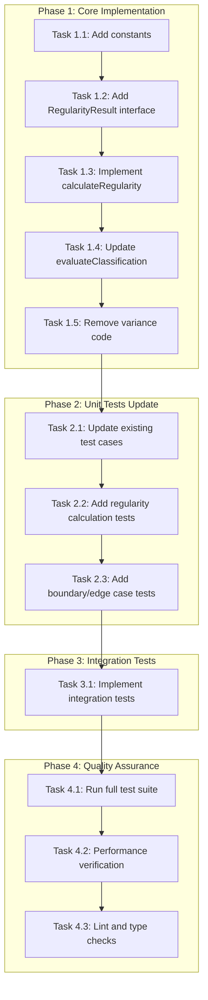
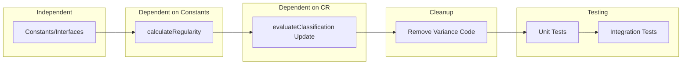

# Work Plan: Regularity-Based Classification Refactor

Created Date: 2026-01-24
Type: refactor
Estimated Duration: 1 day
Estimated Impact: 3 files (2 main + 1 integration test)
Related Issue/PR: N/A

## Related Documents
- Design Doc: [docs/design/regularity-classification-refactor-design.md](../design/regularity-classification-refactor-design.md)
- ADR: [docs/adr/003-payout-analytics-architecture.md](../adr/003-payout-analytics-architecture.md) (supersedes variance criteria)

## Objective

Refactor the wallet classification algorithm from variance-based (spread of payment amounts) to regularity-based (frequency and consistency of payments over months). The current implementation incorrectly classifies wallets based on payment amount variance, while the business requirement is to classify based on payment regularity across months.

## Background

### Current State (Variance-Based)
- EMPLOYEE: variance <= 20%
- FREELANCER: variance > 20%
- Uses `calculateVariance()` and `EMPLOYEE_VARIANCE_THRESHOLD` (0.20)
- Only requires 2 unique months for pattern analysis

### Target State (Regularity-Based)
- EMPLOYEE: regularity >= 70% AND span >= 3 months AND 3+ payments
- FREELANCER: regularity < 70% AND span >= 3 months AND 3+ payments
- Uses `calculateRegularity()` and `EMPLOYEE_REGULARITY_THRESHOLD` (0.70)
- Requires MIN_SPAN_MONTHS (3) and MIN_PAYMENTS_FOR_PATTERN (3)

### Why This Change
1. Business reality: Employees may receive varying amounts (base + bonuses) but are still regular employees
2. The distinguishing factor is regularity of payments, not amount stability
3. Example: Employee paid monthly with 1000, 1500, 2000, 1200 USDT should be EMPLOYEE, not FREELANCER

## Risks and Countermeasures

### Technical Risks
- **Risk**: Existing wallets may be reclassified differently on next payment
  - **Impact**: Medium - Users may see classification changes
  - **Countermeasure**: Expected behavior; wallet will correct on next payment based on actual regularity

- **Risk**: Edge cases in span calculation (same month, year boundary)
  - **Impact**: Low - May cause incorrect classification
  - **Countermeasure**: Comprehensive unit and integration tests for edge cases

- **Risk**: Regularity calculation performance
  - **Impact**: Low - Additional computation required
  - **Countermeasure**: Reuse existing data structures; no additional DB queries needed

### Schedule Risks
- **Risk**: Test updates may reveal additional edge cases
  - **Impact**: Low - May extend timeline slightly
  - **Countermeasure**: Design Doc already defines comprehensive test cases

## Phase Structure Diagram

## Task Dependency Diagram

## Implementation Phases

### Phase 1: Core Implementation (Estimated commits: 2)
**Purpose**: Implement regularity-based classification algorithm

#### Tasks
- [x] **Task 1.1**: Add new constants to ClassificationService
  - `EMPLOYEE_REGULARITY_THRESHOLD = 0.70`
  - `MIN_SPAN_MONTHS = 3`
  - `MIN_PAYMENTS_FOR_PATTERN = 3`

- [x] **Task 1.2**: Add RegularityResult interface
  - Define `{ uniqueMonths: number; spanMonths: number; regularity: number }`
  - Add optional `regularity` field to ClassificationResult interface

- [x] **Task 1.3**: Implement `calculateRegularity()` method
  - Extract unique months using UTC: `getUTCFullYear()`, `getUTCMonth()`
  - Calculate span: `(lastYear - firstYear) * 12 + (lastMonth - firstMonth) + 1`
  - Calculate regularity: `uniqueMonths / spanMonths`
  - Return RegularityResult

- [x] **Task 1.4**: Update `evaluateClassification()` algorithm
  - Replace variance check with regularity check
  - Add span >= 3 months requirement
  - Change payments threshold from 2 to 3
  - Update logging to show regularity instead of variance

- [ ] **Task 1.5**: Remove variance-based code
  - Remove `EMPLOYEE_VARIANCE_THRESHOLD` constant
  - Remove `calculateVariance()` method
  - Update class JSDoc comment

- [ ] Quality check: Code compiles without type errors

#### Phase Completion Criteria
- [ ] `calculateRegularity()` method implemented and returns correct values
- [ ] `evaluateClassification()` uses regularity-based logic
- [ ] All variance-related code removed
- [ ] TypeScript compilation succeeds

#### Operational Verification Procedures
1. Verify TypeScript compiles: `pnpm run build`
2. Verify no type errors in classification.service.ts
3. Manual code review: Ensure regularity calculation matches Design Doc pseudocode

### Phase 2: Unit Tests Update (Estimated commits: 1)
**Purpose**: Update unit tests to reflect new classification criteria

#### Tasks
- [x] **Task 2.1**: Update existing test cases (AC mapping)
  - Update AC-4.3 test: Change from "stable amounts" to "regularity >= 70%"
  - Update AC-4.4 test: Change from "high variance" to "regularity < 70%"
  - Remove `calculateVariance` test suite (replaced with calculateRegularity tests)

- [x] **Task 2.2**: Add regularity calculation tests
  - Test 100% regularity (consecutive months)
  - Test 60% regularity (gaps between months)
  - Test single month span (regularity = 100%, span = 1)
  - Test multiple payments same month (count as 1 unique)
  - Test year boundary handling (Dec -> Jan)

- [x] **Task 2.3**: Add boundary and edge case tests
  - Test exactly 70% regularity boundary (7/10 months) -> EMPLOYEE
  - Test 69.9% regularity (just below) -> FREELANCER
  - Test span < 3 months -> stays ONE_TIME
  - Test year boundary (Dec -> Jan) span calculation
  - Test 3+ payments but span < 3 months -> ONE_TIME

- [ ] Quality check: All unit tests pass

#### Test Case Resolution Progress
- AC-1.1: UNKNOWN classification (no change needed)
- AC-2.1, AC-2.2, AC-2.3: ONE_TIME classification (update span requirement)
- AC-3.1, AC-3.2, AC-3.3, AC-3.4: EMPLOYEE classification (new tests)
- AC-4.1: FREELANCER classification (update criteria)
- AC-5.1: FIRED classification (no change needed)
- AC-6.1, AC-6.2: Classification transitions (new regularity-based tests)
- AC-7.1: Rehire detection (no change needed)

#### Phase Completion Criteria
- [ ] All AC test cases implemented/updated
- [ ] calculateRegularity tests pass
- [ ] Boundary tests pass
- [ ] Edge case tests pass
- [ ] Unit test coverage >= 80%

#### Operational Verification Procedures
1. Run unit tests: `pnpm test libs/db/src/services/__tests__/classification.service.spec.ts`
2. Verify test count matches expected (at least 15+ test cases)
3. Check coverage: `pnpm test:cov -- --collectCoverageFrom='libs/db/src/services/classification.service.ts'`

### Phase 3: Integration Tests Implementation (Estimated commits: 1)
**Purpose**: Implement integration tests with real database interactions

#### Tasks
- [ ] **Task 3.1**: Implement integration test cases in `classification-regularity.int.test.ts`
  - Regularity Calculation Edge Cases:
    - 70% boundary test (7 unique months / 10 span)
    - Below 70% test (6 unique months / 10 span)
    - Multiple payments same month
  - Classification Transitions:
    - FREELANCER -> EMPLOYEE (regularity increases)
    - ONE_TIME -> EMPLOYEE (3+ payments, 3+ months, 70%+)
    - FIRED -> EMPLOYEE (rehire)
  - Span Calculation Edge Cases:
    - Inclusive span calculation
    - Span < 3 months stays ONE_TIME
    - Single month span
    - Year boundary handling
  - UTC Timezone Handling:
    - Month boundary at UTC midnight

- [ ] Quality check: Integration tests pass with test database

#### Phase Completion Criteria
- [ ] All integration test cases implemented
- [ ] Tests pass with DATABASE_URL set
- [ ] Tests properly skip when DATABASE_URL not available

#### Operational Verification Procedures
1. Start test database: `docker compose up -d postgres`
2. Run integration tests: `DATABASE_URL=... pnpm test classification-regularity.int.test.ts`
3. Verify all test cases pass
4. Verify database cleanup works correctly

### Phase 4: Quality Assurance (Required) (Estimated commits: 1)
**Purpose**: Overall quality assurance and Design Doc consistency verification

#### Tasks
- [ ] Verify all Design Doc acceptance criteria achieved
  - AC-1.1: UNKNOWN classification (verified)
  - AC-2.1, AC-2.2, AC-2.3: ONE_TIME classification (verified)
  - AC-3.1, AC-3.2, AC-3.3, AC-3.4: EMPLOYEE classification (verified)
  - AC-4.1: FREELANCER classification (verified)
  - AC-5.1: FIRED classification (unchanged, verified)
  - AC-6.1, AC-6.2: Classification transitions (verified)
  - AC-7.1: Rehire detection (unchanged, verified)

- [ ] Quality checks
  - `pnpm run lint` passes
  - `pnpm run check` passes (Biome)
  - TypeScript compilation succeeds

- [ ] Execute all tests
  - `pnpm test` - all tests pass
  - `pnpm test:cov` - coverage >= 80%

- [ ] Performance verification
  - Classification evaluation < 50ms (per Design Doc NFR)

- [ ] Document updates (if needed)
  - Update ADR-0003 to reference Design Doc for updated classification criteria

#### Operational Verification Procedures
1. Run full quality check: `pnpm run lint && pnpm run check && pnpm run build`
2. Run all tests: `pnpm test`
3. Check coverage report: `pnpm test:cov`
4. Performance test: Add timing log to verify < 50ms processing

## Files to Modify

| File | Change Type | Description |
|------|-------------|-------------|
| `libs/db/src/services/classification.service.ts` | Modify | Main algorithm refactor |
| `libs/db/src/services/__tests__/classification.service.spec.ts` | Modify | Unit test updates |
| `libs/db/src/services/__tests__/classification-regularity.int.test.ts` | Modify | Integration test implementation |

## Quality Assurance Summary

- [ ] Implement staged quality checks (ai-development-guide skill)
- [ ] All unit tests pass
- [ ] All integration tests pass
- [ ] Static check pass (TypeScript)
- [ ] Lint check pass (Biome)
- [ ] Build success
- [ ] Coverage >= 80%

## Completion Criteria

- [ ] All phases completed
- [ ] Each phase's operational verification procedures executed
- [ ] Design Doc acceptance criteria satisfied (AC-1.1 through AC-7.1)
- [ ] Staged quality checks completed (zero errors)
- [ ] All tests pass (unit + integration)
- [ ] Performance requirement met (< 50ms per classification)
- [ ] User review approval obtained

## Progress Tracking

### Phase 1: Core Implementation
- Start: ____-__-__ __:__
- Complete: ____-__-__ __:__
- Notes:

### Phase 2: Unit Tests Update
- Start: ____-__-__ __:__
- Complete: ____-__-__ __:__
- Notes:

### Phase 3: Integration Tests Implementation
- Start: ____-__-__ __:__
- Complete: ____-__-__ __:__
- Notes:

### Phase 4: Quality Assurance
- Start: ____-__-__ __:__
- Complete: ____-__-__ __:__
- Notes:

## Test Resolution Progress Summary

| Phase | Test Cases | Status |
|-------|------------|--------|
| Phase 2 | Unit tests: ~15 cases | Pending |
| Phase 3 | Integration tests: ~12 cases | Pending |
| **Total** | **~27 test cases** | **0/27 resolved** |

## Notes

### Key Implementation Details from Design Doc

1. **Regularity Formula**: `regularity = unique_months / span_months`
2. **Span Calculation**: `span_months = (lastYear - firstYear) * 12 + (lastMonth - firstMonth) + 1`
3. **UTC Timezone**: All timestamps use UTC for consistent month extraction
4. **Constants**:
   - `EMPLOYEE_REGULARITY_THRESHOLD = 0.70` (70%)
   - `MIN_SPAN_MONTHS = 3`
   - `MIN_PAYMENTS_FOR_PATTERN = 3`

### State Transitions (unchanged)
- UNKNOWN -> ONE_TIME: amount >= 500 USDT
- ONE_TIME -> EMPLOYEE/FREELANCER: 3+ payments, span >= 3 months
- FREELANCER <-> EMPLOYEE: regularity crosses 70% threshold
- EMPLOYEE -> FIRED: 2+ months without payment (batch job)
- FIRED -> EMPLOYEE: new payment (rehire)

### What NOT to Change (per Design Doc)
- Database schema
- AnalyticsService processing flow
- RecipientWalletsService CRUD
- Salary change detection (>5%)
- FIRED detection batch job
- Telegram handlers
- Localization strings
