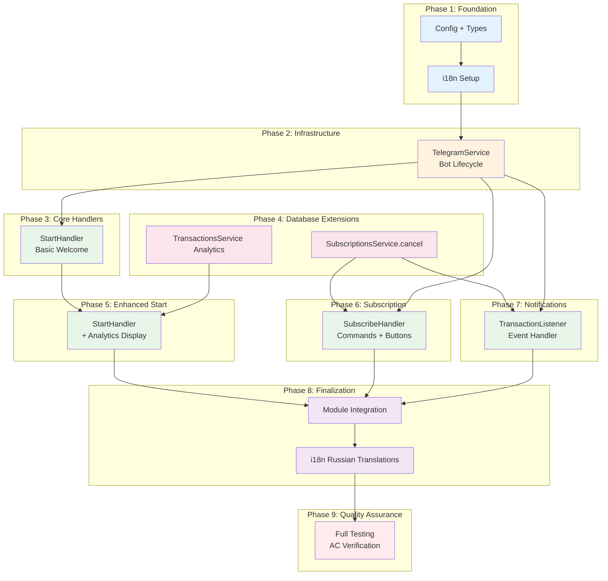
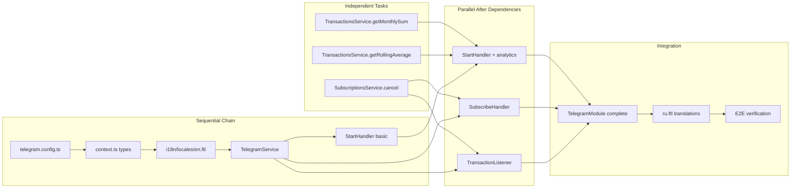

# Work Plan: Telegram Bot User Interface Implementation

Created Date: 2026-01-22
Type: feature
Estimated Duration: 5-7 days
Estimated Impact: 12+ files
Related Issue/PR: N/A

## Related Documents
- Design Doc: [docs/design/telegram-bot-design.md]
- PRD: [docs/prd/telegram-bot-prd.md]
- ADR: [docs/adr/ADR-0001-tron-blockchain-monitoring.md] (referenced for event pattern)
- ADR: [docs/adr/ADR-0002-drizzle-orm-selection.md] (referenced for DB access)

## Objective

Implement the Telegram bot user interface that enables users to:
1. Subscribe to real-time USDT transaction notifications
2. View income analytics (current month sum and 3-month rolling average)
3. Receive instant alerts when funds arrive at the monitored wallet
4. Interact via commands (/start, /subscribe, /unsubscribe) and inline buttons

This feature bridges the blockchain monitoring infrastructure with end-user engagement, delivering value directly to Telegram users.

## Background

**Current State:**
- `TelegramModule` exists as an empty shell with no implementation
- `TelegramService` is an empty injectable class
- `BlockchainModule` emits `transaction.new` events (no consumer)
- `SubscriptionsService` lacks a `cancel()` method
- `TransactionsService` lacks analytics methods (getMonthlySum, getRollingAverage)
- No i18n infrastructure exists in the project

**Target State:**
- Fully functional Telegram bot with grammY framework
- Commands and inline buttons for subscription management
- Real-time transaction notifications to active subscribers
- Bilingual support (Russian and English) via Fluent i18n

## Phase Structure Diagram

## Task Dependency Diagram

## Risks and Countermeasures

### Technical Risks

- **Risk**: grammY NestJS integration library is in alpha stage
  - **Impact**: High - potential breaking changes or missing features
  - **Countermeasure**: Manual integration without alpha package; use vanilla grammY with NestJS lifecycle hooks

- **Risk**: i18n configuration and Fluent syntax learning curve
  - **Impact**: Medium - may slow down development
  - **Countermeasure**: Start with English-only implementation; add Russian in final phase; reference grammY i18n plugin documentation

- **Risk**: Notification delivery rate under high subscriber volume
  - **Impact**: Medium - potential Telegram API rate limit violations
  - **Countermeasure**: Implement batched sending with 30 msg/sec limit; log failures and continue

- **Risk**: Database performance for analytics queries
  - **Impact**: Medium - slow response times if queries not optimized
  - **Countermeasure**: Use indexed columns; test with realistic data volumes; add caching if needed

### Schedule Risks

- **Risk**: Unfamiliar with grammY framework patterns
  - **Impact**: Medium - may require additional research time
  - **Countermeasure**: Phase 1-2 focused on foundation and learning; allocate extra buffer

- **Risk**: Integration complexity between NestJS and grammY lifecycle
  - **Impact**: Medium - onModuleInit/onModuleDestroy coordination
  - **Countermeasure**: Phase 2 dedicated to lifecycle management with thorough testing

## Implementation Phases

### Phase 1: Foundation - Configuration and Types (Estimated commits: 2)

**Purpose**: Establish configuration, type definitions, and i18n infrastructure required by all subsequent components.

**Dependencies**: None (independent)

**Technical Justification**: All handlers and services depend on configuration and type definitions. i18n middleware must be set up before any user-facing messages.

#### Tasks

- [ ] Task 1.1: Create `libs/telegram/src/config/telegram.config.ts`
  - Implement `registerAs('telegram', ...)` configuration
  - Define `TelegramConfig` interface with `botToken: string`
  - Add validation for missing bot token (throw on startup)
  - Files: `telegram.config.ts`, `telegram.config.spec.ts`

- [ ] Task 1.2: Create `libs/telegram/src/types/context.ts`
  - Define `BotContext` type extending grammY `Context` with `I18nFlavor`
  - Define `CALLBACK_ACTIONS` constants for inline buttons
  - Define `AnalyticsData` interface
  - Files: `context.ts`

- [ ] Task 1.3: Create i18n infrastructure with English locale
  - Create `libs/telegram/src/i18n/locales/en.ftl` with all message keys
  - Include: welcome, current-month-income, expected-income, status-*, btn-*, subscribed-success, unsubscribed-success, notification-*, already-subscribed, not-subscribed
  - Files: `en.ftl`

- [ ] Task 1.4: Install grammY and related dependencies
  - `pnpm add grammy @grammyjs/i18n`
  - Update package.json
  - Files: `package.json`, `pnpm-lock.yaml`

- [ ] Quality check: Lint and type check pass for new files

#### Phase Completion Criteria

- [ ] TelegramConfig loads bot token from environment correctly
- [ ] BotContext type compiles without errors
- [ ] English locale file contains all 15+ message keys from PRD
- [ ] grammY dependencies installed and importable

#### Operational Verification Procedures

1. Create unit test that verifies config throws when TELEGRAM_BOT_TOKEN is missing
2. Create unit test that verifies config returns token when set
3. Verify all Fluent message keys parse without syntax errors
4. Run `pnpm run check` and verify no type errors

---

### Phase 2: Infrastructure - TelegramService (Estimated commits: 2)

**Purpose**: Implement bot lifecycle management with NestJS integration.

**Dependencies**: Phase 1 (configuration and types)

**Technical Justification**: Bot instance must be properly managed before any handlers can be registered.

#### Tasks

- [ ] Task 2.1: Implement `TelegramService` with bot lifecycle
  - Inject `ConfigService` and retrieve bot token
  - Create `Bot<BotContext>` instance
  - Implement `OnModuleInit` interface with `bot.start()` call
  - Implement `OnModuleDestroy` interface with `bot.stop()` call
  - Add structured logging for lifecycle events
  - Files: `telegram.service.ts`

- [ ] Task 2.2: Configure i18n middleware
  - Initialize `I18n` with Fluent plugin
  - Set default locale to 'en'
  - Configure locale detection from `ctx.from.language_code`
  - Register middleware on bot instance
  - Files: `telegram.service.ts`

- [ ] Task 2.3: Add `sendMessage` helper method
  - Implement `sendMessage(chatId: number, text: string, options?: Other<'sendMessage'>)`
  - Handle errors gracefully (log and continue for notifications)
  - Respect Telegram rate limits in documentation
  - Files: `telegram.service.ts`

- [ ] Task 2.4: Add `getBot()` accessor method
  - Expose bot instance for handler registration
  - Files: `telegram.service.ts`

- [ ] Task 2.5: Create unit tests for TelegramService
  - Test lifecycle methods with mocked bot
  - Test error handling when bot start fails
  - Files: `telegram.service.spec.ts`

- [ ] Quality check: All unit tests pass

#### Phase Completion Criteria

- [ ] Bot starts successfully with valid token
- [ ] Bot stops gracefully on module destroy
- [ ] i18n middleware configured and detects language
- [ ] sendMessage method works with proper error handling
- [ ] Unit tests achieve 80%+ coverage for TelegramService

#### Operational Verification Procedures

1. Set TELEGRAM_BOT_TOKEN in .env and run `pnpm run start:dev`
2. Verify log output shows "Bot starting..." and "Bot started"
3. Send SIGTERM and verify graceful shutdown log
4. Run `pnpm run test -- telegram.service` and verify all tests pass

---

### Phase 3: Basic StartHandler (Estimated commits: 1)

**Purpose**: Implement /start command with welcome message (analytics added in Phase 5).

**Dependencies**: Phase 2 (TelegramService must be operational)

**Technical Justification**: Verify bot can receive and respond to commands before adding complex logic.

#### Tasks

- [ ] Task 3.1: Create `libs/telegram/src/handlers/start.handler.ts`
  - Inject TelegramService to access bot instance
  - Register `/start` command handler in constructor
  - Respond with localized welcome message using `ctx.t('welcome')`
  - Include Subscribe/Unsubscribe inline buttons (non-functional initially)
  - Files: `start.handler.ts`

- [ ] Task 3.2: Create unit tests for basic StartHandler
  - Mock bot context with `ctx.reply` spy
  - Verify welcome message sent
  - Verify inline keyboard included
  - Files: `start.handler.spec.ts`

- [ ] Quality check: Unit tests pass

#### Phase Completion Criteria

- [ ] /start command responds with welcome message
- [ ] Inline buttons displayed (Subscribe/Unsubscribe)
- [ ] Message uses i18n localization (English)

#### Operational Verification Procedures

1. Start bot with `pnpm run start:dev`
2. Open Telegram, find bot, send `/start`
3. Verify welcome message appears in English
4. Verify two inline buttons visible (may not work yet)
5. Run `pnpm run test -- start.handler` and verify tests pass

---

### Phase 4: Database Service Extensions (Estimated commits: 3)

**Purpose**: Add `cancel()` method to SubscriptionsService and analytics methods to TransactionsService.

**Dependencies**: None (can run parallel to Phase 2-3)

**Technical Justification**: Required by handlers in Phases 5-7. Independent of Telegram implementation.

#### Tasks

- [ ] Task 4.1: Add `cancel(userId: number)` to SubscriptionsService
  - Set subscription status to 'cancelled' for user's active subscription
  - Preserve record (no deletion)
  - Return void (fail-fast on errors)
  - Add structured logging
  - Files: `libs/db/src/services/subscriptions.service.ts`

- [ ] Task 4.2: Add `getMonthlySum(year: number, month: number)` to TransactionsService
  - Sum USDT incoming transactions for specified month
  - Filter by `toAddress = monitoredWallet` (incoming only)
  - Return "0" if no transactions
  - Preserve 6 decimal precision
  - Files: `libs/db/src/services/transactions.service.ts`

- [ ] Task 4.3: Add `getRollingAverage(months: number)` to TransactionsService
  - Calculate average of last N months' sums
  - Use available months if fewer than N exist
  - Return "0" if no data
  - Return with 2 decimal precision for display
  - Files: `libs/db/src/services/transactions.service.ts`

- [ ] Task 4.4: Create unit tests for new methods
  - Test cancel active subscription
  - Test cancel when no active subscription (no-op)
  - Test getMonthlySum with data, empty data, edge cases
  - Test getRollingAverage with 3 months, 1 month, 0 months data
  - Files: `subscriptions.service.spec.ts`, `transactions.service.spec.ts`

- [ ] Quality check: All new tests pass, existing tests still pass

#### Phase Completion Criteria

- [ ] SubscriptionsService.cancel() sets status to 'cancelled'
- [ ] TransactionsService.getMonthlySum() returns correct sum
- [ ] TransactionsService.getRollingAverage() handles < 3 months data (AC-1.3)
- [ ] All methods return "0" for empty data (AC-1.4)
- [ ] Unit tests achieve 80%+ coverage for new methods

#### Operational Verification Procedures

1. Run `pnpm run test -- subscriptions.service` - all tests pass
2. Run `pnpm run test -- transactions.service` - all tests pass
3. Manual verification with test database:
   - Insert test transactions, verify getMonthlySum
   - Verify getRollingAverage with 1, 2, 3+ months data

---

### Phase 5: Enhanced StartHandler with Analytics (Estimated commits: 1)

**Purpose**: Enhance /start to display income analytics.

**Dependencies**: Phase 3 (basic StartHandler), Phase 4 (analytics methods)

**Technical Justification**: StartHandler now has access to analytics data from TransactionsService.

#### Tasks

- [ ] Task 5.1: Inject TransactionsService into StartHandler
  - Add constructor dependency
  - Update module providers if needed
  - Files: `start.handler.ts`

- [ ] Task 5.2: Fetch and display analytics in /start
  - Call `getMonthlySum()` for current month
  - Call `getRollingAverage(3)` for expected income
  - Format amounts with thousand separators and 2 decimals
  - Display using localized message keys
  - Files: `start.handler.ts`

- [ ] Task 5.3: Inject UsersService and SubscriptionsService
  - Check if user exists and has active subscription
  - Display subscription status in message
  - Files: `start.handler.ts`

- [ ] Task 5.4: Update unit tests for analytics display
  - Mock TransactionsService.getMonthlySum
  - Mock TransactionsService.getRollingAverage
  - Verify amounts displayed correctly
  - Verify subscription status shown
  - Files: `start.handler.spec.ts`

- [ ] Quality check: All tests pass

#### Phase Completion Criteria

- [ ] /start displays current month income (AC-1.1)
- [ ] /start displays expected income from 3-month average (AC-1.2)
- [ ] Shows "0.00 USDT" when no data (AC-1.4)
- [ ] Shows subscription status (AC-1.5)
- [ ] Response time < 2 seconds

#### Operational Verification Procedures

1. Start bot, send /start
2. Verify current month income displayed (may be 0.00 initially)
3. Verify expected income displayed
4. Verify subscription status shows "Not subscribed"
5. Run `pnpm run test -- start.handler` - all tests pass

---

### Phase 6: SubscribeHandler (Estimated commits: 2)

**Purpose**: Implement /subscribe, /unsubscribe commands and inline button callbacks.

**Dependencies**: Phase 2 (TelegramService), Phase 4 (cancel method)

**Technical Justification**: Subscription management requires both bot access and database operations.

#### Tasks

- [ ] Task 6.1: Create `libs/telegram/src/handlers/subscribe.handler.ts`
  - Inject UsersService, SubscriptionsService, TelegramService
  - Register `/subscribe` and `/unsubscribe` command handlers
  - Files: `subscribe.handler.ts`

- [ ] Task 6.2: Implement handleSubscribe
  - Create user if not exists (UsersService.create)
  - Check for existing active subscription
  - If already subscribed: respond with "already-subscribed" message (AC-2.3)
  - If not subscribed: create subscription with 365-day expiry, respond with confirmation (AC-2.1, AC-2.2, AC-2.4)
  - Files: `subscribe.handler.ts`

- [ ] Task 6.3: Implement handleUnsubscribe
  - Find user by Telegram ID
  - If no active subscription: respond with "not-subscribed" message (AC-3.2)
  - If subscribed: call SubscriptionsService.cancel(), respond with confirmation (AC-3.1, AC-3.3, AC-3.4)
  - Files: `subscribe.handler.ts`

- [ ] Task 6.4: Register callback query handlers for inline buttons
  - Handle `action:subscribe` callback -> call handleSubscribe logic
  - Handle `action:unsubscribe` callback -> call handleUnsubscribe logic
  - Update original message with `ctx.editMessageText` (AC-4.3)
  - Files: `subscribe.handler.ts`

- [ ] Task 6.5: Wire button callbacks in StartHandler
  - Set callback_data for Subscribe button: `action:subscribe`
  - Set callback_data for Unsubscribe button: `action:unsubscribe`
  - Files: `start.handler.ts`

- [ ] Task 6.6: Create unit tests for SubscribeHandler
  - Test subscribe flow: new user, existing user, already subscribed
  - Test unsubscribe flow: subscribed user, not subscribed user
  - Test button callback handling
  - Files: `subscribe.handler.spec.ts`

- [ ] Quality check: All tests pass

#### Phase Completion Criteria

- [ ] /subscribe creates user and subscription (AC-2.1, AC-2.2)
- [ ] /subscribe shows confirmation message (AC-2.4)
- [ ] /subscribe handles already subscribed case (AC-2.3)
- [ ] /unsubscribe sets status to cancelled (AC-3.1)
- [ ] /unsubscribe shows confirmation message (AC-3.3)
- [ ] /unsubscribe handles not subscribed case (AC-3.2)
- [ ] Inline buttons trigger correct flows (AC-4.1, AC-4.2)
- [ ] Button actions update message (AC-4.3)

#### Operational Verification Procedures

1. Start bot, send /start, click Subscribe button
2. Verify "subscribed" confirmation message
3. Send /start again, verify status shows "Subscribed"
4. Click Unsubscribe button
5. Verify "unsubscribed" confirmation message
6. Send /subscribe command directly - verify works
7. Send /unsubscribe when not subscribed - verify appropriate message
8. Run `pnpm run test -- subscribe.handler` - all tests pass

---

### Phase 7: TransactionListener (Estimated commits: 2)

**Purpose**: Implement event listener for transaction notifications.

**Dependencies**: Phase 2 (TelegramService), Phase 4 (getActiveSubscribers)

**Technical Justification**: Notification delivery requires both bot access and subscriber lookup.

#### Tasks

- [ ] Task 7.1: Create `libs/telegram/src/listeners/transaction.listener.ts`
  - Inject SubscriptionsService, TelegramService
  - Use `@OnEvent(TRANSACTION_NEW_EVENT)` decorator
  - Import `TRANSACTION_NEW_EVENT` from `@app/blockchain`
  - Files: `transaction.listener.ts`

- [ ] Task 7.2: Implement onTransactionNew handler
  - Extract transaction data from event payload
  - Call SubscriptionsService.getActiveSubscribers()
  - Format notification message with: amount, truncated sender address, timestamp, hash
  - Use localized message keys
  - Files: `transaction.listener.ts`

- [ ] Task 7.3: Implement batch notification sending
  - Loop through subscribers, send notification to each
  - Use TelegramService.sendMessage()
  - Log each successful delivery
  - On failure: log error, continue with next subscriber (AC-5.3)
  - Respect 30 msg/sec rate limit (stagger if needed)
  - Files: `transaction.listener.ts`

- [ ] Task 7.4: Add timing and performance logging
  - Log total notification count
  - Log time from event receipt to completion
  - Target: < 5 seconds total (AC-5.1)
  - Files: `transaction.listener.ts`

- [ ] Task 7.5: Create unit tests for TransactionListener
  - Mock SubscriptionsService.getActiveSubscribers
  - Mock TelegramService.sendMessage
  - Test notification sent to all subscribers
  - Test failure handling for individual users
  - Test empty subscriber list
  - Files: `transaction.listener.spec.ts`

- [ ] Quality check: All tests pass

#### Phase Completion Criteria

- [ ] Listener receives transaction.new events (AC-5.1)
- [ ] Notifications sent to all active subscribers
- [ ] Notification contains amount, sender, timestamp (AC-5.2)
- [ ] Individual failures don't stop other notifications (AC-5.3)
- [ ] Rate limits respected (AC-5.4)
- [ ] Notifications delivered within 5 seconds of event

#### Operational Verification Procedures

1. Subscribe to notifications using /subscribe
2. Manually emit transaction.new event (or wait for real transaction)
3. Verify notification received with correct format
4. Check logs for timing information
5. Subscribe second user, verify both receive notifications
6. Run `pnpm run test -- transaction.listener` - all tests pass

---

### Phase 8: Module Integration and Russian Translations (Estimated commits: 2)

**Purpose**: Wire all components together and add Russian language support.

**Dependencies**: Phases 5, 6, 7 (all handlers implemented)

**Technical Justification**: Final integration and i18n completion.

#### Tasks

- [ ] Task 8.1: Update TelegramModule with all providers
  - Import DbModule for service access
  - Register all handlers as providers
  - Register TransactionListener as provider
  - Export TelegramService if needed
  - Files: `telegram.module.ts`

- [ ] Task 8.2: Update index.ts exports
  - Export TelegramModule
  - Export TelegramService
  - Export types (BotContext, etc.)
  - Files: `index.ts`

- [ ] Task 8.3: Register TelegramModule in AppModule
  - Import TelegramModule in app.module.ts
  - Ensure proper module ordering
  - Files: `src/app.module.ts`

- [ ] Task 8.4: Create Russian translations
  - Create `libs/telegram/src/i18n/locales/ru.ftl`
  - Translate all message keys to Russian (Cyrillic)
  - Review with native speaker if possible
  - Files: `ru.ftl`

- [ ] Task 8.5: Test Russian locale detection
  - Configure test user with Russian language
  - Verify all messages appear in Russian
  - Files: manual testing

- [ ] Quality check: Build succeeds, all tests pass

#### Phase Completion Criteria

- [ ] TelegramModule properly wired with all dependencies
- [ ] Application starts without errors
- [ ] Russian translations complete and correct (AC-6.2, AC-6.4)
- [ ] Language detection works correctly (AC-6.1)
- [ ] English fallback for non-Russian users (AC-6.3)

#### Operational Verification Procedures

1. Run `pnpm run build` - no errors
2. Run `pnpm run start:dev` - bot starts successfully
3. Test with English user: all messages in English
4. Test with Russian user (set Telegram language to Russian): all messages in Russian
5. Verify all commands work (/start, /subscribe, /unsubscribe)
6. Verify inline buttons work
7. Verify transaction notifications work

---

### Phase 9: Quality Assurance (Estimated commits: 1)

**Purpose**: Comprehensive testing, AC verification, and documentation.

**Dependencies**: All previous phases

#### Tasks

- [ ] Task 9.1: Run full test suite
  - `pnpm run test` - all tests pass
  - Files: N/A

- [ ] Task 9.2: Check test coverage
  - `pnpm run test:cov`
  - Verify 80%+ coverage for new code
  - Files: N/A

- [ ] Task 9.3: Run quality checks
  - `pnpm run lint` - no errors
  - `pnpm run check` - no type errors
  - `pnpm run format` - all files formatted
  - Files: N/A

- [ ] Task 9.4: Verify all acceptance criteria
  - AC-1.1 through AC-1.5: /start command with analytics
  - AC-2.1 through AC-2.4: /subscribe command
  - AC-3.1 through AC-3.4: /unsubscribe command
  - AC-4.1 through AC-4.3: Inline buttons
  - AC-5.1 through AC-5.4: Transaction notifications
  - AC-6.1 through AC-6.4: Language detection and i18n
  - AC-7.1, AC-7.2: Open access
  - Files: N/A (manual verification)

- [ ] Task 9.5: Performance verification
  - Verify /start response time < 2 seconds
  - Verify notification latency < 5 seconds
  - Document any performance concerns
  - Files: N/A

- [ ] Task 9.6: Update CLAUDE.md if needed
  - Add TelegramModule to architecture section
  - Document new commands/features
  - Files: `CLAUDE.md`

#### Phase Completion Criteria

- [ ] All 28 acceptance criteria verified
- [ ] Test coverage >= 80% for new code
- [ ] Zero lint/type errors
- [ ] Build succeeds
- [ ] Performance targets met
- [ ] Documentation updated

#### Operational Verification Procedures (from Design Doc)

**Configuration Verification:**
1. Unit test: `telegram.config.spec.ts` - token validation passes
2. i18n test: All Fluent files parse without errors

**Infrastructure Verification:**
1. Integration test: Bot starts and stops with mock
2. Verify lifecycle logs appear correctly

**Application Verification:**
1. E2E test: /start shows analytics with real bot
2. E2E test: Subscribe/Unsubscribe works with real bot
3. E2E test: Notifications delivered on event emission

**Integration Verification:**
1. Manual test: Complete flow with Telegram client
2. Verify Russian language user sees Russian text
3. Verify transaction notification within 5 seconds

---

## Quality Assurance Summary

- [ ] Staged quality checks completed (all phases)
- [ ] All tests pass (`pnpm run test`)
- [ ] Static check pass (`pnpm run check`)
- [ ] Lint check pass (`pnpm run lint`)
- [ ] Build success (`pnpm run build`)
- [ ] Coverage >= 80% for new code

## Completion Criteria

- [ ] All 9 phases completed
- [ ] Each phase's operational verification procedures executed
- [ ] All 28 Design Doc acceptance criteria satisfied
- [ ] Staged quality checks completed (zero errors)
- [ ] All tests pass
- [ ] Documentation updated (CLAUDE.md)
- [ ] User review approval obtained

## Progress Tracking

### Phase 1: Foundation
- Start: YYYY-MM-DD HH:MM
- Complete: YYYY-MM-DD HH:MM
- Notes:

### Phase 2: Infrastructure
- Start: YYYY-MM-DD HH:MM
- Complete: YYYY-MM-DD HH:MM
- Notes:

### Phase 3: Basic StartHandler
- Start: YYYY-MM-DD HH:MM
- Complete: YYYY-MM-DD HH:MM
- Notes:

### Phase 4: Database Extensions
- Start: YYYY-MM-DD HH:MM
- Complete: YYYY-MM-DD HH:MM
- Notes:

### Phase 5: Enhanced StartHandler
- Start: YYYY-MM-DD HH:MM
- Complete: YYYY-MM-DD HH:MM
- Notes:

### Phase 6: SubscribeHandler
- Start: YYYY-MM-DD HH:MM
- Complete: YYYY-MM-DD HH:MM
- Notes:

### Phase 7: TransactionListener
- Start: YYYY-MM-DD HH:MM
- Complete: YYYY-MM-DD HH:MM
- Notes:

### Phase 8: Module Integration
- Start: YYYY-MM-DD HH:MM
- Complete: YYYY-MM-DD HH:MM
- Notes:

### Phase 9: Quality Assurance
- Start: YYYY-MM-DD HH:MM
- Complete: YYYY-MM-DD HH:MM
- Notes:

## Acceptance Criteria Traceability Matrix

| AC ID | Description | Phase | Task |
|-------|-------------|-------|------|
| AC-1.1 | /start responds with welcome + current month income | 5 | 5.2 |
| AC-1.2 | /start displays expected income (3-month average) | 5 | 5.2 |
| AC-1.3 | Uses available months if < 3 months data | 4 | 4.3 |
| AC-1.4 | Shows "0.00 USDT" when no data | 4 | 4.2, 4.3 |
| AC-1.5 | /start displays Subscribe/Unsubscribe buttons | 3 | 3.1 |
| AC-2.1 | /subscribe creates user if not exists | 6 | 6.2 |
| AC-2.2 | /subscribe creates subscription with 'active' status | 6 | 6.2 |
| AC-2.3 | /subscribe shows "already subscribed" if active | 6 | 6.2 |
| AC-2.4 | /subscribe responds with confirmation | 6 | 6.2 |
| AC-3.1 | /unsubscribe sets status to 'cancelled' | 6 | 6.3 |
| AC-3.2 | /unsubscribe shows "not subscribed" message | 6 | 6.3 |
| AC-3.3 | /unsubscribe responds with confirmation | 6 | 6.3 |
| AC-3.4 | Records preserved (no deletion) | 4 | 4.1 |
| AC-4.1 | Subscribe button triggers subscription flow | 6 | 6.4 |
| AC-4.2 | Unsubscribe button triggers unsubscription flow | 6 | 6.4 |
| AC-4.3 | Button action updates original message | 6 | 6.4 |
| AC-5.1 | Notification sent within 5 seconds of event | 7 | 7.3, 7.4 |
| AC-5.2 | Notification contains amount, sender, timestamp | 7 | 7.2 |
| AC-5.3 | Individual failure doesn't stop others | 7 | 7.3 |
| AC-5.4 | Respects Telegram rate limits (30 msg/sec) | 7 | 7.3 |
| AC-6.1 | Detects language from ctx.from.language_code | 2 | 2.2 |
| AC-6.2 | Uses Russian for 'ru' language_code | 8 | 8.4 |
| AC-6.3 | Falls back to English for non-Russian | 2 | 2.2 |
| AC-6.4 | All strings in Fluent (.ftl) files | 1, 8 | 1.3, 8.4 |
| AC-7.1 | Allows any Telegram user | All | N/A (no auth) |
| AC-7.2 | No authentication required | All | N/A (no auth) |

## Notes

### Implementation Order Rationale

The phase ordering follows the Design Doc's technical dependencies:
1. Configuration must exist before service can load token
2. i18n must be set up before any user-facing messages
3. TelegramService must exist before handlers can register
4. Database extensions (Phase 4) are independent and can run parallel to Phases 2-3
5. StartHandler analytics requires both Phase 3 (basic handler) and Phase 4 (analytics methods)
6. SubscribeHandler and TransactionListener can run parallel after their dependencies

### Parallel Work Opportunities

- Phase 4 (Database Extensions) can be developed in parallel with Phases 2-3
- Phase 6 and Phase 7 can be developed in parallel after their dependencies are met

### Key Files Summary

**New Files:**
- `libs/telegram/src/config/telegram.config.ts`
- `libs/telegram/src/config/telegram.config.spec.ts`
- `libs/telegram/src/types/context.ts`
- `libs/telegram/src/handlers/start.handler.ts`
- `libs/telegram/src/handlers/start.handler.spec.ts`
- `libs/telegram/src/handlers/subscribe.handler.ts`
- `libs/telegram/src/handlers/subscribe.handler.spec.ts`
- `libs/telegram/src/listeners/transaction.listener.ts`
- `libs/telegram/src/listeners/transaction.listener.spec.ts`
- `libs/telegram/src/i18n/locales/en.ftl`
- `libs/telegram/src/i18n/locales/ru.ftl`

**Modified Files:**
- `libs/telegram/src/telegram.module.ts`
- `libs/telegram/src/telegram.service.ts`
- `libs/telegram/src/telegram.service.spec.ts`
- `libs/telegram/src/index.ts`
- `libs/db/src/services/subscriptions.service.ts`
- `libs/db/src/services/subscriptions.service.spec.ts`
- `libs/db/src/services/transactions.service.ts`
- `libs/db/src/services/transactions.service.spec.ts`
- `src/app.module.ts`
- `package.json`
- `CLAUDE.md`
