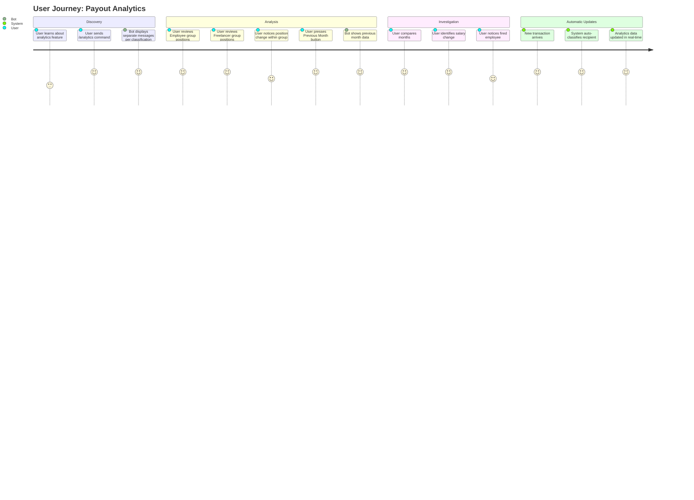
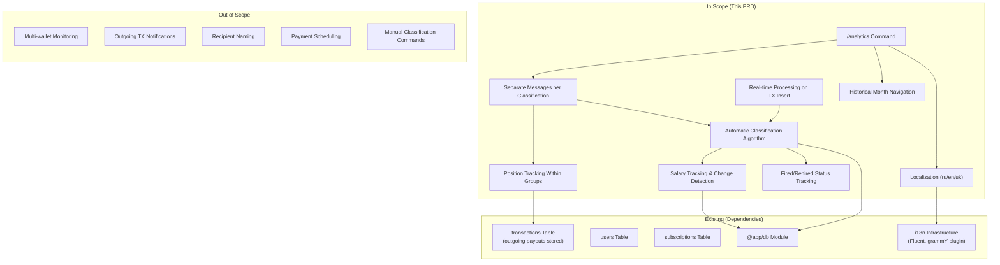

# PRD: Payout Analytics Feature

## Overview

### One-line Summary

A Telegram bot command that displays payout analytics with recipient wallet tracking, automatic classification, salary tracking, and monthly priority ranking to help users analyze payment patterns.

### Background

PayPing monitors a single TRON wallet for incoming transactions. The existing system already stores outgoing transactions (payouts) in the database. Finance teams and business owners need visibility into where payments are going, how frequently recipients are paid, and their relative priority within each payment cycle.

Current capabilities:
- Transaction monitoring for incoming USDT (TRC20)
- Monthly income analytics display via `/start` command
- Subscription-based real-time notifications

Missing capabilities:
- No visibility into outgoing payment patterns
- No recipient wallet tracking or classification
- No way to identify payment priority or schedule changes
- No automatic detection of employee status changes (salary increases, terminations, rehires)

This feature addresses a key business need: understanding payout patterns, automatically identifying regular employees vs. freelancers vs. one-time service payments, tracking salary changes, and detecting employment status changes.

## User Stories

### Primary Users

**Finance Team Members**: Responsible for tracking payroll disbursements and identifying payment pattern anomalies.

**Business Owners**: Need high-level visibility into who gets paid, when, and in what order.

**HR/Operations**: Monitor employee payment schedules and identify potential issues (delayed payments, position changes, terminations).

### User Stories

```
As a finance team member
I want to see a ranked list of payout recipients for the current month grouped by classification
So that I can quickly review employees, freelancers, and one-time payments separately
```

```
As a business owner
I want the system to automatically classify recipients based on payment patterns
So that I don't need to manually categorize each wallet
```

```
As an HR manager
I want to be notified when an employee's salary changes or when they are fired/rehired
So that I can ensure payment patterns match HR records
```

```
As a finance team member
I want to compare recipient positions between months within their classification group
So that I can identify changes in payment priority among similar payment types
```

```
As a Russian-speaking user
I want to view payout analytics in my language
So that I can understand the data without translation
```

### Use Cases

1. **Monthly Payout Review**: Finance team runs `/analytics` at month-end to verify all regular employees received payments. Analytics displays separate messages for each classification type with positions numbered within each group.

2. **Automatic Classification**: A new wallet receives its first payment of 1,500 USDT. The system automatically classifies it as "One-time" (first appearance with amount >= 500 USDT). After 3 months of regular payments with similar amounts, the system reclassifies it as "Employee".

3. **Salary Change Detection**: An employee's payment increases from 5,000 USDT to 6,000 USDT. The system detects the change, monitors for confirmation (two identical payments at new amount), and logs the salary increase.

4. **Termination Detection**: An employee wallet receives no payments for 2 consecutive months. The system automatically changes status to "Fired" with a door emoji indicator.

5. **Rehire Detection**: A previously fired employee's wallet receives a new payment. The system changes status back to "Employee" and logs the event as a rehire with the new salary.

## Functional Requirements

### Must Have (MVP)

- [ ] **FR-1: New `/analytics` Command with Grouped Display**
  - Respond to `/analytics` or `/rating` command
  - Display current month payout analytics by default
  - Show **SEPARATE MESSAGES per classification type** (Employees, Freelancers, One-time, Unknown)
  - Position numbers are **within classification group** (Employee #1, #2, #3 not global position)
  - AC: Given a subscribed user sends `/analytics`, When the bot responds, Then separate formatted messages display for each classification type within 3 seconds

- [ ] **FR-2: Recipient Wallet Table Display**
  - Show wallet address (truncated format: `TXyz...abc`)
  - Show position **within classification group** (not global position)
  - Show position in previous month within same classification (or "NEW" if first payment)
  - Show position change indicator (up arrow, down arrow, right arrow, or "NEW")
  - AC: Given 5 employees and 3 freelancers in current month, When user views analytics, Then employees appear in one message as #1-5 and freelancers appear in separate message as #1-3

- [ ] **FR-3: Recipient Wallet Entity**
  - Create new database entity for tracking recipient wallets
  - Store wallet address (unique)
  - Store classification: `UNKNOWN`, `ONE_TIME`, `EMPLOYEE`, `FREELANCER`, `FIRED`
  - Store first seen date, last payment date, and salary history
  - AC: Given a new recipient address in payout, When transaction is processed, Then recipient wallet record is created with appropriate automatic classification

- [ ] **FR-4: Automatic Classification Algorithm**
  - **Unknown (?)**: Transaction amount < 500 USDT
  - **One-time (O)**: First wallet appearance AND amount >= 500 USDT
  - **Employee (E)**: Regular payments + stable amounts (within tolerance range, accounting for bonuses/overtime)
  - **Freelancer (F)**: More than 1 payment AND varying amounts (high variance)
  - **Fired (door emoji)**: Employee with no payments for 2 consecutive months
  - **Rehired**: Fired employee receives payment - back to Employee, log salary change
  - AC: Given a wallet with 3 monthly payments of similar amounts (within 20% variance), When classification is evaluated, Then wallet is classified as EMPLOYEE

- [ ] **FR-5: Real-time Analytics Processing**
  - Analytics data updated **when transaction is added** (not on-demand)
  - Classification evaluated and updated on each new transaction
  - Position calculated and stored immediately after transaction processing
  - AC: Given a new payout transaction is recorded, When processing completes, Then recipient classification and monthly position are updated within 1 second

- [ ] **FR-6: Salary Tracking and Change Detection**
  - Track salary amounts for Employee-classified wallets
  - Analyze last 2-3 months to detect salary changes
  - **Salary increase confirmation**: Two identical payments at new amount = confirmed raise
  - If not confirmed after 2 months, check 3rd month for pattern
  - Log salary changes with timestamps
  - AC: Given an employee paid 5,000 USDT for 6 months receives 6,000 USDT, When two consecutive months show 6,000 USDT, Then salary increase is confirmed and logged

- [ ] **FR-7: Fired and Rehired Status Tracking**
  - Monitor Employee wallets for payment gaps
  - Mark as FIRED after 2 consecutive months without payment
  - If fired wallet receives new payment, change to EMPLOYEE and log as rehire
  - Include new salary in rehire log
  - AC: Given an Employee wallet with no payments in January and February, When March arrives without payment, Then wallet status changes to FIRED with door emoji indicator

- [ ] **FR-8: Localization Support**
  - Support Russian (ru), Ukrainian (uk), and English (en) languages
  - Use existing i18n infrastructure with Fluent format
  - Localize all user-facing strings including table headers and indicators
  - AC: Given user with `language_code='ru'`, When `/analytics` executed, Then all text displays in Russian

### Should Have

- [ ] **FR-9: Historical Month Selection**
  - Accept optional month parameter: `/analytics 2026-01` or `/analytics Jan`
  - Show analytics for specified month instead of current
  - Validate month exists in historical data (6 months back)
  - AC: Given user sends `/analytics 2025-12`, When processed, Then December 2025 analytics display

- [ ] **FR-10: Inline Keyboard Navigation**
  - Provide "Previous Month" and "Next Month" buttons
  - Update displayed analytics when button pressed
  - Disable "Next Month" when viewing current month
  - AC: Given user viewing January analytics, When "Previous Month" pressed, Then December analytics display

### Could Have

- [ ] **FR-11: Summary Statistics**
  - Show total payout amount for month per classification group
  - Show count of recipients per classification
  - Show overall breakdown summary
  - AC: Given 5 employees totaling 25,000 USDT and 3 freelancers totaling 8,000 USDT, When analytics viewed, Then each group message shows its total

- [ ] **FR-12: Export to CSV**
  - Inline button to export analytics as CSV file
  - Include all displayed data plus full wallet addresses
  - Send as Telegram document attachment

- [ ] **FR-13: Salary Change Notifications**
  - Notify when salary increase is detected and confirmed
  - Notify when employee is marked as fired
  - Notify when employee is rehired

### Out of Scope

- **Multi-wallet Monitoring**: Only the single predefined wallet's outgoing transactions are analyzed. Multiple source wallets are not supported.
- **Real-time Payout Notifications**: Outgoing transaction notifications are not part of this feature. Focus is on analytics only.
- **Recipient Wallet Naming**: Users cannot assign custom names to recipient wallets. Only address and classification are tracked.
- **Payment Scheduling**: No integration with payment scheduling systems. This feature is read-only analytics.
- **Manual Classification Commands**: No admin commands for manual classification. Classification is fully automatic based on payment patterns.
- **TRX Payouts**: Only USDT (TRC20) transactions are tracked initially.

## Non-Functional Requirements

### Performance

- **Response Time**: `/analytics` command must respond within 3 seconds for up to 100 recipients
- **Real-time Processing**: Classification and position updates must complete within 1 second of transaction recording
- **Database Query Time**: Grouped position calculation query must complete in under 500ms
- **Historical Data**: Support querying 6 months of historical data without degradation

### Reliability

- **Data Consistency**: Position calculations must be deterministic (same timestamp order every time)
- **Classification Accuracy**: Automatic classification must maintain >90% accuracy against expected patterns
- **Fallback Handling**: If no data exists for requested month, display informative message
- **Error Rate**: Less than 1% command failures due to internal errors

### Security

- **Wallet Address Privacy**: Addresses are truncated in display (first 4 + last 3 characters)
- **No Financial Advice**: Analytics are informational only, not financial recommendations

### Scalability

- **Recipient Growth**: Support up to 500 unique recipient wallets
- **Monthly Transactions**: Handle up to 1000 payouts per month
- **Index Optimization**: Monthly position queries must use indexed columns

## Success Metrics

### Quantitative Metrics

1. **Command Usage Rate**: >= 10 `/analytics` commands per active user per month
2. **Response Time P95**: < 3 seconds for analytics command
3. **Data Accuracy**: 100% position calculation accuracy (verified by audit)
4. **Historical Query Success**: >= 99% of historical month queries return data
5. **Classification Accuracy**: >= 90% of wallets classified correctly (verified by manual review of sample)
6. **Salary Change Detection Accuracy**: >= 95% of salary increases detected within 2 payment cycles

### Qualitative Metrics

1. **User Understanding**: Users can identify position changes at a glance within classification groups
2. **Classification Utility**: Automatic classifications accurately reflect payment types
3. **Localization Quality**: Messages are natural and grammatically correct in all supported languages
4. **Status Tracking Value**: Fired/rehired tracking provides actionable HR insights

## User Journey Diagram



## Scope Boundary Diagram



## User Interface Mockups (Text-based)

### /analytics Command Response (English) - Separate Messages

**Message 1: Employees**
```
Employees - January 2026
Position changes from December 2025

 #  | Wallet       | Prev | Change | Amount
----+--------------+------+--------+----------
 1  | TXyz...abc   |  1   |   =    | 5,000.00
 2  | TAbc...def   |  3   |   ^    | 4,500.00
 3  | TGhi...jkl   |  2   |   v    | 4,000.00

Total: 3 employees | 13,500.00 USDT

[<< Previous] [Next >>]
```

**Message 2: Freelancers**
```
Freelancers - January 2026
Position changes from December 2025

 #  | Wallet       | Prev | Change | Amount
----+--------------+------+--------+----------
 1  | TDef...ghi   |  1   |   =    | 2,500.00
 2  | TMno...pqr   | NEW  |  NEW   | 1,800.00

Total: 2 freelancers | 4,300.00 USDT

[<< Previous] [Next >>]
```

**Message 3: One-time**
```
One-time Payments - January 2026

 #  | Wallet       | Amount
----+--------------+----------
 1  | TJkl...mno   | 800.00

Total: 1 recipient | 800.00 USDT

[<< Previous] [Next >>]
```

**Message 4: Unknown (if any)**
```
Unknown - January 2026

 #  | Wallet       | Amount
----+--------------+----------
 1  | TQrs...tuv   | 150.00

Total: 1 recipient | 150.00 USDT
(Amounts < 500 USDT)

[<< Previous] [Next >>]
```

**Message 5: Fired (if any)**
```
Fired Employees

 #  | Wallet       | Last Payment  | Last Amount
----+--------------+---------------+------------
 1  | TWxy...zab   | November 2025 | 4,000.00

Total: 1 former employee
```

### Position Change Indicators

| Indicator | Meaning (EN) | Meaning (RU) |
|-----------|--------------|--------------|
| `^` | Position improved (paid earlier) | Pozitsiya uluchshilas' |
| `v` | Position declined (paid later) | Pozitsiya ukhudshilas' |
| `=` | Position unchanged | Pozitsiya ne izmenilas' |
| `NEW` | First payment to this wallet | Novyy poluchatel' |

### Classification Types

| Code | Type | Description (EN) | Description (RU) | Auto-Classification Rule |
|------|------|------------------|------------------|--------------------------|
| `[E]` | EMPLOYEE | Regular employee - consistent monthly | Sotrudnik | Regular payments + stable amounts |
| `[F]` | FREELANCER | Freelancer - irregular schedule | Frilancer | >1 payment + varying amounts |
| `[O]` | ONE_TIME | One-time - single payment | Razovyy | First appearance + >= 500 USDT |
| `[?]` | UNKNOWN | Unclassified wallet | Neopredeleno | Amount < 500 USDT |
| `[door]` | FIRED | Former employee | Uvolennyy | Employee + 2 months no payment |

## Technical Considerations

### Dependencies

**Existing Systems:**
- `@app/db`: Database module with Drizzle ORM
- `transactions` table: Stores all blockchain transactions (incoming and outgoing)
- `users` table: User records with Telegram ID and language preference
- `subscriptions` table: Active subscription tracking
- `@app/telegram`: Telegram bot module with grammY
- i18n infrastructure: Fluent-based localization (en.ftl, ru.ftl, uk.ftl)

**New Database Entities:**
- `recipient_wallets` table: Track recipient addresses, classifications, and salary history
- `monthly_positions` table: Store position history per recipient per month per classification
- `salary_history` table: Track salary changes for employee wallets

**External Services:**
- No new external service dependencies

### Constraints

- **Existing Transaction Data**: Outgoing transactions must already be stored in `transactions` table
- **Single Monitored Wallet**: All payouts originate from the single monitored wallet
- **Timestamp Precision**: Position order relies on transaction timestamp accuracy
- **6-Month History Limit**: No data available beyond 6 months of historical records
- **Real-time Processing**: Classification must run synchronously with transaction insertion

### Assumptions

- Outgoing transactions are identifiable by `fromAddress = monitored_wallet`
- Transaction timestamps are in milliseconds (TRON standard)
- Multiple transactions to same recipient in one month: position is based on first payment timestamp, amount shown is cumulative (sum of all payments in that month)
- Position is determined by timestamp order within UTC month boundaries **and within classification group**
- **Historical data availability**: The system is assumed to have approximately 6 months of historical transaction data. This assumption requires validation during implementation; actual data availability may vary and should be verified before feature launch.
- **Salary variance tolerance**: A 20% variance is acceptable for "stable amount" classification (accounts for bonuses, overtime, minor adjustments)
- **Classification stability**: Once a wallet reaches EMPLOYEE status, it remains EMPLOYEE unless fired (2 months no payment)

### Risks and Mitigation

| Risk | Impact | Probability | Mitigation |
|------|--------|-------------|------------|
| Position tie (same timestamp) | Medium | Low | Use secondary sort by transaction hash for determinism |
| Large recipient count | Medium | Medium | Implement pagination for >20 recipients per classification |
| Historical data gaps | Low | Low | Show "No data available" message with explanation |
| Classification algorithm edge cases | Medium | Medium | Log edge cases, implement override mechanism in future if needed |
| Performance degradation with real-time processing | Medium | Low | Add database indexes, optimize classification queries |
| False positive fired detection | Medium | Low | Only mark as fired after full 2 months, allow immediate rehire detection |
| Salary change false positives | Medium | Medium | Require 2 consecutive months at new amount for confirmation |

## Data Model

### New Entity: recipient_wallets

```
recipient_wallets
-----------------
id: serial PRIMARY KEY
address: varchar(64) UNIQUE NOT NULL
classification: varchar(20) DEFAULT 'UNKNOWN'
current_salary: varchar(78) NULL  -- Current expected salary for employees
first_seen_at: timestamp NOT NULL
last_payment_at: timestamp NOT NULL
last_payment_amount: varchar(78) NOT NULL
total_payments: integer DEFAULT 1
months_without_payment: integer DEFAULT 0  -- For fired detection
fired_at: timestamp NULL  -- When marked as fired
created_at: timestamp DEFAULT NOW()
updated_at: timestamp DEFAULT NOW()

INDEX: idx_recipient_wallets_address (address)
INDEX: idx_recipient_wallets_classification (classification)
```

### New Entity: monthly_positions

**Position Calculation Mechanism**: Monthly position records are calculated and stored **when transactions are added** (real-time processing). When a new payout transaction is recorded, the system immediately:
1. Creates or updates the recipient wallet record
2. Evaluates and updates classification
3. Calculates and stores the position within the classification group for that month

```
monthly_positions
-----------------
id: serial PRIMARY KEY
recipient_wallet_id: integer REFERENCES recipient_wallets(id)
year_month: varchar(7) NOT NULL  -- Format: '2026-01'
classification: varchar(20) NOT NULL  -- Classification at time of payment
position: integer NOT NULL  -- Position within classification group
transaction_hash: varchar(64) NOT NULL
amount: varchar(78) NOT NULL  -- Cumulative amount if multiple payments to same recipient
payment_timestamp: bigint NOT NULL  -- Timestamp of first payment (determines position)
created_at: timestamp DEFAULT NOW()
updated_at: timestamp DEFAULT NOW()

UNIQUE: (recipient_wallet_id, year_month)
INDEX: idx_monthly_positions_year_month (year_month)
INDEX: idx_monthly_positions_recipient (recipient_wallet_id)
INDEX: idx_monthly_positions_classification (classification, year_month)
```

### New Entity: salary_history

```
salary_history
--------------
id: serial PRIMARY KEY
recipient_wallet_id: integer REFERENCES recipient_wallets(id)
previous_salary: varchar(78) NULL
new_salary: varchar(78) NOT NULL
change_type: varchar(20) NOT NULL  -- 'INITIAL', 'INCREASE', 'DECREASE', 'REHIRE'
confirmed: boolean DEFAULT false  -- True after 2 months at new amount
detected_at: timestamp NOT NULL
confirmed_at: timestamp NULL
created_at: timestamp DEFAULT NOW()

INDEX: idx_salary_history_recipient (recipient_wallet_id)
INDEX: idx_salary_history_detected (detected_at)
```

### Classification Enum

```typescript
enum RecipientClassification {
  UNKNOWN = 'UNKNOWN',        // Amount < 500 USDT
  ONE_TIME = 'ONE_TIME',      // First appearance + >= 500 USDT
  EMPLOYEE = 'EMPLOYEE',      // Regular + stable amounts
  FREELANCER = 'FREELANCER',  // Multiple payments + varying amounts
  FIRED = 'FIRED',            // Employee + 2 months no payment
}
```

### Classification Algorithm Pseudocode

```
function classifyWallet(wallet, newPayment):
  if wallet.classification == FIRED:
    // Rehire detection
    wallet.classification = EMPLOYEE
    logSalaryChange(wallet, 'REHIRE', newPayment.amount)
    return

  if newPayment.amount < 500:
    wallet.classification = UNKNOWN
    return

  if wallet.total_payments == 1:
    wallet.classification = ONE_TIME
    return

  recentPayments = getPayments(wallet, last_3_months)
  variance = calculateVariance(recentPayments.amounts)

  if variance <= 0.20:  // 20% tolerance
    wallet.classification = EMPLOYEE
    detectSalaryChange(wallet, newPayment)
  else:
    wallet.classification = FREELANCER

function detectFiredEmployees():
  // Run monthly or on-demand
  for wallet in getEmployeeWallets():
    if months_since_last_payment(wallet) >= 2:
      wallet.classification = FIRED
      wallet.fired_at = NOW()
```

## Undetermined Items

All major requirements have been clarified. The following items were resolved:

- **Classification algorithm parameters**: 500 USDT threshold and 20% variance tolerance defined
- **Fired detection timing**: 2 consecutive months without payment
- **Salary change confirmation**: 2 consecutive months at new amount
- **Display format**: Separate messages per classification group with positions numbered within group

No outstanding undetermined items remain at this time.

## Appendix

### References

- [Existing PRD: Telegram Bot UI](./telegram-bot-prd.md)
- [Design: i18n User-Friendly Messages](../design/i18n-user-friendly-messages-design.md)
- [grammY Documentation](https://grammy.dev/)
- [Drizzle ORM Documentation](https://orm.drizzle.team/)
- [Crypto Payroll Analytics Trends 2026](https://www.gloroots.com/blog/best-crypto-payroll-software)
- [Crypto Analytics Platforms](https://mpost.io/top-10-crypto-analytics-platforms-for-investors-in-2026/)

### Glossary

- **Position**: The sequential order in which a recipient wallet received payment **within its classification group** during a calendar month (Employee #1, #2, #3, etc.)
- **Recipient Wallet**: A TRON wallet address that has received at least one payout from the monitored wallet
- **Classification**: Category automatically assigned to a recipient wallet based on payment patterns (Employee, Freelancer, One-time, Unknown, Fired)
- **Payout**: An outgoing USDT transaction from the monitored wallet to a recipient
- **Salary**: The expected payment amount for an Employee-classified wallet
- **Salary Change**: Detected when payment amount differs from expected salary, confirmed after 2 consecutive months
- **Fired**: Employee status when no payment received for 2 consecutive months
- **Rehired**: When a Fired employee receives a new payment, returning to Employee status

### Message String Keys (for i18n)

| Key | English | Russian (transliterated) |
|-----|---------|--------------------------|
| `analytics-employees-title` | Employees | Sotrudniki |
| `analytics-freelancers-title` | Freelancers | Frilansery |
| `analytics-onetime-title` | One-time Payments | Razovye platezhi |
| `analytics-unknown-title` | Unknown | Neopredelennye |
| `analytics-fired-title` | Fired Employees | Uvolennye sotrudniki |
| `analytics-month` | {month} {year} | {month} {year} |
| `analytics-changes-from` | Position changes from | Izmeneniya pozitsiy s |
| `analytics-header-position` | # | # |
| `analytics-header-wallet` | Wallet | Koshelek |
| `analytics-header-prev` | Prev | Pred |
| `analytics-header-change` | Change | Izm. |
| `analytics-header-amount` | Amount | Summa |
| `analytics-total-employees` | Total: {count} employees | Vsego: {count} sotrudnikov |
| `analytics-total-freelancers` | Total: {count} freelancers | Vsego: {count} frilanserov |
| `analytics-total-onetime` | Total: {count} recipient | Vsego: {count} poluchateley |
| `analytics-no-data` | No payout data for this month | Net dannykh za etot mesyats |
| `btn-prev-month` | Previous | Predydushchiy |
| `btn-next-month` | Next | Sleduyushchiy |
| `position-up` | Position improved | Pozitsiya uluchshilas' |
| `position-down` | Position declined | Pozitsiya ukhudshilas' |
| `position-same` | Position unchanged | Bez izmeneniy |
| `position-new` | New recipient | Novyy |
| `salary-increase-detected` | Salary increase detected | Obnaruzheno povyshenie zarplaty |
| `employee-fired` | Employee marked as fired | Sotrudnik uvolen |
| `employee-rehired` | Employee rehired | Sotrudnik vosstanovlen |

Note: Russian strings shown transliterated. Actual implementation uses Cyrillic characters.

---

**Document Version**: 2.0
**Created**: 2026-01-23
**Last Updated**: 2026-01-23
**Status**: Draft

### Change History

| Version | Date | Changes |
|---------|------|---------|
| 1.0 | 2026-01-23 | Initial draft |
| 1.1 | 2026-01-23 | Addressed review feedback: moved historical data claim to Assumptions, clarified admin access via ADMIN_USER_IDS, clarified multiple transaction handling, added position calculation mechanism details, added Undetermined Items section |
| 2.0 | 2026-01-23 | Major revision: (1) Removed admin classification command (FR-9) - classification is now fully automatic, (2) Replaced manual classification with automatic algorithm based on payment patterns, amount thresholds, and variance analysis, (3) Changed display format to separate messages per classification type with positions numbered within each group, (4) Added real-time processing requirement - analytics updated on transaction insert, (5) Added salary tracking with change detection and confirmation logic, (6) Added fired/rehired status tracking for employees, (7) Added new data model for salary_history, (8) Updated success metrics to include classification and salary detection accuracy, (9) Removed references to ADMIN_USER_IDS and admin-related functionality |
