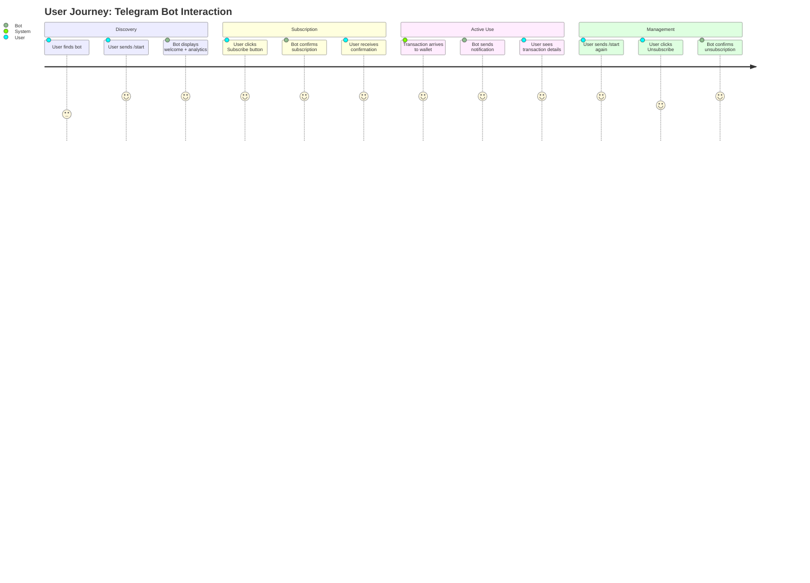
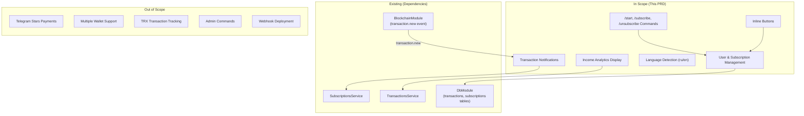

# PRD: Telegram Bot User Interface

## Overview

### One-line Summary

A Telegram bot interface that allows users to subscribe to wallet monitoring notifications and view income analytics via simple commands and inline buttons.

### Background

PayPing is a service that monitors a TRON cryptocurrency wallet for incoming USDT and TRX transactions. Currently, the blockchain monitoring infrastructure (`BlockchainModule`) and database persistence (`DbModule`) are implemented, with the `transaction.new` event being emitted when new transactions are detected.

The missing piece is the user-facing interface: a Telegram bot that enables users to:
- Subscribe to real-time transaction notifications
- View income analytics (current month and projected)
- Receive instant alerts when funds arrive

This feature bridges the gap between blockchain monitoring and user engagement, delivering value directly to Telegram users who need to track incoming payments.

## User Stories

### Primary Users

**Bot Users**: Anyone who wants to monitor incoming transactions to the company wallet. This includes:
- Business owners tracking customer payments
- Finance team members monitoring cash flow
- Stakeholders interested in transaction activity

### User Stories

```
As a new user
I want to start the bot and see current income statistics
So that I can understand the service value before subscribing
```

```
As a potential subscriber
I want to quickly subscribe via a button
So that I can start receiving notifications without typing commands
```

```
As a subscribed user
I want to receive instant notifications when funds arrive
So that I can respond to incoming payments immediately
```

```
As a subscriber
I want to unsubscribe easily
So that I can stop notifications when I no longer need them
```

```
As a Russian-speaking user
I want to see the interface in my language
So that I can use the bot comfortably
```

### Use Cases

1. **First-time User Onboarding**: User starts the bot, sees welcome message with income analytics, decides to subscribe using the inline button.

2. **Daily Monitoring**: Subscribed user receives notification about a 500 USDT incoming transfer, checks who sent it.

3. **Analytics Review**: User opens the bot to check current month income and compare with expected (average) income to assess business performance.

4. **Subscription Management**: User no longer needs notifications, clicks unsubscribe button to stop receiving alerts.

5. **Language Detection**: Russian user starts the bot, automatically sees all messages in Russian without any configuration.

## Functional Requirements

### Must Have (MVP)

- [ ] **FR-1: /start Command with Analytics**
  - Display welcome message with user greeting
  - Show current month income (sum of USDT incoming transactions)
  - Show expected income (3-month rolling average)
  - If less than 3 months of data exists, use available months for average calculation
  - Include inline buttons for Subscribe/Unsubscribe actions
  - AC: Given a user sends /start, When the bot responds, Then the message includes current month income, expected income, and action buttons within 2 seconds

- [ ] **FR-2: /subscribe Command**
  - Create or activate user subscription
  - Store user in database with Telegram ID
  - Set subscription status to 'active'
  - Confirm subscription with success message
  - AC: Given a user executes /subscribe, When the command completes, Then user record exists with active subscription and confirmation message is displayed

- [ ] **FR-3: /unsubscribe Command**
  - Deactivate user subscription (set status to 'cancelled')
  - Do not delete user record (preserve history)
  - Confirm unsubscription with appropriate message
  - AC: Given a subscribed user executes /unsubscribe, When the command completes, Then subscription status is 'cancelled' and confirmation message is displayed

- [ ] **FR-4: Inline Buttons on /start**
  - Provide "Subscribe" button that triggers subscription flow
  - Provide "Unsubscribe" button that triggers unsubscription flow
  - Update button states based on current subscription status
  - AC: Given a user views /start response, When buttons are displayed, Then clicking Subscribe/Unsubscribe triggers the appropriate action and updates the message

- [ ] **FR-5: Transaction Notifications**
  - Listen to `transaction.new` event from BlockchainModule
  - Send notification to all users with active subscriptions
  - Include transaction details: amount, sender address, timestamp
  - Send notifications within 5 seconds of event emission
  - AC: Given a new transaction is detected, When event is emitted, Then all active subscribers receive notification with transaction details within 5 seconds

- [ ] **FR-6: Language Detection and Localization**
  - Detect user's Telegram language preference from `ctx.from.language_code`
  - Support Russian (ru) as primary language
  - Fallback to English (en) for all other languages
  - Store all user-facing strings in localization files
  - AC: Given a user with Russian language setting starts the bot, When messages are displayed, Then all text appears in Russian

- [ ] **FR-7: Open Access (No Whitelist)**
  - Allow any Telegram user to interact with the bot
  - No authentication or authorization required
  - No subscription payment required for MVP
  - AC: Given any Telegram user, When they start the bot, Then they can access all features without restrictions

### Should Have

- [ ] **FR-8: Subscription Status Display**
  - Show current subscription status in /start message
  - Display subscription expiration date if applicable
  - Show "Subscribed" or "Not subscribed" indicator

- [ ] **FR-9: Error Handling with User Feedback**
  - Display user-friendly error messages on failures
  - Provide guidance on how to retry or contact support
  - Log errors for debugging while showing generic messages to users

### Could Have

- [ ] **FR-10: Transaction History Command**
  - Add /history command to view recent transactions
  - Display last 10 transactions with pagination

- [ ] **FR-11: Custom Notification Preferences**
  - Allow users to set minimum amount threshold for notifications
  - Enable/disable notification sounds

### Out of Scope

- **Telegram Stars Payments**: Payment integration will be implemented in a separate PRD. MVP subscription is free.
- **Multiple Wallet Monitoring**: Only a single predefined wallet is monitored.
- **TRX Transaction Notifications**: Only USDT (TRC20) transactions are tracked initially.
- **Admin Commands**: Bot administration features are not included.
- **Group Chat Support**: Bot operates in private chats only.
- **Webhook Mode**: Long polling is used; webhook deployment is out of scope.

## Non-Functional Requirements

### Performance

- **Response Time**: Bot commands must respond within 2 seconds under normal load
- **Notification Latency**: Transaction notifications must be sent within 5 seconds of `transaction.new` event
- **Throughput**: Support at least 100 concurrent subscribed users receiving notifications
- **Database Query Time**: Analytics queries (monthly sum, rolling average) must complete in under 500ms

### Reliability

- **Availability**: Bot should be available 99% of the time during business hours
- **Error Rate**: Less than 1% of commands should fail due to internal errors
- **Notification Delivery**: 99% of notifications should be successfully delivered to Telegram

### Security

- **No Sensitive Data Storage**: Only Telegram ID, username, and name are stored
- **Input Validation**: All user inputs must be sanitized
- **Rate Limiting**: Implement basic rate limiting to prevent abuse (10 commands per minute per user)

### Scalability

- **Horizontal Scaling**: Design should support multiple bot instances in the future
- **Database Indexing**: User lookup by Telegram ID must be indexed
- **Event-Driven Architecture**: Maintain loose coupling via event system for future extensions

## Success Metrics

### Quantitative Metrics

1. **Notification Delivery Rate**: >= 99% of transaction notifications successfully delivered
2. **Command Response Time**: P95 response time < 2 seconds for all commands
3. **Subscriber Retention**: 70% of users remain subscribed after 30 days
4. **Daily Active Users**: Track unique users interacting with the bot daily
5. **Notification Latency**: P95 < 5 seconds from transaction detection to notification delivery

### Qualitative Metrics

1. **User Satisfaction**: Users can complete subscribe/unsubscribe flow without confusion
2. **Localization Quality**: Russian messages are natural and grammatically correct
3. **Analytics Clarity**: Income statistics are immediately understandable

## User Journey Diagram



## Scope Boundary Diagram



## User Interface Mockups (Text-based)

### /start Command Response (English)

```
Welcome to PayPing!

Current Month Income: 12,450.50 USDT
Expected Income: 15,230.00 USDT

Status: Not subscribed

[Subscribe] [View Analytics]
```

### /start Command Response (Russian)

```
Dobro pozhalovat' v PayPing!

Dokhod za tekushchiy mesyats: 12 450.50 USDT
Ozhidaemyy dokhod: 15 230.00 USDT

Status: Ne podpisan

[Podpisatsya] [Otpisatsya]
```

### Transaction Notification (English)

```
New incoming transaction!

Amount: 500.00 USDT
From: TXyz...abc
Time: 2026-01-22 14:30:05 UTC

Transaction hash: abc123...def
```

### Transaction Notification (Russian)

```
Novaya vkhodyashchaya tranzaktsiya!

Summa: 500.00 USDT
Ot: TXyz...abc
Vremya: 2026-01-22 14:30:05 UTC

Khesh tranzaktsii: abc123...def
```

### Subscription Confirmation (English)

```
You are now subscribed!

You will receive notifications when funds arrive to the monitored wallet.

To unsubscribe, use /unsubscribe or click the button in /start.
```

### Unsubscribe Confirmation (English)

```
You have been unsubscribed.

You will no longer receive transaction notifications.

To subscribe again, use /subscribe or click the button in /start.
```

## Technical Considerations

### Dependencies

**Existing Systems:**
- `BlockchainModule`: Provides `transaction.new` event via NestJS EventEmitter
- `DbModule`: Provides `TransactionsService` and `SubscriptionsService`
- `users` table: Stores Telegram user information
- `subscriptions` table: Stores subscription status and dates
- `transactions` table: Stores transaction history for analytics

**External Services:**
- Telegram Bot API (via grammY framework)
- grammY i18n plugin for localization

### Constraints

- **Long Polling Only**: grammY will use long polling mode (no webhook)
- **Single Bot Instance**: Initial deployment assumes single instance
- **Telegram Rate Limits**: Must respect Telegram API limits (30 messages/second to different chats)
- **Event-Driven**: Must integrate with existing NestJS EventEmitter pattern

### Assumptions

- Telegram Bot Token is provided via environment variable `TELEGRAM_BOT_TOKEN`
- `transaction.new` event payload contains complete `TransactionNewEvent` interface
- Users table has `telegramId` column for user lookup
- Monthly income calculation uses UTC timezone
- USDT amount is stored as string with 6 decimal precision

### Risks and Mitigation

| Risk | Impact | Probability | Mitigation |
|------|--------|-------------|------------|
| Telegram API downtime | High | Low | Implement retry with exponential backoff; queue notifications |
| High notification volume | Medium | Medium | Batch notifications; implement rate limiting |
| Incorrect analytics calculation | Medium | Low | Unit test edge cases (no data, partial months) |
| Localization errors | Low | Medium | Review translations with native speakers |
| Database query performance | Medium | Low | Add indexes; use query explain analysis |

## Appendix

### References

- [grammY Documentation](https://grammy.dev/)
- [grammY i18n Plugin](https://grammy.dev/plugins/i18n)
- [grammY Fluent Plugin](https://grammy.dev/plugins/fluent)
- [Telegram Bot API](https://core.telegram.org/bots/api)
- [10 Best UX Practices for Telegram Bots](https://medium.com/@bsideeffect/10-best-ux-practices-for-telegram-bots-79ffed24b6de)
- [Telegram Bot Features](https://core.telegram.org/bots/features)
- Existing PRD: None (first PRD in project)
- Existing Design: `docs/design/blockchain-monitoring-design.md`

### Glossary

- **USDT**: Tether USD, a stablecoin pegged to the US dollar
- **TRC20**: Token standard on the TRON blockchain (similar to ERC20 on Ethereum)
- **grammY**: TypeScript/JavaScript Telegram Bot framework
- **Long Polling**: Method where bot repeatedly asks Telegram for updates
- **Inline Button**: Interactive button displayed within a message
- **Rolling Average**: Average calculated over a moving window (3 months in this case)
- **Subscription**: User's opt-in state for receiving notifications

### Message String Keys (for i18n)

| Key | English | Russian (transliterated) |
|-----|---------|--------------------------|
| `welcome` | Welcome to PayPing! | Dobro pozhalovat' v PayPing! |
| `current_month_income` | Current Month Income | Dokhod za tekushchiy mesyats |
| `expected_income` | Expected Income | Ozhidaemyy dokhod |
| `status_subscribed` | Subscribed | Podpisan |
| `status_not_subscribed` | Not subscribed | Ne podpisan |
| `btn_subscribe` | Subscribe | Podpisatsya |
| `btn_unsubscribe` | Unsubscribe | Otpisatsya |
| `notification_title` | New incoming transaction! | Novaya vkhodyashchaya tranzaktsiya! |
| `amount` | Amount | Summa |
| `from_address` | From | Ot |
| `time` | Time | Vremya |
| `tx_hash` | Transaction hash | Khesh tranzaktsii |
| `subscribed_success` | You are now subscribed! | Vy podpisany! |
| `unsubscribed_success` | You have been unsubscribed. | Vy otpisany. |

Note: Russian strings shown above are transliterated for documentation purposes. Actual implementation will use Cyrillic characters in locale files.

---

**Document Version**: 1.0
**Created**: 2026-01-22
**Status**: Draft
